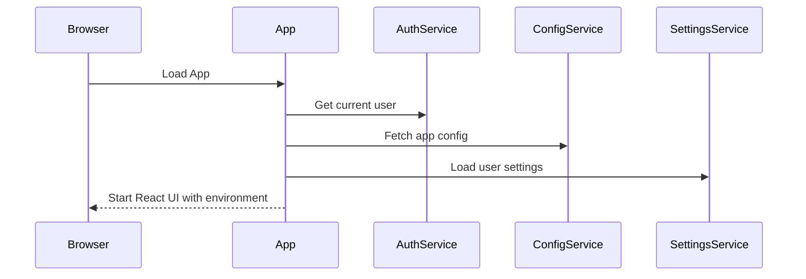

# Chapter 1: Application Environment Setup

Welcome! 🎉 You're about to step into the world of building disaster response tools — and like any good performance, the stage needs to be set before the actors come out.

In our case, before the Disaster Ninja app can fully load and work correctly, we need to prepare something called the **Application Environment**.

Imagine this like a **stage crew** quietly working behind the scenes: setting the lights, placing props, checking microphones. Before the curtain opens, everything must be ready.

Let’s take a closer look at what it means, why it’s important, and how it works behind the scenes. 🎭

---

## ✅ What Is “Application Environment Setup”?

Before anything appears on the screen — like maps, layers, or toolbars — the app needs to make sure you're logged in, load important configurations, and prepare user-specific settings.

This setup phase makes sure:
- The app knows which user is logged in
- The map and tools are configured correctly
- All the pieces are where they need to be for the app to work smoothly

Think of it like a checklist before launching the app.

---

## 🎯 Use Case: Logging in and Loading the Right Settings

As a user, when you visit Disaster Ninja:
1. You want to see your own settings (like your selected language or login status)
2. The app should load the latest map data and tools
3. You should be ready to go without delay

This only happens **if the environment is set up correctly**.

---

## 🧠 Key Concepts

Let’s break down the environment setup into simple parts:

| Part | What it does | Analogy |
|------|--------------|---------|
| Authentication | Checks who you are (e.g., logged in user) | Checking your backstage pass at the door |
| Config Fetching | Loads settings from a server (like feature toggles, map defaults) | Reading the script before a play |
| User Preferences | Applies saved settings like language or previous selections | Adjusting your personal spotlight 📸 |

---

## 🔧 How Setup Happens (In Simple Terms)

When the app starts:
1. It checks if you're logged in
2. It loads important config values
3. It prepares language and internal settings
4. It continues to the rest of the app

Here’s a simplified walkthrough of that process:

```ts
async function setupAppEnvironment() {
  const user = await authService.getUser();       // 1. Who's there?
  const config = await configService.load();      // 2. What’s the scene?
  const preferences = await loadUserSettings();   // 3. Personal touches
  
  startApp({ user, config, preferences });        // 4. Launch away!
}
```

🧾 Explanation:
- Line 2: We get the current authenticated user.
- Line 3: We ask the backend for configuration values like which features to show.
- Line 4: We optionally load previous choices the user made (like language).
- Line 5: Then we start the app, passing all this data in.

---

## 🔍 What Happens Internally (Step-by-step Walkthrough)

Let’s explore how these parts flow together under the hood.



---

## 💡 Under the Hood (Code-Level View)

The Disaster Ninja project likely initializes the environment in a root setup file, for example:

📁 `/src/app/environment/setup.ts`

Let’s look at what such a file might include:

```ts
export async function initializeEnvironment() {
  const user = await authClient.getLoggedInUser();
  const config = await configRepo.fetchPublicConfig();
  const i18nLanguage = user?.settings?.language || 'en';

  i18n.changeLanguage(i18nLanguage);

  return { user, config };
}
```

🧾 What’s Happening:
- `authClient.getLoggedInUser()`: Asks the server, “who’s currently logged in?”
- `configRepo.fetchPublicConfig()`: Gets things like map settings and feature toggles
- `i18n.changeLanguage(...)`: Sets the language so UI loads in the correct language

Once this is done, the rest of the app can start safely, knowing it’s on solid ground.

---

## 🚀 What Happens After Setup?

Once the setup is complete…
- Your name shows up (yay! You're logged in).
- The map knows which base layer to show.
- Language is set correctly.
- The app continues from [React Application Entry Point](04_react_application_entry_point.md), where the visual part kicks in.

---

## 🏁 Summary

In this chapter, you learned:

- The app environment is like a backstage setup for your application.
- It runs before anything is shown on screen.
- It ensures the right user, configuration, and preferences are used.
- Without it, the app wouldn't know how to behave.

Now that we have our backstage ready... it’s time to prepare the runtime!

➡️ Head to the next chapter: [Vite Configuration](02_vite_configuration.md) to learn how we build and serve the app during development.

---

Welcome aboard, and keep going — you've just taken the first step into the Disaster Ninja codebase! 👣