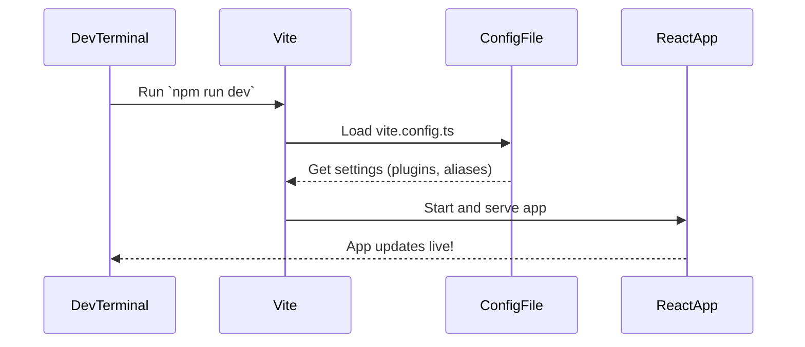

# Chapter 2: Vite Configuration

Welcome back! 👋 In [Chapter 1: Application Environment Setup](01_application_environment_setup.md), we learned how the Disaster Ninja app quietly sets the stage before anything shows up — things like user settings, app configuration, and language preferences.

Now that the backstage is ready, let's talk about **how the app is built and served** as you're developing it. That’s where **Vite Configuration** comes in. 🎬

---

## 🎯 Why Should I Care About Vite?

Imagine you're working on a house with multiple rooms (pages), pipes (APIs), and furniture (components). 🏡

- Vite is the super-speedy **construction crew** that helps build your house (project) every time you make a change.
- The Vite Configuration is the detailed **blueprint** that tells the builders where everything should go, what tools they can use, and how to speed things up.

Without the right blueprint, things would be chaotic—walls in the wrong place, missing pieces, broken flow.

---

## 🛠️ What Is Vite and Why Do We Use It?

Vite (pronounced “veet”) is a build tool that helps you:
- Start the project locally with lightning speed ⚡
- Build and optimize code for production
- Use cool plugins like React, TypeScript, and more
- Handle tricky things like environment variables and paths

### Use Case Example:

> "I want to start the app locally while I work on adding a new feature."

This is where Vite shines! With a proper Vite config, doing this is as easy as:

```bash
npm run dev
```

Behind the scenes, Vite uses its configuration file to:
- Load the right plugins
- Set up Routes and Hot Reloading
- Resolve your paths and directories
- Load the right environment variables

---

## 🧠 Key Concepts of Vite Configuration

Let’s simplify the main parts of Vite’s config file so you don’t get overwhelmed:

| Section | What It Does | Analogy |
|--------|---------------|---------|
| `plugins` | Add support for React, i18n, etc. | Plugging in power tools 🔌 |
| `resolve.alias` | Shortcut path mapping | Putting labels on storage boxes 📦 |
| `define` | Inject constants like app version or env vars | Leaving notes to the builder 📝 |
| `build` | Tells Vite how to bundle everything | Packing the entire house for delivery 📦 |
| `server` | Dev server settings | Choosing where you live while building 🏠 |

---

## 📁 Vite Config File Location

In the Disaster Ninja project, Vite reads from the file:

```
/vite.config.ts
```

Let’s look at a simplified version of it:

```ts
import { defineConfig } from 'vite';
import react from '@vitejs/plugin-react';

export default defineConfig({
  plugins: [react()],  // Enable React support
  resolve: {
    alias: {
      '@': '/src',       // Allow '@/components/Button' instead of '../../../components/Button'
    }
  },
  define: {
    __APP_VERSION__: JSON.stringify('1.0.0'),
  },
});
```

### 🧾 Beginner Explainer:
- `defineConfig(...)`: Wraps and exports your Vite settings.
- `react()`: Adds React Hot Reloading so changes appear instantly.
- `alias`: Let’s you use nice import paths instead of writing long relative paths.
- `define`: Lets you define constants (like `__APP_VERSION__`) you can use in your code.

---

## 💡 Example: Using an Alias in Imports

With this alias:

```ts
alias: {
  '@': '/src'
}
```

Instead of writing:

```ts
import Button from '../../../components/ui/Button';
```

You write:

```ts
import Button from '@/components/ui/Button';
```

✅ Cleaner
✅ Less breakage when moving files

---

## 🛤️ Dive Into: What Happens When You Run `npm run dev`

Let's understand the basic flow with a simple diagram:



👉 Vite checks the config, sets things up, and serves the app with Live Reload enabled. That means you make a change in code, and the browser updates instantly. No full refresh required!

---

## 🔍 Under the Hood: Plugins and Custom Setup

Let’s look at a more realistic snippet that might be in Disaster Ninja’s config file:

```ts
import path from 'path';

resolve: {
  alias: {
    '@components': path.resolve(__dirname, 'src/components'),
    '@store': path.resolve(__dirname, 'src/store'),
  }
}
```

🧾 This means you can write imports like:

```ts
import { Sidebar } from '@components/Sidebar';
```

---

## 🌍 Environment Variables

Sometimes you want to switch environments (like between dev and prod). Vite can help load the right ones.

For example, in `.env` file you can define:

```
VITE_API_URL=https://api.disasterninja.dev
```

In code you can use:

```ts
const apiUrl = import.meta.env.VITE_API_URL;
```

✅ Vite automatically injects this during dev.

---

## 🔧 Build Options (For Production)

Vite can also help us get ready for deployment (shipping the house! 🏗️📦)

```ts
build: {
  outDir: 'dist',            // Where to put built files
  sourcemap: true,           // Helpful for debugging
  chunkSizeWarningLimit: 1000,
}
```

When you run:
```bash
npm run build
```

These settings tell Vite:
- Where to place files
- Whether to include debug helpers
- How to warn if bundle is too big

---

## 📂 File Structure Recap

Here’s where things usually live:

```
/vite.config.ts               <-- Vite config file
/src/                         <-- Codebase
  /components/                <-- UI Components
  /store/                     <-- State management
.env                          <-- Environment variables
```

---

## 🚀 Summary

In this chapter, you learned:

✅ Vite helps start, develop, and build projects easily  
✅ The Vite config is like a blueprint that sets up important project rules  
✅ Aliases, plugins, and env vars simplify development  
✅ When you run `npm run dev`, Vite reads the config and serves the app instantly  
✅ Vite makes building for production smooth and configurable

Now you’re ready to confidently edit and run the Disaster Ninja app locally. Anytime you hit save, changes show up immediately — like magic! 🪄

---

➡️ Next up, we’ll look at testing and setup for tests in the project. Head over to [Test Configuration (e.g., Global Setup and Auth)](03_test_configuration__e_g___global_setup_and_auth_.md) to see how tests are powered behind the scenes.

Stay curious and keep building! 🧱✨