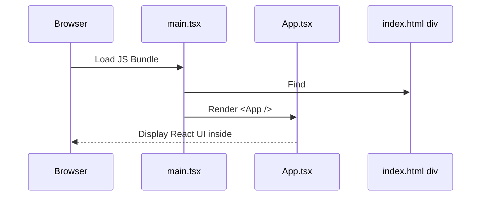

# Chapter 3: React Application Entry Point

Welcome back! 👋 In the last chapter, we looked at how Vite stitches together and serves our app using a blazing-fast dev server. ([Chapter 2: Vite Configuration](02_vite_configuration.md))

Now that your environment is ready — lights, camera, action — you might be wondering...

> 🎬 **Where does it all actually begin in a React app?**

In this chapter, we’ll introduce the **React Application Entry Point** — the "main doorway" to the whole Disaster Ninja app.

---

## 🎯 What Problem Does the Entry Point Solve?

Let’s walk through a simple use case:

> "I open Disaster Ninja in my browser. How does React know what to render? Where does it start?"

🧠 Good question! React needs a **single place to begin** — to load the app’s structure and kick off everything else.

That’s exactly what the **entry point** does.

---

## 🏠 Real-World Analogy

Think of the app like a huge building.

- The **entry point** is the **main door** where everyone walks into the lobby area.
- Inside that lobby, there's a guide (`App.tsx`) that tells people where to go next: maps, layers, user settings, etc.
- The **entry point** is also where the staff tidy up (set up contexts, themes, auth, etc.) before customers arrive.

Without a front door, people can’t enter — and without the entry point, the app can’t run.

---

## 🧠 Key Concepts

Let’s break things down before jumping into code.

| Concept | What It Does | Analogy |
|--------|---------------|--------|
| `main.tsx` | The exact file where the app begins | The app’s “front door” 🚪 |
| `App.tsx` | The root component that renders the UI | The building’s lobby 🏢 |
| `ReactDOM.createRoot(...)` | React’s way of connecting to the page | Turning on the lights 💡 |
| `<React.StrictMode>` | A helper that warns about bad patterns (dev-only) | A supervisor during construction 🛠️ |
| `<App />` | The main app code | Your helpful front desk worker 👩‍💼 |

---

## 🛠️ A Minimal React Entry Point

In a React + Vite app like Disaster Ninja, the starting file is usually:

📄 `/src/main.tsx`

Let’s look at a simplified version:

```tsx
// /src/main.tsx
import React from 'react';
import ReactDOM from 'react-dom/client';
import App from './App';

ReactDOM.createRoot(document.getElementById('root')!).render(
  <React.StrictMode>
    <App />
  </React.StrictMode>
);
```

### 🧾 Beginner Explanation

- `ReactDOM.createRoot(...)`: We tell React where the app should "plug into" the website — usually an element with id `root`.
- `<React.StrictMode>`: Only active in dev. Helps find potential problems.
- `<App />`: This is where all your pages, maps, UI, and logic live.

---

## 🔍 What You See in the HTML File

The `main.tsx` must find a place on the page to render React — and that’s why this line is important:

```ts
document.getElementById('root')
```

In the file 📄 `index.html`, you'll find something like this:

```html
<div id="root"></div>
```

Meaning: “React, put your app inside this div.”

---

## 🧭 Digging into `<App />`

The `<App />` component is the **root** of your interface — everything else is inside it.

📄 `/src/App.tsx`

A simplified version might look like:

```tsx
// /src/App.tsx
import React from 'react';

export default function App() {
  return (
    <div>
      <h1>Welcome to Disaster Ninja</h1>
      {/* Map, Sidebar, Toolbar, etc */}
    </div>
  );
}
```

🧾 This returns the first visual piece of the app. From here, we can load more components, routes, tools, and maps.

---

## 👀 What Happens When You Open the App?

Let’s visualize the steps from browser to React UI:



🎯 So when a user opens the app:
- React code kicks off at `main.tsx`
- Finds the `#root` element in HTML
- Renders `<App />` inside it
- The user sees the first screen of Disaster Ninja!

---

## 🧠 Reality Check: More than Just `<App />`

In real-world React apps like Disaster Ninja, `main.tsx` might also:

✅ Initialize **app environment**  
✅ Provide **context providers** (e.g. Auth, Theme, State)  
✅ Load i18n (internationalization)  
✅ Enable strict type checking  
✅ Set up logging or error boundaries

Here’s what a slightly more realistic version might look like:

```tsx
// /src/main.tsx
import React from 'react';
import ReactDOM from 'react-dom/client';
import { App } from './App';
import { I18nextProvider } from 'react-i18next';
import { appEnvironmentInit } from './app/environment/setup';
import i18n from './i18n';

async function main() {
  await appEnvironmentInit(); // sets language, config, user...

  ReactDOM.createRoot(document.getElementById('root')!).render(
    <React.StrictMode>
      <I18nextProvider i18n={i18n}>
        <App />
      </I18nextProvider>
    </React.StrictMode>
  );
}

main();
```

> 🧾 You don’t need to understand every part yet — just know this is where everything connects together!

---
## 🧩 How the Other Pieces Fit In

In [Chapter 1: Application Environment Setup](01_application_environment_setup.md), we learned about the backstage setup. Here, in `main.tsx`, we actually **call that environment setup**:

```ts
await appEnvironmentInit(); // make sure everything is ready
```

Once that’s done, we can safely show the UI.

In [Chapter 4: Internationalization (i18n) System](04_internationalization__i18n__system.md), we’ll see how the `I18nextProvider` handles multiple languages using a library called `i18next`.

---

## 💡 Summary

✅ The **React Application Entry Point** is where everything begins  
✅ In Disaster Ninja, it’s in `/src/main.tsx`  
✅ It tells React where to render and what to render first  
✅ `<App />` is the root component — it contains the full app interface  
✅ This file can also initialize app settings, login context, language, and more  

---

🥳 Congrats! You now know where the Disaster Ninja app truly begins!  
Everything flows from here into the UI, maps, data, and dashboards.

Up next, let’s learn how Disaster Ninja speaks many languages with our custom i18n setup.

➡️ Continue to [Chapter 4: Internationalization (i18n) System](04_internationalization__i18n__system.md) 🌍

Keep going — you’ve already unlocked the app’s front door! 🚪✨