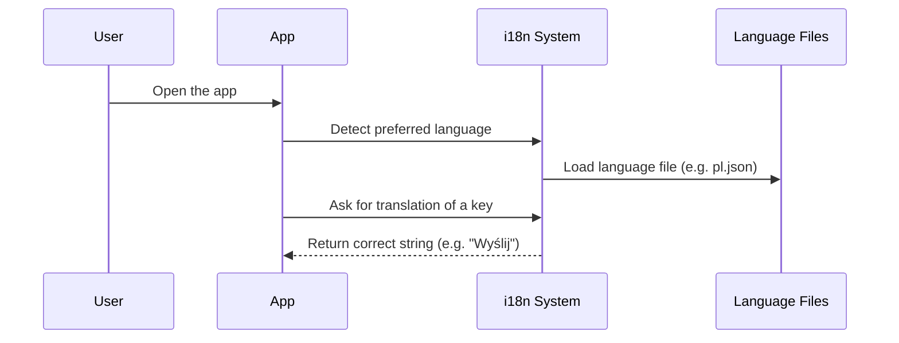

# Chapter 4: Internationalization (i18n) System

Welcome back, explorer! 🌍 In the previous chapter, we discovered how the app begins its journey from the [React Application Entry Point](03_react_application_entry_point.md) — the “front door” of Disaster Ninja.

Now let's imagine this — you open the Disaster Ninja app in France 🇫🇷, Japan 🇯🇵, or Brazil 🇧🇷. As a global citizen, you’d expect to see the app in your own language... right?

This is exactly what the **Internationalization (i18n) System** helps us do!

---

## 🎯 Why Internationalization? (The Real-World Use Case)

> “I want users to experience Disaster Ninja in their own language — automatically.”

Every time someone logs in from a different country (or with a specific language preference), the app should:
- Show button labels, tooltips, and headers in the right language 
- Adapt number and date formats
- Help everyone use and understand the app easily

🌐 That’s where internationalization — known as **i18n** (because there are 18 letters between “i” and “n”) — comes in!

---

## 🌟 High-Level Analogy

🧠 Think of the i18n system as a **universal translator** in a sci-fi movie. 🌌  
It listens in and **automatically translates your UI** into the language your users expect — English, Spanish, Polish — without reloading the whole app.

---

## 🧠 Key Concepts

Let’s break this down into bite-sized concepts:

| Concept | What It Is | Analogy |
|--------|-------------|---------|
| Language files | Place where translations are stored | A multilingual dictionary 📕 |
| Translation key | Identifiers for each string in the UI | A word's name in the dictionary 🔑 |
| `i18next` | The library doing the translation | The real-time interpreter 🗣️ |
| `useTranslation()` | React hook to translate inside components | Ask the interpreter for help 👂 |

---

## 🏁 The Goal (Example)

Say you have a **button** in your app with the English word “Submit”.

You want it to:
✅ Show “Enviar” when the user has Spanish  
✅ Show “Wyślij” in Polish  
✅ Show “Soumettre” in French

...without rewriting the whole app every time.

Let’s learn how to set that up!

---

## 📁 Step 1: Add Translations

In the code, translation files live in a `locales` folder:

```
/src/i18n/
  └─ en.json
  └─ es.json
  └─ pl.json
```

Then you write translations like this:

📄 `/src/i18n/en.json`
```json
{
  "button.submit": "Submit"
}
```

📄 `/src/i18n/es.json`
```json
{
  "button.submit": "Enviar"
}
```

📄 `/src/i18n/pl.json`
```json
{
  "button.submit": "Wyślij"
}
```

🧾 Each file is simply a **dictionary** of key–value pairs:  
- The key: shared lookup word (like `button.submit`)  
- The value: what it should display in that language

---

## ⚙️ Step 2: Use Translations in React

Your component might look like this:

```tsx
import { useTranslation } from 'react-i18next';

export function SubmitButton() {
  const { t } = useTranslation();

  return <button>{t('button.submit')}</button>;
}
```

🧾 Explanation:
- You **import** `useTranslation` from `react-i18next`
- Call `t('button.submit')` to get the right translation
- It automatically checks the user’s selected language

👉 If user uses Spanish: Shows `Enviar`  
👉 If Polish: Shows `Wyślij`  
👉 Default: Uses English

Magic, right? ✨

---

## 🔄 Step 3: Changing the Language

You can also let users change the language during runtime:

```tsx
import i18n from 'i18next';

i18n.changeLanguage('es'); // Changes to Spanish
```

When this runs, the app updates all translations instantly — no reload needed!

---

## 🧠 Under the Hood: What Actually Happens?

Let’s zoom out and see what happens when a user loads the app:



✅ No reload  
✅ No page refresh  
✅ All UI updates in-place!

---

## 🧰 How i18n is Set Up (Behind the Scenes)

When the app starts (see [React Application Entry Point](03_react_application_entry_point.md)), it runs the environment initializer — and one of the things it does is set up the i18n system.

📄 `/src/i18n.ts`
```ts
import i18n from 'i18next';
import { initReactI18next } from 'react-i18next';

import en from './i18n/en.json';
import es from './i18n/es.json';
import pl from './i18n/pl.json';

i18n.use(initReactI18next).init({
  lng: 'en',          // default language
  fallbackLng: 'en',
  resources: {
    en: { translation: en },
    es: { translation: es },
    pl: { translation: pl },
  },
});

export default i18n;
```

🧾 Key things happening:
- Loads raw translation files (imported JSONs)
- Registers all languages as `resources`
- Sets default language to English
- Sets up `initReactI18next` plugin

---

## 🌐 Detecting the Right Language

The app doesn’t just guess — it tries smart things like:
- Checking user profile language
- Looking at browser language settings
- Falling back to English if needed

You’ll often see this part in:

📄 `/src/app/environment/setup.ts`
```ts
const userLang = user?.settings?.language || navigator.language || 'en';
i18n.changeLanguage(userLang);
```

🧾 This ensures your app meets users where they are 💜

---

## 💬 Bonus: Inline Dynamic Text

Need to add dynamic values inside your string? No problem! Just use this:

📄 `/i18n/en.json`
```json
{
  "greeting": "Hello, {{name}}!"
}
```

Then in code:

```tsx
t('greeting', { name: 'Anna' }); // => "Hello, Anna!"
```

🧼 No string concatenation needed!

---

## ✅ Summary

🔥 In this friendly chapter, you learned that:

- The **i18n system** lets Disaster Ninja support multiple languages
- All translations are stored in simple JSON files using keys
- The `useTranslation()` hook gives you easy access to the right text
- React updates the UI language instantly — without reload
- The setup happens in a shared `i18n.ts` file during app initialization
- The language is smartly chosen based on user or browser prefs

This helps us build a truly global, inclusive, and delightful experience for users everywhere 🌏

---

➡️ Ready to take your testing skills to the next level? Head to the next chapter: [Playwright Configuration](05_playwright_configuration.md) to learn how the app is automatically tested using browser automation tools!

💡 Keep exploring. You’re doing amazing! 💪