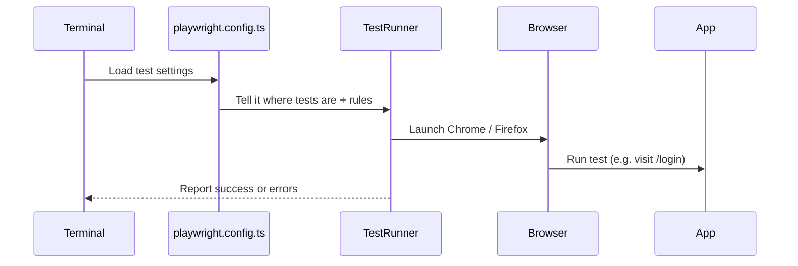

# Chapter 5: Playwright Configuration

Welcome back! 👋 In the last chapter, we explored how Disaster Ninja can speak different languages using the [Internationalization (i18n) System](04_internationalization__i18n__system.md). 🌍

Now, let’s shift gears and talk about how we open the curtains, test the actors, and make sure every part of the app behaves correctly. 🎭 That’s where **Playwright Configuration** comes in!

---

## 🎯 What Problem Does Playwright Configuration Solve?

> 💬 “I want to make sure everything works before real users click on it.”

Imagine you built a new feature in Disaster Ninja — a search bar or a fancy new button. You want to:
- Check that it works on different browsers
- See if it behaves correctly for logged-in AND logged-out users
- Automatically test user flows like clicking, typing, and opening menus

✅ That’s why we use a **test automation tool** called **Playwright**, and  
✅ We use **Playwright Configuration** to control how and where those tests run.

---

## 🎬 Analogy: Playwright = Director + Camera Crew

Think of Playwright like a film director 👨‍🎬:
- It **runs the scenes** (tests)
- It **sets the camera angles** (browser viewports)
- It **directs the actors** (UI elements like buttons or popups)
- It **reports what went wrong** if anything breaks

But even the best directors need a control room…  
That’s where **Playwright Configuration** steps in — the place where you define:
- What to test
- Which browser to use
- How long to wait if the internet is slow
- Where the tests live

---

## 🧠 Key Concepts in Simple Terms

| Concept | What It Means | Analogy |
|--------|----------------|---------|
| `playwright.config.ts` | Configuration file for Playwright | The director’s clipboard 📋 |
| `testDir` | Where the tests live | The shelf with all the test scripts 🗃️ |
| `timeout` | How long to wait before giving up | How long to rehearse before stopping ⏱️ |
| `projects` | Which browsers to test on | Trying the same scene on Firefox, Chrome, etc. 🎥 |
| `use` | Default browser settings | Blueprint for every test run 🛠️ |

---

## 👀 Use Case: Example Component Test

Let’s say you want to test this flow:

> "User visits the login page → enters valid credentials → sees the dashboard."

✅ Instead of doing this by hand 100 times, you can write this using Playwright!

But first, you need configuration to tell Playwright:
- Where the login page is
- What viewport size to use
- Which test folder to look into

---

## 🔧 What Does a Basic Playwright Config Look Like?

Here’s a super simplified config:

📄 `playwright.config.ts`

```ts
import { defineConfig } from '@playwright/test';

export default defineConfig({
  testDir: './tests',
  timeout: 30000, // fail if a test lasts longer than 30s

  use: {
    baseURL: 'http://localhost:3000',
    headless: true, // run without showing browser
    viewport: { width: 1280, height: 720 },
  },

  projects: [
    { name: 'chromium' },
    { name: 'firefox' }
  ],
});
```

### 🧾 Explanation:
- `testDir`: All test files live in the `tests/` folder
- `timeout`: Each test can run for 30 seconds before failing
- `headless: true`: Launch browser silently in the background
- `viewport`: Pretend the screen is 1280×720 pixels
- `projects`: Run the tests on both Chrome and Firefox 🌐

---

## 🧪 Example Test File

Here’s a tiny test that navigates to the login page and checks the title.

📄 `tests/login.spec.ts`

```ts
import { test, expect } from '@playwright/test';

test('login page has correct title', async ({ page }) => {
  await page.goto('/login');
  await expect(page).toHaveTitle(/Login/);
});
```

🗒️ What it does:
- Opens `/login` page
- Checks that the browser title contains the word “Login”

💥 If the login page is broken, the test will fail and tell you 👀

---

## 🧰 Running the Tests

To launch Playwright tests:

```bash
npx playwright test
```

…and boom! 🎉  
Playwright starts browsers, runs tests, and prints whether they passed or failed.

You can even **record** tests visually:

```bash
npx playwright test --ui
```

This opens a slick interface to run/debug them interactively!

---

## ▶️ What Happens Internally (Step-by-Step Flow)

Let’s break down what happens when you run `npx playwright test`:



✅ Easy to follow  
✅ Fully automated  
✅ No manual clicking required

---

## 🔍 Under the Hood – Real Project Structure

Here's how Disaster Ninja's test setup might look:

```
/playwright.config.ts     👈 Configuration lives here
/tests/                   👈 Folder containing end-to-end tests
  login.spec.ts           👈 Test login flow
/global.setup.ts          👈 Optional global auth/login setup
/auth.helper.ts           👈 Shared helper to sign in via API quickly
```

In the config file, you may also see a global setup used for logging users in (we’ll dive deeper into this in [Test Configuration (e.g., Global Setup and Auth)](235_test_configuration__e_g___global_setup_and_auth_.md)):

```ts
globalSetup: require.resolve('./tests/global.setup.ts')
```

This helps test **authenticated areas** of the app without logging in again and again.

---

## ✨ Bonus: Custom Projects with Different Devices

You can even define custom device simulations:

```ts
projects: [
  {
    name: 'Desktop Chrome',
    use: { browserName: 'chromium', viewport: { width: 1440, height: 900 } }
  },
  {
    name: 'Mobile Safari',
    use: { ...devices['iPhone 13'] }
  }
]
```

🧠 This tells Playwright:
> “Test this feature on phones too!”

---

## ✅ Summary

In this chapter, you learned:

✅ What Playwright and its configuration do for automated testing  
✅ The role of `playwright.config.ts` as the control panel  
✅ How Playwright helps simulate real user behavior in the browser  
✅ How tests run step-by-step, from config to browser and back  
✅ Bonus: You can run tests on different devices and browsers

Playwright gives us confidence – so we don’t ship broken features to users.

----

In the next chapter, we’ll peel back the curtain on how Disaster Ninja manages its internal state using an amazing library called Reatom.

➡️ Continue to [Reatom State Management](06_reatom_state_management.md) to learn how we keep our app’s “memory” clean and clear! 🧠💡

Happy testing! 💪🧪