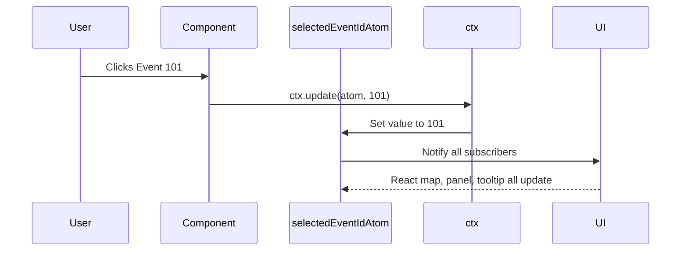

# Chapter 6: Reatom State Management

Welcome back! 🎉 In [Chapter 5: Playwright Configuration](05_playwright_configuration.md), we learned how Disaster Ninja runs automated browser tests — making sure everything works before real users interact with the app.

Now it's time to dive into the core of how Disaster Ninja keeps track of “what's happening” inside the app — 🔄 app state!

That’s where **Reatom State Management** comes in.

---

## 🎯 Why Reatom? (The Use Case)

> “I have a sidebar that shows a list of events. When someone clicks one, highlight it on the map, display more info in a panel, and show a message — all at once.”

That sounds like a lot to coordinate, right? 🤯

Without some kind of smart system, different parts of your app might:
- Get out of sync 🔄
- Miss updates 🛑
- Crash when trying to access something that’s not ready 💥

This is exactly where Reatom helps:  
✅ It tracks and shares app "memory"  
✅ It enables components to respond automatically when data changes  
✅ It provides a clean and simple system to keep things **in sync**

---

## 🧠 What Is App State?

Before we dive in, let’s understand the idea of **state**.

🧠 The "state" of an app is its current memory — like:
- Is the map loading?  
- Which event is selected?  
- What's the user’s name?

Any changes to this state should trigger updates in the UI. That’s where state management libraries — like Reatom — come into play.

---

## 🔍 Key Concepts of Reatom (Simplified)

Let’s break Reatom into 3 friendly pieces:

| Concept | What It Is | Analogy |
|--------|-------------|---------|
| Atom | A single value in the app’s memory | One sticky note 📝 |
| Derived Atom | A value based on other atoms | A math formula based on sticky notes ✏️ |
| Actions | Thing that updates state | Hand that writes on the sticky note ✋ |

Reatom’s job is to manage those sticky notes in a structured way so your app doesn’t get confused!

---

## 🧩 Solving Our Use Case: Selected Event

Let’s walk through a concrete, real-life example.  
👉 Our goal: Track the currently selected disaster event.

We'll build a very simple system:
1. Create a new "selectedEventId" atom
2. Update it when a user selects something
3. Subscribe to changes (e.g., to highlight on map)

---

### 🪄 Step 1: Define Your Atom

Atoms are state containers — like individual Post-It notes in memory.

📄 `/store/selectedEvent.ts`

```ts
import { atom } from '@reatom/core';

export const selectedEventIdAtom = atom<number | null>(null);
```

🧾 This defines a tiny chunk of state:  
- Value type: number (ID of selected event) or null  
- Default: null (nothing selected yet)

Imagine this as a scratchpad:  
🎯 “Who is currently selected? Stick their ID here.”

---

### 🧾 Step 2: Updating the Atom from a Component

We need a way to update the atom. In Reatom, we use **ctx** — a context provided to every subscriber or updater.

Let’s say we have a list of events, and someone clicks one:

```tsx
import { useCtx } from '@reatom/react';
import { selectedEventIdAtom } from '@/store/selectedEvent';

function EventListItem({ eventId }) {
  const ctx = useCtx();

  return (
    <li onClick={() => ctx.update(() => selectedEventIdAtom, eventId)}>
      Event #{eventId}
    </li>
  );
}
```

🧾 Explanation:
- `useCtx()` gives you the "Reatom context"
- You call `ctx.update()` with your target atom and new value
- Clicking the `<li>` sets that event ID into our memory

✅ Now the app *remembers* which event is selected!

---

### 👁️ Step 3: Reacting to the Atom's Value

In another part of the app — say, a map — we want to know:  
👉 “Is this marker the selected one?”

We can **read** the value using a hook:

```tsx
import { useAtom } from '@reatom/npm-react';
import { selectedEventIdAtom } from '@/store/selectedEvent';

function MapMarker({ eventId }) {
  const selectedEventId = useAtom(selectedEventIdAtom);

  return (
    <div style={{ border: selectedEventId === eventId ? '2px solid red' : 'none' }}>
      📍 Marker #{eventId}
    </div>
  );
}
```

🧾 This reads the current value of `selectedEventIdAtom`.  
If a marker is selected — it's given a red border!

✅ No need for prop drilling  
✅ No need for context providers  
✅ Changes auto-update the UI

---

## 🧠 What Happens Under the Hood?

Let’s see what happens during this process.



All connected components update automatically. 🎯  
No manual sync needed.

---

## 🏗️ Where Is This Code Structured?

In Disaster Ninja, Reatom state is usually organized like this:

```
/src/store/
  selectedEvent.ts           👈 Atom for selected event
  user.ts                    👈 Atom for user info
  map.ts                     👈 Atoms for map state
```

Each file:
- Declares 1–3 related atoms
- Exports them for use in components
- Keeps app logic centralized and reusable

---

## 🧪 Bonus: Logging Atom Changes (using Middleware)

You can even **log** whenever atoms are updated:

```ts
import { withLogger } from '@reatom/framework';

const selectedEventIdAtom = atom(null, 'selectedEventIdAtom').pipe(withLogger());
```

Now every change to `selectedEventIdAtom` is printed in the console.

Cool for debugging! 🔍

---

## ✅ Summary

In this chapter, we learned:

✅ What Reatom is, and why state management matters  
✅ The key concepts: atoms, actions, derived values  
✅ How to use Reatom to read and update app state  
✅ That atoms automatically trigger UI updates — no wiring needed!  
✅ Reatom keeps everything in sync... like air traffic control for your app ✈️

We’ve only just scratched the surface! Next, we’ll zoom in on the building blocks of Reatom: the Atom itself — in [Atoms](07_atoms.md).

➡️ Continue to [Chapter 7: Atoms](07_atoms.md) to learn how atoms are created and customized.

Keep going — you’re unlocking the secret language of state! 🧠✨