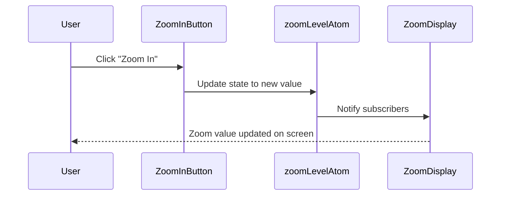

# Chapter 7: Atoms

Welcome back! In [Chapter 6: Reatom State Management](06_reatom_state_management.md), we explored how Disaster Ninja uses Reatom to keep track of app state — things like which event is selected, whether a sidebar is open, or what layer is active on the map.

We learned that this “app memory” is stored and managed with things called **atoms**.

But… what exactly is an atom? 🧲  
What does it do, and why is it the **core building block** of our entire state system?

Let’s find out. 👇

---

## 🎯 Use Case: Track the Current Map Zoom Level

Imagine you're building a simple toolbar in the Disaster Ninja map UI.

✅ User zooms in → zoom level updates  
✅ Zoom level should display on-screen  
✅ Other tools (like overlays) should also adapt to the new zoom level

You need a simple way to:
- Store the current zoom level
- Let any component read that value
- Let any component update that value

That’s exactly the kind of job an **atom** is designed for. Let's build it together.

---

## 🧱 What is an Atom? (The LEGO Block Analogy)

🧠 Think of an atom as a **single LEGO brick** of your app's memory.

It stores **one piece of state**, like:
- A number (zoom level)
- A string (selected language)
- A boolean (is sidebar open?)

Each part of your app can:
- Read the current value of the atom  
- Update its value  
- Automatically react when it changes  

🧊 One atom = One simple value.

---

## 🧠 Key Concepts

| Concept | What It Means | Analogy |
|--------|----------------|----------|
| Atom | A stored value in app memory | A labeled LEGO brick |
| Create atom | Define the value you want to keep track of | “This brick holds the zoom level” |
| Read atom | Ask the current value | Peek at the label |
| Update atom | Change the stored value | Swap the label to a new number |

Atoms are created using the `atom()` function from the Reatom library.

Let’s build one!

---

## 🛠️ Step-by-Step: Create and Use a Zoom Level Atom

### 1. Define the Atom

Create a new file for our atom state.

📄 `/src/store/mapZoom.ts`

```ts
import { atom } from '@reatom/core';

export const zoomLevelAtom = atom(5); // default zoom level
```

🧾 We just made an atom called `zoomLevelAtom` 🔢

- Its first value is `5`
- It can later be changed
- Anyone can subscribe to it and react to changes

---

### 2. Read the Atom in a Component

Let’s show the zoom level on the screen.

```tsx
import { useAtom } from '@reatom/npm-react';
import { zoomLevelAtom } from '@/store/mapZoom';

export function ZoomDisplay() {
  const zoom = useAtom(zoomLevelAtom);

  return <div>🔍 Zoom: {zoom}</div>;
}
```

🧾 Explanation:
- `useAtom()` hooks into Reatom
- It gives you the latest value from `zoomLevelAtom`
- The UI re-renders if the zoom changes

---

### 3. Update the Atom

Let’s add a button to simulate zooming in.

```tsx
import { useCtx } from '@reatom/npm-react';
import { zoomLevelAtom } from '@/store/mapZoom';

export function ZoomInButton() {
  const ctx = useCtx();

  const zoomIn = () => {
    ctx.update(zoomLevelAtom, (prev) => prev + 1);
  };

  return <button onClick={zoomIn}>➕ Zoom In</button>;
}
```

🧾 Explanation:
- `useCtx()` gives us a context to update atoms
- We call `ctx.update(...)` to change the value
- `(prev) => prev + 1` increases the zoom level

Any component using this atom will now auto-update!

---

## 🔄 What Happens Internally?

Let’s zoom out and visualize what’s going on behind the scenes 🔍:



✅ Atoms handle syncing across components  
✅ No manual prop passing  
✅ Reatom handles subscriptions under the hood

---

## 💡 Under the Hood: How Atoms Are Implemented

Atoms are created using Reatom’s `atom()` function. Each atom defines:
- An initial value
- Optional custom behavior (more on that in next chapters)

Example:

```ts
const zoomLevelAtom = atom(5);
```

This creates a simple atom with an initial value of `5`.

Internally, Reatom does a few things:
1. Registers a new state container
2. Keeps track of any React components that are reading it
3. When value changes, it automatically re-renders subscribers

---

## 🔍 Advanced Options: Naming Your Atom (for Debugging)

You can optionally give your atom a name:

```ts
export const zoomLevelAtom = atom(5, 'zoomLevelAtom');
```

This helps when debugging 👀 because you’ll see the atom’s name in logs and dev tools.

---

## 💬 Long-Term Benefit: Small, Simple Pieces

🧠 Here’s why atoms are awesome:

- They're small: each one handles one thing  
- They're composable: larger systems are built from multiple atoms  
- They're predictable: no hidden magic, just plain data  

As you read code or build features, you’ll spot many atoms doing their job quietly in the background.

---

## 🚀 Summary

In this chapter, you’ve learned:

✅ What atoms are: tiny containers of app state  
✅ How to define, read, and update an atom  
✅ How components automatically respond when atoms are updated  
✅ That atoms are the foundation of the entire Reatom state system  

We used a simple example: map zoom level  
But atoms are used everywhere in Disaster Ninja — user login, selected layers, active panels, and more!

---

Now that you know what atoms are, it’s time to go deeper:  
Learn how to manage state across multiple atoms in [Chapter 8: State Management with Atoms](08_state_management_with_atoms.md) — where we combine them to build rich behaviors!

Keep stacking your state bricks — you’re building a strong app foundation! 🏗️🧱