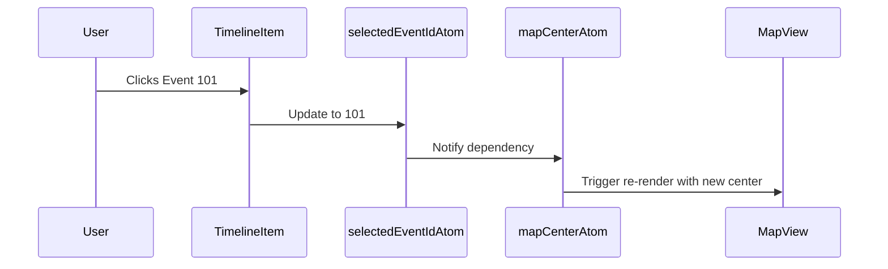

# Chapter 8: State Management with Atoms

Welcome back! 🎉 In [Chapter 7: Atoms](07_atoms.md), you learned that atoms are the atomic building blocks 🧱 of state in the Disaster Ninja app. Each atom holds one piece of data, like a user ID, a zoom level, or a selected item.

Now it’s time to see how atoms come together to create a system — a **state management flow** that powers the entire app.

---

## 🎯 Use Case: Tying Together App State with Atoms

Let’s walk through a real example:

> "When a user selects an event on the timeline, the app should update the map center position, highlight the selected area, and show event info in a panel."

That's 3 components:  
🗺️ Map position  
🏕️ Highlighted region  
🧾 Info panel

All of these need to **share a consistent idea of which event is selected.** That's exactly what atoms can help us do!

---

## 🧠 Recap: What Is an Atom?

Think of atoms as tiny **post-it notes** 📝 on the app’s wall, each holding a small piece of live app memory:

- `selectedEventAtom`: holds the ID of the selected event  
- `mapCenterAtom`: holds the latitude and longitude  
- `eventInfoPanelAtom`: tracks if the info panel should be open  

When one post-it is updated, everyone reading it gets notified.

Now let’s tie them together!

---

## 🧩 Key Concepts for Managing State with Atoms

To build a full state flow, we combine atoms in meaningful ways. Here's what we use:

| Concept | What It Does | Analogy |
|--------|---------------|---------|
| Base Atom | Stores a single value | A labeled post-it 📌 |
| Derived Atom | Computes something based on other atoms | A calculator watching your post-its 🔢 |
| Syncing Atoms | Linking atoms that affect each other | Sticky notes that move together 🧷 |
| Action Functions | Custom logic to update atoms together | A manager writing on multiple post-its 🧑‍💼 |

Let’s use these to solve our timeline use case 👇

---

## 🛠️ Step-by-Step: Managing Selected Event State

### ① Define the Base Atom: Selected Event

This atom remembers *which* event the user selected.

📄 `/src/store/events.ts`

```ts
import { atom } from '@reatom/core';

export const selectedEventIdAtom = atom<number | null>(null);
```

➕ Bonus: Name your atom for debugging:

```ts
atom<number | null>(null, 'selectedEventIdAtom');
```

🧠 This now holds the event ID (e.g., 42), or `null`.

---

### ② Define Reaction Atoms: Reactive Side Effects

Let’s update the map center when an event is selected.

📄 `/src/store/map.ts`

```ts
import { atom } from '@reatom/core';
import { selectedEventIdAtom } from './events';

export const mapCenterAtom = atom((ctx) => {
  const eventId = ctx.spy(selectedEventIdAtom);
  if (!eventId) return [0, 0];

  // In real code, you might fetch the event's coordinates.
  return [50, 20];  // Fake position for demo
});
```

🧾 Explanation:  
- `atom()` with a function creates a **derived atom**  
- `ctx.spy()` tracks the selected event  
- When `selectedEventIdAtom` changes, this atom updates automatically  
- All subscribed components will re-render 🎯

👉 The same idea is used for opening the panel and highlighting the region!

---

### ③ Update Atom on Click

A user clicks on an event card. We update the main state atom.

📄 In a component (e.g., TimelineListItem)

```tsx
import { useCtx } from '@reatom/react';
import { selectedEventIdAtom } from '@/store/events';

export function TimelineItem({ eventId }) {
  const ctx = useCtx();

  return (
    <div onClick={() => ctx.update(selectedEventIdAtom, eventId)}>
      Event #{eventId}
    </div>
  );
}
```

✅ When clicked, the event is selected  
✅ `selectedEventIdAtom` updates  
✅ All atoms that depend on it (like `mapCenterAtom`) update  
✅ React components showing the map, info panel, etc. update accordingly

---

## 🔄 What Happens Behind the Scenes?

Let’s visualize this data flow using a sequence diagram:



🎯 This “data ripple” is automatic. No manual messaging or prop chains. Everybody who depends on the state gets fresh data.

---

## 🔬 Under the Hood: How Reatom Atoms Work

Here’s a simplified view of how atoms trigger updates:

- **Base atoms** store simple values like strings or numbers
- When you call `ctx.update(atom, newValue)`:
  1. The atom stores the new value
  2. Reatom checks which other atoms or components are watching
  3. Those are recalculated or re-rendered

Reatom uses a **dependency graph** internally to track these 🕸️  
So changing one atom only updates the pieces that care.

---

## 🧪 Example of Multiple Reactions

Say we want an info panel to open or close based on event selection:

📄 `/src/store/infoPanel.ts`

```ts
import { atom } from '@reatom/core';
import { selectedEventIdAtom } from './events';

export const isInfoPanelOpenAtom = atom((ctx) => {
  return ctx.spy(selectedEventIdAtom) !== null;
});
```

🧾 Whenever an event is selected, this becomes `true`.  
When the selection is cleared, it becomes `false`.

---

## 📦 Real-Life Folder Structure

In Disaster Ninja, you’ll find these patterns:

```
/src/store/
  events.ts              ⬅️ Holds selectedEventIdAtom
  map.ts                 ⬅️ Holds mapCenterAtom (dependent on event)
  infoPanel.ts           ⬅️ Holds isInfoPanelOpenAtom (reaction)
```

Each file defines atoms for one area.  
Together they form a predictable, reliable memory for your app.

---

## ✅ Summary

You just built your first real state system in Reatom! 🙌

Let’s review:

✔ Atoms store pieces of app memory  
✔ Derived atoms compute values based on others  
✔ Updating an atom triggers changes across the app  
✔ You can model complex behaviors by combining atoms 🔁

This modular architecture helps Disaster Ninja stay bug-free and reactive — even as it grows.

---

In the next chapter, we’ll explore how geospatial data is managed and manipulated inside the app using helper functions. 🗺️

➡️ Continue to [Chapter 9: GeoJSON Helpers](09_geojson_helpers.md) to see how we handle map features and geometry formats.

You’re doing amazing — keep those atoms flowing! 💡🧠🌍