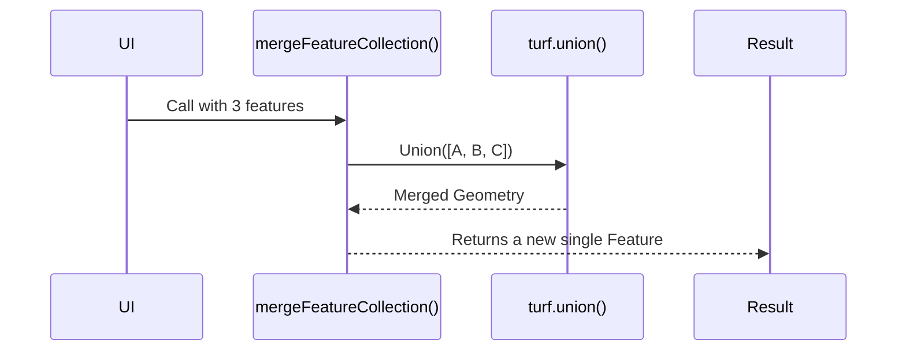

# Chapter 9: GeoJSON Helpers

Welcome back! 👋 In the last chapter, you learned how to manage flexible app state using atoms in [Chapter 8: State Management with Atoms](08_state_management_with_atoms.md). Now that we have a strong mental model of how data flows inside the UI, let's turn our attention to something a little more... geographic. 🗺️

In this chapter, we’ll explore how Disaster Ninja works with real-world maps using **GeoJSON Helpers** — your friendly toolbox for everything spatial!

---

## 🎯 What Problem Do GeoJSON Helpers Solve?

> "I have a bunch of geometry — like a country outline, a flood zone, or a cluster of buildings — and I want to display, combine, or analyze that data in the app."

In Disaster Ninja, a ton of things exist “on the map”:
- Boundaries of disasters
- Drawing tools from users
- Points and polygons from data layers

All this spatial data lives in a common format called **GeoJSON**.  
But working with raw GeoJSON can be tricky and repetitive. That’s why we use **GeoJSON Helpers**!

---

## 🧰 What Are GeoJSON Helpers?

Think of GeoJSON Helpers as a set of 🧙 magic tools that help you do stuff with map data — quickly and safely.

They can:
- Normalize messy geometry 🧼
- Combine (merge) multiple shapes 🔗
- Get boundaries around shapes 📏
- Filter or clean up features 🧽

These helpers reduce errors and make working with maps approachable — especially for beginners.

---

## 💡 Analogy: GeoJSON = Building Blocks, Helpers = LEGO Tools

- 🧱 GeoJSON gives you the bricks (Points, Lines, Polygons)
- 🛠️ GeoJSON Helpers give you the tools: to snap them together, find their edges, or build cool shapes

---

## 🗺️ Real Use Case: Merging Multiple GeoJSON Shapes

Imagine you’ve selected 3 different polygons — maybe three administrative regions.  
You want to:
1. Merge them into one area
2. Show that on the map as a single shape

Without helpers: you’d have to manually manipulate geometries (unexpectedly hard).

✅ With GeoJSON Helpers: you call a single helper like `mergeFeatureCollection()`.

---

## 🧠 Key Concepts (Simplified)

| Concept | What It Is | Analogy |
|--------|-------------|---------|
| GeoJSON | A format for geographic shapes | Standardized LEGO bricks |
| Feature | A single shape (e.g. a country outline) | One brick |
| FeatureCollection | A group of shapes | A tub of bricks |
| Helper Function | A utility for manipulating GeoJSON | Your LEGO toolkit 🧰 |

Let’s walk through a beginner-friendly example.

---

## 🛠️ Example: Merge GeoJSON Shapes Together

Let’s say we have 3 geometric shapes selected:

```ts
const selectedFeatures = {
  type: "FeatureCollection",
  features: [feature1, feature2, feature3], // individual polygons
}
```

We want to merge them into one combined shape!

Use the helper like this:

```ts
import { mergeFeatureCollection } from '@/lib/geojsonHelpers';

const merged = mergeFeatureCollection(selectedFeatures);
```

✅ `merged` now contains:  
- A single feature with the combined area  
- Which you can directly show on the map  

This helps when:
- Combining user-drawn areas
- Zooming to a focus boundary
- Running analysis on an affected region

---

## 🔍 What Happens Behind the Scenes?

Here’s a simplified version of what the helper does:

1. Reads all polygons from the FeatureCollection
2. Passes them into a library (like `turf.js`) to compute the spatial union
3. Returns one big merged polygon

Let’s visualize this process:



Cool, right? You write 1 line, and the helper handles all the geometry magic. 🧙

---

## 🧩 Internal Implementation: A Peek Under the Hood

Let’s look at how this helper might be implemented.

📄 `/src/lib/geojsonHelpers.ts`

```ts
import { featureCollection, union } from '@turf/turf';

export function mergeFeatureCollection(fc) {
  const [first, ...rest] = fc.features;

  return rest.reduce((acc, feature) => {
    return union(acc, feature);
  }, first);
}
```

🧾 Explanation:
- It takes the first feature as the base
- Then merges one-by-one using `turf.union()`
- In the end, returns a single geometry feature

It’s like combining puzzle pieces into a larger one 🧩

---

## 🧰 Other Useful Helpers

Here are some common helpers and what they do:

| Helper Function | What It Does | Example Use Case |
|-----------------|--------------|------------------|
| `mergeFeatureCollection()` | Combines many shapes into one | Focus region |
| `getBoundingBox()` | Returns rectangle around a shape | Auto-zoom on selection |
| `isValidGeojson()` | Checks if input is valid | Avoid map errors |
| `getFeatureCentroid()` | Returns center point of a shape | Place a label or pin |

You can find these in the `/src/lib/geojsonHelpers.ts` file.

---

## 🧪 Tip: Use With Atoms!

Many of your map selections or drawn layers will be stored in [atoms](07_atoms.md).

You can combine helpers + atoms to create great reactive behavior:

```ts
const selectedFeaturesAtom = atom(null);

const mergedAtom = atom((ctx) => {
  const fc = ctx.spy(selectedFeaturesAtom);
  return fc ? mergeFeatureCollection(fc) : null;
});
```

Now, any time the selection changes, the merged shape is updated!

—

## 📦 Where to Find GeoJSON Helpers in the Codebase

In Disaster Ninja, you’ll find most spatial helpers here:

```
/src/lib/geojsonHelpers.ts       👈 All GeoJSON tools live here
```

And used throughout:
- Geometry Uploader
- Draw Tools
- Focused Geometry Layers
- Event Boundary Tools

---

## ✅ Summary

In this chapter, you discovered that:

✅ GeoJSON is how geographic data is represented in the app  
✅ GeoJSON Helpers are tools to process, validate, and manipulate GeoJSON  
✅ You can merge shapes, get centroid points, bounding boxes, and more — in one line  
✅ Helpers often rely on geometry libraries (like Turf.js)  
✅ These helpers integrate beautifully with atoms for live updates

Next time you work with geographic layers, boundaries, or drawn features — you’ll know you have a powerful toolkit by your side. 🧰🌍

---

Ready to dive into the map itself?

➡️ Let's continue to [Chapter 10: Map and Marker Management](10_map_and_marker_management.md) — where we learn how to display shapes, add pins, and control the map view! 🗺️🎯

Keep going, cartographer ninja! 🥷📍