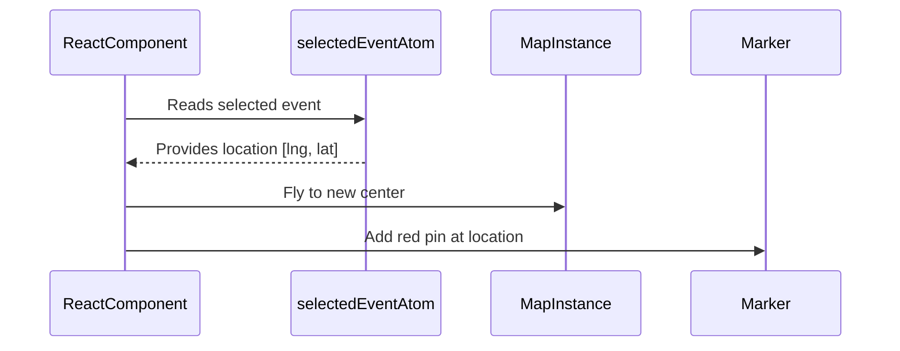

# Chapter 10: Map and Marker Management

Welcome back! 🗺️ In [Chapter 9: GeoJSON Helpers](09_geojson_helpers.md), we learned how to merge and manipulate shapes using amazing helper functions that operate on spatial data formats.

Now that we can shape and clean map data, it’s time to bring it to life!  
In this chapter, we'll explore how the Disaster Ninja app actually creates and manages maps and markers using a tool called **MapLibre**.

---

## 🎯 Real-World Motivation: Marking an Event on the Map

Let’s start with a beginner-friendly use case:

> “When a disaster event is selected, I want to show a pin 📍 on the map at its location and automatically center the map there.”

This involves two moving parts:

- 📍 Adding a marker to the map  
- 🗺️ Moving (or zooming) the map to the marker

In this chapter, we’ll learn about the tools and abstractions that let you do just that — all using React, hooks, and state.

---

## 🧠 What Problem Does Map & Marker Management Solve?

In an interactive map application like Disaster Ninja, you need to:

| Goal | Problem It Solves |
|------|-------------------|
| Add markers | Show specific events or places |
| Remove markers | Keep the map clean when data changes |
| Move the map view | Focus the user’s attention on key locations |
| Respond to updates | Make the map reflect the app state automatically |

Disaster Ninja handles all of this using a combination of a reusable map system and marker manager powered by **MapLibre** and **React hooks**.

---

## 🧰 Key Concepts

Let’s break this abstraction down into beginner-friendly ideas:

| Concept | What It Means | Analogy |
|--------|----------------|---------|
| `MapLibre GL` | Library that renders interactive maps in the browser | Like Google Maps, but open-source 🗺️ |
| `mapInstance` | The actual map object on screen | The map “brain” 🧠 |
| `marker` | A visual pin or icon placed on the map | A sticky note on the map 🧷 |
| `React hook` | A way to run behavior in response to state | Listens and responds to data updates 🔄 |

We’ll show how they come together to manage what the user sees on the map.

---

## 🏁 Use Case Step-by-Step: Add a Marker and Move the Map

Let’s walk through how to build this beginner use case:

> “I want to show a red location pin for the selected event, and center the map on it.”

---

### ✅ Step 1: Set Up Your Map Component

You'll create a map using MapLibre.

```tsx
// MapComponent.tsx
import { useRef, useEffect } from 'react';
import maplibregl from 'maplibre-gl';

export function MapComponent() {
  const mapRef = useRef<HTMLDivElement>(null);
  const mapInstanceRef = useRef<maplibregl.Map | null>(null);

  useEffect(() => {
    if (mapRef.current && !mapInstanceRef.current) {
      mapInstanceRef.current = new maplibregl.Map({
        container: mapRef.current,
        style: 'https://demotiles.maplibre.org/style.json',
        center: [0, 0],
        zoom: 2,
      });
    }
  }, []);

  return <div ref={mapRef} style={{ height: '500px' }} />;
}
```

🧾 Explanation:
- We create and store a MapLibre instance inside a `ref`.
- The map is inserted into the DOM using `mapRef`.
- On component mount, the map is initialized at the world view.

So far: We have a basic interactive map! 🎉

---

### ✅ Step 2: Place a Marker

Let’s place a marker on the map at `[50, 20]`.

```tsx
useEffect(() => {
  const marker = new maplibregl.Marker({ color: 'red' })
    .setLngLat([50, 20])
    .addTo(mapInstanceRef.current!);

  return () => {
    marker.remove(); // clean up if re-render
  };
}, []);
```

🧾 Explanation:
- A red pin appears at that point on load.
- We clean it up on re-render so old duplicates are removed.

You can change the coordinates dynamically based on props or app state!

---

### ✅ Step 3: Sync with React State (like selected event)

Let’s assume we have a selected event stored in an atom (from [Chapter 8](08_state_management_with_atoms.md)):

```ts
export const selectedEventAtom = atom<{ location: [number, number] } | null>(null);
```

Now in our `MapComponent`, we’ll use this atom.

```tsx
import { useAtom } from '@reatom/npm-react';
import { selectedEventAtom } from '@/store/selectedEvent';

const selected = useAtom(selectedEventAtom);

useEffect(() => {
  if (!selected || !mapInstanceRef.current) return;

  const marker = new maplibregl.Marker({ color: 'red' })
    .setLngLat(selected.location)
    .addTo(mapInstanceRef.current);

  mapInstanceRef.current.flyTo({ center: selected.location });

  return () => marker.remove();
}, [selected]);
```

✅ Now this is dynamic:
- When the selected event changes, the marker updates
- The map smoothly centers (zooms into) the event's location

Magic! 🪄

---

## 🔍 Internal Flow: What Happens Behind the Scenes

To visualize the flow of interaction between state, map, and marker, let’s use a simple diagram:



🧠 The map and marker are fully driven by external app state.  
When the user selects something, the visual updates follow — automatically.

---

## 💡 But Where Is This Logic in Disaster Ninja?

Inside the Disaster Ninja codebase, map and marker logic is typically abstracted into reusable hooks and classes.

Examples found here:

```
/src/map/
  useMap.ts              👈 Hook to access map instance
  MarkerManager.ts       👈 Class to manage marker creation & cleanup
  MapProvider.tsx        👈 Top-level React context for map
```

Instead of manually managing refs as above, the actual code uses:

- A shared Map context
- Subscription to atoms (like selected geometry)
- A marker manager that handles create/update/remove efficiently

Each layer of abstraction makes the system more maintainable.

---

## 🧠 Under the Hood: MarkerManager Simplified

Here’s how marker management may work internally:

```ts
export class MarkerManager {
  private markers: maplibregl.Marker[] = [];

  addMarker(coord: [number, number]) {
    const marker = new maplibregl.Marker({ color: 'red' })
      .setLngLat(coord)
      .addTo(this.map);

    this.markers.push(marker);
  }

  clearMarkers() {
    this.markers.forEach((m) => m.remove());
    this.markers = [];
  }
}
```

🧾 Explanation:
- `addMarker()` adds a new pin
- `clearMarkers()` removes all the pins when needed
- This class helps avoid clutter and leak of old markers

Used behind the scenes in components reacting to atom updates

---

## 📦 Real Project Integration

✅ Declarative components + smart logic = smooth map updates

The pieces work together like this:

- A `selectedEventAtom` triggers subscribe updates
- A `MapLibre` instance is already set up in `<MapCanvas />`
- A `MarkerManager` instance is used to add/remove markers
- Optionally a zoom handler (flyTo) focuses the view

You don’t always write the MapLibre logic directly — the hooks manage it for you.

---

## ✅ Summary

In this chapter, you learned:

- How to create and control a map with MapLibre
- How to place interactive markers (pins) at specific coordinates
- How to sync markers with dynamically changing state using atoms
- That Disaster Ninja manages maps through reusable hooks, providers, and marker managers
- Most complex marker/map logic is wrapped behind clean interfaces for you!

---

Now that you can show and update content on the map…  
What if the user clicks or drags on the map? 🎯 That’s where interactivity comes in!

➡️ Continue to [Chapter 11: Map Interactivity](11_map_interactivity.md) to learn how the map responds to user actions.

You're now a map master in training! Keep going, cartographer ninja! 🥷📍🗺️