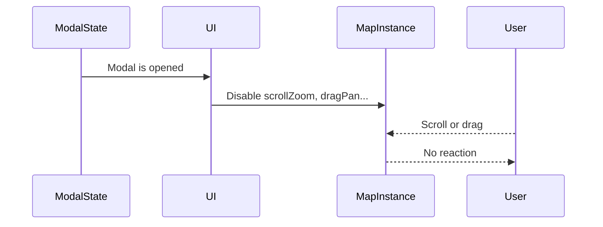

# Chapter 11: Map Interactivity

Welcome back, cartographer ninja! 🥷🗺️  
In [Chapter 10: Map and Marker Management](10_map_and_marker_management.md), we explored how to use the map — showing markers, centering on events, and syncing visuals with state.

Now, it’s time to flip the script:

> Instead of the app changing the map, what if the user changes the map?

That’s **Map Interactivity** — making the map respond to user actions like dragging, zooming, and rotating. 🎮

---

## 🎯 Real-World Use Case: Freezing the Map While a Modal is Open

Let’s walk through a simple but very common scenario:

> “When a user opens a modal (like a settings panel), we want the map to stop reacting to input — so it doesn’t pan or zoom accidentally.”

Why this matters:
- Prevents distraction while focusing on UI  
- Avoids unexpected movements  
- Feels polished and intentional ✨

To handle this in Disaster Ninja, we need control over **interactivity settings** on the map.

Let’s explore how we do that! 👇

---

## 🎮 Big Picture: What Is Map Interactivity?

At a high level:

> Map interactivity is about choosing when the map should listen to the user — and how.

There are different types of interactions:
- Dragging or panning around the map
- Zooming in/out using scroll or touch
- Rotating the map with gestures
- Clicking things like markers or geometry

In technical terms:  
You enable or disable certain input behaviors on the **MapLibre instance**.

---

## 🧰 Key Concepts

Let’s break Map Interactivity into small, easy-to-digest tools:

| Concept | What It Does | Analogy |
|--------|---------------|---------|
| `scrollZoom` | Allows zooming with mouse wheel | Scroll to zoom in 📜🔍 |
| `dragPan` | Allows dragging to move the map | Click and drag like a whiteboard 🧲 |
| `boxZoom` | Enables zooming by drawing a rectangle | Click-drag-select like PowerPoint 🔳 |
| `keyboard` | Enables map moves using arrow keys | Keyboard-nudge the map 🎹 |

Disabling these can give users a **cleaner focus** during modal use or when editing data.

---

## 🛠️ Using the Map Interactivity Tools

Let’s walk through how to disable all interactions when a modal is open.

### Step 1: Access the Map Instance

To control interactivity, you need access to the actual map object.

In Disaster Ninja, this is usually available via context or hook:

```ts
const map = useMapInstance(); // Custom hook or context
```

For demo purposes, let’s say we already have `map`.

---

### Step 2: Use the Interactivity Controls

Each feature in MapLibre has a toggle method. Here’s how we disable common inputs:

```ts
map.scrollZoom.disable();
map.dragPan.disable();
map.keyboard.disable();
map.boxZoom.disable();
```

To re-enable later:

```ts
map.scrollZoom.enable();
map.dragPan.enable();
map.keyboard.enable();
map.boxZoom.enable();
```

🧾 Simple, right?

You can attach this logic to a modal’s open/close state, like this:

```tsx
useEffect(() => {
  if (isModalOpen) {
    map.scrollZoom.disable();
    map.dragPan.disable();
  } else {
    map.scrollZoom.enable();
    map.dragPan.enable();
  }
}, [isModalOpen]);
```

✅ When the modal opens, the map “freezes”.  
✅ When it closes, normal interaction resumes.

---

### Bonus: Disable All Interactions at Once

Disaster Ninja also provides a shortcut for this 🔥

```ts
import { toggleMapInteractivity } from '@/map/tools/interactivity';

toggleMapInteractivity(map, false); // disable all interaction
toggleMapInteractivity(map, true);  // enable again
```

This is helpful when you want to change interactivity in many places consistently.

---

## 🔍 What Happens Behind the Scenes?

Here’s a simple flow diagram showing what happens when a modal opens and pauses map interactivity:



The user tries to move the map — but it politely ignores input until interaction is re-enabled. 🧊

---

## 🛠️ Internal Implementation: `toggleMapInteractivity`

Let’s peek at how the helper `toggleMapInteractivity()` works internally.

📄 `/src/map/tools/interactivity.ts`

```ts
export function toggleMapInteractivity(map: Map, enabled: boolean) {
  const method = enabled ? 'enable' : 'disable';

  map.scrollZoom[method]();
  map.dragPan[method]();
  map.boxZoom[method]();
  map.keyboard[method]();
}
```

🧾 Explanation:
- We dynamically call `enable()` or `disable()` on each interaction tool
- This keeps things concise: one function manages all interactivity settings
- Used by modals, editors, and tools across the app

This avoids code duplication and ensures consistent map behavior 🎯

---

## 🧠 Where Is This Used in the App?

The Map Interactivity tools are used extensively in:

- Geometry tools: pause dragging while editing a polygon  
- Modals or side panels: prevent accidental movement  
- Measurement tools: disable interactivity while measuring distance  
- Focused Geometry Mode: freeze the map while showing a danger zone

You'll often see code like this in components:

```ts
useEffect(() => {
  toggleMapInteractivity(map, !isInEditMode);
}, [isInEditMode]);
```

Meaning: if edit mode is active, interactivity is paused ❄️

---

## 💬 Tip: Keep the Map Predictable

Disabling interactivity might sound counterintuitive — but it gives users confidence and precision, especially when:

- Drawing lines/polygons  
- Focusing on layered data  
- Opening complex modals or analysis tools  

You don’t want the map zooming away when someone scrolls a panel! 😅

---

## ✅ Summary

You did it! Now you understand:

✅ Map Interactivity isn’t just about how maps behave — it’s about **when** they behave  
✅ You can disable/enable interactions like scroll and drag  
✅ Disaster Ninja uses a helper like `toggleMapInteractivity()` to do this consistently  
✅ This is useful during drawing, editing, or when modals are open  
✅ It makes interfaces feel more intentional and less annoying 😄

---

Now that you can **freeze or enable** map behavior as needed…  
Want to learn how even more complex map inputs (like clicks, tool drawing, or hover interactions) are managed?  
Let’s level up.

➡️ Continue to [Chapter 12: Map Interaction Manager](12_map_interaction_manager.md) where we explore how all user interactions — clicks, hovers, selections — come together in one unified system. 🔍🖱️

See you there, map master! 🧠👆🗺️