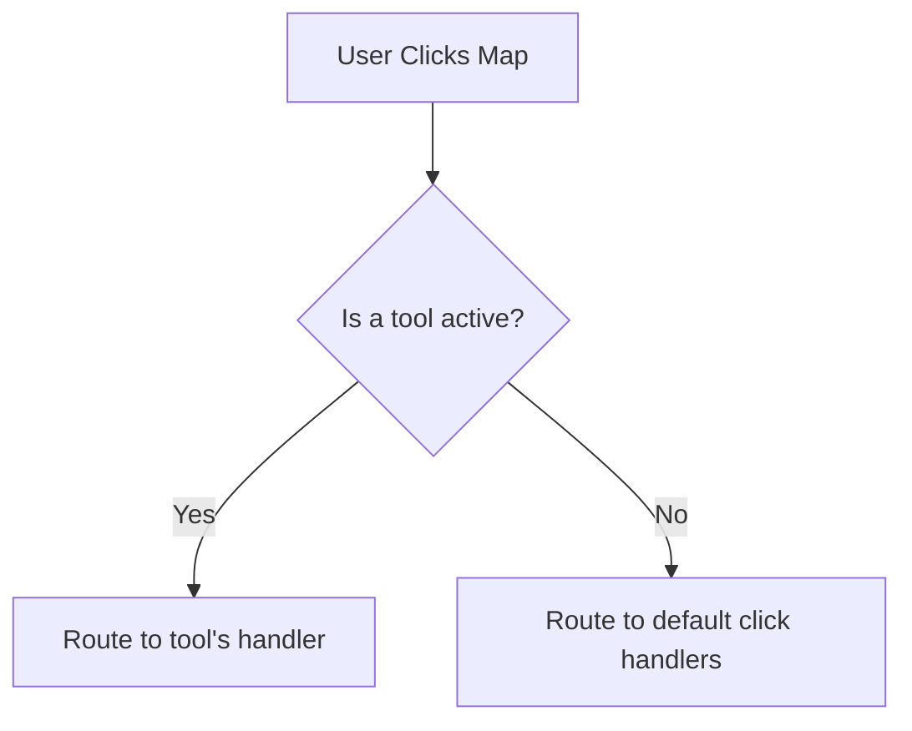
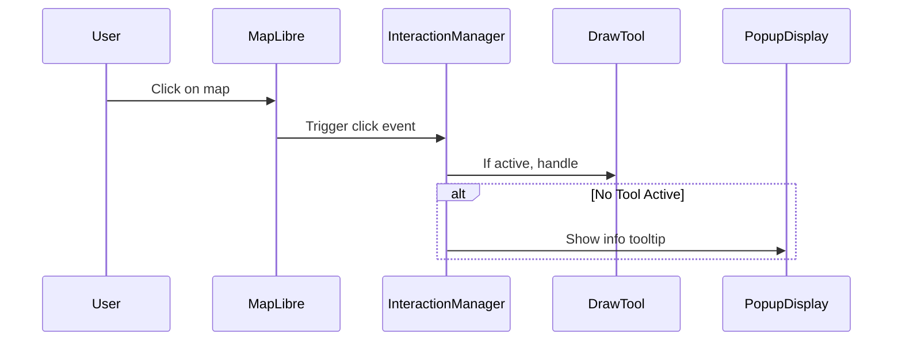

# Chapter 12: Map Interaction Manager

Welcome back, explorer of maps! 🗺️  
In the [previous chapter: Map Interactivity](11_map_interactivity.md), we learned how Disaster Ninja controls when the map listens to the user — like freezing movement when a modal is open.

Now let’s go one step further:

> What happens when a user clicks the map?  
> Or hovers over geometry?  
> Or drags a tool across the map?

It’s time to meet the friendly conductor behind all these events: the **Map Interaction Manager**. 🎼🧠

---

## 🎯 Motivation: What Problem Does This Solve?

Let’s start with a real use case:

> "When a user clicks on the map, we want to either:
> - Select a feature
> - Show a tooltip
> - Trigger analysis (if a tool is active)
> 
> But only ONE of those should happen at a time — and only if it's relevant."

🤯 This sounds simple… but without proper coordination, things can go very wrong:
- Multiple tools fight to handle the same click
- A hover event interrupts a tooltip
- Tools react when they’re not supposed to

That’s why we use the **Map Interaction Manager**.

✅ It listens to everything  
✅ It decides who should respond  
✅ It makes sure only one action happens at a time

Like a traffic officer for user input 🧍‍♂️🛑

---

## 🧠 What Is the Map Interaction Manager?

Let's simplify:

> 🧠 It's a central controller that listens to all **map interactions** (like clicks or drags) and delegates them only to relevant tools.

Imagine visiting a help desk at a library.  
You ask something → a librarian checks who's responsible → and passes your request to the right expert.

The Map Interaction Manager does the same — for clicks, drags, or hovers — but on the map.

---

## 🧩 Key Concepts (Explained Simply)

| Concept | What It Is | Analogy |
|--------|-------------|---------|
| Listener | A function that waits for an interaction | Someone watching for raised hands 🖐️ |
| Active Tool | A map feature (like a drawing tool) that's currently enabled | Your current pen 🖊️ |
| Handler Registry | A list of functions that want to respond to interactions | A queue of volunteers 👍 |
| Delegation | Calling the correct handler when something happens | Assigning the right person to answer 📞 |

Together, these pieces make sure that map clicks go to the right destination — and only one thing responds. Let's see how this works 👇

---

## 🛠️ A Simple Example: Handle Map Clicks

Let’s imagine this situation:

> You want to show a popup with feature info **only if no tool is active**.

### Step 1: Register a Click Handler

Somewhere in a feature handler, we register a "listener" like this:

```ts
mapInteractionManager.addClickHandler('popup', (event) => {
  // Show the popup at event.lngLat with feature info
});
```

🧾 Explanation:
- `addClickHandler()` tells the interaction manager:  
  "If no tool is active and someone clicks, use this handler."

---

### Step 2: Managing Active Tool Modes

Let’s say you've activated a drawing tool (like a polygon draw mode):

```ts
mapInteractionManager.setActiveTool('drawPolygon');
```

💡 When this tool is active:
- Clicks go to the **draw handler**
- The popup listener is ignored

This maintains **input priority**. Only the active mode responds. 🎯

When you're done:

```ts
mapInteractionManager.clearActiveTool();
```

Now regular handlers (like showing a tooltip) regain control.

---

### Step 3: Priority Behavior

The Map Interaction Manager follows this simple priority model:



🔥 This gives us flexibility without chaos. Tools work when active, and default behaviors resume when nothing special is selected.

---

## 🔬 What Happens Behind the Scenes?

Here’s a non-code walkthrough:

1. User clicks on the map ⛳
2. The Map Interaction Manager receives the event
3. It checks:
   - Is a tool active?  
     - If yes → forwards the event to that tool’s handler  
     - If no → looks for default click listeners
4. Only one path is allowed to respond!

This prevents any overlap or confusion.

### Let's see a sequence:



It’s all about orderly, predictable input. 🧰🔍

---

## 💡 Internal Code Peek: How the Manager Works

Let’s look at a **simplified version** of how `MapInteractionManager` is implemented.

📄 `/src/map/MapInteractionManager.ts`

```ts
export class MapInteractionManager {
  activeToolName: string | null = null;
  clickHandlers: Map<string, (event: any) => void> = new Map();

  setActiveTool(name: string) {
    this.activeToolName = name;
  }

  clearActiveTool() {
    this.activeToolName = null;
  }

  addClickHandler(name: string, handler: (e: any) => void) {
    this.clickHandlers.set(name, handler);
  }

  handleClick(event: any) {
    if (this.activeToolName) {
      // Let tool handle it
      const toolHandler = this.clickHandlers.get(this.activeToolName);
      toolHandler?.(event);
    } else {
      // Route to default handlers
      for (const [name, handler] of this.clickHandlers) {
        if (name !== this.activeToolName) handler(event);
      }
    }
  }
}
```

🧾 What’s happening:
- `addClickHandler()` lets features register listeners
- `setActiveTool()` prioritizes one feature
- `handleClick()` routes every event accordingly

Think of it as a switchboard operator connecting each call to the right desk ☎️

---

## ✨ Behind-the-Scenes Helpers

Under the hood, the manager is usually initialized and attached like:

📄 `/src/map/index.ts`

```ts
map.on('click', (e) => {
  mapInteractionManager.handleClick(e);
});
```

So once the manager is set up, all clicks go through it first.  
No component ever talks directly to the map!

This makes interactions predictable and testable ✅

---

## 📦 Where It's Used

The Map Interaction Manager is used throughout the app:

- 🖊️ In drawing tools (e.g. [Chapter 68: DrawToolsController](68_drawtoolscontroller.md))
- 🧭 In tooltip/hover behavior ([Chapter 22: Tooltip Trigger Mechanism](22_tooltip_trigger_mechanism.md))
- 🎯 During focused geometry selection ([Chapter 71: Focused Geometry Layer](71_focused_geometry_layer.md))
- ⚙️ In layer interactivity and advanced features

Some tools dynamically register/deregister with the manager, based on user actions. It's all automated!

---

## ✅ Summary

You now understand what keeps map interactions organized in Disaster Ninja!

✅ The Map Interaction Manager listens for all map clicks  
✅ It routes those clicks based on active tools or default behavior  
✅ Only one handler responds to each event  
✅ This keeps the map focused, stable, and easy to scale

With this system, we avoid conflicts, race conditions, or mystery bugs. 🧪

---

In the next chapter, we’ll zoom back out to understand how map layers are controlled and toggled — peace of mind for any map wrangler!

➡️ Continue to [Chapter 13: Layer Control System](13_layer_control_system.md)

You're doing amazing! Onward, ninja of navigation! 🥷🗺️🖱️