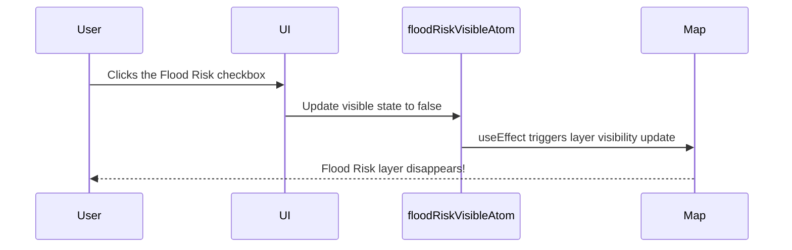
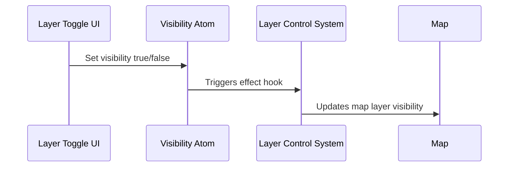

# Chapter 13: Layer Control System

Welcome back! 🧭 In the previous chapter, we explored how user actions are managed in a unified way through the [Map Interaction Manager](12_map_interaction_manager.md). It helped us capture clicks and gestures on the map with consistency.

Now we’re ready to dive into another magical part of Disaster Ninja — **how map layers are displayed, hidden, organized, and personalized for each user's needs**.

Welcome to the **Layer Control System**. 🎛️

---

## 🎯 Real-World Use Case: Turning On/Off Map Layers

Let’s say you’re a disaster response coordinator using the app:

> “I want to quickly turn **on** a flood risk layer and **off** population density to focus on what matters most right now.”

This is exactly what the **Layer Control System** allows you to do:  
✅ Show only what you need  
✅ Hide what you don’t  
✅ Reorder layers  
✅ See clearly what’s on the map

It’s like a smart remote control for your layers! 📺

---

## 🧠 Big Idea: What Is the Layer Control System?

Imagine a remote control that lets you:

- Turn each layer **on** or **off**
- Customize layer settings (like opacity or style)
- See a **list of what’s currently visible**
- Understand what each layer is for (via labels, legends, etc.)
- Prioritize layers by reordering

That’s the vision for the **Layer Control System** — and it works seamlessly with state management and user interactions under the hood.

---

## 📦 Key Concepts (Simplified)

Think of layers as transparent glass panes placed on top of each other on a table. Each one contains different types of data.

The Layer Control System gives you the power to manage each pane.

Let’s understand it piece by piece:

| Concept | Beginner-Friendly Description | Analogy |
|--------|-------------------------------|---------|
| 🧱 Layer | A single piece of data on the map | A transparent slide |
| 📝 Control Panel | UI where you turn layers on or off | Remote control with switches |
| ⚙️ Layer Settings | Customizations like opacity or filters | Adjusting TV brightness |
| 🚦 Visibility State | Stores whether each layer is showing | Light switch ON/OFF |
| 🧠 Logic Layer Atom | Atom that keeps track of all layer (on/off) states | Live memory of the map layers |

---

## ✅ Solving Our Use Case Step-by-Step

Let’s build a minimal path together:

> “I want to display the ‘Flood Risk’ layer and hide the ‘Population Density’ layer.”

---

### ① Step 1: Store Layer State with Atoms

Every layer has a visibility flag stored in atoms (see [Atoms](07_atoms.md)).

📄 `/src/store/layers.ts`

```ts
import { atom } from '@reatom/core';

export const floodRiskVisibleAtom = atom(true);
export const populationDensityVisibleAtom = atom(false);
```

🧾 These atoms remember:  
- Flood Risk → visible ✅  
- Population Density → hidden ❌

They’ll update the map when changed.

---

### ② Step 2: Show a Toggle UI (Layer Control Panel)

📄 A minimal component to toggle them:

```tsx
import { useAtom } from '@reatom/npm-react';
import { floodRiskVisibleAtom, populationDensityVisibleAtom } from '@/store/layers';

export function LayerControlPanel() {
  const floodVisible = useAtom(floodRiskVisibleAtom);
  const popVisible = useAtom(populationDensityVisibleAtom);

  return (
    <div>
      <label>
        <input
          type="checkbox"
          checked={floodVisible}
          onChange={(e) =>
            floodRiskVisibleAtom.set(e.target.checked)
          }
        />
        Flood Risk
      </label>

      <label>
        <input
          type="checkbox"
          checked={popVisible}
          onChange={(e) =>
            populationDensityVisibleAtom.set(e.target.checked)
          }
        />
        Population Density
      </label>
    </div>
  );
}
```

🧾 Explanation:
- Each checkbox is linked to a layer's visibility state
- When user toggles it, visibility atom updates

---

### ③ Step 3: Sync Visibility with Map Layers

Let’s now show/hide the layers based on their atom values (see [Reatom State Management](06_reatom_state_management.md)).

📄 Somewhere inside your Map component:

```tsx
const floodVisible = useAtom(floodRiskVisibleAtom);
const popVisible = useAtom(populationDensityVisibleAtom);

// Access map instance
useEffect(() => {
  map.setLayoutProperty('flood-risk-layer', 'visibility', floodVisible ? 'visible' : 'none');
}, [floodVisible]);

useEffect(() => {
  map.setLayoutProperty('population-density-layer', 'visibility', popVisible ? 'visible' : 'none');
}, [popVisible]);
```

🧾 These `setLayoutProperty` calls tell MapLibre to show/hide a layer immediately.

---

## 🔍 What Happens Behind the Scenes?

Let’s see what happens when a user toggles one layer:



It’s that simple 🎯  
No callbacks. No imperative code messes. Just atoms → UI → map.

---

## 🔧 Under the Hood: Layer State Registry

In a real app, we don’t hardcode all target atoms. Instead, we use a dynamic structure like:

📄 `/src/store/logicalLayers.ts`

```ts
import { atom } from '@reatom/core';

type LayerConfig = {
  id: string;
  name: string;
  visible: boolean;
};

export const layersAtom = atom<LayerConfig[]>([
  { id: 'flood-risk', name: 'Flood Risk', visible: true },
  { id: 'population-density', name: 'Population Density', visible: false },
]);
```

A loop in UI renders this list dynamically.

In the map logic:

```ts
layers.forEach((layer) => {
  map.setLayoutProperty(layer.id, 'visibility', layer.visible ? 'visible' : 'none');
});
```

Now we can manage any number of layers the same way — no need to rewrite controls every time.

---

## ⚙️ Internal Implementation Layers (Advanced View)

Disaster Ninja wraps multiple layers in abstractions. Here's how it flows behind the curtain:



Some other internal pieces involved:

- `LayerTree`: organizes nested/grouped layers  
- `LayerAtom`: stores visibility + metadata  
- `LayerRenderer`: applies visibility state to the map

You don’t need to manually touch these for 95% of use cases — the system handles them for you! ✅

---

## ✨ Cool Bonus Features

The Layer Control System also supports:

🟡 Opacity controls  
🟢 Reordering layers  
🔵 Showing mini legends  
🔴 “Logical groups” (e.g., All Risk Layers together)

These all enhance user experience and layer clarity.

---

## 🙌 Summary

You’ve now unlocked one of the most powerful tools in Disaster Ninja — the Layer Control System!

✅ It turns map features into manageable visual layers  
✅ Users can toggle each layer on/off like flipping a switch  
✅ State is stored in atoms and synced directly with the map  
✅ Internally, Disaster Ninja registers and updates layers efficiently using abstractions

This helps users customize the map to their job at hand — and stay focused when disaster strikes.

---

Next up: How do we actually manage and define the **contents and metadata** of each layer?

➡️ Continue to [Chapter 14: Layer Management](14_layer_management.md) to uncover how layers are created, updated, and stored behind the scenes.

You’re cruising through map mastery — well done legend warrior! 🥷🗺️👑