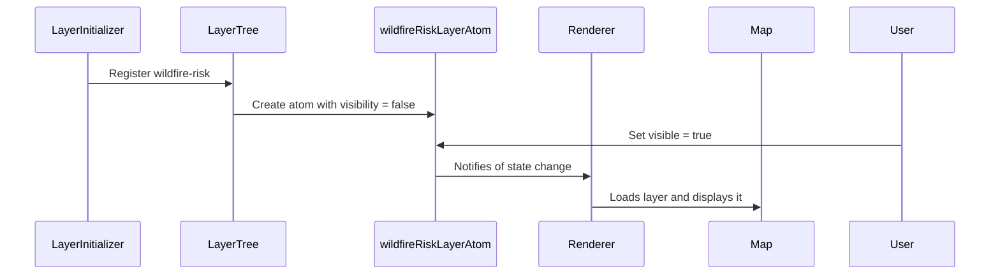

# Chapter 14: Layer Management

Welcome back, map master! 🧭  
In [Chapter 13: Layer Control System](13_layer_control_system.md), you learned how users can show or hide layers on the map — like flipping switches on a control panel. That helped users interact with the map in real-time.

But now you might be wondering...

> Who creates the layers in the first place?  
> How do we know what they are, where they come from, and how they behave?

That’s where the **Layer Management** system comes in — the behind-the-scenes engine that powers how layers are created, stored, and organized logically. 🗂️✨

---

## 🎯 Motivation: Why Do We Need Layer Management?

Let’s look at a real-life use case:

> “I want to insert a new data layer representing wildfire risk. It should display in a specific order on the map, be editable, and have a legend showing the color scale.”

We’re not just **toggling** layers anymore.

We’re now:
- Creating new layer entries
- Defining how each one behaves (static or interactive, visible or not)
- Organizing them so the system knows how to draw and update them in the right sequence

That’s the job of the Layer Management system — the blueprint and logic engine for all layers. 📐🧱

---

## 🧠 What Is Layer Management?

In simple words:

> Layer Management is the **central brain** that keeps track of all map layers — their configs, state, order, visibility, and type.

It is what allows you to:
- Load layers dynamically
- Update their properties  
- Validate their data  
- Group similar layers  
- Interface with rendering systems

It’s like the backstage manager of a theater 🎭 — one who keeps track of every actor (layer) and tells them when and how to perform.

---

## 🔑 Key Concepts (Explained Simply)

To really understand how this works, let’s break it down:

| Concept | What It Means | Analogy |
|--------|----------------|---------|
| 💾 LogicalLayer | An internal object that defines a layer (ID, name, source, etc.) | A file card in a map library |
| ⚙️ Layer Parameters | Metadata and settings for a specific layer | The spec sheet for that layer 📋 |
| 🧠 LayerAtom | State object that stores info about one layer | A brain cell remembering its settings |
| 🌲 LayerTree | A structured list of all layers in the system | A folder tree on your computer |

Let’s walk through how we use these to model the creation and management of a new layer.

---

## 💡 Use Case: Adding and Managing a Wildfire Risk Layer

We want to:
1. Define a new layer  
2. Register it in the system  
3. Store its state  
4. Ensure it appears on the map in the correct location

Let’s do this step-by-step with simplified examples.

---

### ✅ Step 1: Define a Logical Layer

Let’s start by describing the layer in code.

📄 `/src/layers/wildfireLayer.ts`

```ts
export const wildfireRiskLayer = {
  id: 'wildfire-risk',
  name: 'Wildfire Risk',
  source: 'https://layers.api/wildfire-risk',
  type: 'raster',
  editable: false,
};
```

🧾 This defines:
- Layer ID (used internally)
- Name (shown to the user)
- Source URL (where to fetch data from)
- Type of layer (raster/image vs. vector)
- Whether it can be edited

This is called a **Logical Layer** – a plain object that represents a data layer.

---

### ✅ Step 2: Register the Layer in the Layer Tree

Next, we "register" this layer so the system knows about it.

📄 Somewhere in setup (e.g., `/src/layers/allLayers.ts`)

```ts
import { wildfireRiskLayer } from './wildfireLayer';

export const allLogicalLayers = [
  wildfireRiskLayer,
  // ...other layers
];
```

Now the app knows this layer exists and can start creating atoms and visual entries for it.

---

### ✅ Step 3: Create a Layer Atom to Store Its State

Next, we convert the layer into a **LayerAtom** — a state object that can track things like visibility, loading status, order, etc.

📄 `/src/store/layerAtoms.ts`

```ts
import { atom } from '@reatom/core';

export const wildfireRiskLayerAtom = atom({
  id: 'wildfire-risk',
  visible: false,
  loading: false,
  error: null,
});
```

This atom remembers:
- Whether the layer is visible or not
- Whether it's currently loading data
- If something went wrong loading

It's like a sticky note that gets updated over time ✅

---

### ✅ Step 4: Connect to the Map via a Renderer

Once the layer is registered and the atom exists, a **renderer component** subscribes to the atom and draws it on the map.

Example:

```tsx
import { useAtom } from '@reatom/npm-react';
import { wildfireRiskLayerAtom } from '@/store/layerAtoms';

function WildfireRiskRenderer() {
  const { visible } = useAtom(wildfireRiskLayerAtom);

  useEffect(() => {
    if (!visible) return;

    // Add code to show wildfire map style here
    map.addSource('wildfire-risk', { /* ... */ });
    map.addLayer({ id: 'wildfire-risk', source: 'wildfire-risk' });

    return () => map.removeLayer('wildfire-risk');
  }, [visible]);

  return null;
}
```

🧾 Output:
- When the layer is marked visible, it appears on the map  
- When it’s hidden, it's removed

This connects Layer Management to actual rendering 💪

---

## 🔍 What Actually Happens Internally?

Let’s take a high-level peek at what happens when the layer is added and shown:



The key thing to remember:  
→ Logical definitions → Layer atoms → Map updates 🔁

---

## 🔧 Internal Implementation Quick Peek

Inside Disaster Ninja, these concepts are implemented in places like:

- 📄 `/src/layers/LayerTree.ts` — builds structured tree of logical layers
- 📄 `/src/store/layersAtomsStructure.ts` — defines atoms for each layer
- 📄 `/src/map/renderers/GenericRenderer.ts` — renders layers on the map
- 📄 `/src/layers/layerSource.ts` — defines where layers pull their data from

Example of the tree-building code:

```ts
const tree = [
  createLogicalLayerAtom(wildfireRiskLayer),
  createLogicalLayerAtom(floodLayer),
];
```

Each layer object becomes an atom and gets inserted into the tree, managed using [Reatom](06_reatom_state_management.md).

—

## ✅ Summary

Here’s what you learned in this chapter:

✅ Layer Management is the abstraction that defines, registers, and manages all map layers  
✅ Every layer starts as a **LogicalLayer** with metadata  
✅ Then it becomes a **LayerAtom** to hold its state  
✅ A renderer reads the atom and displays the layer reactively  
✅ The Layer Tree organizes and connects them into one system  

This unlocks the ability to manage dozens (or even hundreds) of map layers dynamically and reliably! 💪🌍

---

In the next chapter, we’ll build upon this and explore how layer **ordering** is handled — ensuring important data is always shown on top.

➡️ Continue to [Chapter 15: Map Layers Order Manager](15_map_layers_order_manager.md)

Keep going — you're assembling a world-class map engine! 🔧🗺️🚀