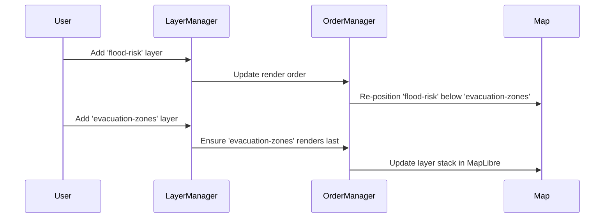

# Chapter 15: Map Layers Order Manager

Welcome back, map maestro! 🎉 You’ve already learned how to load, manage, and control layers in [Chapter 14: Layer Management](14_layer_management.md).

But what happens when you add multiple layers — and they overlap each other?

> Imagine turning on a “Flood Risk” layer, a “Roads” layer, and an “Evacuation Zones” layer.  
> You expect to see roads on top of floods, and evacuation zones on top of everything.

However… 😧

Without a system to manage the **order** of layers, critical information might get buried under less important data.

That’s exactly why we have the **Map Layers Order Manager**.

---

## 🎯 What Problem Does This Solve?

> “I want the evacuation zones to appear on top of other data so they are visible and not hidden.”

When many layers are displayed together:
- Their **stacking order** determines what you see
- Some layers are best shown in the background
- Others should always remain on top (like labels or alert zones)

🧒 For beginners, think of placing paper sheets on a desk — the sheets on top hide the ones underneath.

✅ The Map Layers Order Manager decides the correct stacking of layers and ensures the topmost ones are rendered last (so they appear on top within the map).

---

## 🧱 Why Is Layer Order Important?

Let’s make it even simpler.

Imagine this stack of visual layers:

```
🟩 Base Map
🟦 Flood Risk
🟥 Alert Zones
🟨 Marker Pins
```

If we accidentally render 🟨 Marker Pins before 🟥 Alert Zones, they might get hidden by mistake!

We need a manager to make sure:
- 🟩 comes first,
- then 🟦,
- then 🟥,
- and finally 🟨.

---

## 🧠 Key Concepts — Explained Simply

Let’s break down how this works behind the scenes using beginner-friendly terms:

| Concept | What It Is | Analogy |
|--------|------------|---------|
| Layer Stack | An ordered list of map layers | Stack of paper sheets on a desk |
| Render Order | The sequence in which layers are drawn | Drawing the background first and outlines last |
| Order Manager | Logic that calculates and updates the layer order | A librarian deciding which book goes on which shelf |
| Z-Index (Visual stacking) | The depth positioning of each layer | Layers “on top” vs. “underneath” |

---

## 🧩 Use Case: Layer Overlap Gone Wrong

🧁 Problem: You show a “Population Density” layer and an “Evacuation Outline” layer.

Oops! The population layer is more detailed — and it ends up hiding evacuation outlines completely.

😤 Not helpful in emergency apps.

✅ Solution: The Map Layers Order Manager ensures that high-priority layers like “Evacuation” always stay on top by adjusting the render order dynamically.

---

## ✅ Step-by-Step: How to Use the Map Layers Order Manager

Let’s say you are managing 3 layers:

- `"base-map"` — background tile layer  
- `"flood-risk"` — raster data (should be behind markers)  
- `"evacuation-zones"` — highlighted polygons that should always be on top

We want to make sure the rendering order is:

```
1. base-map
2. flood-risk
3. evacuation-zones
```

Here’s how the Map Layers Order Manager helps.

---

### ① Step 1: Store Layer Order in an Atom

Each layer is registered into the system with an internal position.

Example representation:

```ts
export const layerRenderOrderAtom = atom([
  'base-map',
  'flood-risk',
  'evacuation-zones'
]);
```

This atom maintains an array of **layer IDs in correct order**.

---

### ② Step 2: Apply Render Order When Layers Are Added

When each layer is added to the map, we ensure that they appear in the order from the atom.

Example logic (pseudo-code):

```ts
function renderAllLayersInOrder(map, orderedIds) {
  orderedIds.forEach(id => {
    const layer = getLayerDefinition(id);
    map.addLayer(layer.definition, idBeforeNext(orderedIds, id));
  });
}
```

🧾 Each layer is added in order using MapLibre’s `addLayer()` call.

This guarantees that later layers draw **on top of** earlier ones.

---

## 🙋 How Does Order Affect What You See?

Let’s say you have this visually:

```text
🅰️ Zone Labels     ← should be topmost
🅱️ Building Shapes
🆎 Base Tiles
```

If Zone Labels load **before** Buildings, they'll disappear under them.

Solution → the Map Layers Order Manager constantly watches the order and updates it when needed.

---

## 🔍 Under The Hood: A Walkthrough of What Happens

Here’s what happens when a few layers are added dynamically:



This ensures the newest, most critical layer is always drawn on top. 🎯

---

## 🧪 Implementation Shortcut in Code

There’s a central file that handles how this works automatically:

📄 `/src/map/MapLayersOrderManager.ts`

It contains logic like:

```ts
function updateLayerStack(map, orderedIds) {
  for (let i = 0; i < orderedIds.length; i++) {
    const currentId = orderedIds[i];
    const nextId = orderedIds[i + 1];
    
    if (map.getLayer(currentId)) {
      map.moveLayer(currentId, nextId); // Moves 'current' just before 'next'
    }
  }
}
```

🧾 Simple logic:
- Move each layer in sequence
- Ensures stacking ends up right, even if layers rendered out of order originally

---

## ✨ Helpful Features Provided by the Order Manager

1. ✅ Automatically reorders when layers are added/removed  
2. ✅ Keeps essential data (e.g. evacuation zones) always on top  
3. ✅ Integrates with [Layer Management](14_layer_management.md) and [Layer Control System](13_layer_control_system.md)  
4. ✅ Supports both raster and vector layers  
5. ✅ Keeps the UI clean and understandable

---

## 🔁 Bonus: Custom User Reordering Support

The system also supports **manual reordering**, like drag-and-drop in a Layers Panel.

When the user reorders layers:
- We update the `layerRenderOrderAtom`
- The Map Layers Order Manager applies the new order to MapLibre

💥 And now the user controls the view!

---

## ✅ Summary

You made it! Let’s recap:

✔ The Map Layers Order Manager controls **which layer is on top**  
✔ It practically ensures that **critical data isn't hidden** under background layers  
✔ It stores the order in a centralized atom  
✔ It applies that order when layers are rendered  
✔ It works behind the scenes to avoid cluttered, confusing maps!

This system ensures visual clarity in real-world scenarios — like flood zones, boundaries, and emergency alerts.

---

Up next: Let’s apply this structure to another smart system — decision analysis!  
We’ll learn how sorting works with multiple map-based criteria.

➡️ Continue to [Chapter 16: MCDA Sorting](16_mcda_sorting.md)

Onward, layer legend! 🥷🗂️✨