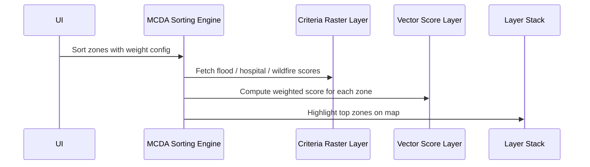

# Chapter 16: MCDA Sorting

Welcome! 👋 In the previous chapter, we explored how map layers are ordered and visualized with the help of the [Map Layers Order Manager](15_map_layers_order_manager.md). Now, we dive into a powerful tool used to make smart decisions from complex data: **MCDA Sorting**.

This beginner-friendly chapter will help you understand:

- What MCDA Sorting is
- Why it's useful in disaster response
- How it works in the Disaster Ninja frontend
- Where in the app it’s typically used

Let’s get started! 🧠✨

---

## 🧠 What Is MCDA Sorting?

MCDA stands for **Multi-Criteria Decision Analysis**.

MCDA Sorting is a way to sort or rank things (like regions or places) by evaluating them on multiple criteria — not just one.

Imagine sorting candidates for a rescue operation not just by distance to a hospital 🚑, but also by:

- Population at risk 👨‍👩‍👧‍👦
- Flood level severity 🌊
- Accessibility 🚧
- Available shelter space 🏨

MCDA looks at all of these factors together to help planners decide where priority response is needed.

Rather than sorting by a single number (like "distance"), MCDA uses:
✅ Multiple scores  
✅ Individual importance weights  
✅ A formula to combine them

Think of it as a super-smart sorting hat! 🧙‍♂️🎩

---

## 🎯 Real-World Use Case in Disaster Ninja

> “I want to display a sorted list of areas from most-affected to least-affected, based on multiple layers of data.”

With MCDA Sorting, users can build advanced sorting rules based on:
- Population impact
- Damage severity estimates
- Emergency needs
- Resource availability

Then ➡️ Disaster Ninja uses MCDA Sorting to rank the map regions for you.

It brings clarity out of messy data.

---

## 🧰 Key Monster Terms (Explained Like You’re 5)

| Term | What It Means | Example |
|------|---------------|---------|
| Criteria | The things you're measuring | “Distance”, “Population”, “Risk” |
| Weight | How important each criterion is | “Population is 60%, Distance is 40%” |
| Score | The value for each criterion | “Zone A: Population 1000, Distance 20km” |
| Ranking | The final sorted list | “Zone A is #1, Zone B is #2...” |

MCDA helps combine 10 messy numbers into one beautiful rank.

---

## 🧩 Step-by-Step: A Sorting Hat Using MCDA

Let’s walk through a made-up example:

We want to rank 3 districts for aid delivery:

| District | Population at Risk | Flood Level | Accessibility |
|----------|--------------------|-------------|---------------|
| Alpha    | 10,000             | Medium      | Bad           |
| Beta     | 5,000              | High        | Okay          |
| Gamma    | 2,000              | Low         | Good          |

We assign weights to what's MOST important:

- Population impact 👉 50%
- Flood level 👉 30%
- Accessibility 👉 20%

MCDA adds it all up (after normalization), and returns:

1. Alpha (highest weighted score)  
2. Beta  
3. Gamma

This is what we call **MCDA Sorting**.

---

## 💡 In Disaster Ninja, this happens automatically when:

- You enable priority ranking on layers
- You fill out an MCDA form (see [MCDAForm Component](98_mcdaform_component.md))
- You view areas ranked from most urgent to least

Under the hood, a sort function kicks in!

---

## 🧠 MCDA Sorting in the Code (Conceptual)

You’ll often find MCDA Sorting inside data processing functions like this:

```ts
export function mcdaSort(items: Area[], criteria: CriteriaWeight[]) {
  return items
    .map((area) => ({
      area,
      score: calculateWeightedScore(area, criteria),
    }))
    .sort((a, b) => b.score - a.score); // descending order
}
```

📦 Explanation:
- Each area is evaluated across all criteria
- A score is calculated using weights
- Areas are sorted by their final score from high to low

You don’t need to write this — it’s already handled behind the scenes.

---

## 👀 Where You’ll Find MCDA Sorting in the App

MCDA Sorting is invoked in:

- Map layer rankings
- MCDA configuration panels
- Multivariate layer styles
- The [MCDAForm Component](98_mcdaform_component.md)

It’s also part of:

🎯 Priority dashboards  
🧮 Ranked tooltips  
📊 Analytics panel outputs

You pick the factors and define their importance — Disaster Ninja calculates the rest. 🧠📋

---

## 🧪 Under the Hood - How It Works 🛠️

1. Each criterion is **normalized** to similar scale (e.g. 0 to 1)
2. Each score is multiplied by its weight
3. All weighted scores are added up
4. The total score is used to sort areas

✅ Easy to use with sliders  
✅ Visual feedback on the map  
✅ Transparent criteria weights

---

## ✨ Benefits of MCDA in Disaster Planning

✔ Combines messy data into a simple view  
✔ Decision-making based on **what YOU define as important**  
✔ Works well with real-world geographic layers  
✔ Supports transparency and explainability in priority setting

---

## ✅ Summary

In this chapter, you learned:

- MCDA Sorting ranks items based on multiple criteria + importance weights
- It’s like putting each region through a smart sorting hat 🎩
- Disaster Ninja uses this to guide disaster response planning
- Sorting happens automatically behind the scenes when MCDA is active
- It’s a powerful way to answer: “Where should we act first?”

---

🧭 Next Step:

Want to learn how MCDA Sorting fits into a larger system of styles, layers, and decisions?

➡️ Continue to [Chapter 17: Multi-Criteria Decision Analysis (MCDA) Sorting](17_multi_criteria_decision_analysis__mcda__sorting.md) to understand how this sorting integrates with maps, layers, and visuals.

You’re now ranking like a pro strategist! 🧠💼📊 Let’s keep going!

# Chapter 16: MCDA Sorting

Last time in [Chapter 15: Map Layers Order Manager](15_map_layers_order_manager.md), we learned how to control map layer visibility to make sure important features (like evacuation zones) always stay on top. Now let’s talk about how we handle map-based decision making using a technique called MCDA Sorting.

---

## 🧭 Why Use MCDA Sorting?

Let’s imagine you're planning an emergency evacuation route.

You have to choose the best path that is:
- least likely to flood 🌀
- closest to hospitals 🏥
- farthest from wildfires 🔥

Each of these is a different kind of map layer, and they each matter... but in different ways.

So how do you choose the best option? That’s where MCDA — Multi-Criteria Decision Analysis — comes in!

MCDA Sorting helps you compare map features (like roads or zones) using multiple criteria at once, and ranks them by how "good" they are for your scenario.

---

## 🧠 Key Concepts

### 1. 🎯 Criteria Layers
These are any map layers that provide a value we can sort by. For example:
- Flood depth (raster layer)
- Distance to hospital (vector or raster)
- Population density (raster)

Each criterion layer gives a score to each location or zone.

### 2. 🧮 Weighted Scoring
Each criterion gets a weight — how important it is to the decision.
- Flood depth: 50%
- Hospital distance: 30%
- Wildfire proximity: 20%

Final score = weighted sum of all the values.

### 3. 🪜 Sorting
Once we’ve calculated scores, we can sort locations from "best" to "worst" and even highlight them on the map!

---

## 🧪 Simple Use Case: Ranking Zones for Evacuation

Let’s say we have 3 zones. Here are their scores per criterion:

| Zone | Flood (Lower = better) | Hospital Distance | Wildfire Distance |
|------|-------------------------|--------------------|------------------|
| A    | 0.2                     | 0.8                | 0.6              |
| B    | 0.5                     | 0.6                | 0.9              |
| C    | 0.1                     | 0.4                | 0.2              |

Weights: Flood 50%, Hospital 30%, Wildfire 20%.

We score each zone using:

```
score = (flood * 0.5) + (hospital * 0.3) + (wildfire * 0.2)
```

---

## 🧑‍💻 Code Example

Let’s compute this in a TS function!

```ts
type Zone = {
  id: string;
  flood: number;
  hospital: number;
  wildfire: number;
};

type Weights = {
  flood: number;
  hospital: number;
  wildfire: number;
};

function sortZones(zones: Zone[], weights: Weights): Zone[] {
  return zones
    .map(zone => ({
      ...zone,
      score:
        zone.flood * weights.flood +
        zone.hospital * weights.hospital +
        zone.wildfire * weights.wildfire,
    }))
    .sort((a, b) => a.score - b.score); // Lower score = better
}
```

This function takes your zones and weights, computes a final score for each, and sorts them.

✅ Output:
- A list of zones ordered from most optimal (lowest score) to worst.

---

## 🔍 Behind the Scenes: What Happens When You Sort Zones?

Let’s peek inside!



### Step-by-Step:
1. The user defines weights via the UI.
2. MCDA engine fetches values from various map layers.
3. It calculates scores per zone.
4. It sends results to styling layers to highlight zones properly.

---

## 🛠 Internal Implementation (Simplified Overview)

This happens in a React + Jotai + MapLibre setup.

📁 `atoms/mcdaConfigAtom.ts`
```ts
export const mcdaWeightsAtom = atom({
  flood: 0.5,
  hospital: 0.3,
  wildfire: 0.2,
});
```

📁 `selectors/scoredZonesSelector.ts`
```ts
export const scoredZonesSelector = selector((get) => {
  const weights = get(mcdaWeightsAtom);
  const zones = get(allZonesLayerAtom); // [A, B, C...]

  return sortZones(zones, weights);
});
```

Scored zones are automatically ordered when a user updates weights.

---

## 🗺️ Showing Sorted Results on the Map

You can use [Layer Control System](13_layer_control_system.md) to add a special layer that:

- Highlights the top N zones
- Colors zones by score from green (good) to red (bad)

This lets us visually express multi-criteria decisions right on the map.

---

## 🧠 Summary

✔ MCDA Sorting compares zones using multiple raster/vector criteria  
✔ Each criterion gets a weight  
✔ A total score is computed and used to rank features  
✔ This score can be visualized with styled layers  

This is a powerful way to let users prioritize what's important to them — and see the results immediately.

---

👉 Next up: Let’s enable users to **test alternative scenarios** with instant feedback — welcome to the playground of spatial reasoning!

[Chapter 17: Scenario Comparison](17_scenario_comparison.md)