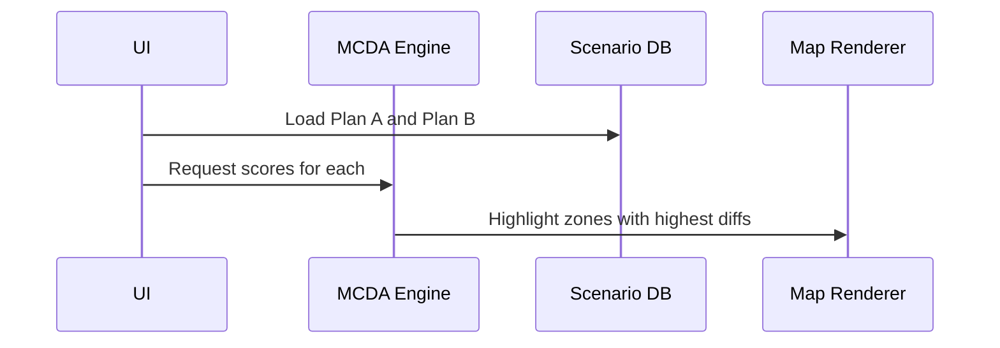

# Chapter 17: Multi-Criteria Decision Analysis (MCDA) Sorting

Welcome, analyst ninja! 🧠📊 In [Chapter 16: MCDA Sorting](16_mcda_sorting.md), you got a high-level look at how Disaster Ninja uses sorting techniques to make sense of complex, multi-dimensional data.

Now in this chapter, we'll take one layer deeper dive into this idea and fully understand what **Multi-Criteria Decision Analysis (MCDA) Sorting** really means.

If you're curious how Disaster Ninja can help users **rank disaster-affected areas**, **highlight priorities**, and **filter key risks** — this is the chapter for you. 🎯

---

## 🎯 Why MCDA Sorting? (A Real-World Motivation)

Imagine this situation:

> “You’re a relief coordinator. You have 50 districts hit by a flood.  
> Now you need to decide: _Which ones need help first?_”

But it's not that simple.

Each area has:
- A different number of affected people
- A different infrastructure condition
- Varying levels of flood exposure
- Different access to emergency services

👉 You can't choose based on one factor!  
You must consider multiple factors. 📋

This is where **Multi-Criteria Decision Analysis (MCDA)** comes in.

---

## 🤔 What is MCDA Sorting (In Simple Words)?

> “MCDA Sorting is about **ranking options** based on multiple factors — not just one.”

Think of it like rating job candidates:

| Candidate | Experience (0–10) | Skills (0–10) | Culture Fit (0–10) | Final Score |
|----------|-------------------|---------------|--------------------|-------------|
| Alice    | 8                 | 9             | 9                  | 26          |
| Bob      | 7                 | 6             | 8                  | 21          |
| Carla    | 9                 | 10            | 7                  | 26          |

Here, every factor is important. You combine them to get a score — and then **sort** the table based on that score.

That’s what Disaster Ninja does — but for **spatial areas**, **boundaries**, or **layers** on a map!

---

## 🎯 Where Does MCDA Sorting Show Up in the App?

In Disaster Ninja, MCDA Sorting is used when the user wants to:

- Prioritize map features — like cities, zones, or countries
- Combine different indicators (like damage, exposure, population)
- Visualize areas in order of importance
- Use bivariate or multivariate coloring to reflect combining factors

✨ It powers:
- Area rankings
- Risk heatmaps
- Dynamic table sorting based on criteria

---

## 🧱 Let’s Break It Down: MCDA Sorting Anatomy

At a high level, MCDA Sorting involves:

| Part | Meaning |
|------|---------|
| 🧮 Criteria | The different indicators used to compare options (e.g. flood risk, population) |
| 📊 Weights | The importance of each criterion |
| 🧠 Scoring | Combining the values into one comparable number |
| 🧹 Sorting | Arranging ranked features from most to least “priority” |

Think of it as a recipe:

```ts
score = (floodRisk * 0.4) + (population * 0.3) + (infrastructureDamage * 0.3);
```

Then sort areas according to the final `score`.

---

## 📍 Example: Sorting Provinces by Impact

Let’s say you have 3 provinces. Each one has:

| Province | Flood Risk | Population | Road Accessibility | Combined Score |
|----------|------------|------------|---------------------|----------------|
| A        | 0.8        | 0.6        | 0.3                 | 0.61           |
| B        | 0.5        | 0.9        | 0.4                 | 0.62           |
| C        | 0.9        | 0.4        | 0.7                 | 0.67           |

Disaster Ninja will sort these and highlight Province C as top priority.

---

## ✨ How MCDA Sorting Is Used in Practice

Disaster Ninja provides tools to:

1. Let users choose which indicators (criteria) they care about
2. Let users assign weights to those indicators
3. Apply mathematical calculations per area feature (like a district)
4. Sort the results from highest to lowest
5. Visually reflect sorting using map styles and edge highlights

🔄 The results update live as users change criteria or weights!

---

## 🧠 How It Works Behind the Scenes

Let’s look at a flow diagram:

```mermaid
flowchart TD
    A[User selects indicators and weights] --> B[App collects MCDA config]
    B --> C[App loads data for each feature]
    C --> D[App calculates a "score" per feature]
    D --> E[App sorts features by score descending]
    E --> F[Map shows sorted features using color gradient or outlines]
```

It’s basically data science — but blended with geospatial analysis, wrapped in a user-friendly UI. 💡

---

## 🔧 Code-Level View (Simplified)

In the code, the sorting process can be distilled like this:

```ts
function calculateScore(feature, config) {
  return (
    feature.floodRisk * config.weights.floodRisk +
    feature.population * config.weights.population +
    feature.access * config.weights.roadAccess
  );
}

const sortedFeatures = features
  .map(f => ({ ...f, score: calculateScore(f, config) }))
  .sort((a, b) => b.score - a.score);
```

Then they’re used for:
- Coloring features
- Displaying tools like tooltips or tables
- Showing rankings in side panels

---

## 🛠️ Where to Find MCDA Sorting in the Codebase

MCDA Sorting logic and integration take place in several parts of the app:

📁 Key places include:

- `/src/features/mcda/` — Main logic components
- `/src/components/MCDAForm.tsx` — User interface for selecting indicators
- `/src/lib/sorting.ts` — Sorting helpers and math
- Atoms:
  - `mcdaLayerAtom`
  - `mcdaConfigAtom`
  - `mcdaResultFeaturesAtom`

You don’t need to access them all right now — just know they’re there when you’re ready to dig deeper.

---

## 🧩 Related Concepts

To make MCDA Sorting work, Disaster Ninja also uses:

🧮 Normalization — converts all values to compatible scales (0–1)  
📐 Weight assignment — lets users say which factor matters more  
🎨 Bivariate or multivariate styling — colors/symbols based on combined scores  
✅ Thresholding — show only areas with score > X

These create powerful analytical views for disaster prioritization!

---

## ✅ Summary

Let’s recap what you’ve learned:

✅ MCDA Sorting combines multiple criteria to create rankings  
✅ It helps prioritize areas or features on the map  
✅ Sorting relies on user-selected indicators + weights  
✅ Behind the scenes, the app calculates scores and sorts based on them  
✅ MCDA Sorting powers advanced map visualizations and tables dynamically  
✅ It’s a core analytics tool in Disaster Ninja's toolbox

You’re now officially dangerous with data. 💪🧠

---

In the next chapter, we’ll explore the **core concept of MCDA** itself — how scores are calculated, values normalized, and decisions made.

➡️ Continue to [Chapter 18: MCDA (Multi-Criteria Decision Analysis)](18_mcda__multi_criteria_decision_analysis_.md)

You're doing amazing. Keep sorting your way into knowledge! ⬆️🔍📊

# Chapter 17: Scenario Comparison

Welcome back! 👋 In [Chapter 16: MCDA Sorting](16_mcda_sorting.md), we learned how to rank places on a map using multiple criteria — like flood risk, hospital distance, and population. That gave responders a way to prioritize… but what if you want to try out different priorities?

🤔

Maybe one scenario focuses more on flood risk 🌊  
...while another scenario gives more weight to accessibility 🚧

Wouldn’t it be awesome to compare how those different settings affect priorities — instantly?

That’s what this chapter is all about: **Scenario Comparison!**

---

## 🧭 Why Scenario Comparison Matters

Imagine a disaster response planner trying out different strategies:

> “I want to know how the top 3 evacuation zones change if I prioritize hospital access more.”

By comparing **scenarios with different MCDA weights**, you can answer:
- What changes when flood risk becomes the top priority?
- Do new regions rise to the top if we shift focus to accessibility?
- How stable are my top-ranked zones across variations?

🔥 This supports evidence-based decision-making — and lets users test their assumptions in real time!

---

## 🧩 Key Concepts

Let’s break it down.

### 🧪 A "Scenario" is:
- A unique configuration of MCDA **weights** (e.g., flood: 50%, access: 30%, population: 20%)
- Often saved as a **preset** or **custom slider setup**
- Produces one set of ranks or results on the map

### 🔁 Scenario Comparison is:
- Running **multiple scenarios** side-by-side
- Seeing how rankings differ between them
- Showing visual changes on the map 🔀

---

## 🔧 Example: Compare Two Scenarios

| Scenario | Flood | Hospital | Wildfire |
|----------|-------|----------|----------|
| Plan A   | 60%   | 30%      | 10%      |
| Plan B   | 30%   | 50%      | 20%      |

Using these, we can compare how each zone ranks under *Plan A vs Plan B*.

---

## 🧑‍💻 Code Walkthrough: Comparing Two Scenarios

Let’s code a simple function to compare zones under two MCDA setups.

```ts
type Weights = { flood: number; hospital: number; wildfire: number };

function getScoresForScenario(zones: Zone[], weights: Weights) {
  return zones.map(zone => ({
    id: zone.id,
    score:
      zone.flood * weights.flood +
      zone.hospital * weights.hospital +
      zone.wildfire * weights.wildfire,
  }));
}
```

This gives you a score per zone per scenario. Now we can compare!

```ts
function compareScenarios(zones: Zone[], scenarioA: Weights, scenarioB: Weights) {
  const scoresA = getScoresForScenario(zones, scenarioA);
  const scoresB = getScoresForScenario(zones, scenarioB);

  return zones.map(zone => {
    const scoreA = scoresA.find(s => s.id === zone.id)?.score ?? 0;
    const scoreB = scoresB.find(s => s.id === zone.id)?.score ?? 0;
    return {
      id: zone.id,
      diff: scoreB - scoreA,
    };
  });
}
```

🎯 Now you know: which zones went up/down in score when switching scenarios.

---

## 👁 Visual Example: Show Zones That Changed the Most

In the map UI, you can:

- Color zones by how much their MCDA score changed between scenarios
- Highlight "stable" zones that stay top-ranked in both
- Show a side-by-side layer view: Plan A vs. Plan B

---

## 🛠 How It Works Under the Hood

Let’s visualize what happens step-by-step.



Key stages:
1. User picks two saved MCDA scenarios.
2. The system fetches weights from the database.
3. Scores are calculated for both scenarios.
4. The difference is visualized on the map.

---

## 🧠 Internal Atoms & Selectors

📁 `atoms/scenarioListAtom.ts`

```ts
export const scenarioListAtom = atom<Weights[]>([
  { flood: 0.6, hospital: 0.3, wildfire: 0.1 },
  { flood: 0.3, hospital: 0.5, wildfire: 0.2 },
]);
```

📁 `selectors/compareScenariosSelector.ts`

```ts
export const compareScenariosSelector = selector((get) => {
  const zones = get(allZonesLayerAtom);
  const [planA, planB] = get(scenarioListAtom);

  return compareScenarios(zones, planA, planB);
});
```

📍 This selector runs the comparison and outputs per-zone differences — ready to style on the map!

---

## 🗺️ Power Feature: Scenario Switcher in UI

Let users:
- Toggle between saved MCDA configs
- Instantly see updated rankings
- Compare side-by-side maps with a swipe tool or split view

Combine this with the [Layer Control System](13_layer_control_system.md) to manage visibility of each view.

---

## ✨ Summary

✔ A **scenario** is a saved MCDA config (weights)  
✔ Users can try multiple scenarios to test different priorities  
✔ Each scenario ranks zones differently  
✔ Scenario Comparison shows which regions change the most  
✔ Helps users explore tradeoffs and make better decisions

This brings the power of model testing right into the hands of decision-makers — all visually and interactively!

---

🚀 Up next: What if zones should only **qualify** if they meet minimum requirements first?

Let’s explore a new filtering system: [Chapter 18: Criteria Threshold Filters](18_criteria_threshold_filters.md)

You’re building powerful decision tools — keep going! 💪🧠📊