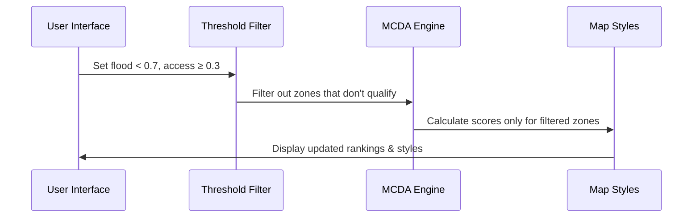

# Chapter 18: MCDA (Multi-Criteria Decision Analysis)

Welcome, decision-maker! 🧠🌍 In [Chapter 17: MCDA Sorting](17_multi_criteria_decision_analysis__mcda__sorting.md), we saw how data can be **sorted** using multiple rules. But where did those rules come from? And how do you know which area is “best” for your goal?

That's where this chapter comes in: welcome to the world of **MCDA** — a powerful but beginner-friendly way of choosing the best options in complex scenarios using many different factors.

---

## 🎯 Why MCDA?

Let’s imagine you're planning disaster relief and want to figure out:

> “Which area should receive priority aid?”

But… there’s not just one factor to consider:

- Flood risk
- Population density
- Accessibility
- Economic vulnerability
- Health infrastructure

...and more!

Different users might care more about one than the other — and totally different areas may emerge as the “top priority” depending on those **user preferences**.

So how do we combine all of these into a single, clear answer?

✅ That's the job of MCDA!  

---

## 🤔 What Is MCDA in Simple Terms?

🛠️ MCDA stands for **Multi-Criteria Decision Analysis**

It’s like a smart calculator that helps you figure out:

> "What location is best, given a bunch of different priorities?"

Just like buying a house:
- 🏡 You might weigh price (50%), location (30%), and size (20%)
- 🔍 MCDA takes your scores and weights and gives you a score for each house

In Disaster Ninja, we apply this same idea — except instead of houses, we apply it to the pixels, regions, or geometries on the map!

---

## 🧠 Key Concepts

| Concept | What It Means | Simple Analogy |
|--------|----------------|----------------|
| Criteria | The factors being considered (e.g. flood risk) | A checklist |
| Weights | How important each factor is | Giving each item points |
| Score | The result of combining weights and values | Final scorecard |
| Visualization | Showing the best-scoring areas clearly on the map | Coloring the best zones |

MCDA combines all these to help users make better decisions visually and interactively.

---

## 📦 Example: Choosing an Aid Target Area

Let’s work through a use case:

> You want to send medical aid to one region based on:
> - High population (weight: 30%)
> - Flood exposure (weight: 50%)
> - Poor hospital access (weight: 20%)

MCDA will:
1. Use each data layer (as a map input)
2. Normalize the values so they’re comparable
3. Multiply by the user-defined weight
4. Sum the results for each location
5. Render the results as a colored map

✅ The area with the darkest color = highest score = best match

---

## 🎨 How MCDA Looks in Practice

In the Disaster Ninja frontend:

- Each input layer becomes part of a scoring formula
- You can give each a weight (via sliders or input boxes)
- The system runs a calculation
- Results are visualized directly on the map

Here’s an example:

| Area | Pop Density (30%) | Flood Risk (50%) | Poor Access (20%) | Total Score |
|------|------------------|------------------|--------------------|-------------|
| A    | 0.8              | 0.6              | 0.2                | 0.56        |
| B    | 0.4              | 0.9              | 0.6                | 0.63 (winner) |
| C    | 0.9              | 0.1              | 0.5                | 0.48        |

🧠 The system handles the math. You just provide the “importance” of each factor.

---

## ⚙️ How MCDA Works Behind the Scenes

Let’s explore how MCDA operates in the application:

1. 👤 User selects layers and sets weights
2. 🧮 Each layer gets normalized (scaled between 0 and 1)
3. 📊 Each value is multiplied by its weight
4. ➕ All weighted values are summed per map feature
5. 🗺️ Output layer is shown on the map

Everything is recalculated live when weights change!

---

## 🗺️ Visualization Style: Bivariate/Multivariate Maps

The result of an MCDA calculation is typically displayed:
- As a colored heatmap on the map
- With legend gradients showing intensity
- Sometimes as combinations (e.g. bivariate matrix)

The highest-priority areas are immediately visual:
🟥 High scores (top concern)
🟨 Medium scores
🟩 Low scores

---

## 🧪 Try Playing with It!

In the Disaster Ninja app:

1. Click Advanced Tools → MCDA
2. Select at least two input layers
3. Assign a weight for each (“how important is this?”)
4. Click Calculate
5. Watch the map update!
6. Adjust weights and see the colors change

It’s like experimenting with your own decision engine 🔬

---

## 📦 Where Is MCDA Used in the Codebase?

Later in this guide, we’ll dive deeper into implementation:
- [Chapter 19: MCDA Configuration](19_mcda_configuration.md)
- [Chapter 98: MCDAForm Component](98_mcdaform_component.md)
- [Chapter 184: MCDA Calculations](184_mcda_calculations.md)

In this chapter, just know that MCDA is:
- A user-facing feature
- Connected to map layers, sliders, and rendering logic
- Powered by logic that combines normalized, weighted data values

---

## ✅ Summary

🎯 MCDA helps users decide “which area is best” — when there’s no single obvious answer  
✅ It combines multiple map layers using customizable weights  
✅ The result is shown on the map with intuitive visuals  
✅ It’s perfect for disaster planning, aid delivery, or risk evaluation  
✅ Beginners can simply adjust the weights and see smart results

---

You now understand what MCDA is — the brain behind complex geo-decisions in Disaster Ninja!

Want to control how MCDA is configured and connected to the layers?

➡️ Continue to [Chapter 19: MCDA Configuration](19_mcda_configuration.md) to dive deeper.

Keep analyzing like a pro, decision ninja! 🧠🥷📊

# Chapter 18: Criteria Threshold Filters

Welcome back, explorer of smart decisions! 🧭👩‍💻

In [Chapter 17: Scenario Comparison](17_scenario_comparison.md), we compared different setups of MCDA (Multi-Criteria Decision Analysis) — seeing how priorities shift based on weights, like giving flood risk more vs. less importance.

But now let’s solve a new problem:

> “I only want to consider zones that meet **minimum safety standards**.  
> If a zone's flood risk is too high, I want to ignore it completely!"

This is where our new tool comes in: **Criteria Threshold Filters** ✅

---

## 🙋 Why Use Threshold Filters?

Imagine a rescue planner says:

> “Don’t even show me zones where flood risk is above 0.7 — they’re too dangerous right now.”

Or:

> “Only show zones where at least some medical access exists.”

In real-world planning, not every zone is worth comparing. Sometimes you want to focus *only* on areas that pass minimum qualifications.

🥅 That’s what threshold filters do:
- They let you define **cut-off rules** for any criterion
- Only the zones that pass all filters go into scoring and sorting

---

## 🧠 Key Concepts - Beginner Friendly!

Let’s break it down into small pieces 👇

### 1. 🎯 Criteria
The indicators you're using, like:
- Flood risk
- Accessibility
- Population

Each one gives a value to every zone.

### 2. 🚫 Threshold
A minimum or maximum rule. You can say:
- “Flood risk must be **less than 0.6**”
- “Population density must be **greater than 0.3**”

This removes zones that don’t match your conditions.

### 3. ✅ Filtered Set
Only zones that **pass all thresholds** are kept.
Sorting and MCDA scores will only apply to this smaller group.

---

## 🧪 Use Case: Filter Unsafe Zones Before Ranking

Let’s say you define:
- Flood risk must be < 0.7  
- Accessibility must be ≥ 0.3

Here’s your raw data:

| Zone | Flood Risk | Accessibility |
|------|------------|----------------|
| A    | 0.8        | 0.4            ❌  
| B    | 0.6        | 0.2            ❌  
| C    | 0.5        | 0.5            ✅  

Only Zone C passes both thresholds — that’s the only zone that will be *scored* and *ranked*.

---

## 👩‍💻 Code Example: Simple Filter Function

Let’s write a small function to apply thresholds:

```ts
type Zone = {
  id: string;
  flood: number;
  access: number;
};

type Thresholds = {
  flood?: number;    // upper limit
  access?: number;   // lower limit
};

function filterZones(zones: Zone[], t: Thresholds): Zone[] {
  return zones.filter(zone =>
    (t.flood === undefined || zone.flood < t.flood) &&
    (t.access === undefined || zone.access >= t.access)
  );
}
```

🧠 Explanation:
- `flood < t.flood`: Only accept zones with flood risk below the threshold
- `access >= t.access`: Require minimum accessibility level
- If a threshold isn’t provided, skip it

Input:
```ts
filterZones(zones, { flood: 0.7, access: 0.3 });
```

Output:
✅ Array of zones that passed both rules

---

## 🔄 How Filtering Fits into MCDA Sorting

Recall from [Chapter 16: MCDA Sorting](16_mcda_sorting.md), we calculate scores like:

```ts
score = flood * 0.5 + access * 0.5;
```

With threshold filtering, we do this:

1. Filter out zones that don’t meet the criteria
2. Compute scores for the remaining ones
3. Sort by score

Let’s combine this:

```ts
function sortFilteredZones(zones: Zone[], weights: any, thresholds: Thresholds): Zone[] {
  const validZones = filterZones(zones, thresholds);
  return validZones
    .map(zone => ({
      ...zone,
      score: zone.flood * weights.flood + zone.access * weights.access
    }))
    .sort((a, b) => a.score - b.score);
}
```

Now you only rank what qualifies.

---

## 🛠 What Happens Internally — Step-by-Step

Here’s the chain of logic when you use criteria thresholds:



🎯 Only valid zones are sent forward to scoring and styling.

---

## 🔧 Internal Implementation (Simplified)

Thresholds are stored in a global atom ⬇️

📁 `atoms/thresholdsAtom.ts`

```ts
export const thresholdsAtom = atom<Thresholds>({
  flood: 0.7,
  access: 0.3,
});
```

Zones are filtered like this:

📁 `selectors/filteredZonesSelector.ts`

```ts
export const filteredZonesSelector = selector((get) => {
  const thresholds = get(thresholdsAtom);
  const zones = get(allZonesAtom);

  return filterZones(zones, thresholds);
});
```

These filtered zones are then passed into scoring functions like in [Chapter 16](16_mcda_sorting.md).

---

## 🗺️ Showing Threshold Filters in the UI

Most of the time, users will get simple dropdowns or sliders:

✅ “Hide zones with flood risk above X”  
✅ “Only include zones with hospital access above Y”  
🎚 Update filters = live update map

Combine with:
- [MCDAForm Component](98_mcdaform_component.md)
- [Layer Control System](13_layer_control_system.md)

…and the user can sculpt the data they want to see 🔍

---

## ✅ Summary

Here’s what you learned:

✔ Threshold filters remove zones that don’t meet key rules  
✔ They work before MCDA scoring — pre-filtering the input  
✔ Useful for safety cutoffs, minimum values, or focus subsets  
✔ Easy to configure and integrate in the UI  
✔ Results update live to display only relevant zones

They give analysts a **cleaner decision view**, focusing only on zones that matter most.

---

📚 Next stop: Let’s explore **how those MCDA scores are actually calculated**, with weights and math under the hood.

Continue to [Chapter 19: MCDA Scoring Engine](19_mcda_scoring_engine.md) for the full breakdown ⚙️📊

You’re doing amazing — keep filtering, scoring, deciding! 💪🧠🗺️