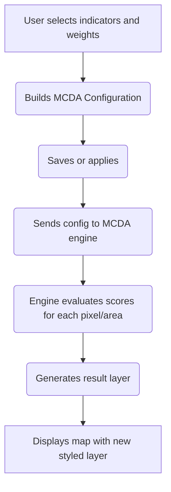
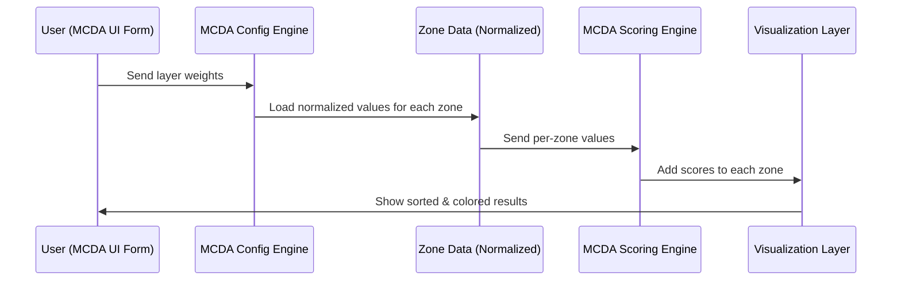

# Chapter 19: MCDA Configuration

Welcome to Chapter 19 of the Disaster Ninja front-end tutorial! 🎉

In this chapter, you'll learn about a powerful and customizable feature: the MCDA Configuration system.

If you've ever followed a recipe — whether for baking cookies or choosing the best location for aid deployment — you know the importance of choosing the right ingredients and adjusting things to taste.

Think of **MCDA Configuration** as a recipe builder for making spatial decisions. 🍰🧭

---

## 🎯 What Is MCDA Configuration?

“MCDA” stands for **Multi-Criteria Decision Analysis**. This analysis method lets you evaluate and compare different geographical areas using multiple data layers or indicators — like population density, flood exposure, health access, and so on.

MCDA Configurations allow you to:
- ❇️ Create custom decision-making models
- ⚖️ Choose which criteria (map layers) to include
- 🎛️ Set the importance (weight) of each criterion
- 🧮 Adjust how values are normalized or transformed
- 📊 Apply this configuration to generate a score map

In short:
➡️ Users build a custom MCDA Configuration  
➡️ The app combines and compares the chosen indicators  
➡️ The result is a new layer showing areas with higher or lower priority  
✅ All based on your rules.

---

## 🧠 Real-World Analogy

Imagine you’re cooking a stew. 🍲  
You pick your ingredients (layers), decide how much of each to add (weights), and customize the process (e.g. chopping or roasting = normalization or transformation).

MCDA Configuration is like writing and tweaking that stew recipe:  
Your final flavor (resulting map layer) depends entirely on what you put in — and how you prepare it.

---

## ⚙️ MCDA Configuration: The Building Blocks

Let’s break down an MCDA Configuration into beginner-friendly parts:

| Concept | What It Is | Analogy |
|--------|-----------|---------|
| Layers/Indicators | The data you want to consider | The ingredients in your recipe 🍅🥕🧄 |
| Normalization | How raw values are scaled (e.g. 0–1) | Cutting different ingredients to similar sizes |
| Weights | How important each indicator is | How much of each spice you use 🧂🌶 |
| Transformation | Adjusting values (e.g. enhancing gaps) | Roasting or blending to change flavor |
| Configuration | The full group of rules and settings | Your complete recipe card 📃 |

---

## 🧩 Beginner Use Case: Build a “Medical Access Priority” MCDA

Let’s say you want to identify areas that most urgently need medical access. 🤕

You might define:
1. High population density → important
2. Poor road access → important
3. High average age → less important, but still worth including

This would translate to an MCDA Configuration like:

| Layer | Weight | Normalization | Transformation |
|-------|--------|----------------|----------------|
| Population Density | 0.5 | Min-Max | None |
| Road Accessibility | 0.4 | Inverse Scale | None |
| Average Age | 0.1 | Z-Score | Enhance extremes |

The app will use this setup to compute a score for each region based on your logic!

---

## 👀 What Does an MCDA Configuration Look Like in Code?

Internally, an MCDA Configuration is just a structured object like this:

```ts
const myMcdaConfig = {
  name: "Medical Access Priority Model",
  layers: [
    {
      id: "population_density",
      weight: 0.5,
      normalization: "min-max",
      transformation: null,
    },
    {
      id: "road_accessibility",
      weight: 0.4,
      normalization: "inverse",
      transformation: null,
    },
    {
      id: "average_age",
      weight: 0.1,
      normalization: "z-score",
      transformation: "enhance",
    },
  ],
};
```

🎉 This structure is easy to store, update, or reuse later!

---

## 🔧 Where Do MCDA Configurations Live In The App?

The Disaster Ninja front-end has dedicated components and atoms for handling MCDA Configurations:

| Feature | Location |
|--------|----------|
| Form builder UI | MCDAForm component |
| Saved configurations | Stored server-side and loaded via API |
| Current selection | Stored in React + Reatom atoms |
| Evaluation logic | Triggered via MCDA sorting system |

You can access and edit configurations in the **"Decision Models" or "MCDA" panel** of the app UI.

---

## 🧠 How Does This Fit Into the Analysis Flow?

Let’s walk through the full flow from user input to map result:



➡️ Easy, reactive, and visual.

---

## 🎛️ Using the Configuration Builder UI (MCDAForm)

Disaster Ninja gives users an intuitive interface to build MCDA Configurations with:

✅ Checkboxes to choose available layers  
✅ Sliders to set layer importance (weights)  
✅ Dropdowns for choosing normalization methods  
✅ Advanced options for transformations

Every change is auto-synced to a local atom via the `MCDAForm` component, and can be saved or applied using the app tools.

---

## 💾 Saving and Loading Configurations

Your MCDA Configurations can be:

- Locally stored (temporary session use)  
- Saved to the server (via API) for reuse later  
- Shared with other users (if permissions allow)

This makes it easy to reuse the same decision model across different maps or teams.

---

## 🧪 Tip: You Can Preview Results Instantly

After applying a configuration:

- The app generates a **score map**, often color-coded (e.g. low = blue, high = red)
- You can see it overlayed on the base map
- Tooltips or legends display how values were calculated

This helps with rapid iteration and tuning of your configuration.

---

## 🧭 Summary

🧙 In this chapter, you learned that:

✅ MCDA Configurations are customizable “recipes” for decision analysis  
✅ Users pick indicators, assign importance, and define how values are processed  
✅ The system turns configurations into visual score maps  
✅ This helps identify high-priority areas based on multiple criteria

MCDA is how Disaster Ninja lets you turn raw data into informed spatial decisions. Powerful AND beginner-friendly!

---

🧮 Up next…

Once you know how to build MCDA Configurations, you’ll want those results to look amazing — with styles and colors that clearly communicate the findings.

➡️ Head to [Chapter 20: Bivariate and Multivariate Style Generators](20_bivariate_and_multivariate_style_generators.md) to learn how we visually represent MCDA results and more!

Keep going — your intelligence is now spatially resolved! 🎯🗺️🧠

# Chapter 19: MCDA Scoring Engine

Welcome back, strategy builder! 🧠🛠️

In [Chapter 18: Criteria Threshold Filters](18_criteria_threshold_filters.md), we learned how to hide unqualified zones before deciding what to rank — like ignoring dangerous areas with very high flood risk. But now it’s time for the real brain behind decision-making:

👉 The **MCDA Scoring Engine.**

What does it do?

It takes all your selected data layers (criteria), applies your chosen weights, and calculates a smart **composite score** for each zone or area on the map.

That’s how Disaster Ninja decides which places are most important — mathematically and fairly! 🧮📊

---

## 🎯 Central Use Case: Score All Zones for Decision-Making

Example:

> “I want to find the best zones for medical supply drops, considering:
> - Population density (40%)
> - Access to health facilities (40%)
> - Flood risk (20%)”

You select layers → assign weights → MCDA Scoring Engine kicks in → each zone gets one final score → top zones are shown clearly!

Let’s see how to do this step by step 👇

---

## 🧱 Key Concepts (Beginner Friendly)

Before we write code, let’s understand the building blocks:

### 1. 📊 Criteria Layers
Each represents a number per zone:
- `population_density`: 0.1 to 1.0
- `flood_risk`: 0.0 to 1.0
- `health_access`: 0.0 to 1.0

Each value measures one dimension of importance.

### 2. 🎚 Weights
You assign importance to each layer:
```ts
{
  population_density: 0.4,
  flood_risk: 0.2,
  health_access: 0.4,
}
```

These must add up to 1.0 (or 100%).

### 3. 🧮 Normalization
Every layer is scaled so its values fall between `0` and `1`. This way, we can mix and compare them easily.

### 4. 🧠 Scoring Formula

Once normalized, the score for each zone is:

```
score = (pop * 0.4) + (flood * 0.2) + (access * 0.4)
```

Zones are ranked from highest to lowest score 👍

---

## 🧑‍💻 Using the MCDA Scoring Engine

Let’s say we have this input:

```ts
const weights = {
  population: 0.4,
  floodRisk: 0.2,
  healthAccess: 0.4
};

const zones = [
  { id: "A", population: 0.9, floodRisk: 0.2, healthAccess: 0.7 },
  { id: "B", population: 0.4, floodRisk: 0.5, healthAccess: 0.8 },
  { id: "C", population: 0.7, floodRisk: 0.1, healthAccess: 0.5 },
];
```

Let’s calculate a score for each zone:

```ts
function calculateScores(zones, weights) {
  return zones.map(zone => ({
    ...zone,
    score:
      zone.population * weights.population +
      zone.floodRisk * weights.floodRisk +
      zone.healthAccess * weights.healthAccess,
  }));
}
```

🧠 Explanation:
- For each zone, we multiply each value by its weight.
- Then sum the results into one final `score`.

📥 Input:
Zones + weight for each criterion  
📤 Output:
Same zones with added `score` field

---

## 🪜 Example Output

Using the function above, we’ll get:

| Zone | Score |
|------|-------|
| A    | 0.76  |
| B    | 0.62  |
| C    | 0.58  |

So, under your selected weights, Zone A has the highest priority.

Later, maps or tables can sort and show these zones visually! 📍📈

---

## 🛠 Behind the Scenes: What Happens Step-by-Step

Let’s look at the journey of your MCDA config when you click "Score Zones".



☑️ This all happens reactively — scores are updated whenever weights change!

---

## 📦 Where This Lives in Code

Here’s what the actual implementation looks like.

📁 File: `lib/mcda/calculateScores.ts`

```ts
export function calculateScores(zones, weights) {
  return zones.map((zone) => {
    let score = 0;
    for (const key in weights) {
      score += (zone[key] ?? 0) * weights[key];
    }
    return { ...zone, score };
  });
}
```

✅ Looping all weights  
✅ Matching keys to zone values  
✅ Returns all zones, with new `score`

Hint: This runs inside a **selector** that connects zones and weights!

---

## 🎛 Config Atom + Score Selector

To connect pieces together...

📁 `atoms/mcdaConfigAtom.ts`

```ts
export const mcdaWeightsAtom = atom({
  population: 0.4,
  floodRisk: 0.2,
  healthAccess: 0.4,
});
```

📁 `selectors/scoredZonesSelector.ts`

```ts
export const scoredZonesSelector = selector(get => {
  const weights = get(mcdaWeightsAtom);
  const zones = get(normalizedZoneDataAtom); // pre-normalized 🙌

  return calculateScores(zones, weights);
});
```

📍 Note: This selector reacts to **changes in weights** or **data** and updates UI automatically.

---

## 🎨 What Happens to the Score?

Once scores are calculated:
- Zones are sorted and ranked
- Map colors each zone using a gradient (e.g. green–red)
- Optional labels or tooltips show the final score

Now users can see decisions clearly — visually + numerically!

---

## 🧠 Summary

Let’s recap what the Scoring Engine does:

✔ Takes normalized data values for each criterion  
✔ Multiplies them by user’s selected weights  
✔ Sums them to create one single score per zone  
✔ Sorts zones based on this score  
✔ Powers ranked lists, heatmaps, table views and more

This is the mathematical core of MCDA sorting in Disaster Ninja.

---

🧭 Ready to blend configuration, UI, and interactivity to build custom strategies?

➡️ Continue to [Chapter 20: MCDA UI Integration](20_mcda_ui_integration.md) to see how users actually build and control all this through sliders and controls.

Keep going, future decision architect! 🧠✨📍