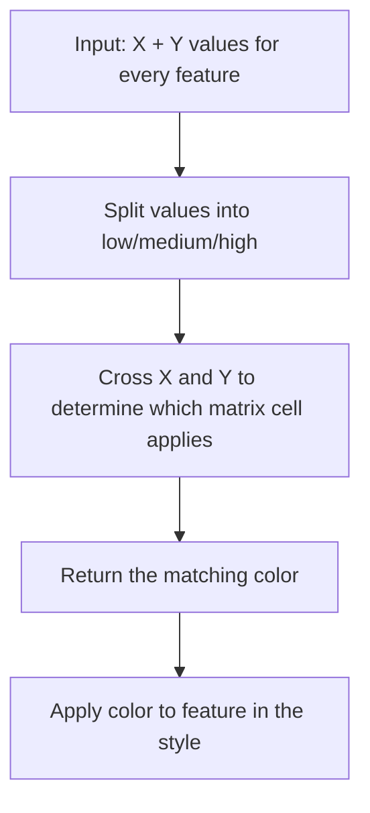
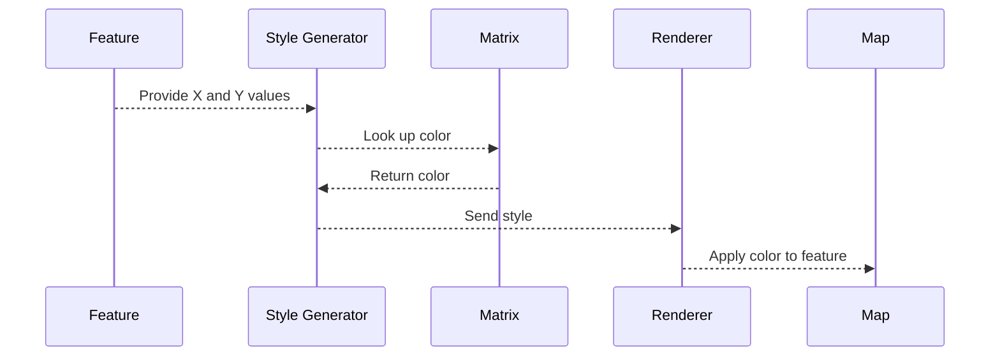
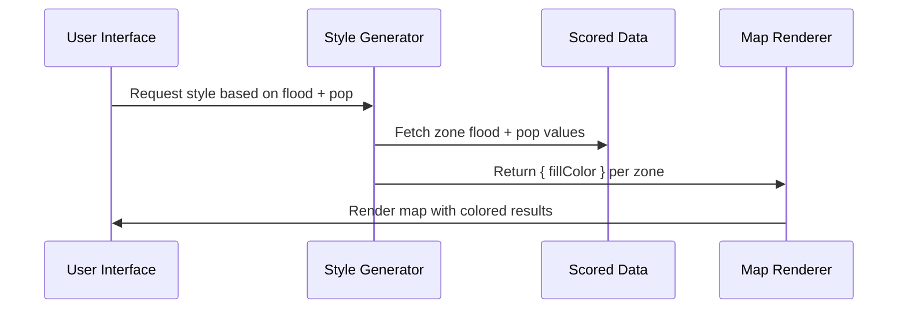

# Chapter 20: Bivariate and Multivariate Style Generators

Welcome to Chapter 20! 🎉

In the last few chapters, you learned how Disaster Ninja represents complex data layers and manages how they show up on the map. But here’s a key question:

> "How does the app decide what colors to use on the map based on different data points?"

This is where the concept of bivariate and multivariate styles comes in — and they’re generated by something called the...

🎨**Bivariate and Multivariate Style Generators**

In this chapter, we’ll unpack this design system and learn how it brings data to life through map visuals.

---

## 🎯 Why Bivariate and Multivariate Styles?

Imagine you want to visualize two important factors on a map:
- Population density
- Flood risk levels

You could color areas red if flood risk is high, or blue if density is high. But what if both are high? What color shows that?

Bivariate styles let us:
✅ Combine multiple data points  
✅ Represent them with grid colors  
✅ Help users interpret complex layered information visually

And **Multivariate** styles do the same across 3 or more factors!

---

## 🧠 What Are Style Generators?

Think of style generators as smart artists. 🎨

> They take multiple layers of data, and choose the perfect color for every area on the map — based on well-defined rules or color schemas.

They’re not drawing lines manually. They follow formulas which map data combinations to visual values — like a style blueprint.

---

## 🧰 Key Concepts — Simplified

| Term | Meaning | Analogy |
|------|---------|---------|
| Bivariate | Visualizing two data dimensions (e.g. flood risk + density) | A 2-axis graph 📊 |
| Multivariate | 3 or more data dimensions | A radar chart 🕸️ |
| Style Generator | A function that creates a color map or style config | A rulebook for shading a map 🎨 |
| Matrix | A grid showing all value combinations | A style palette for data combinations 🧮 |

Let’s bring these ideas to life!

---

## 🧪 Real-World Use Case: Visualizing Risk on the Map

Let’s say your dataset contains:

- Axis X: "Number of elderly residents" (Low → High)  
- Axis Y: "Distance from nearest hospital" (Far → Close)

You want to shade each region with a color that reflects this combo.

Your **bivariate style generator** does exactly that:
- Looks at where a region falls on both axes
- Matches it to a color
- Generates a map style so the UI can color that region

Result: with just a glance, users can spot high-risk areas where elderly populations are far from hospitals. 🧓🏥

---

## 🎨 How Styles Are Generated

Here’s a simplified flow of how a bivariate style generator works:



🧠 For tool developers, it’s like color-by-numbers — but the numbers come from your data!

---

## 🔨 How the Style Generator Works (Code Overview)

Let's look at a simplified version of a Bivariate Style Generator:

📄 `/src/map/styleGenerators/bivariate.ts`

```ts
export function generateBivariateStyle(xGroups, yGroups, colorMatrix) {
  return (feature) => {
    const xValue = getFeatureValue(feature, 'xAxis');
    const yValue = getFeatureValue(feature, 'yAxis');

    const xGroup = findGroup(xGroups, xValue);
    const yGroup = findGroup(yGroups, yValue);

    const color = colorMatrix[xGroup][yGroup];
    return {
      color,
      opacity: 1,
    };
  };
}
```

✏️ Each feature:
- Reads its X and Y axis values
- Looks up where it falls in both groups
- Picks a color from the matrix
- Returns a visual style

This style is passed to the map layer renderer.

---

## 🌐 Where Are These Used?

Bivariate and multivariate styles are foundational to showing:

- Vulnerability maps  
- MCDA (Multi-Criteria Decision Analysis) outputs  
- Impact assessment visualizations  
- Geography-based scoring systems

When you see a colorful grid-style map in Disaster Ninja — chances are, it comes from a style generator. 📊🎨

---

## 📊 What Is a Style Matrix?

The color matrix is a 2D grid like this:

|        | Low Y | Medium Y | High Y |
|--------|--------|----------|--------|
| Low X  | 🟦     | 🟪       | 🟥     |
| Medium X | 🟨     | 🟩       | 🟧     |
| High X | ⬜     | 🟫       | ⬛     |

The generator chooses the cell that matches the feature's X and Y category (group), and applies the matching color.

This helps users instantly understand categories like:
- "High risk, low readiness"
- "Moderate risk, high capacity"

—

## 🧩 And What About Multivariate?

It’s similar, but with a few more dimensions!

Instead of choosing from a 2D grid, a multivariate generator might:
- Combine 3 or more axes
- Create a unique color based on multiple values (via a color function)
- Group dimensions into scores or indices

For example:

```ts
const color = computeColor({
  elderly: 0.7,
  hospitalAccess: 0.4,
  incomeLevel: 0.8,
});
```

It’s more complex — but powerful. That’s how MCDA visualizations work.

---

## 🖼️ Visualization of the Generator’s Role

Let’s visualize the data filtering process:



Everything happens automatically under the hood — users just see a styled map!

---

## 🧠 Where to Find This in the Project

In Disaster Ninja, style generators can be found in:

📁 `/src/map/styleGenerators/`

- `bivariate.ts`
- `multivariate.ts`
- `mcdaStyle.ts`

They’re used alongside:
- MCDA logic (Chapter 18–19)
- Color managers (like [Chapter 21: Bivariate Color Manager](21_bivariate_color_manager.md))
- Rendering tools ([Chapter 187: Bivariate Renderer](187_bivariate_renderer.md), [Chapter 178: Multivariate Renderer](178_multivariaterenderer.md))

---

## 💡 TL;DR Summary

✓ Bivariate Style Generators match TWO data axes to a color  
✓ Multivariate Style Generators handle 3+ dimensions  
✓ They produce **color styles** to paint the map dynamically  
✓ A grid-style **color matrix** helps visually encode data  
✓ The system handles mappings automatically for every feature

Thanks to this, users can easily see...
- Where help is needed most  
- Where risks intersect  
- Where to focus first in a disaster 🎯

---

Next up: Want to learn how these generators get their color palettes and manage visual rules?

➡️ Head to [Chapter 21: Bivariate Color Manager](21_bivariate_color_manager.md)

More color, more clarity, more insight — keep exploring, style wizard! 🧙🎨🗺️

# Chapter 20: Bivariate and Multivariate Style Generators

Welcome back, wizard of weighted scores! 🧙‍♀️📊

In [Chapter 19: MCDA Scoring Engine](19_mcda_scoring_engine.md), we saw how Disaster Ninja calculates one final score for each zone — based on your selected map criteria and priorities.

But now that we have numbers (MCDA scores), here’s the next big question:

> “How do we actually show these results to users on the map in a way that’s easy to understand?”

🔥 That’s what this chapter is about: **Styling the map with colors that reflect multi-dimensional results** — so people can instantly “see” which areas matter.

---

## 🎯 Central Use Case: Show Two (or More) Criteria At Once

Imagine this:

> “I want to see which areas have high flood risk AND high population density.”

Or maybe...

> “Where is there poor hospital access, but still lots of vulnerable people?”

In single-criterion maps, you’d just use one color scale (e.g., blue = low to red = high flood risk). But what about two? Or three?

⚙️ That’s where we use:

- → **Bivariate styling** (2 dimensions)
- → **Multivariate styling** (3+ dimensions)

Let’s make sense of it, step by step.

---

## 🧱 Key Concepts — Style Basics for Beginners

Let’s unpack what we mean by these fancy style words 👇

### 1. 🎨 Style Generator
This is a function that builds map styling rules from MCDA or other data output.

It decides:
- What color to use for each zone
- Which borders, icons, fills to apply

Example:
```ts
{ fillColor: "#FF0000", strokeColor: "#FFFFFF" }
```

These styles drive what you see on the map!

### 2. 🟦🟥 Bivariate Style
This shows **two criteria at once**, using a color grid.

Imagine:
- X-axis = Flood Risk (low → high)
- Y-axis = Population Density (low → high)

We create a color matrix like this:

|         | Low Pop | Mid Pop | High Pop |
|---------|---------|---------|----------|
| Low Flood | 🟩       | 🟨       | 🟥        |
| High Flood| 🟦       | 🟦🟥      | 🟥⬛       |

Each zone’s color reflects **both values** together!

### 3. 🌐 Multivariate Style
This extends to **3+ indicators**, and uses advanced rules:
- Blended colors
- Symbols or icons
- Layer overlays

More flexible — but also more abstract.

---

## 🧪 Use Case: Color Zones by Flood Risk + Population

Let’s walk through a very simple example.

We want to merge:
- Flood risk: `0.0 → 1.0`
- Population: `0.0 → 1.0`

We break each into “Low”, “Medium”, “High” ranges.

```ts
function classifyZone(zone) {
  const floodBucket = zone.flood > 0.66 ? "high"
                   : zone.flood > 0.33 ? "medium" : "low";

  const popBucket = zone.population > 0.66 ? "high"
                  : zone.population > 0.33 ? "medium" : "low";

  return `${floodBucket}-${popBucket}`; // e.g., "high-low"
}
```

🧠 This gives us a label that maps to a color.

Now style it:

```ts
const colorMap = {
  "low-low": "#D4EEFF",
  "low-medium": "#A2D9FF",
  "low-high": "#69B3FF",
  "medium-low": "#FFDEB1",
  "medium-medium": "#FFA763",
  "medium-high": "#FF7A00",
  "high-low": "#FFCCCC",
  "high-medium": "#FF6666",
  "high-high": "#CC0000",
};
```

Put it together:

```ts
function getStyle(zone) {
  const key = classifyZone(zone);
  return {
    fillColor: colorMap[key] || "#CCCCCC", // fallback color
    fillOpacity: 0.8,
    strokeColor: "#333333",
  };
}
```

🎉 You now have bivariate coloring — with clear visuals!

---

## ⚙️ What’s Happening Behind the Scenes

Let’s visualize the inner flow when map styling is generated:



☑️ Each zone is styled dynamically based on its data values.

---

## 💡 Internally: Where Disaster Ninja Styles Zones

When generating styles, Disaster Ninja uses:
- A reusable `generateBivariateStyle()` function
- Color templates and grids
- Normalized input values (0.0–1.0)

📁 `lib/styles/bivariateStyleGenerator.ts`

```ts
export function generateZoneStyle(zone, xAccessor, yAccessor, colorGrid) {
  const x = xAccessor(zone); // e.g., zone.flood
  const y = yAccessor(zone); // e.g., zone.pop

  const xBin = Math.floor(x * 3); // 0–2
  const yBin = Math.floor(y * 3); // 0–2

  const color = colorGrid[yBin][xBin];
  return {
    fillColor: color,
    fillOpacity: 0.7,
  };
}
```

🧠 This styles each zone by:
- Getting its input values
- Converting to 3x3 grid bins
- Looking up the color and returning a style

---

## 🧰 Tip: Try It in the App

Under “MCDA configuration”:
1. Set two criteria as most important (e.g., flood + pop)
2. Choose “Bivariate Color Style”
3. Map updates with dual-dimension colors instantly!
4. Hover to see which values place each zone where

📊 It’s like seeing your decision model... turned into a heatmap!

---

## ✅ Summary

You’ve learned:

✔ What bivariate and multivariate styles are  
✔ How Disaster Ninja shows 2+ indicators together  
✔ How zones are color-coded based on combinations of values  
✔ Simple ways to classify and assign colors  
✔ How the internal generator matches colors using data bins  

Bivariate styles take decision-making from numbers → to something even your grandma can read at a glance! 👵🗺️

---

🎯 Next up: Ever want to “lock in” those results or layer them against other scenarios?

➡️ Keep going to [Chapter 21: Result Layer Configuration](21_result_layer_configuration.md)  
It’s time to turn styles into shareable insights! 💾🔥📍