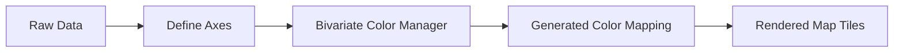
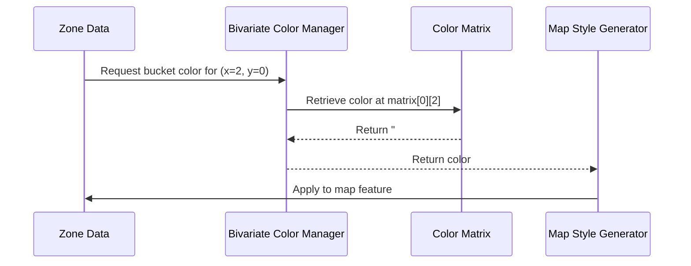

# Chapter 21: Bivariate Color Manager

Welcome back! 🌈 In the previous chapter ([Chapter 20: Bivariate and Multivariate Style Generators](20_bivariate_and_multivariate_style_generators.md)), you explored how colors can help visualize multi-dimensional data.

Now it’s time to dive deep into the tool that actually lets us shape these colors and apply them meaningfully: the **Bivariate Color Manager**.

---

## 🎯 Why Do We Need a Bivariate Color Manager?

Imagine you're dealing with disaster data that has two important dimensions:  
- 🔴 Population Exposure  
- 🔵 Infrastructure Fragility

You want a visual way to show **both** — at the same time — using colors on a map.

Without a tool, you'd be stuck trying to mix random color combos manually. Not only is that error-prone, but it might make your map hard to read. ❌

✅ That’s where the Bivariate Color Manager comes in!

---

## 🧠 What Is the Bivariate Color Manager?

> The Bivariate Color Manager is a color palette design tool that lets you manage what colors are used when combining two lines of data (called "axes").

In simpler terms:
- It defines which colors are used when two pieces of data intersect.
- It helps turn complex data relationships into easy-to-understand visuals.  
- It ensures your map remains readable and consistent.

💡 Think of it as a mini-painter that selects just the right shade for each square on your data grid.

---

## 🔀 Bivariate Data = Two-Dimensional Grid

Think of the combined data like a matrix:

|              | Low Fragility | Medium Fragility | High Fragility |
|--------------|---------------|------------------|----------------|
| Low Exposure | 🟦           | 🟪                | 🟥              |
| Mid Exposure | 🟦           | 🟫                | 🟥              |
| High Exposure| 🟩           | 🟥                | 🟥              |

Each cell = a unique data combo → a unique color 🎨

---

## 🧩 Where Does the Bivariate Color Manager Fit?

Here’s how it plugs into the Disaster Ninja data-to-visual workflow:



So when two values come together (like medium fragility + high exposure), the color manager tells the system:  
> “This should be a bold red.”

---

## 🧰 Key Features of the Bivariate Color Manager

| Feature | What It Does |
|--------|---------------|
| 🎨 Define color palette | Allows user to pick colors for each data combination |
| 📊 Visual matrix | Displays all data combinations in an easy-to-edit grid |
| 🔄 Sync with axes | Reacts to horizontal (X) and vertical (Y) axis selections |
| 📂 Save/Load combos | Lets you store and reuse bivariate color presets |

This empowers Disaster Ninja users (especially analysts and planners) to visualize relationships clearly.

---

## 🔧 Example: Editing Colors for Bivariate Intersections

You'll usually see the editor in the form of a matrix or grid UI.

Example:
- Rows = Fragility (low to high)
- Columns = Exposure (low to high)
- Each cell = a color that shows the result of combining those two properties

The Bivariate Color Manager lets you click on each cell and edit its color.

📌 Want low fragility + high exposure to pop out?  
🖌️ Change that cell to a noticeable red!

Changing the color immediately updates how the data appears on the map. ✅

---

## 🤓 What Happens Internally?

When you configure a color grid:

1. Each axis (X and Y) is broken into ranges (e.g. Low, Medium, High).
2. The Bivariate Color Manager creates a **2D matrix**: one color per combination.
3. These are mapped into a hashmap (object), with keys like:
   - `x0y0` → color1
   - `x1y2` → color2
4. This color map is sent to the map rendering engine.

So underneath…

```ts
const bivariateColorMap = {
  'x0y0': '#e8e8e8',
  'x0y1': '#b8d6be',
  'x1y2': '#64acbe',
  // etc.
};
```

And on the map, wherever a geometry’s data falls into a combination – boom, it gets colored accordingly! 🌈

---

## 💼 Real-World Use Case: Visualizing Resource Gaps

Let’s say:

- X axis = available resources (low to high)
- Y axis = people in need (low to high)

With the Bivariate Color Manager, you can decide:

- Red = crisis (low resources + high need)
- Gray = calm (high resources + low need)
- Orange = weak supply (low resources + low need)

This instantly helps identify areas with urgent attention needed — even before reading numbers. 🔍

---

## 🛠️ Where Is It in the Code?

You’ll find the Bivariate Color Manager logic and UI in:

📁 /src/bivariate/
- colorManager.ts — logic for storing/editing combo colors
- ColorManagerPanel.tsx — UI letting users customize colors
- bivariateMatrix.ts — matrix coordination
- useColorMapEditorHook.ts — connects color edits to application state

Also connects with Reatom atoms to keep everything in sync and reactive!

---

## 🚀 Creating a New Palette (Step-by-Step Guide)

Imagine you're creating a new map visualization:

1. Choose your X and Y axes (e.g. hazard level and preparation level)
2. Open the Bivariate Color Manager
3. Click each matrix cell to assign a color
4. Watch the map update instantly!
5. Optionally, save the preset to reuse later

It’s a powerful but beginner-friendly way to **teach maps to speak your data’s language**.

---

## ✅ Summary

🎯 You now understand:

✅ The Bivariate Color Manager lets you assign color meanings to data combinations  
✅ It works like a palette toolkit for mapping 2-dimensional variables  
✅ It ensures colors make sense for both the eyes and the data  
✅ The color mappings integrate into render engines via a matrix + hash  
✅ Mini changes in settings = big improvements in map readability and clarity

---

Next up, let’s see what happens when your mouse moves over these colorful zones…  
➡️ Continue to [Chapter 22: Tooltip Trigger Mechanism](22_tooltip_trigger_mechanism.md) and learn how Disaster Ninja helps users discover what lies beneath the colors.

Great job, color commander! 🎉🎨🗺️

# Chapter 21: Bivariate Color Manager

Welcome back, insightful mapper! 🧭🎨

In [Chapter 20: Bivariate and Multivariate Style Generators](20_bivariate_and_multivariate_style_generators.md), you learned how two-dimensional (bivariate) and multi-dimensional (multivariate) data can be turned into vibrant, informative maps using clever color combinations.

But WAIT… you may now be wondering:

> “Where do all those color grids come from? Who decides which colors mean what?”

🎯 That’s the job of the **Bivariate Color Manager**.

---

## 🎯 Central Use Case: Make a 3x3 Map Coloring Scheme

Let’s say you’re showing:

✅ Axis X: Flood Risk  
✅ Axis Y: Population Density  

You want:
- 🔵 Blue for low-pop, low-risk
- 🔴 Red for high-pop, high-risk
- 🟨 Yellow for medium values

The Bivariate Color Manager gives you:

🍱 A ready-made **color matrix**,  
🎛 Built from smart presets or custom styles,  
✅ That automatically lines up with your X/Y data bins.

It’s the manager that builds your visual legend!

---

## 🧱 Key Concepts

Before we dive into code, let’s understand the basic building blocks.

### 1. 🎨 Color Matrix
This is the center of it all — a 3×3 (or NxN) grid mapping [X-bucket][Y-bucket] to one color.

Imagine it like this:

|        | Low Y     | Medium Y   | High Y    |
|--------|-----------|------------|-----------|
| Low X  | 🟦 `#D4EEFF` | 🟨 `#FFD580` | 🟥 `#FF4C4C` |
| Med X  | 🟦         | 🟨         | 🟥         |
| High X | 🟦         | 🟨         | 🟥         |

Each region's color depends on which bucket it falls into for both axes.

### 2. 🎛 Palette Presets
Instead of manually configuring 9 colors, we use pre-defined themes:
- 🔴 “Red-Blue”
- 🟩 “Green-Yellow”
- 🔵 “CoolWarm”

These keep styles consistent across maps.

### 3. 🧠 Color Manager
This is a helper that:
- Builds color matrices from presets
- Converts a preset into a format the Style Generator can use
- Returns color values based on X/Y bin location

Think of it as a very smart paint-by-numbers kit!

---

## 🧪 Use Case: Generate a Red-Blue Matrix (3×3)

Let’s use the Color Manager to get a color grid based on a preset.

```ts
import { generateMatrixFromPreset } from './bivariateColorManager';

const colorMatrix = generateMatrixFromPreset("red-blue", 3);
```

🧠 What this gives you:

```ts
[
  ['#F1EEF6', '#BDC9E1', '#74A9CF'],
  ['#D7B5D8', '#DF65B0', '#DD1C77'],
  ['#980043', '#67001F', '#49006A']  // example for illustration
]
```

Each color represents one combo of X + Y buckets!

Now this matrix is ready for use with a Bivariate Style Generator (see [Chapter 20](20_bivariate_and_multivariate_style_generators.md)).

---

## 👩‍💻 Code Example: Look Up a Color From a Grid

Let’s say a zone is:
- X bucket: 2 (High flood)
- Y bucket: 0 (Low population)

We get the color:

```ts
const color = colorMatrix[0][2];
console.log(color); // => '#74A9CF'
```

💡 Always index as `[yBin][xBin]` — rows first, columns second.

---

## ⚙️ What Happens Internally? (Step-by-Step)

Let’s look at what happens when a style needs a color:



Everything runs reactively behind the scenes 🧠

---

## 🔧 Internal Implementation (Simple Overview)

📁 `bivariateColorManager.ts`

```ts
export function generateMatrixFromPreset(presetName, size = 3) {
  const palette = getPaletteByName(presetName); // e.g. "red-blue"
  const matrix = [];

  for (let y = 0; y < size; y++) {
    const row = [];
    for (let x = 0; x < size; x++) {
      row.push(palette[y][x]);
    }
    matrix.push(row);
  }

  return matrix;
}
```

🧠 This builds the final matrix by copying it from the preset template. You can also generate gradients dynamically if needed!

---

## 📦 Where You’ll See This Used in the App

The Bivariate Color Manager appears in:

📍 MCDA results view  
📍 Advanced layer styling tools  
📍 The color legend renderer  
📍 The [BivariateRenderer](187_bivariate_renderer.md)

Wherever you see a bivariate visual — it likely comes from here.

---

## 🎛 Available Presets (Sample)

| Name        | Description                     |
|-------------|----------------------------------|
| red-blue    | Warm to cool, for risk styles 🔴🔵 |
| green-yellow| Positive indicators 🟩🟨         |
| blue-purple | Soft gradients 🔵🟣             |
| danger      | High contrast (gray → red → black) ⚫🔴⚪ |

🧠 You can also provide your own palette definitions manually!

---

## 🧠 Styling Tip: Use Consistent Presets

To help users:
- Stick with common palettes for similar maps  
- Explain what top-left vs. bottom-right colors mean  
- Use map legends with captioned labels (“Low Risk”, “High Pop”) 🧾

Consistency improves usability and confidence 🙌

---

## ✅ Summary

Let’s wrap it all up!

✔ The Bivariate Color Manager creates 2D color matrices  
✔ You use these matrices to color zones based on two inputs  
✔ Presets make this easy and consistent  
✔ Used by style generators to return per-feature color  
✔ Coordinates beautifully with legends and MCDA visuals

It bridges the gap between MCDA scores and visual understanding 🧠➡️🎨

---

🎯 Next up: Let’s tie results together into final map layers and learn how to configure them dynamically for styling, exporting, or sharing.

➡️ Continue to [Chapter 22: Result Layer Configuration](22_result_layer_configuration.md)

You’re painting insight with precision — keep it up, data map sorcerer! 🧙‍♂️🗺️📍