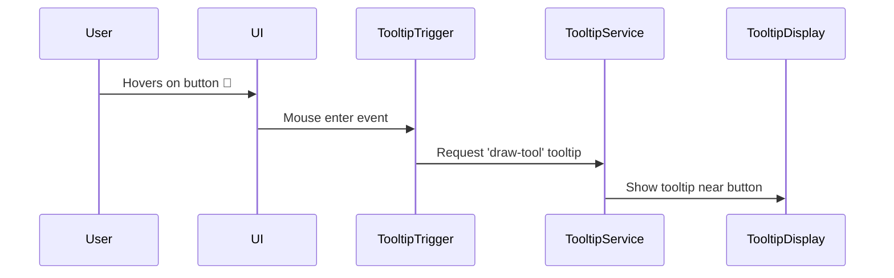
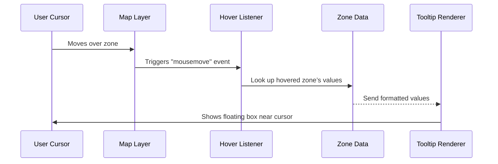

# Chapter 22: Tooltip Trigger Mechanism

Welcome back! 🌟 In [Chapter 21: Bivariate Color Manager](21_bivariate_color_manager.md), you explored how color is used to enrich data visualization. Now, let’s talk about how Disaster Ninja guides users by showing bite-sized help messages on the user interface.

Introducing: the ✨ **Tooltip Trigger Mechanism** ✨ — a small but powerful system that helps users understand unfamiliar features without leaving the app.

---

## 🎯 What Problem Does the Tooltip Trigger Mechanism Solve?

Imagine this:

> “You see a complex dashboard with buttons and graphs.  
> You hover your mouse over one — and a helpful message pops up saying what it does.  
> Without even clicking, you know!”

This is the Tooltip Trigger Mechanism at work 👇

✅ It helps users discover new features  
✅ Explains functionality without cluttering the UI  
✅ Improves usability, especially for new or infrequent users  
✅ Reduces onboarding time

—

Instead of this:
> “🤔 What does this button with 3 triangles do?”

You get this:
> 👉 Hover message: “Switch multilayer map view”

Awesome, right? Let’s see how it works. 🧠

---

## 🧠 What Is the Tooltip Trigger Mechanism?

At its core, the Tooltip Trigger Mechanism is a system that detects **when a user hovers over or focuses on an interactive element** — and then **tells the tooltip system to display a related message**.

Think of it as:

🎯 The "What triggered the tooltip?" system  
💬 Not the tooltip content — just the trigger.

In Disaster Ninja, it's implemented as reusable components and hooks that manage tooltip activation and pass the spotlight to the Tooltip Display System (covered in [Chapter 23](23_tooltip_display_system.md)).

---

## 🧩 Key Concepts

Let’s break the system into beginner-friendly pieces:

| Term | What It Is | Think of It As… |
|------|------------|----------------|
| Trigger Area | An invisible zone that detects mouse hover or click | A spotlight marker on the UI 🎯 |
| Trigger Type | Defines how the tooltip gets activated (hover, click, focus) | A switch 🔘 |
| Tooltip ID | A unique label for the tooltip content to show | A tooltip message key 🔑 |
| TooltipTrigger component | A reusable wrapper for this behavior | The director that says "Cue the tooltip!" 🎬 |

🧠 The Tooltip Trigger doesn’t display tooltips. It just signals when and which tooltip should appear.

---

## 🛠️ Example: Wrapping a Button with a Tooltip Trigger

Let’s say you have a button that activates the drawing tool. Here’s how you wrap it with a trigger:

```tsx
import { TooltipTrigger } from '@/components/tooltips';

<TooltipTrigger tooltipId="draw-tool" trigger="hover">
  <button>
    ✏️ Draw
  </button>
</TooltipTrigger>
```

🧾 Breakdown:

- `tooltipId`: tells the system which tooltip message to show
- `trigger`: tells it to trigger on `"hover"`, `"click"`, or `"focus"`
- The child (`<button>`) is the element that should activate the tooltip

✅ Now when a user hovers over the button, a nice helpful tooltip will show — like "Start drawing a shape on the map".

Note: We’re only focusing on the trigger here — not the tooltip content or display styles 😄

---

## 📦 How It Works in the Background

Here’s what happens step-by-step:

1. The user **hovers** the wrapped button.
2. TooltipTrigger component:
    - Listens for the event (like `onMouseEnter`)
    - Notifies the Tooltip Service: “Hey, tooltipId 'draw-tool' was triggered!”
3. The Tooltip Display system sees the request and renders the tooltip.

✨ This separation of responsibilities keeps each piece clean.

---

## ⚙️ Behind The Scenes: Component View

Here’s a simplified peek under the hood of `TooltipTrigger.tsx`

```tsx
type TooltipTriggerProps = {
  tooltipId: string;
  trigger: 'hover' | 'click' | 'focus';
  children: React.ReactElement;
};

export function TooltipTrigger({ tooltipId, trigger, children }: TooltipTriggerProps) {
  const handleTrigger = () => {
    tooltipService.showTooltip(tooltipId);
  };

  const handleClear = () => {
    tooltipService.hideTooltip();
  };

  return React.cloneElement(children, {
    onMouseEnter: trigger === 'hover' ? handleTrigger : undefined,
    onClick: trigger === 'click' ? handleTrigger : undefined,
    onFocus: trigger === 'focus' ? handleTrigger : undefined,
    onMouseLeave: (trigger === 'hover' || trigger === 'click') ? handleClear : undefined,
    onBlur: trigger === 'focus' ? handleClear : undefined,
  });
}
```

🧾 This makes the TooltipTrigger super flexible:
- Works with any element (button, icon, div, etc.)
- Applies different trigger styles
- Talks to a central service (`tooltipService`) to control actual rendering

—

Don’t worry if this looks advanced—you’re not expected to write this now. Just know it exists and how to use it!

---

## 🔍 Flow Diagram: Tooltip Trigger in Action



👉 When they leave the button, `TooltipTrigger` calls `.hideTooltip()`.

✅ Tooltips only stay visible as long as the trigger is active.

---

## 🧪 Bonus: Alternate Trigger Modes

You can use `trigger="focus"` for keyboard navigation accessibility support:

```tsx
<TooltipTrigger tooltipId="submit-analysis" trigger="focus">
  <button>Analyze</button>
</TooltipTrigger>
```

And for touch devices, `trigger="click"` gives better UX:

```tsx
<TooltipTrigger tooltipId="exit-mode" trigger="click">
  <button>❌</button>
</TooltipTrigger>
```

Each one works in different situations — just choose what you need.

---

## 🧠 Where This is Used in the App

The `TooltipTrigger` is used in many components across Disaster Ninja!

You’ll find it in:

- Map tool bar buttons 🛠️
- Layer toggles 🤹‍♂️
- Settings panels ⚙️
- Help tooltips or info 🛈 icons

Anywhere we want to give the user a nudge of helpful information 💡

---

## ✅ Summary

You’ve now learned that the:

✅ Tooltip Trigger Mechanism detects user interaction  
✅ It uses wrapper components (like `<TooltipTrigger>`)  
✅ Tells a central tooltip service when to show/hide tooltips  
✅ Keeps behavior consistent across hover, click, and focus  
✅ Encourages clean UX and avoids clutter

The tooltip's content and render behavior is handled next... 🎬

—

➡️ Continue to [Chapter 23: Tooltip Display System](23_tooltip_display_system.md) to see how the tooltip is rendered on screen, positioned nicely, and styled.

You’re doing great — now tooltips won’t be a mystery anymore! 🧙‍♂️🖱️💬

# Chapter 22: Tooltip Trigger Mechanism

Welcome back, visual data explorer! 🧭🖱️

In [Chapter 21: Bivariate Color Manager](21_bivariate_color_manager.md), you learned how Disaster Ninja translates data combinations into colors using smart color grids — turning complex map zones into easy-to-read visuals.

But here’s a follow-up question:

> “What happens when I move my mouse over a zone on the map?  
> Can I see the actual numbers behind the color?”

🎯 That’s exactly what the **Tooltip Trigger Mechanism** does!

It allows users to hover over any zone and instantly get data-rich info — without cluttering the map.

---

## 🎯 Central Use Case: Show Details On Hover

Let’s say you’re looking at a heatmap with flood risk and population density, styled with bivariate colors.

👉 You want to hover your cursor over Zone A  
🤔 And instantly see something like:

```
Flood Risk: High (0.85)
Population Density: Medium (0.47)
MCDA Score: 0.72
```

✅ The Tooltip Trigger Mechanism handles that behind the scenes — capturing mouse events and showing light, helpful popups.

---

## 🧱 Key Concepts

Let’s break this down step by step!

### 1. 📍 Hover Zones (Map Features)
Each zone (e.g., province, district) is represented as a **feature** on the map. It includes geometry and data like flood risk, population, or MCDA score.

### 2. 🖱️ Mouse Events
When your mouse moves over a feature, the frontend detects it using MapLibre’s mouse tracking system.

Specifically:
- `onMouseMove`: checks what’s under the cursor
- `onClick`: (optional) opens a persistent tooltip or panel

### 3. 📦 Data Lookup
Once a zone is hovered, the app pulls pre-fetched data for that feature (e.g., ID → scores, values).

Think of it like “Show me the row from the table matching this zone.”

### 4. 💬 Dynamic Tooltip Popup
A styled box appears near the cursor with relevant key-value pairs, often like:

```
Region: Zone A
Flood Risk: 0.75
Access Score: 0.42
```

---

## 👩‍💻 How to Use It (As a User)

No setup needed!

Just:
1. Load a map with styled zones (e.g., MCDA, risk layers)
2. Move your mouse over any zone
3. A tooltip appears near the cursor ✨

---

## 🧪 Beginner-Friendly Walkthrough (Hover Example)

Let’s say this zone has these values:

```ts
{
  id: "zone-123",
  name: "Alpha District",
  floodRisk: 0.72,
  population: 0.56,
  mcdaScore: 0.64,
}
```

🖱️ When you hover over it:
- App finds this object
- Formats values into display text
- Renders a small popup absolutely positioned by cursor

---

## 👨‍💻 Code Example: Simple Hover + Tooltip Setup

Here’s a super-simplified event hook for a MapLibre map layer:

```ts
map.on("mousemove", "zones-layer", (e) => {
  const feature = e.features?.[0];
  if (feature) {
    showTooltip({
      x: e.point.x,
      y: e.point.y,
      data: {
        name: feature.properties.name,
        flood: feature.properties.floodRisk,
        pop: feature.properties.population,
        score: feature.properties.mcdaScore,
      },
    });
  }
});
```

🧠 Explanation:
- `e.point` gives pixel coords for positioning
- `feature.properties` contains pre-loaded data
- `showTooltip()` is a helper that updates tooltip content + position

---

## ✨ Result Example

Imagine your map pointer is over a region — this appears:

```
🗺️ Alpha District
🌊 Flood Risk: 0.72
👥 Population: 0.56
📈 MCDA Score: 0.64
```

Lightweight. Useful. Magic! 🌟

---

## ⚙️ What Happens Behind the Scenes?

Let’s walk through it:



It all happens reactively and in milliseconds!

---

## 🔧 Internal Implementation (Simplified)

📁 `components/TooltipLayer.tsx`

```tsx
function Tooltip(props) {
  const { position, values } = props;
  return (
    <div className="tooltip" style={{ left: position.x, top: position.y }}>
      <div><b>{values.name}</b></div>
      <div>Flood: {values.flood}</div>
      <div>Population: {values.pop}</div>
      <div>Score: {values.score}</div>
    </div>
  );
}
```

📁 `atoms/hoverAtom.ts`

```ts
export const tooltipStateAtom = atom({
  visible: false,
  x: 0,
  y: 0,
  values: {},
});
```

📁 `lib/map/handlers.ts`

```ts
export function initTooltipTrigger(map, layerId) {
  map.on("mousemove", layerId, (e) => {
    const feature = e.features?.[0];
    if (!feature) return;

    setTooltipStateAtom({
      visible: true,
      x: e.point.x + 10,
      y: e.point.y + 10,
      values: feature.properties,
    });
  });

  map.on("mouseleave", layerId, () => {
    setTooltipStateAtom({ visible: false });
  });
}
```

✅ This shows/hides the tooltip DOM node  
✅ Keeps positioning reactive  
✅ Works seamlessly with data layers!

---

## 🧠 Recap: Why It’s Useful

Tooltips let users:
- Hover + instantly preview key data 🔎  
- Understand what’s behind the color 📊  
- Make informed comparisons with real numbers 🧮  
- Keep maps clean while adding depth 💡

That’s powerful UX with low effort — and high value! 🙌

---

## ✅ Summary

Here’s what you now know:

✔ The Tooltip Trigger Mechanism reacts to mouse movement  
✔ It uses hovered features to find and show values  
✔ Tooltips appear dynamically at the pointer  
✔ Uses pre-styled HTML + atoms to show info fast  
✔ Helps users understand mapped data without clicking

Popups make data human again — fast, helpful, and non-intrusive! ⚡

---

🧭 Up next: Let’s explore how to store, structure, and reuse your results across time, scenarios, or teams.

➡️ [Chapter 23: Result Layer Configuration](23_result_layer_configuration.md)

You’re one hover away from mastery – keep clicking forward! 🖱️🗺️💬