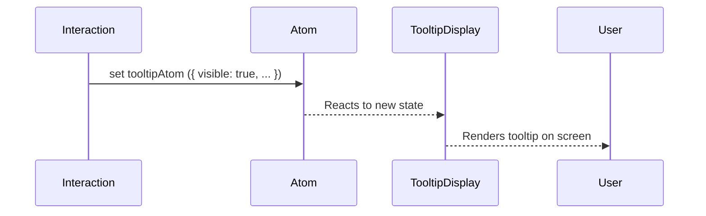
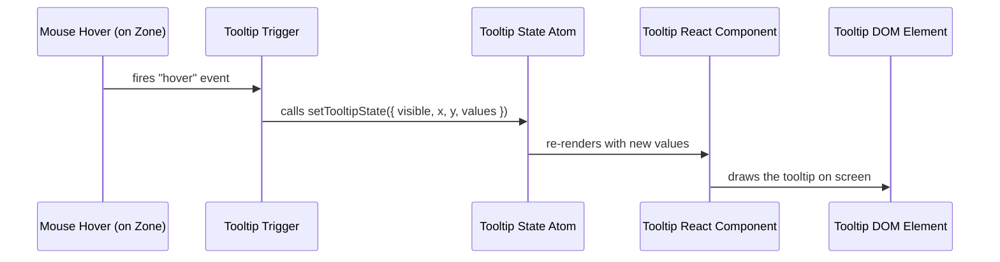

# Chapter 23: Tooltip Display System

Welcome back, UI ninja! 🧙‍♂️  
In [Chapter 22: Tooltip Trigger Mechanism](22_tooltip_trigger_mechanism.md), we learned how user interactions — such as hover or click — can trigger a tooltip.

Now we’re ready to explore what happens once a tooltip is triggered.

It’s time to shine the spotlight on the 🏷️ Tooltip Display System — the component that actually renders tooltip content on the screen and tracks when (and where) it should appear.

---

## 🧭 What Is the Tooltip Display System?

Think of the Tooltip Display System as your app’s version of sticky notes.

> They politely pop in when needed to explain something…  
> …and slide out of the way when they’re done.

More technically:
✅ It renders rich, context-sensitive tooltips on the map  
✅ It listens for updates (like location, content, or visibility)  
✅ It removes or repositions tooltips as the app state changes

It's everything you see ✨ after ✨ the tooltip is triggered.

---

## 🎯 Real-World Use Case: Explaining a Map Feature

Let’s say your user hovers over a special zone on the map — like a "Critical Risk Area". You want to:
- Show a small tooltip with zone name and stats
- Anchor it near the pointer or map feature
- Remove it smoothly when hover ends

➡️ The Tooltip Display System shows, positions, and hides this information automatically — based on internal app state.

---

## 🧰 Key Components of the Display System

Let’s break this concept down:

| Concept | What It Does | Analogy |
|--------|---------------|---------|
| Tooltip Component | Renders the tooltip's actual HTML | The sticky note UI visible on screen |
| Tooltip Position | X/Y placement on the screen or map | Where to stick the note 📍 |
| Tooltip State | When and what to show | Content + visibility toggle |
| Tooltip Cleanup | Logic to remove or fade the tooltip | Pulling the sticky note off the page 😄 |

Let’s build a simplified tooltip display together.

---

## 🛠️ 1. Show a Tooltip When Tooltip State Is Set

The tooltip system is often powered by atoms (see [Chapter 6: Reatom State Management](06_reatom_state_management.md)).

📄 `/src/store/tooltip.ts`

```ts
export const tooltipAtom = atom<{
  content: string;
  position: { x: number; y: number };
  visible: boolean;
} | null>(null);
```

This atom defines whether the tooltip is visible, where it's positioned, and what it shows.

---

## 🪄 2. Build the Tooltip Display Component

Now in your global layout or map, insert the `TooltipDisplay` component.

📄 `/src/components/TooltipDisplay.tsx`

```tsx
import { useAtom } from '@reatom/npm-react';
import { tooltipAtom } from '@/store/tooltip';

export function TooltipDisplay() {
  const tooltip = useAtom(tooltipAtom);

  if (!tooltip || !tooltip.visible) return null;

  const { x, y, content } = tooltip;

  return (
    <div
      className="tooltip"
      style={{
        position: 'absolute',
        top: y + 10,
        left: x + 10,
        background: '#333',
        color: '#fff',
        padding: '6px 10px',
        borderRadius: '4px',
        pointerEvents: 'none',
        zIndex: 9999,
      }}
    >
      {content}
    </div>
  );
}
```

🧾 What just happened?
- You render the tooltip's HTML near the pointer (slightly offset)
- It uses absolute positioning and shows above all elements
- The CSS ensures it's non-intrusive (`pointer-events: none`)

---

## 🎯 3. Set the Tooltip Dynamically

Back in a hover handler or interaction logic (see [Chapter 22: Tooltip Trigger Mechanism](22_tooltip_trigger_mechanism.md)), you can update the tooltip:

```tsx
ctx.update(tooltipAtom, {
  content: 'Critical Flood Risk Zone',
  position: { x: event.originalEvent.pageX, y: event.originalEvent.pageY },
  visible: true,
});
```

Then, remove it on mouse leave:

```tsx
ctx.update(tooltipAtom, null);
```

🪄 Boom! Your sticky note fades in, delivers info, and disappears. Magic. 🎩✨

---

## 🔄 What Happens When a Tooltip Appears?

Let’s visualize the display flow:



💡 You create conditions in your app logic — and the UI reacts automatically. No manual DOM fiddling.

---

## 🧪 Bonus: Advanced Tooltip Components

The Tooltip Display System can also support:

- Rich tooltip content with React elements
- Dynamic placement based on map location
- Sticky behavior while fixed to a feature
- Animations (show/hide fades or slides)

Example with JSX content:

```ts
ctx.update(tooltipAtom, {
  content: (
    <div>
      <strong>Earthquake Risk:</strong> HIGH
      <br />
      Population exposed: 340K
    </div>
  ),
  position: { x: 212, y: 519 },
  visible: true,
});
```

💪 The tooltip is a true React component — it can render anything React can.

---

## ℹ️ Where You’ll Find This Code in Disaster Ninja

Key places where the Tooltip Display System lives:

- 📁 `/src/components/TooltipDisplay.tsx` – Renders current tooltip state
- 📁 `/src/store/tooltip.ts` – Stores the tooltip’s data using a Reatom atom
- 📁 `/src/map/interactions/` – Triggers tooltips based on interactions
- 🧠 Driven by atoms and map events — clean, decoupled logic

If you want to show something helpful under the cursor — this is the place!

---

## ✅ Summary

🎉 You now understand how tooltips are rendered in Disaster Ninja!

✅ Triggered tooltips funnel their data into `tooltipAtom`  
✅ The `TooltipDisplay` component listens and renders them on demand  
✅ Tooltip components can show plain or rich content  
✅ The position is based on screen X/Y or map coordinates  
✅ Everything is managed predictably with Reatom and React

Next time you hover, click or explore a feature — know there’s a smart tooltip display system behind the scenes! 🧠💬

---

➡️ Up next: How do we provide services and utilities behind tooltips — like delay handling and lifecycle controls?

Let’s peek behind the curtain in [Chapter 24: Tooltip Service](24_tooltip_service.md) 👇

You're doing amazing — keep going, tooltip wizard! 🪄🏷️

# Chapter 23: Tooltip Display System

In [Chapter 22: Tooltip Trigger Mechanism](22_tooltip_trigger_mechanism.md), we learned how Disaster Ninja detects when a user hovers over a map zone and triggers a tooltip to appear.

Now it's time to answer the next big question:

> “Once the system knows that a tooltip should appear…  
> how does it actually show it on the screen — and make it look good?”

🎯 Enter the **Tooltip Display System** — the part that takes those triggers and turns them into actual, eye-friendly popups.

---

## 🧭 Why Does the Tooltip Display System Matter?

When users hover or click on a zone, they expect:

- 🧾 An easy-to-read summary (e.g. "Flood Risk: 0.81")
- 📍 Positioned at the correct cursor or area
- 🎯 Only visible while they focus on it
- 💡 Automatic disappear when not needed

The Tooltip Display System handles all of this, so users get smooth, instant feedback… without clutter.

No tooltips = confused users  
Tooltips done right = confident, informed decisions ✅

---

## 🧩 Key Concepts

Let’s unpack this tool into beginner-friendly chunks:

| Concept | Explanation |
|--------|-------------|
| 💬 Tooltip Content | What should appear in the box: text, values, labels |
| 📍 Tooltip Position | Where the box should appear (near mouse or zone) |
| 🧠 Tooltip State | A central place to store "what and where to show" |
| 🎨 Tooltip Renderer | A React component that turns state into pretty UI |
| 🧽 Auto-Hide Logic | Hides the tooltip when the mouse leaves the zone |

All of these work together, invisibly, to give users that helpful little popup they love. ❤️

---

## 🎯 Central Use Case: Show a Smart Tooltip When Hovering

Let’s say you're looking at the Disaster Ninja map and move your mouse over the district of "Green Valley".

You expect to see a small box saying:

```
📌 Green Valley
Flood Risk: 0.72
Population: 12,300
MCDA Score: 0.64
```

The Tooltip Display System makes sure:
- ✅ This message appears instantly
- ✅ It’s easy to read
- ✅ It disappears when the mouse leaves

Let’s break down how it works.

---

## 👶 Step-by-Step: How to Use It as a Developer

You don’t need to build the display system yourself — just update the tooltip state like this:

```ts
setTooltipStateAtom({
  visible: true,
  x: 550, // screen X coordinate
  y: 300, // screen Y coordinate
  values: {
    name: "Green Valley",
    floodRisk: 0.72,
    population: 12300,
    mcdaScore: 0.64,
  },
});
```

🎯 This tells the display system:
- What to show
- Where to show it
- That it should appear now

To hide the tooltip:

```ts
setTooltipStateAtom({ visible: false });
```

✅ The rendering will auto-update!

---

## 🎨 Result: What It Renders

Once the state is set, this is what appears on the map:

- A small box near your mouse
- Clean styling (white background, shadow, padding)
- Data formatted with icons or labels

It’s not interactive — just a read-only quick view.

---

## 🧰 Under the Hood: How It All Connects

Let’s walk through what happens when your mouse moves over a zone:



💡 If the mouse leaves the zone, `visible` is set to `false`, and the DOM element is unmounted — clean and fast!

---

## 📁 Internal Code: Tooltip Display in React

Let’s look at a super-simplified version of the component.

📁 `components/TooltipBox.tsx`

```tsx
export function TooltipBox() {
  const tooltip = useAtomValue(tooltipStateAtom);
  if (!tooltip.visible) return null;

  return (
    <div className="tooltip-box" style={{ left: tooltip.x, top: tooltip.y }}>
      <div><b>{tooltip.values.name}</b></div>
      <div>Flood: {tooltip.values.floodRisk}</div>
      <div>Pop: {tooltip.values.population}</div>
      <div>Score: {tooltip.values.mcdaScore}</div>
    </div>
  );
}
```

✅ This:
- Checks visibility
- Uses atom values
- Renders the tooltip DOM element absolutely

📁 `atoms/tooltipStateAtom.ts`

```ts
export const tooltipStateAtom = atom({
  visible: false,
  x: 0,
  y: 0,
  values: {},
});
```

This shared state ensures **any part of the app** can trigger a tooltip — and only one will show at a time.

---

## 🧪 Styling (Optional Tips)

📝 Tooltip CSS may look like:

```css
.tooltip-box {
  position: absolute;
  pointer-events: none;
  background: #fff;
  padding: 8px;
  box-shadow: 0 2px 6px rgba(0,0,0,0.15);
  font-size: 13px;
}
```

Tip:
Use `pointer-events: none` to let mouse pass through the tooltip — important for maps!

---

## 🗺️ Where Else Is This Used?

You’ll find tooltip display connected to:
- Map zones when hovered ✅
- Toolbar buttons — via [Tooltip Trigger Mechanism](22_tooltip_trigger_mechanism.md) ✅
- Side panels or setting sliders (optional) ✅

All share the same display system — one codebase, infinite helpful moments!

---

## ✅ Summary

You’ve just learned:

✔ The Tooltip Display System shows smart popup boxes on hover  
✔ It listens to shared tooltip state (`visible`, `x`, `y`, `values`)  
✔ Automatically renders/destroys when needed  
✔ Styled nicely and placed precisely near the pointer  
✔ Makes your data maps usable, human-friendly, and helpful

Behind every helpful hover is a humble TooltipBox. 💬

---

🎯 Next up, let's learn how to take the styled maps and interactive MCDA overlays and turn them into export-ready, configurable map layers.

➡️ Continue to [Chapter 23: Result Layer Configuration](23_result_layer_configuration.md)

You’re well on your way to building friendly, insightful tools for real-time spatial intelligence! 🗺️🌟