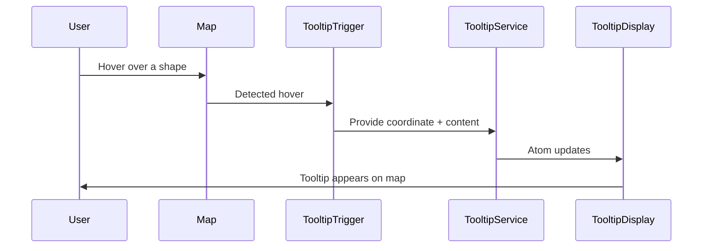
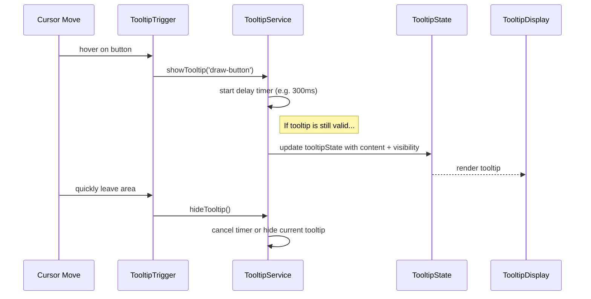

# Chapter 24: Tooltip Service

Welcome ninja! 🥷🗺️

In the last two chapters, you explored how tooltips are triggered (Ch. 22) and how they’re visually rendered on-screen (Ch. 23).

Now, it’s time to meet the brains behind it all — the ☝️Tooltip Service.

This chapter is your simple and friendly guide to understanding what the Tooltip Service is, what it does, why it's important, and how to use it in Disaster Ninja.

---

## 🎯 What Does the Tooltip Service Do?

Have you ever hovered over something in Disaster Ninja and seen a little popup with helpful info appear?  
That's thanks to the Tooltip Service working quietly behind the scenes.

Think of it like a museum guide whispering short, useful facts into your ear whenever you stop near an exhibit.

✅ When you hover your mouse over a data point, boundary, or feature ➡️  
🧠 The Tooltip Service decides where to show the message, what it says, and tells the Tooltip Display System to show it.

---

## 🧱 Beginner-Friendly Analogy

Imagine you’re at a museum 🏛️ looking at a painting. As you step closer, a little animated assistant walks up and says:

> "That’s 'The Starry Night' by Vincent van Gogh."

You didn’t ask for it — but it’s helpful.

❓ Who delivered the message? That’s the Tooltip Display (Chapter 23).  
🤔 Who decided what to say and when? That’s the Tooltip Service!

It’s the guide deciding when to whisper, "Hey, this part’s interesting!"

---

## 🧠 Key Concepts

Let’s break down the Tooltip Service into simple parts:

| Concept | What it is | Analogy |
|---------|-------------|---------|
| Tooltip Service | A controller for when/what tooltips appear | The museum guide 🎧 |
| Tooltip Content | What to show in the tooltip | The whisper from the guide |
| Tooltip Coordinate | Where on screen the tooltip appears | The exact painting you're standing near |
| Set Tooltip | Function to display info at a point | “Show tooltip here!” button |
| Clear Tooltip | Function to hide info | “Quiet now!” gesture 🤫 |

---

## ✨ What’s Unique About Tooltip Service?

Unlike visual components or UI triggers, the Tooltip Service is logic-focused:

- It makes the decision: What info should this user see here?
- It works even without direct user interaction (like from sensors or background changes)
- It supports tooltips tied to map coordinates OR UI elements

Think of it as the 🧠 behind "when" and "why" to display a tooltip.

---

## 🚦 Use Case: Show Feature Info on Hover

Let’s say you hover over a layer that shows disaster zones.

You want to display:
- The name of the zone
- Its risk level
- A quick tip

Here’s how it works:

1. MapInteractionManager detects a hover
2. Tooltip Service is asked: “Should we show a tooltip?” ➡️ YES
3. Tooltip Service provides:
   - Position (coordinate)
   - Content (list of key values)
4. Tooltip Display System renders the box on screen

Smooth, right? 😎

---

## 🛠️ Simple Example: How to Use It

Let’s say you’re building custom hover behavior. Here’s how to use the Tooltip Service manually:

```ts
import { tooltipService } from '@/tooltip/TooltipService';

tooltipService.set({
  coordinate: [50, 20],
  content: {
    title: 'Evacuation Zone',
    properties: {
      ID: 'E-204',
      Status: 'ACTIVE',
    },
  },
});
```

✅ Tooltip appears at `[50, 20]` with a box that says:

- Evacuation Zone
- ID: E-204
- Status: ACTIVE

Now hide it:

```ts
tooltipService.clear();
```

This calls off the guide: “You can go now.” 👋

---

## 🔍 Internal Structure (Behind the Scenes)

The Tooltip Service exposes a small API, usually something like:

📄 /src/tooltip/TooltipService.ts

```ts
export const tooltipService = {
  set(payload: TooltipPayload) {
    tooltipPayloadAtom.set(payload);
  },
  clear() {
    tooltipPayloadAtom.set(null);
  },
};
```

🧾 Explanation:
- Internally uses a Reatom atom (see [Chapter 6](06_reatom_state_management.md)) to store the payload
- The UI listens to the atom
- When a tooltip is present, it’s passed to the Tooltip Display System to render

---

## 🪄 Working with Coordinates

Tooltips can show:
- At a specific map location (useful for markers, boundaries)
- Attached to the mouse position (for hover effects)
- Or even anchored to UI elements (advanced)

You control this by setting the coordinate property appropriately.

Example:

```ts
tooltipService.set({
  coordinate: [longitude, latitude],
  content: {
    title: 'Feature Info',
    properties: { ... }
  }
});
```

The Tooltip Display System will place it near that spot.

---

## 🔁 Used With Other Features

The Tooltip Service is used inside:

🧭 Map Feature Hovers  
🖱️ Sidebar hover previews  
📊 Data table previews  
🥷 Draw/selection tools (for tooltips on selected items)

It is also integrated with components like:

- MapInteractionManager (Chapter 12)  
- Tooltip Trigger System (Chapter 22)  
- Tooltip Display System (Chapter 23)

Which make up the full tooltip experience in Disaster Ninja!

---

## 👀 What It Looks Like in Action

Let’s visualize the flow:



And when user stops hovering:

```mermaid
User->>Map: Moves away
Map->>TooltipTrigger: Detect remove
TooltipTrigger->>TooltipService: clear()
TooltipDisplay->>User: Tooltip disappears
```

Simple, elegant, and responsive 💫

---

## ✅ Summary

Awesome! Now you’ve met a very helpful friend — the Tooltip Service 🙌

☑️ It manages the logic and state behind all tooltip behavior  
☑️ It receives input (like coordinates, content) and passes them along to be displayed  
☑️ It exposes a friendly API to set/clear tooltips  
☑️ It ensures consistent behavior across the map, sidebars, and UI  
☑️ It partners with the Tooltip Trigger and Tooltip Display systems to form the full tooltip chain

Now when something hovers or changes on the map, you’ll know who’s helping show those friendly little messages!

---

Up next: Ever wonder how color-coded legends appear beneath the map to show what data means?

➡️ Continue to [Chapter 25: Legend Rendering for Data Representation](25_legend_rendering_for_data_representation.md) to understand how users interpret map data at a glance.

You're doing great — tooltip master unlocked! 🧙‍♂️✨

# Chapter 24: Tooltip Service

Welcome back! 👋 In [Chapter 23: Tooltip Display System](23_tooltip_display_system.md), we learned how a tooltip appears on the screen — showing helpful info based on cursor position and state. 

But one piece is still missing:

> “Who’s coordinating all this behind the scenes?  
> Who tracks which tooltip is showing, when to show or hide, or how to delay one tooltip so it doesn’t feel jumpy?”

🎯 Say hello to the **Tooltip Service** — the quiet conductor of Disaster Ninja’s tooltip orchestra. 🎼📦

---

## 🧭 Real-World Use Case: Avoid Jumpy Tooltips on Hover

Let’s say you move your mouse quickly between buttons.  
You don't want a new tooltip to pop up for each pixel of movement — that would be overwhelming! 🙈

Instead, you want:

- A small delay before showing a tooltip ⏳
- Support for only one tooltip showing at a time 🧼
- A central place that handles “show this”, “hide that” logic ✅

🥁 Enter the Tooltip Service.

---

## 🧩 What Is the Tooltip Service?

Here’s the short version:

> The Tooltip Service is a tiny helper that listens to tooltip “triggers” and manages what appears — and when.

It:
✅ Starts a delayed show timer when asked  
✅ Cancels the tooltip if you move your mouse away  
✅ Ensures smooth UX by preventing “tooltip spam”  
✅ Remembers which tooltip is currently active

In short — it’s the 👮 who keeps tooltip chaos under control.

---

## 🧱 Key Concepts (Beginner-Friendly Breakdown)

Let’s define it through its **pieces**:

| Concept | What it Means |
|--------|----------------|
| Tooltip ID | A unique string like `"layers-info"` or `"draw-button"` — identifies the tooltip |
| Show Delay | Small time in ms (e.g. 300ms) to wait before showing tooltip — reduces flicker |
| Active Tooltip | Only one tooltip can be active at a time — this is the current one |
| Timer | When you trigger a tooltip, it waits (timer) before actually showing — unless canceled |
| Explicit Hide | Triggers can also tell the service, “Hey — hide the tooltip now!”

This service handles all of this globally — so every component stays light.

---

## 👨‍💻 Using the Tooltip Service in Your App

Here’s how you request a tooltip to appear.

```ts
tooltipService.showTooltip('draw-button');
```

➡️ This doesn’t show it *immediately* — it starts a delay. ⏳

To hide it:

```ts
tooltipService.hideTooltip();
```

If you call `hideTooltip()` before the delay finishes, the tooltip is *never shown*.

This matters for things like buttons — you may hover for just 100ms. The delay keeps the UI from overreacting.

---

## 🧰 Common Use Case in a Component

Let’s say you’re wrapping a Help icon:

```tsx
<TooltipTrigger tooltipId="layers-info" trigger="hover">
  <HelpIcon />
</TooltipTrigger>
```

That `TooltipTrigger` calls the service like this behind the scenes:

```ts
// internally
tooltipService.showTooltip("layers-info");
```

Then when you leave:

```ts
// internally
tooltipService.hideTooltip();
```

🥇 One service, many triggers — nice and clean!

---

## ⚙️ Internals: What Happens Behind the Scenes

Let’s trace a triggering flow:



This system avoids flashing popups by waiting before display. If the cursor moves away fast — it doesn’t show at all 🎯

---

## 🧠 Example Code Internals (Simplified)

📁 `/lib/tooltips/tooltipService.ts`

Here’s a beginner-friendly version:

```ts
let showTimer: ReturnType<typeof setTimeout> | null = null;
let currentTooltipId: string | null = null;

export const tooltipService = {
  showTooltip(id: string, delay = 300) {
    if (showTimer) clearTimeout(showTimer);

    showTimer = setTimeout(() => {
      currentTooltipId = id;
      tooltipStateAtom.set({
        visible: true,
        content: getTooltipText(id),
        position: lastMousePos, // stored elsewhere
      });
    }, delay);
  },

  hideTooltip() {
    if (showTimer) clearTimeout(showTimer);
    tooltipStateAtom.set({ visible: false });
    currentTooltipId = null;
  },
};
```

🧾 Notes:
- Manages only **one** tooltip at a time
- Uses `setTimeout` to delay display
- Cancels tooltips if user moves too fast (gentle UX 💆‍♀️)
- Stores tooltip text lookup via an ID (from config)

The `tooltipStateAtom` connects to the [Tooltip Display System](23_tooltip_display_system.md)

---

## 🧪 How Does `.showTooltip(id)` Know What to Show?

Internally, each ID maps to a tooltip text:

```ts
function getTooltipText(id: string): string {
  const tooltips = {
    'draw-button': 'Draw geometry on the map',
    'layers-info': 'View active layers and controls',
    'save-scenario': 'Save your MCDA scenario for reuse',
  };
  return tooltips[id] || '';
}
```

You can organize these strings separately for localization later 🌎

---

## ✅ Summary

You're now in control of the full tooltip lifecycle! Let's summarize:

✔ The Tooltip Service manages tooltip display logic globally  
✔ Adds a delay before showing tooltips (makes UX smoother)  
✔ Ensures only one tooltip is visible at a time  
✔ Cancels display if conditions change (e.g. user moves mouse away)  
✔ Keeps logic centralized and clean via `showTooltip()` and `hideTooltip()`  

With this service, you can confidently add helpful hints without annoying flickers, jumps, or cluttered logic 🎯👏

---

➡️ Next up: Let’s explore how this same logic helps with more advanced UI mechanisms — like showing detail panels or layers-of-information panes.

Head to [Chapter 25: Info Panel System](25_info_panel_system.md)

Onward, tooltip tactician! 🪄🏷️🎨