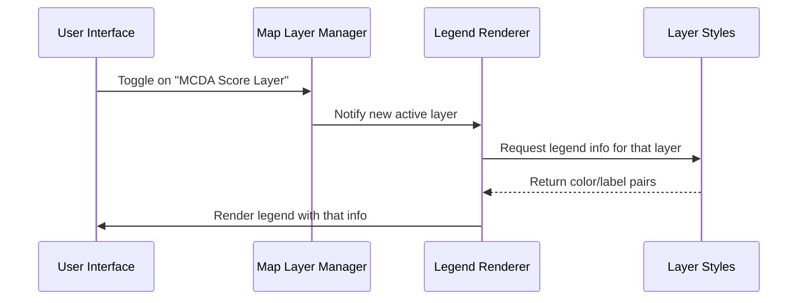

# Chapter 25: Legend Rendering for Data Representation

Welcome to Chapter 25! 🎨 In this chapter, we’ll explore one of the most visually powerful features in Disaster Ninja: the legend system!

> 🧠 “Wait… what is a legend?”

Well, in a map, a legend is like a **visual decoder.**  
It explains what colors, shapes, and icons represent. 🗺️

In Disaster Ninja, the legend does even more — it helps users interpret complex, multivariable data in a way that is clear, color-coded, and quick to understand. 🔍🌈

Let’s get started by understanding the concept behind…

---

## 🎯 Legend Rendering — What Problem Does It Solve?

Consider this scenario:

➡️ You're looking at a map showing health risk.  
It uses:
- Shades of red for high-risk zones
- Circles for population clusters
- Arrows for outbreak direction

❓ Without a legend: You’d be guessing!

✅ With a legend: You instantly understand what the data means.

🧠 In Disaster Ninja, legend rendering solves this problem automatically by:
- Explaining multivariate color systems
- Showing icons and data classes
- Dynamically matching the visualization on the map

Legends turn mystery maps into clear stories. ✨

---

## 🧠 What Is a Legend in Software Terms?

In Disaster Ninja, a "legend" is a component that:

- Renders a group of symbols, icons, or color blocks  
- Labels them with human-readable text  
- Matches them directly to a data style used on the map

Think of the legend as a **mini palette + dictionary** for what you're seeing onscreen.

---

## 🧰 Legend Types in Disaster Ninja

Disaster Ninja supports several types of legends for different types of data:

| Legend Type | Description | Example |
|-------------|-------------|---------|
| 📊 Univariate | One variable, rendered by color shades | Population density (light to dark blue) |
| 🎯 Bivariate | Two variables crossed into a matrix grid | Health Risk vs. Readiness |
| 🎨 Multivariate | Multiple variables each shown via styled blocks or symbols | CPI Index with 3 metrics |
| 🧭 Icon-based | Legends using icons (e.g. arrows, circles) | Direction of evacuation, type of buildings |

Let’s walk through how the system assembles and displays these legends.

---

## 🧩 Key Concepts and Components

| Concept | What It Does | Analogy |
|--------|----------------|---------|
| Legend Entry | Represents one symbol and its meaning | Dictionary entry |
| Legend Box | Group of entries under a title | Visual vocab list 📚 |
| Bivariate Grid | 2D matrix to represent two indicators | Tic-tac-toe board with colored cells |
| Multivariate Panel | Stacked color bars/icons for multiple factors | Pie chart’s label system |
| Legend Renderer | The component that outputs the legend | The screen painter 🎨 |

You can think of this chapter as learning to paint a “map label”. 🎨🗺️

---

## 🛠️ How Legend Rendering Works in Practice

Let’s explore one use case step-by-step:

> “I want to show a bivariate legend combining:  
> - Program Reach (X-axis)  
> - Risk Level (Y-axis)  
> … and display the 3x3 matrix of colors.”

This is a bivariate-style legend. Here’s how we do it.

---

### ✅ Step 1: Legend Data Model

Each legend is built from a structured model:

```ts
export interface LegendEntry {
  label: string;
  color?: string;
  icon?: JSX.Element;
}

export interface LegendGroup {
  title: string;
  entries: LegendEntry[];
}
```

🧾 These can model almost any legend:
- Color only? ✅
- Icon only? ✅
- Both icon + color? ✅

---

### ✅ Step 2: Create the Legend

For our bivariate use case:

```ts
const legendData: LegendGroup = {
  title: 'Program Reach vs. Risk Level',
  entries: [
    { label: 'Low Reach + High Risk', color: '#ff0000' },
    { label: 'Medium Reach + Medium Risk', color: '#cccc00' },
    { label: 'High Reach + Low Risk', color: '#00ff00' },
    // ...add all matrix combinations
  ]
}
```

🧾 This can be dynamically generated using utility functions tied to the data source.

---

### ✅ Step 3: Use the Legend Renderer

Disaster Ninja provides a reusable React component:

```tsx
import { LegendPanel } from '@/components/LegendPanel';

<LegendPanel legend={legendData} />
```

The component takes care of:
- Showing the title
- Laying out color blocks or icons
- Labeling each entry cleanly
- Supporting responsive layout

---

### ✅ Step 4: Contextual Rendering

In many cases, the legend shown depends on:
- The type of active layer
- The visualization style (bivariate, multivariate, MCDA)

Using Reatom state, each legend is dynamically tied to the map rendering logic.

So when a bivariate layer is active, the page auto-displays its legend — no extra coding needed!

---

## 🔬 Behind the Scenes: Dynamic Legend Generation

Disaster Ninja links together:

1. 🧠 Data styles for the layer (`colorMatrix`, `iconMap`, `axisLabels`)  
2. 🔧 Configuration logic  
3. 🎨 Legend Formatter component

This ensures:
- The map style and legend are always in sync  
- Users don’t get confused by false legend-color mappings  
- Advanced visualizations like bivariate matrix cell merging are supported

Example generator:

```ts
export function getLegendFromBivariateMatrix(matrix): LegendGroup {
  return {
    title: 'Program Reach vs. Risk Level',
    entries: matrix.cells.map(cell => ({
      label: cell.label,
      color: cell.color,
    })),
  };
}
```

---

## 🎯 Supporting Multivariate, MCDA, or Icon-Based Legends

Legends are flexible! You can also:

- Show icon-only entries  
- Combine multiple legend groups under one panel  
- Pass performance scores (used in MCDA layers)  
- Use triangular axis shapes (used in some bivariate + multivariate styles)

These all use the same LegendPanel API — just with different inputs.

---

## 👀 Where in the App This Is Used

You’ll see the legend system power:

- 📍 Layer legends for MCDA and metrics
- 🟡 Color-coded matrix explanations (bivariate grid)
- 📊 Tool panels that render extra layer explanations in context

Components involved:
- `<LegendPanel />` - the flexible UI container  
- `legendFormatter.ts` - converts metric matrix config → visual text + color
- `LegendWithMap` - image + text combo used in side panels

---

## ✅ Summary

Whew! That was a colorful journey. 🔴🟡🟢

Let’s recap what you now know:

✅ A legend decodes data visualizations on the map  
✅ Disaster Ninja supports multiple legend types: bivariate, multivariate, icon-based  
✅ You can define a legend using data structures like LegendEntry and LegendGroup  
✅ The LegendPanel component renders the UI dynamically  
✅ Legends stay in sync with the data thanks to centralized formatting functions

Now when someone says, “What does this blue square mean?”...  
You’ll have a powerful, pretty answer ready. 💪

---

Next: How does this connect to the map UI?

➡️ Join us in [Chapter 26: Legends Panel](26_legends_panel.md)  
…where we dig into how Disaster Ninja presents legends in the user interface.

Paint on, legend ninja! 🧙🎨🗺️

# Chapter 25: Legend Rendering for Data Representation

Welcome back, map magician! 🧙‍♀️🗺️

In [Chapter 24: Tooltip Service](24_tooltip_service.md), we learned how to show smart, lightweight help messages when users hover over different parts of the map UI.

In this chapter, we’ll tackle something just as important for visual storytelling:

> “How do we show users what all the map colors and symbols mean?”

🎯 That’s where the **Legend Rendering System** comes in.

---

## 🎯 Central Use Case: “What does red mean on this map?”

Imagine you’re an emergency responder looking at a colorful heatmap. You see green, orange, and red zones…

> “Hmm, does red mean danger or safety? What’s the range? What do the icons mean?”

That’s why every good map needs a ➡️ legend.

✅ A legend explains:
- What colors represent
- What icon symbols mean
- What metric scales apply (e.g. "0.0 – 1.0")

The Legend Rendering System automatically generates this from your layer styles — so users always understand what they’re seeing.

---

## 🧩 What Is the Legend Renderer?

> It’s a component that figures out what visual symbols to show at the bottom or side of the screen based on active layers.

In other words:
- 🧠 Reads the active map layers (e.g. MCDA, bivariate risk, population)
- 🎨 Figures out what color scales or shapes are used
- 🔖 Generates a neat visual key that tells the user how to read the map

Legends aren’t hard-coded — they update dynamically as the user changes layers or styles.

✨ Automatic clarity!

---

## 🧱 Key Concepts

Let’s break down its parts:

| Concept | What It Means | Analogy |
|--------|----------------|---------|
| Legend Item | One entry like "Red = High Risk" | A label in your color code |
| Legend Group | A collection of related items (e.g. flood categories) | A legend section 📦 |
| Legend Renderer | A component that loops over active layers and generates visual keys | Visual helper 🙋 |
| Source Styles | Where the legend gets its color or symbol info | Style blueprints 🖼️ |

---

## 🧪 Example: Auto-Legend for a Bivariate Layer

Let’s say you have a map showing:

- X axis: Flood risk (low → high)
- Y axis: Population density (low → high)

The style generator uses a 3×3 color matrix (see [Chapter 20: Bivariate and Multivariate Style Generators](20_bivariate_and_multivariate_style_generators.md))

🧠 The Legend Renderer:
- Detects it’s a bivariate style
- Fetches the X and Y axis labels ("Flood", "Population")
- Pulls the 9 color squares from the style matrix
- Shows a 3×3 legend grid with matching labels and a caption like:
  > "Risk: Red = High Flood, High Pop."

🧙‍♀️ The legend reads your map’s mind.

---

## 👩‍💻 Using the Legend Component

In your frontend layout, just add:

```tsx
<LegendPanel />
```

✅ It’ll read whatever layers are currently visible and show:
- Gradient bars (for continuous data)
- Color chips (for category or MCDA styles)
- 3×3 grid (for bivariate layers)
- Icon lookups (if symbols are used)

—

When the user changes layers or toggles visibility, the legend updates automatically.

---

## 📦 Sample Output (Example from MCDA)

Color layers were generated showing:

| Color | Meaning |
|-------|---------|
| 🟥 Red   | High Priority |
| 🟧 Orange | Medium Priority |
| 🟨 Yellow| Low Priority |

Legend panel will show:

```
MCDA Priority Scores
🟥 High Priority
🟧 Medium Priority
🟨 Low Priority
```

With a styled header, fixed icons, and colors.

---

## ⚙️ What Happens Behind the Scenes?

Let’s walk through the process when map styles change.



🧠 It acts like a color translator — converting styles to user-understandable meaning.

---

## 🔧 Internal Example: Bivariate Legend Definition

📁 `/map/legend/builders/bivariateLegendBuilder.ts`

```ts
export function buildBivariateLegend(layerStyle) {
  const { colorMatrix, xLabel, yLabel } = layerStyle;

  return {
    type: "bivariate",
    caption: `${xLabel} vs ${yLabel}`,
    grid: colorMatrix, // 3x3 or bigger
    xAxis: ["Low", "Med", "High"],
    yAxis: ["Low", "Med", "High"],
  };
}
```

🔥 Now the LegendPanel sees this and renders a 3×3 grid with small colored cells and axis labels like this:

```
      Population
        ↑
        │
Low ───────────► Flood
```

Each cell is colored according to the matrix. Easy to read, hard to misinterpret!

---

## 🧠 Where This Plug In

You’ll see legend generation happening in:

📁 `/map/legend/generateLegendForLayer.ts`

- Detects the layer style type (gradient, bivariate, category)
- Selects builder function (like `buildBivariateLegend`)
- Returns a structure like:

```ts
{
  type: "gradient",
  caption: "Flood Risk Score",
  stops: [
    { color: "#FFFFFF", label: "Low" },
    { color: "#FF0000", label: "High" }
  ]
}
```

📁 `/components/LegendPanel.tsx`

- Subscribes to active layers
- Renders blocks of color + labels

---

## 🛠️ Supporting MCDA, Thresholds, Scenarios

Because styles (and scores) can vary by scenario, the Legend Rendering system is smart enough to update when:
- MCDA configuration changes
- Thresholds filter out zones
- Bivariate dimensions shift

🧙‍♀️ One panel, many dynamic views.

—

Example: If a user changes axis from "Access" to "Vulnerability", the legend updates axis labels automatically — even if colors stay the same!

---

## ✅ Summary

Let’s summarize what you now know:

✔ The Legend Rendering System explains what map colors/symbols mean  
✔ It works dynamically — reacts to active layers and styles  
✔ Bivariate matrices turn into labeled grids  
✔ Gradient stops and labels are pulled from live styles  
✔ MCDA, thresholds, layers all influence the legend output

Thanks to this, every dynamic map gets clarity with just one glance 👁️🎨

---

🎯 Up next: Let’s explore how users can configure or save result layers — not just view them — with the system known as:

➡️ [Chapter 26: Result Layer Configuration](26_result_layer_configuration.md)

You’re now mastering not just map display — but map understanding. 💪🗺️🎓 See you there!

# Chapter 1: What is Python?

Welcome! 🎉 If you're just starting your coding journey, you're in the right place. In this chapter, we’ll take our first steps into the world of **Python**, one of the most beginner-friendly programming languages out there.

## Why Learn Python?

Python is loved by beginners and professionals alike. Here's why:

- 🐍 **Simple and readable**: Python code looks almost like plain English!  
- 🌍 **Versatile**: You can use Python for web development, data analysis, artificial intelligence, automation, and more.
- 💼 **In-demand**: Many big companies use Python—and they’re hiring!

## What Can You Do With Python?

With just a little Python knowledge, you could:

- Build a website  
- Analyze and visualize data  
- Automate boring tasks like renaming files  
- Create simple games  
- And much more!

## A First Glimpse of Python

Let’s look at your very first line of Python code:

```python
print("Hello, world!")
```

This line tells Python to display the message **Hello, world!**

### 🧠 Tip

When you see `print("Hello, world!")`, think of it as Python’s way of *talking back to you*. It’s the simplest way to make sure your code is working!

## Let’s Try It!

If you'd like to try it out right now:

1. Go to [replit.com](https://replit.com) or [python.org](https://python.org)  
2. Find a Python editor or shell  
3. Type in:

    ```python
    print("Hello, world!")
    ```

4. Hit **Run** or **Enter** — You did it! 🎉

---

## What’s Next?

In the next chapter, we’ll set up Python on your computer and learn how to write your own code step by step.

Get ready—you've just taken your first step into coding! Keep going, and soon you’ll be building your own Python projects. 🛠️🐍