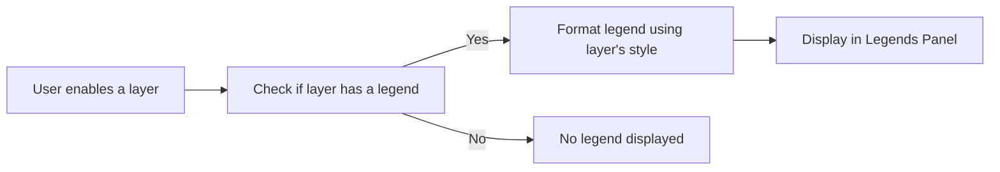
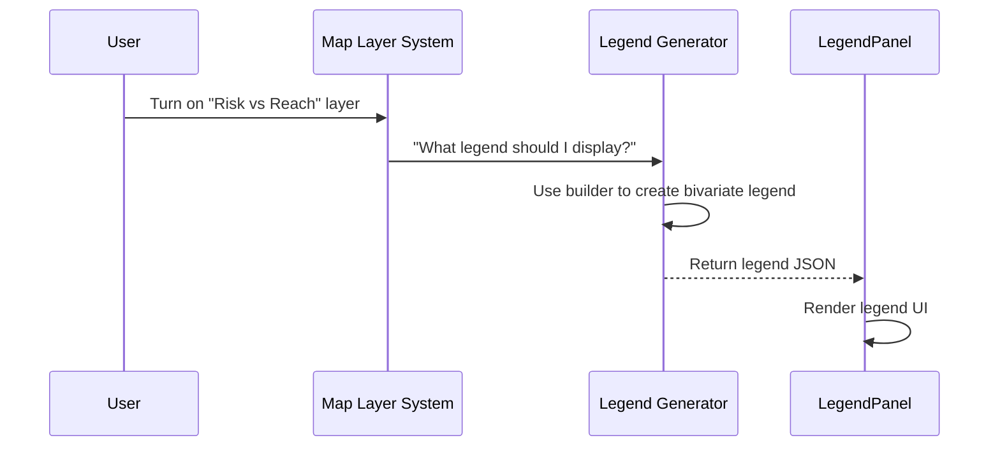

# Chapter 26: Legends Panel

Welcome, map explorer! 🗺️  
By now, you've learned how map layers are loaded, styled, and displayed using data from real-world disasters. You've even seen how we represent color through legends for data in [Chapter 25: Legend Rendering for Data Representation](25_legend_rendering_for_data_representation.md).

But here's a new challenge every map user faces:

>💡 “What do all these colorful symbols on the map actually mean?”

If you're wondering, you're not alone — and you're in luck. That’s what the Legends Panel is for. 🧙‍♂️📖

Let’s break it down.

---

## 🎯 What Is the Legends Panel?

The Legends Panel is like a dynamic **guidebook for your map**.

Whenever you turn on a data layer (like population density, flood zones, or hazard levels), the Legends Panel automatically updates to show you:

- What each color or symbol on the map represents 🖍️
- How to interpret multivariate color styling 🚦
- Layer-specific data ranges, icons, or thresholds 📐

Think of it as a magical legend ✨ — smart enough to only show what's actually used on your map — and to hide the rest.

---

## 🧭 Where Is It Located?

When you open the Disaster Ninja app:

- Look for the "Legend" 📘 icon, usually on the right or bottom panel
- When you click it, the Legends Panel slides into view
- You’ll see a list of legends grouped by active layers

💡 Bonus: Only layers that have their “legend” enabled and are currently visible will appear here

---

## 🛠️ Why Is It Helpful?

Let’s imagine you enable the “Vulnerability Index” layer and see this on your map:

🟥🟨🟩

...Without any explanation, what’s red and what’s green? Is green high or low?

The Legends Panel steps in to tell you:

- 🟥 = High vulnerability
- 🟨 = Moderate
- 🟩 = Low

Now that’s clarity! 🧠🔍

---

## 🗂️ How It Works (The Beginner-Friendly Process)

Let’s understand what’s happening under the hood when a layer is turned on:

1. ✅ You activate a layer with a defined legend (like a hazard risk map)
2. 🧠 The app reads the layer’s configuration and legend styling
3. 🧾 The legend entry is rendered and added to the panel
4. ❌ If you hide or disable the layer → its legend disappears too

👉 That means the Legend Panel is always up-to-date with your current map view.

---

## 🧠 Key Terms

Let’s simplify a few terms you’ll come across:

| Term | What It Means | Analogy |
|------|---------------|---------|
| Legend | Visual explanation of how data is shown | Map key or emoji dictionary 🔍 |
| Active Layer | A map layer you turned on | A show you’re currently watching 📺 |
| Legend Item | One entry in the legend (e.g., red = high) | A row in a map explanation 📏 |
| Legend Panel | UI that shows all the current legends | A magical floating handbook 🧚 |

---

## 🧩 Real Example: Viewing a Multivariate Layer

Suppose you enabled a multivariate layer (e.g., combining flood risk + population exposure).

You might see a grid of colored squares in the Legends Panel, like:

|     | 🚦 |          |
|-----|----|----------|
| Color 1 | Low risk + Low exposure |
| Color 2 | High risk + High exposure |

🧙 Behind the scenes, the Legends Panel checks the layer’s type and formatting system to generate the right explanation — whether the data is:

- A single scale
- A bivariate matrix
- A set of custom thresholds

---

## ⚙️ Under the Hood: How the App Builds the Legends Panel

Let’s look at a simplified flowchart:



🎯 Only layers with a legend configuration are shown  
🎯 The panel updates automatically when you turn layers on or off

---

## 🧑‍💻 Developer Tip: Where Is This Logic In Code?

The Legends Panel component and configuration lives in several places:

📁 `/src/map/legends/`

- `legendFormatter.ts` → Defines how to display various styles
- `LegendPanel.tsx` → The main React component showing legends for current layers
- `LegendWithMap Component` → A helper to show legends alongside maps in context
- `useLegendContent.ts` → Smart hook for figuring out what should appear in the panel

🧾 When a layer is added:
- It registers its legend structure (if defined)
- When visible, its formatted items are added to the panel

---

## 🧪 Bonus: You Can Build a Legend for Your Own Custom Layer

If your layer has special styling (say, 5 shades of blue), you can describe that like this:

```ts
legend: {
  type: 'gradient',
  steps: [
    { color: '#blue1', label: 'Low' },
    { color: '#blue5', label: 'High' },
  ],
}
```

When this layer becomes active, the system will render that gradient and show "Low" to "High" labels accordingly.

Voila! 💫 No extra work needed.

---

## 🔄 Dynamic Updating in Action

Let’s walk through a live example:

1. User enables “Hazard Risk Layer”
2. Its visible state is `true`
3. An atom triggers the legend formatter
4. Panel receives new content
5. It re-renders and shows: 🎨 Red = High, Orange = Medium, Yellow = Low

Now imagine the user disables that layer. Poof! 🌬️ Its legend is gone from view.

Only relevant data, always.

---

## 📦 Where to Find It in the Project

Here’s a quick guide to useful files:

📁 Panel Logic:
- `/src/map/LegendPanel.tsx` → The display logic
- `/src/map/LegendWithMap.tsx` → Optional side-kick component

📁 Formatting:
- `/src/map/legendFormatter.ts` → How to render each type

📁 Layer Configs:
- Each layer definition includes a `legend` field if it needs display guidance

---

## ✅ Summary

You’ve now unlocked your map-reading superpower 🦸 — the Legend Panel.

Here’s what you’ve learned:

✅ The Legends Panel explains what the map visuals actually represent  
✅ It updates live based on which layers are active  
✅ Each layer can provide its own formatted legend instructions  
✅ You can define your own legends or use built-in styles (like bivariate, continuous gradient, etc.)  
✅ This makes Disaster Ninja visually intuitive and user-friendly

Next time your map is filled with color, elevation, exposure, or symbols — you’ll know exactly what’s going on.

You are the map wizard now. 🧙🗺️📖

---

In the next chapter, we'll dive into how we take graphical style formats and convert them into something the map engine understands.

➡️ Continue to [Chapter 27: Map CSS to MapBox Converter](27_map_css_to_mapbox_converter.md)

Keep learning, cartographer ninja! 🥷📘🔥

In Disaster Ninja, legend rendering is a dynamic and context-aware system that visually explains the meaning of data styles applied to the map. Whether you're showing flood risk, MCDA scores, or population density, the legend gives users a quick, easy-to-understand reference for what all that color and symbolism actually means.

Let’s break down how the system works on a technical level, step by step. 🛠️

---

## 🔁 Step-by-Step: How Legends Are Generated

When a layer is added or updated on the map, here’s what happens:

1. 🎯 The map layer registers its metadata and styling (e.g. color, thresholds, bivariate mode).
2. 🛠 The Legend System reads the layer config and invokes the appropriate rendering function:
   - univariate → gradient list
   - bivariate → matrix grid
   - multivariate → stacked icons + labels
3. 🧠 The system auto-generates labels from known data breaks or custom configuration.
4. 🖼 The legend is passed to a global UI display component and rendered on-screen — usually next to the layer toggle or in a “Legend” side drawer.
5. ⚙️ Users can toggle, expand, or collapse legends based on layer selection.

It’s all component-based, responsive, and driven by data. ✅

---

## 👨‍💻 Example: Univariate Legend Generator

Say your map layer uses a scale from 0 to 1 with 5 thresholds.

Here’s what you'd define:

const breaks = [0, 0.2, 0.4, 0.6, 0.8];
const colors = ['#F0F9E8', '#BAE4BC', '#7BCCC4', '#43A2CA', '#0868AC'];
const labels = ['Very Low', 'Low', 'Medium', 'High', 'Very High'];

The legend renderer creates this:

[
  { color: '#F0F9E8', label: 'Very Low' },
  { color: '#BAE4BC', label: 'Low' },
  { color: '#7BCCC4', label: 'Medium' },
  { color: '#43A2CA', label: 'High' },
  { color: '#0868AC', label: 'Very High' },
]

This array is rendered as 5 horizontal swatches in a boxed UI panel.

—

📁 Internal builder (simplified):

function buildUnivariateLegend(breaks, colors, labels) {
  return breaks.map((_, i) => ({
    color: colors[i],
    label: labels[i],
  }));
}

---

## 🎯 Bivariate Legend Example: Dual-Axis Matrix

For bivariate styles:

- X-axis = Flood Risk (Low/Medium/High)
- Y-axis = Population (Low/Medium/High)

You get a 3x3 grid with labeled rows and columns:

┌──────────────┬────┬────┬────┐
│              │ Low Pop │ Med Pop │ High Pop │
├──────────────┼────┼────┼────┤
│ Low Risk     │🟩   │🟨  │🟥   │
│ Med Risk     │🟨   │🟧  │🟥   │
│ High Risk    │🟥   │🟥  │⬛   │
└──────────────┴────┴────┴────┘

Each cell = color from matrix → connected to map zones.

📁 Generated by bivariateLegendBuilder:

function buildBivariateLegend(xLabels, yLabels, matrixColors) {
  return {
    xLabels,
    yLabels,
    cells: matrixColors, // [ [color, color, color], ... ]
  };
}

---

## 🧪 Bonus: Multivariate Legends

Used when showing 3+ variables in one map layer (rare, advanced).

Renders:
- Vertical stack of mini swatches
- Or icons explained by shape / size

Legend entry example:

📦 [
  { type: 'color', value: '#FF5733', label: 'High Risk' },
  { type: 'icon', icon: 'hospital', label: 'Health Sites' },
  { type: 'size', size: 12, label: 'Population Cluster' }
]

These legends are auto-generated from the layer registries, usually based on MCDA or thematic style settings.

---

## 🔧 Legend Renderer Component

Disaster Ninja uses a global React component:

LegendRenderer.tsx → handles all legend types

Internally routes to:

- UnivariateLegendBox
- BivariateMatrixLegend
- MultivariateLegendPanel

Uses smart props:
- legendType = 'univariate' | 'bivariate' | 'multivariate'
- entries = formatted swatches or cells

➡️ This keeps the UI flexible and layer-independent.

---

## 🧭 Where to Find It in the Codebase

Legend system is centered around:

📁 /src/legends/
  - legendRenderer.tsx
  - buildUnivariateLegend.ts
  - buildBivariateMatrixLegend.ts
  - legendPresets.ts
  - layerLegendMappings.ts

Map layers declare their config → legend builders pick the style → renderers visualize 💥

---

## ⚙️ Advanced Features Supported

- 💠 Custom titles (e.g. “Flood Danger Level”)
- 🧲 Auto-generate from data bins (e.g., Jenks classification)
- 🌍 Localized label support
- 🧪 Dynamic legends that change based on time/zoom
- 🔄 Legend panel tabs if multiple styles are active

---

## ✅ Summary

Let’s recap:

✔️ A legend is a visual guide that tells users “what the map colors mean”  
✔️ Disaster Ninja supports multiple styles: univariate, bivariate, multivariate  
✔️ Legends are generated dynamically based on map layer settings  
✔️ They’re composed of swatches, labels, grids, or icons — clean and scannable  
✔️ The `LegendRenderer` component ties everything together  

When someone says: "What does red mean?"... the legend has your back. 🟥✊

—

➡️ Up next: Let’s explore how these legends get integrated with exported maps and shared outputs!

Continue to [Chapter 26: Map Export & Snapshot Generator](26_map_export_and_snapshot_generator.md)

You're almost fully styled — onward, legend maker! 🧙‍♂️🗺️🎨

# Chapter 26: Legends Panel

Welcome back, map wizard! 🧙‍♂️ In the [previous chapter](25_legend_rendering_for_data_representation.md), we explored how legends help users understand map colors, symbols, and scores. You learned that the legend isn't just a static picture—it reacts to your data and helps your audience read your map like a pro!

Now we’ll learn how all of that gets displayed in the actual app interface using…

🎯 **The Legends Panel!**  
> "How does the app know which legend to show, and where does it appear?"

Let’s unlock the final piece of the magic map puzzle: presenting the right legend, at the right time, in the right place.

---

## 🎯 Use Case: Dynamic Display of Data Legends

Imagine you're an analyst comparing **Program Reach (Low → High)** vs. **Risk Level (Low → High)** on a bivariate map style.

You want the app to:

✅ Automatically show the correct 3x3 color legend when this layer is selected  
✅ Use meaningful axis labels (“Program Reach”, “Risk Level”)  
✅ Update when the data or axis switches  
✅ Stay hidden when the layer is off  

This is exactly what the **Legends Panel** handles—like a helpful map guide that always knows what’s being shown.

---

## 🧱 What Is the Legends Panel?

It’s a visual **UI component** that listens to what layers are active, asks the rendering system which legend matches, and then displays it beautifully.

Think of it as a stage manager:

- 🎭 It listens for changes in the show (map layers)
- 🎨 It figures out which props and descriptions to render (legend UI)
- 📐 It lays everything out correctly for the user to understand

---

## 🌟 Core Concepts

Here's how the Legends Panel works behind the curtain:

| Concept | What It Does | Simple Example |
|--------|--------------|----------------|
| `LegendPanel` | React component that renders the legend area | Shows color boxes + labels in the sidebar |
| `generateLegendForLayer()` | Finds which type of legend to use for a layer | “MCDA? → use color blocks”, “Bivariate? → draw 3x3 grid” |
| `legendBuilders` | Tiny functions that format matrix or gradient into legend-ready format | Converts a 3x3 matrix into labeled rows |
| `Reatom State` | App memory system that remembers which layer is selected | If you toggle on a layer, it tells the LegendPanel to change |

---

## 📦 Example: Showing a Bivariate Legend in the Panel

Let's say the user toggles a map showing flood risk vs. population density.

Here's all it takes to show the correct legend:

```tsx
// ✅ Just include the panel in your layout
<LegendPanel />
```

☝️ That’s it!

You don’t need to pass anything manually. It auto-detects what’s active using the internal layer state system and generates the correct legend.

---

## 🔍 What Appears in the UI?

Imagine our legend data looks like:

```ts
const legendData = {
  type: "bivariate",
  caption: "Flood Risk vs. Population",
  xAxis: ["Low", "Med", "High"],
  yAxis: ["Low", "Med", "High"],
  grid: [
    { label: "Low/Low", color: "#ffffff" },
    { label: "High/High", color: "#ff0000" },
    // ...other combinations
  ]
}
```

Then the panel output visually looks like:

```
Flood Risk vs. Population
    ↑ Population
    │
    │  🔲 🔲 🔲
    │  🔲 🔲 🔲
    │  🔲 🔲 🔲
    └────────→ Flood Risk
```

Each color square matches the 3x3 bivariate grid the user is seeing on the map ✨

---

## 🧠 What Happens Behind the Scenes?

Let’s walk through what happens step-by-step when a layer is activated:



💡 The legend panel is just listening. When something changes, it reacts and renders the new legend.

---

## 🏗️ Internal Code (Simple Walkthrough)

Here’s how pieces connect in the codebase.

### 1. The Panel UI: `/components/LegendPanel.tsx`

This is the cozy section of the UI that renders the legend.

```tsx
export function LegendPanel() {
  const legend = useCurrentLegend(); // Gets legend based on current layer

  return (
    <div className="legend-container">
      <h4>{legend?.caption}</h4>
      {legend?.type === 'bivariate' && <BivariateLegendGrid grid={legend.grid} />}
      {legend?.type === 'category' && <CategoryLegend entries={legend.entries} />}
      {/* Other styles handled here */}
    </div>
  )
}
```

🧠 The panel figures out the legend type and chooses the correct sub-component to show.

---

### 2. Getting the Right Legend: `/map/legend/generateLegendForLayer.ts`

This function matches each layer with the correct legend type and builder:

```ts
export function generateLegendForLayer(layer) {
  const style = layer.style;

  if (style.type === "bivariate") {
    return buildBivariateLegend(style);
  }

  if (style.type === "category") {
    return buildCategoryLegend(style);
  }

  return null;
}
```

👀 So the panel doesn't need to understand the data format—this function gives it clean, ready-to-render info.

---

### 3. Building a Bivariate Legend: `/map/legend/builders/bivariateLegendBuilder.ts`

```ts
export function buildBivariateLegend(style) {
  return {
    type: "bivariate",
    caption: `${style.xLabel} vs ${style.yLabel}`,
    xAxis: ["Low", "Med", "High"],
    yAxis: ["Low", "Med", "High"],
    grid: style.colorMatrix,
  };
}
```

This function transforms a matrix of colors into an easy-to-understand legend config 🙌

---

## 🚀 Extending the Panel: Categories, Icons, Gradients

The same `LegendPanel` component works for:

- MCDA categories 🔴🟡🟢
- Threshold-based color ramps
- Icon-based styles (e.g. 🚫, ✅)
- Multivariate triangular or block styles

All that changes? The structure passed to the panel.

🎨 The UI stays consistent — you customize with data.

---

## ✅ Summary

Awesome job! You now understand how the **Legends Panel** connects map data to actual UI:

✔ Dynamically shows the right legend based on active layer  
✔ Uses builder functions to format legend content  
✔ React component lays it out responsively  
✔ Supports color blocks, icons, gradients, bivariate grids — all from one component  

No more guessing what a red square means. The legend explains it all.

---

🎓 Next up: Let’s learn how users can not only view but also configure and save their map layers in:

➡️ [Chapter 27: Result Layer Configuration](27_result_layer_configuration.md)

Your map superpowers keep growing! 🗺️✨