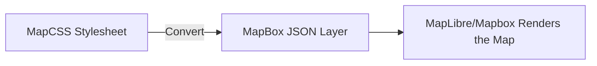
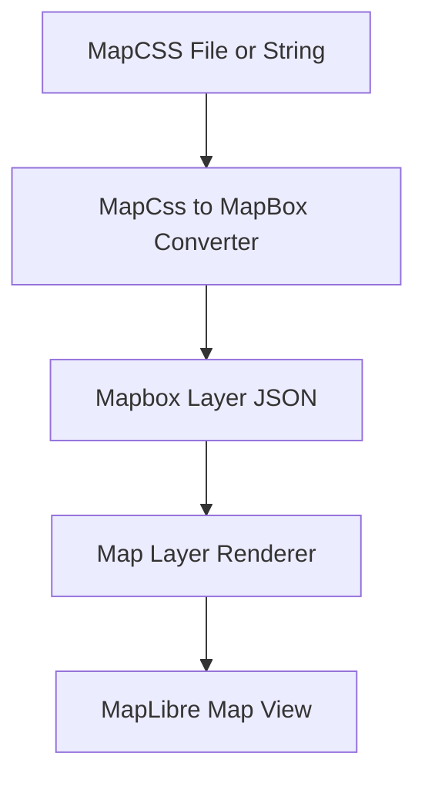
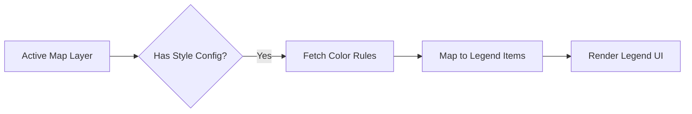
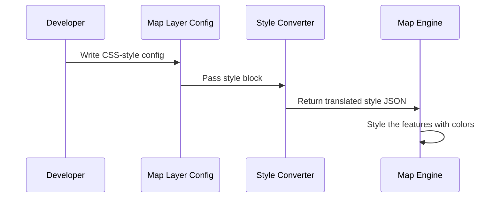

# Chapter 27: Map CSS to MapBox Converter

Welcome back, Disaster Ninja explorer! 🌍  
By now, you've learned how to show, manage, and interact with layers on the map. But how do we define how those layers look?

That brings us to a really cool idea: turning one type of style language (MapCSS) into something our map engine (Mapbox GL / MapLibre) can understand.

In this chapter, you’ll learn what the "Map CSS to MapBox Converter" is, why it exists, and how it helps you in Disaster Ninja without needing to know all the nitty-gritty details of different map styling syntaxes.

---

## 🔄 What Is “Map CSS to MapBox Converter”?

Let’s break it down:

- 🎨 **MapCSS** is a style language designed to describe how map elements (like roads, buildings, and water) should appear.
- 🗺️ **Mapbox (or MapLibre)** uses a different format to display styled map layers.
- 🔧 The **Converter** acts like a translator 📘 between these two styles, so we can use MapCSS in a Mapbox-style map environment.

It takes instructions written in one language (MapCSS) and rewrites them automatically into another format (Mapbox GL JSON layers).

---

## 🧠 Why Do We Need a Converter?

Picture this:

> “You’ve got a bunch of styling rules written in MapCSS (from older tools or existing datasets)… but your map runs using Mapbox / MapLibre.”

💥 Problem: Mapbox doesn’t speak MapCSS.

💡 Solution: Use the converter to **automatically translate styles** from MapCSS → Mapbox.

This way:
- You reuse existing work
- Avoid rewriting styles from scratch
- Keep things consistent across tools and platforms

---

## 💡 Analogy

Imagine you have a blueprint in French (MapCSS), but your builder only speaks English (Mapbox GL). The converter is your interpreter 👷‍♂️🗣️ — translating the blueprint step-by-step so your builder knows what to do.

---

## 🔍 How the Converter Works (High-Level Flow)



It reads rules like:

```
way[highway=residential] {
  color: #999;
  width: 2;
}
```

And turns them into something Mapbox understands:

```json
{
  "id": "residential-roads",
  "type": "line",
  "source": "osm",
  "paint": {
    "line-color": "#999999",
    "line-width": 2
  },
  "filter": ["==", "highway", "residential"]
}
```

Isn’t that neat? 😄

---

## 🏗️ When You Might Use the Converter

- You have **existing styles** from another platform (like JOSM or iD editor).
- You want to keep **consistent visual rules** between projects.
- You are loading **vector data** and need quick styling for roads, rivers, etc.
- You are building a plugin or editor that accepts MapCSS.

🎯 Instead of styling from scratch, convert your old rules!

---

## ⚙️ What Features Does the Converter Support?

Here are some of the key MapCSS parts that the converter supports (depending on your ruleset):

| MapCSS Feature | Converted To (Mapbox) |
|----------------|------------------------|
| Selectors (like `way[highway=...]`) | Filters |
| Color / Width | Paint styles |
| Text labels | Symbol layers |
| Case matching / tags | Filters |

It's like translating a vocabulary — but the rules are pre-set!

---

## 🧰 How Is It Used in Disaster Ninja?

Inside the project, you might find or use the converter in areas like:

📁 `/src/map/styles/mapCssToMapbox.ts`

Key functions might look like:

```ts
import { parseMapCSS, convertToMapbox } from './mapCssToMapbox';

const mapCssStyles = loadStylesFromText(...);
const mapboxLayers = convertToMapbox(parseMapCSS(mapCssStyles));
```

Behind the scenes:

- `parseMapCSS(...)`: reads MapCSS and turns it into an intermediate JSON
- `convertToMapbox(...)`: takes that JSON and produces Mapbox-style layer configs

These layers are then passed into the live map renderer.

---

## 🧪 Quick Example: Converting Road Styling

🗒️ Sample MapCSS:

```
way[highway=primary] {
  color: #f00;
  width: 3;
}
```

🛠️ Resulting Mapbox Layer:

```json
{
  "id": "primary-roads",
  "type": "line",
  "filter": ["==", "highway", "primary"],
  "paint": {
    "line-color": "#ff0000",
    "line-width": 3
  }
}
```

🔥 Ready to use in your map!

---

## 🗂️ Where It Fits in the Bigger System

Here’s a mental model to place the converter in the full Disaster Ninja structure:



It’s a “pre-processor” that lets you use existing styles with modern rendering.

---

## 👍 Pros of Using the Converter

- ✅ Avoids rewriting from scratch  
- ✅ Speeds up iteration  
- ✅ Helps migrate from older styling systems  
- ✅ Makes it easier to work with data from other OSM tools  
- ✅ Good for prototyping or customizing looks quickly

---

## ⚠️ Limitations (Beginner-Friendly)

Like any translator, there can be things that don't perfectly map over:

- Not all MapCSS properties have equivalents in Mapbox (especially advanced ones)
- You may need to tweak labels or symbols manually
- Expressions and scripting logic are not supported

So it's good for **most base style needs**, but very **custom styles** may need manual attention.

---

## ✅ Summary

You just learned about a super-useful behind-the-scenes tool: the **Map CSS to MapBox Converter**! ✨

✅ It transforms MapCSS rules into Mapbox GL JSON styles  
✅ Lets us reuse familiar OpenStreetMap styles in modern map engines  
✅ Simplifies disaster mapping workflows by avoiding duplication  
✅ Makes styling faster and more consistent  
✅ Used internally in Disaster Ninja when applied to vector map layers with preexisting styles

This is styling magic for your map interface! 🌈🌍

---

📍Next: Let’s learn how finding data and places becomes easy with custom search capabilities!

➡️ Continue to [Chapter 28: Search Feature](28_search_feature.md)

You're doing amazing — keep those pixels polished and paths pretty! 🎨🧙‍♂️🗺️

…And that leads us to the core focus of this chapter: How Disaster Ninja dynamically renders legends that clearly explain what map styles mean.

Let’s continue step by step…

---

## 🧰 The Anatomy of a Legend: What’s Inside?

At its simplest, a legend consists of several visual and textual pieces:

✅ A title (e.g. “Flood Risk”)  
✅ A symbol (like a color swatch, icon, or shape)  
✅ A label or category name (e.g. “Low”, “Medium”, “High”)  
✅ Display options (orientation, alignment, scale)

Here’s a sample structure:

```ts
interface LegendItem {
  label: string;         // e.g. "High Risk"
  value?: number;        // e.g. 0.9
  color?: string;        // e.g. "#FF0000"
  icon?: ReactComponent; // for icon-based
}
```

Each Legend is just a list of these items, often grouped into a section with a title.

---

## 🧠 Example: Univariate Legend

Let’s say you’re showing population density as a heatmap from light blue → dark blue.

Legend:

- Light Blue: Low Density
- Medium Blue: Medium Density
- Dark Blue: High Density

Built like this:

```ts
const univariateLegendItems = [
  { label: "Low", color: "#CCE5FF" },
  { label: "Medium", color: "#66B2FF" },
  { label: "High", color: "#004C99" },
];
```

Then we render these blocks in the legend component.

---

## 🎨 Example: Bivariate Legend (Matrix Style)

When two variables are styled bivariately (e.g. Flood Risk + Population), this creates an NxN table.

Legend entry might look like:

|          | Low Pop | Medium Pop | High Pop |
|----------|---------|------------|----------|
| Low Risk | 🟦      | 🟪         | 🟥       |
| Mid Risk | 🟦      | 🟪         | 🟥       |
| High Risk| 🟥      | 🟥         | 🟥       |

Each cell is described like this:

```ts
interface BivariateCrossItem {
  xLabel: string;
  yLabel: string;
  color: string;
}
```

Renderer organizes it into a readable square with a caption.

In Disaster Ninja, this is handled by:

📁 components/bivariate/BivariateLegend.tsx

Which takes in:
- Axis labels (from the MCDA config)
- Color grid (from the style manager)
- Placement and font configs

---

## 🚧 Rendering Flow for Legends

Let’s visualize how Disaster Ninja builds a legend from the current map:



This ensures that:
- Every active visible layer can declare a legend section
- When the user turns a layer on/off — the legend updates automatically 🔄

—

🧠 Where does the style come from?

Disaster Ninja taps into the style objects used to color the map (e.g. via Style Generators — see Chapter 20) and reuses those definitions for the legend 💡

No duplication required!

---

## ⚙️ Where the Code Lives

You’ll find legend rendering powered by these files:

📁 /src/components/legend/
- LegendBox.tsx — Renders a group of items
- LegendItem.tsx — Renders a single row/block
- BivariateLegend.tsx — Handles grid layout
- MultivariateLegend.tsx — Shows multiple stacked variables

📁 /src/lib/legend/generateLegendFromStyle.ts

This converts the current map style into a legend entry list.

📁 /src/atoms/legendAtom.ts

Tracks current legend state per layer.

—

Everything is built reactively using Reatom & React — new data = automatic legend updates ✅

---

## 📦 Also Used For

🎯 You’ll see legends in:

- MCDA scoring + visualization
- Thematic map overlays
- Scenario comparisons
- Multivariate style explanations
- Risk assessment dashboards

Wherever color or shape means “something important”, legends step in to translate! 🧠📊

---

## 📚 Summary

You’ve now unlocked insight into how Disaster Ninja’s legends work:

✔ Legends explain map visuals with titles, color blocks, and labels  
✔ The system builds legends automatically from color/style definitions  
✔ Supports univariate, bivariate, multivariate, and icon legends  
✔ Legends update reactively based on active layers  
✔ Located in `/components/legend/` with helper generators  

From a flat blob of color → to a vivid, explainable picture.

Legends make your maps meaningful 🔍🧭

—

🧑‍💻 Up Next: Want to make those legends interactive — e.g., click to filter?

➡ Continue to [Chapter 26: Interactive Legend Controls](26_interactive_legend_controls.md)

Legendary mapping skills unlocked! 🗺️🧙‍♂️📚

# Chapter 27: Map CSS to MapBox Converter

Welcome back, map artist! 🎨🗺️  
In [Chapter 26: Legends Panel](26_legends_panel.md), you learned how legends dynamically explain what users are seeing on the map—from color gradients to bivariate grids.

Now let’s peel back another layer of the system...

> ❓“How does Disaster Ninja take a style definition like 'red = high risk' and actually style the map with it?”

That’s exactly the job of the **Map CSS to MapBox Converter**.

---

## 🎯 Central Use Case: Styling the Map with Custom Data Logic

Let’s say you wrote a simple style:

```js
{
  type: "category",
  color: {
    "high": "#ff0000",
    "medium": "#ffcc00",
    "low": "#00cc44"
  }
}
```

Meaning:

- Red = High
- Yellow = Medium
- Green = Low

How do we go from that simple config to a real Mapbox style rule that paints areas on the screen with those colors?

That’s exactly what the converter does. 💡

---

## 🧠 Why We Need This Converter

MapBox styles are quite detailed and technical. While you don’t want to write them manually, the app needs them to actually paint layers.

So instead of writing raw MapBox styles (which are verbose), we use a simpler format called **“Map CSS”** — and then automatically convert it into a MapBox-compatible format using...

⚙️ **The Map CSS to MapBox Converter!**

It’s the translator between human-friendly style configs and machine-focused MapBox JSON.

---

## 🧩 Key Concepts

Let’s break it down into beginner-friendly parts:

| Concept | What It Means | Analogy |
|---------|---------------|---------|
| Map CSS | A simple style object written by devs or users | Like writing a recipe |
| MapBox Style | A complex, detailed object understood by Mapbox GL JS | A gourmet dish built from your recipe |
| Style Converter | Code that turns Map CSS → MapBox Style format | A chef that cooks from your recipe |

---

## 🧪 Example: How It Works

Let’s say we write the following Map CSS in a layer:

```js
{
  type: "category",
  colorByField: "risk",
  colorMap: {
    "low": "#00cc44",
    "medium": "#ffcc00",
    "high": "#ff0000"
  }
}
```

🎯 This says:

- For each feature, read its `risk` field  
- Color it based on that value using the provided colors

Now we call the Map CSS → MapBox converter.

It will output (simplified):

```js
{
  "paint": {
    "fill-color": [
      "match",
      ["get", "risk"],
      "low", "#00cc44",
      "medium", "#ffcc00",
      "high", "#ff0000",
      "#cccccc" // fallback color
    ]
  }
}
```

💥 And Mapbox will now *paint the features* based on their "risk" value!

---

## 👩‍🚀 How to Use It (in the App Layer Config)

You don’t ever need to call the converter directly.
Instead, just write your layer config like:

```js
style: {
  type: "category",
  colorByField: "score",
  colorMap: {
    "1": "#66c2a5",
    "2": "#fc8d62",
    "3": "#8da0cb"
  }
}
```

✅ Then when this layer is displayed:
- The app reads this friendly format
- The converter transforms it into a MapBox-compatible object
- The map applies it instantly — no extra work needed!

---

## ⚙️ What Happens Behind the Scenes?

Let’s walk through the process step-by-step:



The converter automatically knows how to handle:

- Category-based mappings
- Univariate gradients
- Bivariate matrix mappings
- Thresholds or quantiles
- MCDA custom scales

---

## 🔧 Internal Code (Simplified Overview)

📁 File: `/src/map/styles/mapCssToMapbox.ts`

Here’s a simplified version:

```ts
export function compileStyle(mapCss) {
  if (mapCss.type === 'category') {
    return {
      paint: {
        'fill-color': [
          'match',
          ['get', mapCss.colorByField],
          ...Object.entries(mapCss.colorMap).flat(),
          '#cccccc' // default
        ]
      }
    };
  }

  // Gradient and other types are handled similarly
}
```

🧠 This helper builds a `fill-color` rule using a Mapbox-supported “match” expression.

You don’t have to know Mapbox syntax — the converter does the hard part. 🧑‍🍳

---

## 💡 Pro Tip: Multi-dimensional Styles Are Also Supported

The converter also understands more complex styles like:

- **Gradients**: using continuous numeric scales
- **Bivariate** color grids: using two fields
- **MCDA** scoring overlays

Each has a handler function that interprets the config and generates a clean Mapbox-compatible paint block.

---

## 📂 Where to Find the Converter Internally

Here’s where it lives in the project:

| File | Purpose |
|------|---------|
| `/src/map/styles/mapCssToMapbox.ts` | Main entry point |
| `/src/map/styles/compileCategoryStyle.ts` | Converts category mapping |
| `/src/map/styles/compileGradientStyle.ts` | Converts numeric gradient maps |
| `/src/map/styles/compileBivariateStyle.ts` | Converts 2D matrix styles |

Each one returns a chunk of Mapbox style definition like:

```js
{
  paint: {
    'fill-color': [...],
    'fill-opacity': 0.75
  }
}
```

This is then fed into the map layer via Mapbox GL JS.

---

## ✅ Summary

Here’s what you’ve learned in this chapter:

✅ The Map CSS to MapBox Converter lets you describe styles simply  
✅ It translates your high-level logic into Mapbox-compatible format  
✅ It supports categories, gradients, bivariate matrices, and more  
✅ Layers auto-trigger the converter when rendered  
✅ You never write Mapbox expressions by hand!

Thanks to this converter, map developers stay productive, expressive — and unburdened by the complex soup of Mapbox syntax. 🧪🧙‍♀️

---

🎯 Up next: Let’s explore how users can export maps — with layers and legends included!

➡️ [Continue to Chapter 28: Map Export & Snapshot Generator](28_map_export_and_snapshot_generator.md)

You're almost ready to print your masterpiece! 🖼️📦🗺️