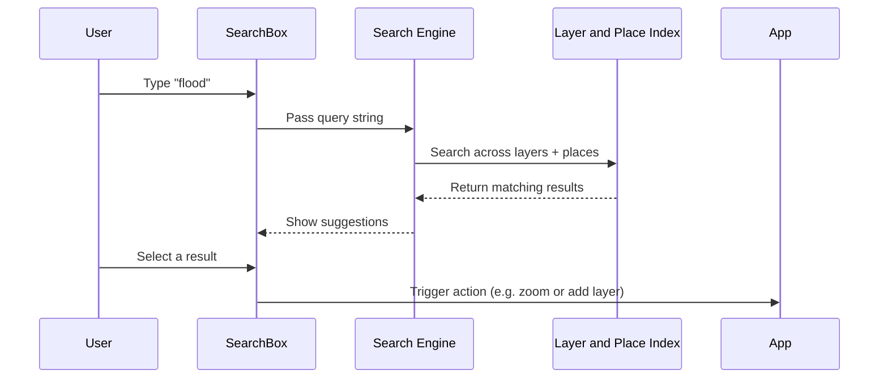

# Chapter 28: Search Feature

Welcome back, knowledge seeker! 🔍  
In this chapter, we’ll unlock a powerful part of the Disaster Ninja front end that acts like your personal assistant — helping you find what you’re looking for quickly and efficiently.

Say hello to the **Search Feature** — your smart librarian for navigating Disaster Ninja. 📚✨

---

## 🎯 What Problem Does the Search Feature Solve?

Imagine you’re analyzing a global disaster response map and:

👉 You want to quickly zoom to **Jakarta, Indonesia**  
👉 Or instantly locate an **MCDA (Multi-Criteria Decision Analysis)** configuration you saved earlier  
👉 Or search for something smart like “Flood Risk Zone in Kenya” 🌍

Instead of scrolling or navigating menus — you just **type** a keyword…  
And the app guides you there. 🙌

The Search Feature:
- Finds what you want
- Reveals relevant options
- Gives quick access to deep locations or data

Think of it as flying through the app with Superpowers. 🚀

---

## 🧠 What Is the Search Feature?

Let’s break it down in simpler terms:

> The Search Feature is a user interface and functionality that lets users type keywords and get **instant suggestions** for locations, saved configurations, or resources across the app.

It combines smart querying and results-rendering into one seamless experience.

📖 Think of it as:
- Your “Google bar” inside Disaster Ninja
- It knows about places 🗺️, projects 📦, and configurations ⚙️
- And navigates you there or loads what you asked for!

---

## 🧰 Key Components of the Search Feature

Let’s explore the building blocks that make up Search:

| Piece | What It Does | Analogy |
|-------|--------------|---------|
| 🔎 Input field | Lets the user type a search | The keyboard to ask questions |
| ⚡ Engine | Queries and matches search terms | The brain that connects your question |
| 📋 Result list | Shows matching items | Like Amazon or Google suggestions |
| 🗺️ Map actions | Focuses on a result when clicked | Camera flying to the spot |
| 🔁 Integration with MCDA & settings | Smartly detects config matches too | Like recalling saved work |

---

## ✨ Beginner Use Cases

Let’s walk through a few common tasks the Search Feature handles:

✅ Search for a city or country → Fly there on the map  
✅ Type part of a saved config → It suggests and loads the MCDA  
✅ Search for administrative boundaries → Zoom + highlight

Without leaving the keyboard, you’re already there.

---

## 🖼️ The UI Experience (What the User Sees)

Here’s what a user typically sees:

1. 🔎 A search bar at the top of the app (like Google Search)
2. They type something like `"Accra"` or `"flood"`
3. ✨ Matching results start appearing live:
   - Location matches (🌍 Accra, Ghana)
   - Config matches (📂 “Flood MCDA Config June23”)
4. The user selects one
5. The map smoothly navigates to that place or loads saved data

Feels magical — but it’s powered by smart code behind the scenes! 💻✨

---

## 🧭 How It Works Under the Hood

Let’s explore the internal steps the app takes to perform a search:

1. User types a query (e.g. `"nairobi"`)
2. Disaster Ninja sends the term to a search helper function
3. The helper queries one or more **search providers**:
   - Location database
   - MCDA saved configs
   - Dataset metadata
4. Results are normalized into a single consistent format
5. Suggested items are shown to the user
6. On selection:
   - The app either pans/zooms to the location  
   - Or loads the saved resource from the backend

🌍 All powered by quick async searches and smart suggestions.

---

## 🔧 Code Overview (Simplified)

The Search logic is often spread across:

📁 `/src/features/search/`  
Here you’ll find:

- `searchProvider.ts` — logic for different search types  
- `searchService.ts` — combines providers into one interface  
- `SearchComponent.tsx` — the UI piece showing the input and results  
- `searchAtoms.ts` — Reatom state handling the live query and results

🧠 It uses atoms to store:
- User input
- Search results
- Selected result

So everything updates reactively 🔄.

---

## 🔍 Example: Searching for Locations

Here’s a simplified search provider for location names:

```ts
export async function searchLocation(query: string): Promise<SearchResult[]> {
  const url = `https://nominatim.openstreetmap.org/search?q=${encodeURIComponent(query)}&format=json`;
  const response = await fetch(url);
  const data = await response.json();

  return data.map((entry) => ({
    type: 'location',
    label: entry.display_name,
    center: [entry.lon, entry.lat],
  }));
}
```

When the user types `"philippines"` — it gets matched by this function and results are returned.

---

## 🏁 Output: Rendering the Results

In the UI component:

```tsx
function SearchResults() {
  const results = useAtom(searchResultsAtom);

  return (
    <ul>
      {results.map((r) => (
        <li key={r.label} onClick={() => onSearchSelect(r)}>
          {r.label}
        </li>
      ))}
    </ul>
  );
}
```

Clicking a result calls a handler like this:

```ts
function onSearchSelect(result: SearchResult) {
  if (result.type === 'location') {
    map.flyTo({ center: result.center, zoom: 8 });
  }

  if (result.type === 'mcda_config') {
    loadUserConfiguration(result.id);
  }
}
```

💥 Boom — instant navigation results!

---

## 🚦 Intermediate and Advanced Behavior

As you grow more confident, the search implementation can be extended to handle:

- 🔄 Debounced or throttled typing  
- 🔍 Highlighting matched segments  
- ⭐ Prioritizing certain types of results  
- 📚 Remembering previous searches  
- 🧠 Adding custom search rules or filters

Disaster Ninja is flexible — you can plug in new providers easily!

---

## 📚 Where This is Used in the App

You’ll find the Search Feature integrated into:

🔍 Top user navigation bar  
🌍 Map interactions  
🖼️ Sidebar / Filter panels  
⚙️ Advanced settings for loading configurations  
📋 Panel toggles

It's one of the few features that crosses all major subsystems.

—

## ✅ Summary

In this chapter, you’ve discovered:

✅ What the Search Feature is — and how it works  
✅ How users can explore locations and saved data lightning-fast ⚡  
✅ How search providers return locations or MCDA configs  
✅ How search integrates with atoms and UI in a graceful way  
✅ Where this feature lives in the codebase — and how it can grow

Disaster Ninja's Search system is like a librarian, GPS, and smart assistant rolled into one. 🔍📚📍

---

🎯 Next Steps

Want to see how this Search Feature expands even further — combining different sources into a unified, powerful experience?

➡️ Head next to [Chapter 29: Aggregated Search](29_aggregated_search.md) — where the Search Feature is supercharged with multiple providers working together!

You're doing brilliantly — keep going, search ninja! 🥷🔍✨

Here’s how Disaster Ninja builds and shows a map legend — step-by-step:

1. 🧱 Map Style Generator Creates Data Categories  
   When map layers get styled (e.g. by MCDA results or risk), the system generates rules like:

   - “Score between 0–0.3 = light green”
   - “Score between 0.3–0.6 = yellow”
   - “Score above 0.6 = red”

   These style buckets become legend items!

2. 🧑‍💻 Legend Entries Are Generated from Styles  
   The style config is passed to the Legend Renderer, which does something like:

   ```ts
   {
     color: "#a8e6cf",
     label: "Low Risk (0–0.3)",
   }
   ```

3. 🎨 Legend Components Render Each Entry  
   Each entry becomes a visual block with:

   - A color swatch or icon  
   - A label  
   - Optionally: a tooltip or info link

   It looks like this on screen:

   ┌─────────┐ Low Risk (0–0.3)  
   │  🟩     │  
   ├─────────┤ Medium Risk (0.3–0.6)  
   │  🟨     │  
   └─────────┘ High Risk (0.6–1.0)  
   │  🟥     │  

4. 📦 Legend is Attached to Layer Panel or Map  
   The legend lives inside the layer’s panel or is pinned to the map corner. It auto-updates as styles change.

5. 🔁 Fast and Reactive: Uses Atoms  
   The legend reflects current app state instantly. For example:

   - You change a classification → legend updates  
   - You switch to bivariate view → 3×3 color matrix legend appears  
   - You load a scenario → new legend is shown

---

🧪 Code Walkthrough: Simple LegendEntry Type

Legend entries are typically simple objects like:

```ts
type LegendEntry = {
  label: string;
  color?: string;
  icon?: React.ReactNode;
  valueRange?: [number, number];
};
```

Each LegendEntry describes:
- 🏷 Label text
- 🎨 Color block (for univariate or bivariate)
- 📎 Icon (for point feature legends)
- 🔢 Optional data range

---

🎨 Code Example: Bivariate Legend Generator

For bivariate maps, you may generate a color matrix like this:

```ts
const bivariateLegendGrid = [
  [ { label: 'Low–Low',  color: '#e8e8e8' },
    { label: 'Low–Med',  color: '#b8d6be' },
    { label: 'Low–High', color: '#64acbe' } ],
  [ { label: 'Med–Low',  color: '#d7b5d8' },
    { label: 'Med–Med',  color: '#df65b0' },
    { label: 'Med–High', color: '#dd1c77' } ],
  [ { label: 'High–Low',  color: '#980043' },
    { label: 'High–Med',  color: '#67001f' },
    { label: 'High–High', color: '#49006a' } ],
];
```

The legend renderer turns this into a 3×3 labeled color grid — like a mini heatmap key.

📍 Each cell matches a color bucket on the map.

---

🧠 Where Legends Live in the UI

You’ll see legends in:

- MCDA map panels  
- Style configuration panels  
- Layer selectors  
- Mini-map overlays  
- Screenshot/export areas

In all these cases, the legend adapts to the data style in use!

---

🌐 Legend Localization and Accessibility

Legend labels are:

✅ Localized (translated)  
✅ Designed for screen readers  
✅ Declarative (based on config)  

Example:

```ts
label = t('legend.risk.medium'); // e.g., "Medium Risk"
```

This allows consistent, user-friendly explanations across maps and users. 🌍✨

---

📐 Responsive Legends

Legends auto-adapt when:

- You resize the screen  
- Switch to compact/mobile layout  
- Change layer visibility  

Disaster Ninja uses layout atoms and breakpoint detection to optimize legend size and position 💺🧠

---

🗂️ Internally: Where You’ll Find Legends

📁 Key files:

- /src/components/legend/Legend.tsx — main renderer  
- /src/lib/legendGenerators.ts — for building legend configs  
- /src/styles/styles.ts — for mapping rules → color blocks  
- /src/atoms/ui/legendVisibilityAtom.ts — track legend toggle states

---

✅ Summary

🧩 The Legend Rendering System helps users immediately interpret map visuals  
🎨 Translates data styles (color, icons, scores) into understandable keys  
⚙️ Reacts to real-time configs and scenarios  
🔄 Supports univariate, bivariate, multivariate, and icon-based styles  
📦 Driven by reusable components and declarative configs

Legends help you visualize not just what’s where — but why it matters.

---

🧭 Up Next

Want to create map exports with your legends baked in, for reports or briefings?

➡️ Continue to [Chapter 26: Map Export and Screenshot Tools](26_map_export_and_screenshot_tools.md) — and learn how to capture map intelligence in sharable form! 📸🗺️🧠

You’re on a legend-worthy journey! 🔎🎨📘

# Chapter 28: Search Feature

Welcome back, adventurous cartographer! 🗺️  
In [Chapter 27: Map CSS to MapBox Converter](27_map_css_to_mapbox_converter.md), you learned how styles are transformed to paint layers on the map. But what if you don’t know where to look on the map?

> ❓ “Where is Kharkiv?”  
> ❓ “Can I find health facilities with high risk in this area?”  
> ❓ “Is there a layer about floods in Bangladesh?”

That’s where the powerful 🔍 **Search Feature** comes in.

---

## 🎯 Central Use Case: “I want to find a specific place or dataset”

Imagine you’re an analyst responding to a flood. You need to:

- Zoom into a country or city  
- Search for layers about population or vulnerability  
- Filter by keywords like “MCDA” or “hospitals”

Instead of clicking all over the UI, you just type it — and the search brings the answers to you instantly. That’s the magic of Disaster Ninja’s Search Feature. 🧞‍♂️

---

## 🧩 Key Concepts

Before we dive in, let’s understand what the Search Feature is made of:

| Concept | What It Does | Analogy |
|--------|--------------|---------|
| SearchBox | UI where you type your query | Like a Google search bar |
| Suggestion Engine | Generates matching results | Auto-complete assistant ✍️ |
| Search Sources | Where matching results come from | Your map’s “libraries” |
| Search Result Actions | What happens when you select something | “Go to location” or “Add layer” |

It’s like a fast, helpful librarian who knows every place, dataset, and layer in your system.

---

## 🔎 How to Use the Search Feature

It’s super simple:

1. 🧭 Find the ⌕ Search icon in the top right of the app  
2. Click it or hit `/` (keyboard shortcut)  
3. Type what you’re looking for:
    - Country names (“Nepal”)
    - Dataset titles (“Flood Risk”)
    - Layer types (“MCDA”, “roads”, “school”)
4. Results will appear instantly — just click one!
    - If it's a location → the map zooms there 🗺️  
    - If it’s a layer → it gets added to the map ✅  
    - Sometimes it also shows related actions (like docs or FAQs)

Try it out:  
→ Type “risk” and see how many layers show up!

---

## 🧠 What Happens Behind the Scenes?

Let’s peek under the hood 👀



💥 It's fast and smart because it uses pre-indexed data from the app itself!

---

## 🧱 Internals: How Search Actually Works

Unlike a complex web search engine, Disaster Ninja’s search is lightweight and focused:

- Layers, places, and features are **indexed at runtime**
- Every indexed item has: `name`, `type`, `keywords`  
- When you type, we compare against these fields (with fuzzy matching)

Let’s walk through an example.

### 🔧 Internal Model

```ts
type SearchableItem = {
  id: string
  label: string
  keywords: string[]
  type: 'place' | 'layer' | 'document'
  onSelect: () => void
}
```

The list of these entries is preloaded into memory. When you type something, we filter the list in JavaScript. ✅ No server needed!

---

### 🔍 Matching Logic (simplified)

```ts
export function searchItems(query: string, allItems: SearchableItem[]): SearchableItem[] {
  return allItems.filter(item =>
    item.label.toLowerCase().includes(query.toLowerCase()) ||
    item.keywords.some(k => k.includes(query.toLowerCase()))
  );
}
```

🧠 This code matches any item whose `label` or `keyword` contains your search phrase.

Fast and user-friendly!

---

### 💡 Example Search Entry

```ts
{
  id: "layer_flood",
  label: "Flood Risk Map",
  keywords: ["risk", "hazard", "floodplain"],
  type: "layer",
  onSelect: () => addLayer("layer_flood")
}
```

So... if you type “hazard”, this layer will show up. Click it? It gets added to the map. 🎯

---

## 📋 Types of Search Results

Here are some things you can find:

| Item Type | What It Does |
|-----------|---------------|
| 🌍 Location | Zooms to a country or city |
| 📚 Layer | Adds a dataset to the map |
| 🧪 Analysis | Opens configured MCDA combos |
| 📄 Document | Links to a guide or external FAQ |

You can even group results by type (like “Places”, “Datasets”, “Tools”) for extra clarity.

---

## 🧑‍💻 Where The Code Lives

Here’s where to explore:

| File | Role |
|------|------|
| `/src/search/SearchPanel.tsx` | Main UI component |
| `/src/search/searchEngine.ts` | Filters search items |
| `/src/search/searchIndex.ts` | Builds and stores the search items |
| `/src/data/indexableLayers.ts` | Generators for layer entries |
| `/src/data/indexablePlaces.ts` | Country/city inputs |

💡 Pro tip: You can build your own search items easily — just add to the index!

---

## ✅ Summary

Let’s recap what you now know:

✅ The Search Feature lets users quickly find places, data layers, and tools  
✅ It updates as you type and offers instant suggestions  
✅ Every item defines an action when selected (zoom, add, open)  
✅ Internally powered by a prebuilt index and fast JS filtering  
✅ It makes maps more discovery-friendly and beginner-accessible

With just a few keystrokes, your map is ready to explore the world. 🌍💨

---

🧭 Up Next: Learn how users can export beautiful snapshots from the map using the built-in tools…

➡️ [Continue to Chapter 29: Map Export & Snapshot Generator](29_map_export_and_snapshot_generator.md)

Type less. Find more. You’re now a Disaster Ninja search master! 🥷🔍📡