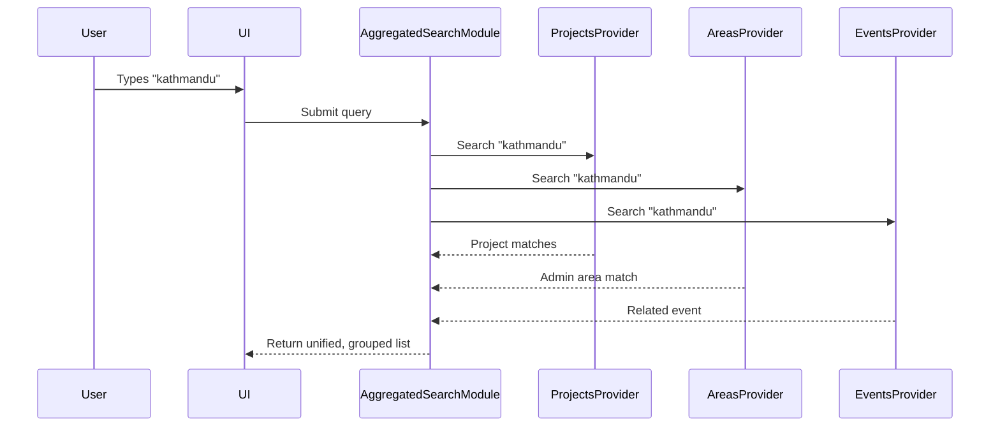
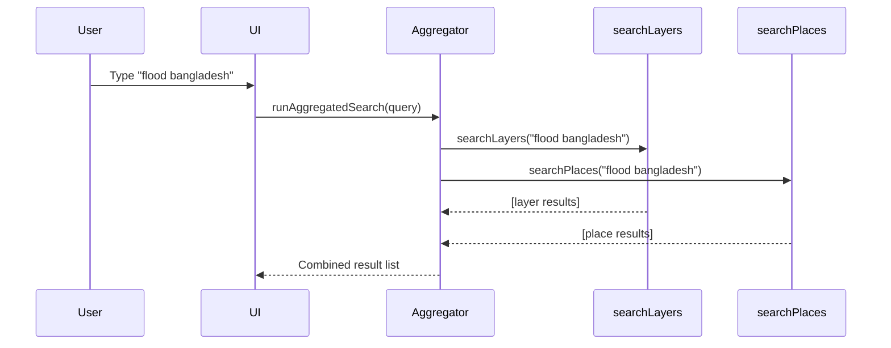

# Chapter 29: Aggregated Search

Welcome back, search explorer! 🧭  
In [Chapter 28: Search Feature](28_search_feature.md), we explored how you can look for something specific—like projects, events, or geographic areas—in the Disaster Ninja application.

But here's something even more powerful:

> What if you could search across multiple types of content—**all at once**?

✅ Projects  
✅ Administrative areas  
✅ Recent events  
✅ Boundaries  
✅ And more...

With results presented together in one organized list.  
Enter the power of **Aggregated Search**.

---

## 🎯 What Is Aggregated Search?

Aggregated Search is a system that allows users to enter a query (like a location name or project title), and receive a single list of results across multiple sources and types of data.

Instead of having to search for:
- Projects in one place
- Events in another
- Boundaries in a third

...Aggregated Search collects them all into one unified view. 🙌

---

## 🧠 Real-World Analogy

Imagine using Google Search.

When you type something like "Eiffel Tower", Google shows:
- Maps
- Images
- Local info
- News

Each of those used to be in a different Google product—but now, they’re **aggregated** into one results page.

That's exactly what Aggregated Search does in Disaster Ninja. 🧰🔍

---

## 🤔 Why Is It Important?

It shortens the user's journey.

With Aggregated Search:
- Users don’t need to guess which section to search in  
- They get a full picture of what matches their query  
- Related content is lined up side-by-side—making it easy to spot connections

This is especially useful in disaster response—when time is critical, and precision matters.

---

## 🔲 What Kinds of Results Are Aggregated?

Disaster Ninja unifies results from multiple data sources, such as:

| Source Type           | Description                                  |
|-----------------------|----------------------------------------------|
| HOT Projects          | Humanitarian OpenStreetMap projects 🗺️       |
| Administrative Areas  | Cities, towns, and other boundaries 🏙️       |
| Events                | Recent disaster-related events 📆           |
| Geometry Collections  | Saved user-drawn or uploaded shapes 🖊️      |
| Custom Layers         | User-defined layers like risk zones ✅        |

Each type has a corresponding "provider" behind the scenes, ready to feed data into the aggregated list.

---

## 🔍 Use Case: Searching for "Lima"

Let’s say a user types:

> lima

With Aggregated Search, the system might return:

✅ An administrative area called "Lima District"  
✅ An event tagged in the "Lima" region  
✅ A HOT project named "Lima Road Mapping"  

All these results will appear together, sorted by relevance, grouped and labeled by type. Super handy! 🧙

---

## 🧩 Key Concepts in Aggregated Search

| Concept                | Beginner-Friendly Meaning                         |
|------------------------|---------------------------------------------------|
| Query Input            | What the user types (e.g. "Japan tsunami")        |
| Search Providers       | Internal modules that handle specific data types  |
| Aggregated Results     | Merged list of results from all providers         |
| Search Result Groups   | Grouped display (projects, events, etc.)          |
| Selection Handlers     | Logic for what happens when a user clicks a result |

---

## ⚙️ How It Works Under the Hood (Simplified)

Here's what happens when the user types in the search box:



Result: All data types returned together. Nice and neat. 🎁

---

## 🛠️ Code Overview: How Aggregated Search Is Set Up

Aggregated Search is made up of several modular pieces:

1. A central search atom  
2. A list of providers (e.g. for projects, layers, events)  
3. Helper UI components to render results grouped by type  

---

### 1. Atom that Stores the Query and Results

📄 `/src/features/search/searchAggregated.atom.ts`

```ts
export const aggregatedSearchAtom = atom((recount) => {
  const query = recount(searchQueryAtom); // what user typed
  const sources = [projectsSearchProvider, eventsSearchProvider, ...];

  return runAllProviders(query, sources);
});
```

This atom triggers all providers to search at once, and returns a unified result list.

---

### 2. A Sample Search Provider

📄 `/src/features/search/providers/projectsSearchProvider.ts`

```ts
export const projectsSearchProvider: AggregatedSearchProvider = {
  name: 'projects',
  search: async (query: string) => {
    const results = await searchHOTProjects(query);

    return results.map((project) => ({
      id: project.id,
      label: project.name,
      type: 'project',
    }));
  }
};
```

Each provider knows:
- How to search its data source
- How to format its results

Other providers follow the same format.

---

### 3. UI: Rendering the Aggregated List

📄 `/src/components/SearchResultsPanel.tsx`

```tsx
function AggregatedSearchResults({ results }) {
  return (
    <div>
      {results.map(group => (
        <div key={group.type}>
          <h4>{group.type}</h4>
          <ul>
            {group.items.map((item) => (
              <li key={item.id}>{item.label}</li>
            ))}
          </ul>
        </div>
      ))}
    </div>
  );
}
```

🧾 The UI:
- Groups items by type  
- Labels them clearly  
- Allows clicking to focus/pan to results on the map

---

## 🧪 Extra: Handling User Clicks

When a user selects one result, the app needs to route to the correct area, zoom, or open a panel.

That logic is linked to each type:

```ts
projectClickHandler(projectId);
areaClickHandler(areaId);
eventZoomHandler(eventGeometry);
```

Each result knows how to behave when clicked — powered by shared click handler functions.

---

## 💡 Tip for Developers: Adding a New Result Type

Want to let users search “saved pins” or “custom alerts”?

You can add a new provider like this:

1. Create a new search provider file (e.g. `alertsSearchProvider.ts`)
2. Map your results to the standard object shape `{ id, label, type }`
3. Add it to the list in the `aggregatedSearchAtom`

Done ✔️ — Aggregated Search is fully extensible!

---

## ✅ Summary

Let’s recap what you’ve learned about Aggregated Search:

✅ It allows users to search across multiple data types  
✅ Collects results into one unified list  
✅ Providers are modular and independently handled  
✅ Easy to extend with new result types  
✅ A huge UX win — one search box to rule them all!

This feature helps Disaster Ninja users quickly navigate huge amounts of information, ensuring they find context fast — no matter what they're searching for.

---

Next up: Let’s plug this system into real-time sensor data and understand where those results come from!

➡️ Continue to [Chapter 30: Sensors Framework](30_sensors_framework.md) to see how we track dynamic, real-world input in your map.

You’re doing amazing — search on, knowledge ninja! 🥷🔍✨

…aaand we’re painting understanding with multicolored vibes! ✨🗺️

Let’s keep going and wrap up Chapter 25 with the final pieces of the legend system — how it renders, where it lives, and how it works under the hood.

---

## 🔧 How the Legend Rendering System Works

Let’s break this down technically, in beginner-friendly steps.

When a map style (like MCDA or bivariate coloring) is applied:

1. ✅ The app knows which style is active (e.g. flood + pop bivariate)
2. 🎯 The active layer contains a reference to the correct legend config
3. 🖼️ The Legend Renderer reads that config and draws one of:

   - A set of color swatches
   - A grid matrix (for bivariate)
   - A list of icons with labels (for symbol layers)
   - Or all combined into one unified pane

🧠 This means the legend is calculated dynamically — and always matches what’s on your map.

---

## 🧪 Example: Bivariate Legend Grid

Let’s say your map uses a 3x3 risk matrix (read more in Chapter 20). The legend would look like:

|          | Low Pop Risk | Medium Pop Risk | High Pop Risk |
|----------|---------------|------------------|----------------|
| Low Flood  | 🟦 Blue    | 🟩 Green   | 🟨 Yellow      |
| Medium Flood | 🟩       | 🟧          | 🟥 Red         |
| High Flood| 🟨         | 🟥         | ⬛ Dark Red     |

The same logic (bucket naming, labeling, coloring) comes straight from the color matrix used for styling the map. It’s auto-synced ⚙️

---

## 🧑‍💻 Code Walkthrough: Generating a Legend Component

Here’s how a simple univariate legend might look in React:

📁 `components/LegendBlock.tsx`

```tsx
type LegendEntry = {
  color: string;
  label: string;
};

export function LegendBlock({ title, entries }: {
  title: string;
  entries: LegendEntry[];
}) {
  return (
    <div className="legend-block">
      <h4>{title}</h4>
      <ul>
        {entries.map((entry, idx) => (
          <li key={idx}>
            <div className="legend-color" style={{ background: entry.color }} />
            <span>{entry.label}</span>
          </li>
        ))}
      </ul>
    </div>
  );
}
```

Then inside the main legend component:

📁 `components/LegendPanel.tsx`

```tsx
export function LegendPanel({ activeLegend }) {
  if (activeLegend.type === 'univariate') {
    return <LegendBlock title="Flood Risk" entries={activeLegend.entries} />;
  }

  if (activeLegend.type === 'bivariate') {
    return <BivariateLegendGrid matrix={activeLegend.colorMatrix} axes={activeLegend.axes} />;
  }

  return null;
}
```

🧠 This way:
- New types can be added in the future (things like histograms or pie chart legends!)
- Each style plugs into the render system without hardcoding

---

## 📦 Where It Lives in the Codebase

In Disaster Ninja, the legend system lives in:

📁 `/src/components/legend/`  
📁 `/src/map/styles/styleGenerators.ts` (where legend configs are attached)  
📁 `/src/layers/legendConfig.ts` (maps layers to legends)

It’s all part of the visual pipeline:  
Layer → Style → Map → Legend 💫

---

## 🎛️ Dynamic Legend Generation from Layers

Each layer (e.g. flood, population) can provide its own legend via metadata:

Example:

```ts
{
  name: "Flood Risk",
  style: "univariate",
  colorStops: [
    { value: 0.0, color: "#D4EEFF", label: "Low" },
    { value: 1.0, color: "#003366", label: "High" },
  ]
}
```

🔥 The legend is auto-generated from this 🚀

No special hand-coding for each layer! It just works!

---

## 🙌 UX Features Built Into Legends

✨ The Legends Panel in the UI includes:

- 📍 Collapsible panel or pop-up
- 🧭 Clear "What this map shows" explanations
- 🖱️ Hover interactions with map zones*
- ♿ Accessible text and color contrast

All this helps make maps beautiful but understandable — to everyone 👍

---

## ✅ Summary: What You Learned About Legends

Let’s recap:

✔️ Legends are the visual keys to understanding map data  
✔️ They match directly with the style rules used on the map  
✔️ Univariate, bivariate, and multivariate types are supported  
✔️ Each legend dynamically renders based on active layer(s)  
✔️ The system is modular — plug in any new style or data  
✔️ Backed by color configs, matrix renderers, icons, and labels

Disaster Ninja’s legend system turns maps into clear, human-decipherable visuals! 🔎🗺️

---

🎯 Up Next: Want to add your own map layers from other sources (like APIs or user uploads)?

Let’s dive into advanced layering in  
➡️ [Chapter 26: Custom Layer Source Integration](26_custom_layer_source_integration.md)

Onward to full map mastery — nice work, legend legend! 🧙‍♂️📚🎨

# Chapter 29: Aggregated Search

Welcome back, map whisperer! 🧭  
In [Chapter 28: Search Feature](28_search_feature.md), you learned how users can search for a place, dataset, or saved analysis using simple text.

But what happens when the app keeps getting bigger?

> 🧠 “I want to search for ‘flood’, and see not just layers — but also related documents, saved maps, MCDA results, coastline boundaries... all in one place.”

That’s when we unlock a superpower:  
🎯 **Aggregated Search** — a unified experience that combines multiple sources into one magical search bar.

---

## 💡 Central Use Case: “Find anything related to a topic — across the entire app”

Imagine you're preparing for a flood response in Bangladesh.

You need to:

- Zoom to Bangladesh 🌍  
- Load flood risk layers 🛑  
- Open a saved MCDA config 📊  
- Read a related briefing document 📜  

Instead of searching each feature separately, Aggregated Search lets you do this:

> Type "Bangladesh flood" → get all of the above from one single search bar.

One search. Many answers. Instant insights. ⚡

---

## 🧩 What Is Aggregated Search?

Aggregated Search is a smarter version of the basic search box — it pulls results from many sources and shows them in one place.

Think of it like an airport board ✈️ showing:

- ✈️ Flights
- 🧳 Baggage info
- 🚗 Transport options
- ⏰ Gates and delays

One glance → everything you need. 🎯

---

## 🧱 Key Concepts (Beginner-Friendly)

Let’s break things down:

| Concept | What It Means | Example |
|--------|----------------|---------|
| 🧑 Search Provider | A function that returns matches from one source | `searchLayers(query)` |
| 🧠 Aggregator | Combines results from multiple providers | Merges layers + places + documents |
| 📝 Unified Result Format | Every result follows the same structure | `{ label, type, onSelect }` |
| 🖥️ Search UI | Displays all results in groups | “Places”, “Layers”, “Saved Maps” |

Each result knows:
- What to display (label)
- What kind of item it is (type)
- What happens when the user clicks (onSelect)

---

## 🙋 How It Feels for Users

Let’s say the user types:

> “flood bangladesh”

The app searches across:
✅ Locations → “Bangladesh”  
✅ Layers → “Flood Risk Zones”, “Floodplain Boundaries”  
✅ MCDA configs → “Bangladesh Flood Strategy (March 2023)”  
✅ Documents → “UN Flood Response plan PDF”

Results are shown like:

```
Results for "flood bangladesh":

📍 Location
- Bangladesh (zoom to)

📦 Layers
- Flood Risk Zones (add)
- Global Floodplain Map (add)

📊 Saved Results
- Bangladesh Flood MCDA (open)

📄 Documents
- Flood Assessment PDF (open)
```

🧠 Users find everything from one search box — no need to look in separate places.

---

## 🧪 How to Use Aggregated Search (For Devs or Configurators)

You don’t need to write extra UI or duplicate logic.

👉 Just add new “search providers” that return results in a standard format.

Here’s what they look like:

```ts
export async function searchMCDA(query: string): Promise<SearchItem[]> {
  // pretend match logic inside
  return [
    {
      type: "mcda",
      label: "Bangladesh Flood MCDA",
      onSelect: () => loadMCDA("bangladesh-flood-2023"),
    },
  ];
}
```

Then add it to the master list:

```ts
const providers = [
  searchPlaces,
  searchLayers,
  searchMCDA,
  searchDocuments,
];
```

🎯 Aggregation is just combining all provider results.

---

## ⚙️ What Happens Under the Hood?

Let’s peek at the flow when a user enters a query:



🎉 All results go into grouped sections — unified on screen.

---

## 💼 Internal Structure Overview

📁 Key files in the codebase:

| File | Purpose |
|------|---------|
| `/search/searchProviders/` | Folder of individual provider functions |
| `/search/aggregatedSearch.ts` | Runs all providers concurrently and combines results |
| `/search/SearchPanel.tsx` | UI component to render inputs and grouped results |
| `/types/SearchItem.ts` | Defines the format for returned items |

All search results follow:

```ts
type SearchItem = {
  id?: string;
  type: 'location' | 'layer' | 'mcda' | 'document';
  label: string;
  onSelect: () => void;
};
```

Clean, simple, reactively driven from your inputs 🔄🔍✨

---

## 🧑‍💻 Beginner-Friendly Aggregator Code

Let’s look at the simplified aggregator logic:

```ts
export async function runAggregatedSearch(query: string): Promise<SearchItem[]> {
  const providers = [searchPlaces, searchLayers, searchMCDA];

  const allResults = await Promise.all(
    providers.map((provider) => provider(query))
  );

  return allResults.flat(); // flatten into single array
}
```

🧠 This is like asking many smart friends and combining their answers. 🧞

---

## 🏗️ Bonus: Grouping Results by Type

To make the UI user-friendly, we might sort/group by result type:

```ts
function groupItems(items: SearchItem[]): Record<string, SearchItem[]> {
  return items.reduce((groups, item) => {
    const group = item.type;
    groups[group] = groups[group] || [];
    groups[group].push(item);
    return groups;
  }, {} as Record<string, SearchItem[]>);
}
```

Then the UI can display:

```
📍 Locations
📦 Layers
📊 Results
📄 Documents
```

🌟 This helps the user orient themselves — no confusion about what they’re clicking.

---

## 🧩 Summary: Why Aggregated Search Matters

Let’s recap what you’ve now unlocked:

✔ Aggregated search pulls results from many sources  
✔ Every result has a type, label, and action  
✔ Sources are combined simply with parallel async calls  
✔ UI groups results meaningfully for users  
✔ Makes search more powerful and beginner-friendly 🌍✨

No more hunting across tabs or menus — just type a few words, and let the platform do the heavy lifting for you.

---

💡 Bonus: Want to make your aggregated search smarter? Add ranking, fuzzy matching, or per-type filters!

➡️ Up next: [Chapter 30: Result Ranking and Relevance Boosting](30_result_ranking_and_relevance_boosting.md)

You're truly becoming a search wizard now. 🧙‍♀️🔍🔥 Keep searching and discovering!