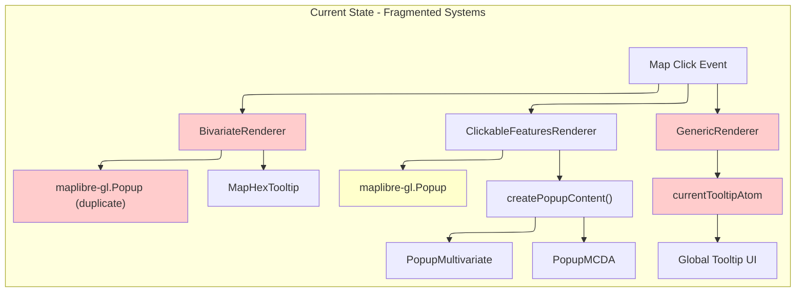
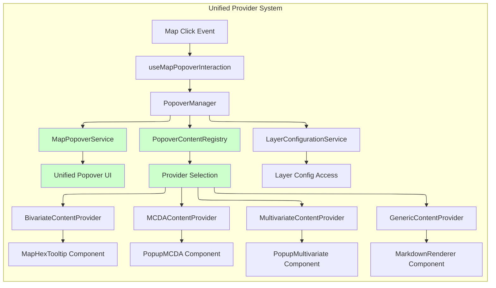
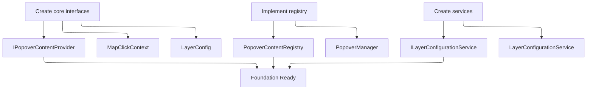

# ADR-001: MapPopover Migration Architecture - Registry-Based Content Providers

## Status

**Proposed**

## Problem Statement

Current map popover/tooltip implementations are fragmented across multiple systems with duplicated code and inconsistent behavior patterns.

### Current Implementation Analysis



**GenericRenderer Pattern:**

```typescript
// Current: Global state atom pattern
onMapClick(e: MapMouseEvent) {
  const features = this._map.queryRenderedFeatures(e.point, {
    layers: [this._layerId]
  });
  if (features.length && this._legend.tooltip) {
    const content = features[0].properties[this._legend.tooltip.paramName];
    currentTooltipActions.showTooltip({ content, position: e.point });
  }
}
```

**ClickableFeaturesRenderer Pattern:**

```typescript
// Current: Abstract base class with maplibre popup
abstract class ClickableFeaturesRenderer {
  private _popup: maplibregl.Popup;

  onMapClick(e: MapMouseEvent) {
    const features = this.getClickableFeatures(e.point);
    if (features.length) {
      const content = this.createPopupContent(features[0], this._style);
      this._popup.setLngLat(e.lngLat).setDOMContent(content).addTo(this._map);
    }
  }

  abstract createPopupContent(feature: Feature, style: Style): HTMLElement;
}
```

**BivariateRenderer Pattern:**

```typescript
// Current: Direct popup management (duplicates ClickableFeaturesRenderer logic)
class BivariateRenderer {
  private _popup: maplibregl.Popup;

  addBivariatePopup() {
    this._map.on('click', this._sourceId, (e) => {
      // Duplicate feature querying, popup lifecycle, DOM rendering...
      const feature = e.features[0];
      const content = this.createBivariateContent(feature);
      this._popup.setLngLat(e.lngLat).setDOMContent(content).addTo(this._map);
    });
  }
}
```

### Technical Debt Issues

1. **Code Duplication**: `BivariateRenderer` reimplements popup lifecycle management
2. **Inconsistent APIs**: `currentTooltipAtom` vs `maplibre-gl.Popup` patterns
3. **Tight Coupling**: Direct dependencies on global state and specific popup libraries
4. **Testing Barriers**: Mocking maplibre-gl.Popup and global atoms in unit tests
5. **Feature Conflicts**: No systematic approach to handle overlapping features

## Solution: Registry-Based Content Provider Architecture

### Target Architecture



**Registry Advantages:**

- **Extensibility**: Adding new layer types requires only registering new providers
- **Testability**: Each provider can be unit tested independently
- **Maintainability**: Changes to one layer type don't affect others
- **Code Organization**: Clear separation of concerns per layer type

### Core Interfaces

```typescript
interface MapClickContext {
  map: Map;
  lngLat: LngLat;
  point: Point;
  features?: MapGeoJSONFeature[];
  originalEvent: MapMouseEvent;
}

interface LayerConfig {
  id: string;
  type: 'MCDA' | 'MULTIVARIATE' | 'BIVARIATE' | 'GENERIC';
  priority: number;
  mcda?: MCDAConfig;
  multivariate?: MultivariateConfig;
  bivariate?: BivariateConfig;
  tooltip?: TooltipConfig;
}

interface IPopoverContentProvider {
  canHandle(context: MapClickContext, layerConfig: LayerConfig): boolean;
  renderContent(context: MapClickContext, layerConfig: LayerConfig): React.ReactNode;
  getPriority(context: MapClickContext, layerConfig: LayerConfig): number;
}

interface ILayerConfigurationService {
  getLayerConfig(layerId: string): LayerConfig | null;
  getConfigsForFeatures(features: MapGeoJSONFeature[]): Array<{
    feature: MapGeoJSONFeature;
    config: LayerConfig;
  }>;
}
```

### Registry Implementation

```typescript
class PopoverContentRegistry {
  private providers: Map<string, IPopoverContentProvider> = new Map();

  register(key: string, provider: IPopoverContentProvider): void {
    this.providers.set(key, provider);
  }

  unregister(key: string): void {
    this.providers.delete(key);
  }

  findProvider(
    context: MapClickContext,
    config: LayerConfig,
  ): IPopoverContentProvider | null {
    for (const provider of this.providers.values()) {
      if (provider.canHandle(context, config)) {
        return provider;
      }
    }
    return null;
  }

  renderContent(
    context: MapClickContext,
    configService: ILayerConfigurationService,
  ): React.ReactNode {
    if (!context.features?.length) return null;

    const candidates = configService
      .getConfigsForFeatures(context.features)
      .map(({ feature, config }) => ({
        feature,
        config,
        provider: this.findProvider(context, config),
        priority: this.findProvider(context, config)?.getPriority(context, config) ?? 0,
      }))
      .filter(({ provider }) => provider !== null)
      .sort((a, b) => b.priority - a.priority);

    if (candidates.length === 0) return null;

    const { config, provider } = candidates[0];
    return provider!.renderContent(context, config);
  }
}
```

### File Structure

```
src/core/map/popover/
├── types/
│   ├── MapClickContext.ts
│   ├── LayerConfig.ts
│   └── index.ts
├── providers/
│   ├── IPopoverContentProvider.ts
│   ├── MCDAContentProvider.ts
│   ├── MultivariateContentProvider.ts
│   ├── BivariateContentProvider.ts
│   ├── GenericContentProvider.ts
│   └── index.ts
├── registry/
│   ├── PopoverContentRegistry.ts
│   └── index.ts
├── services/
│   ├── ILayerConfigurationService.ts
│   ├── LayerConfigurationService.ts
│   └── index.ts
├── managers/
│   ├── PopoverManager.ts
│   └── index.ts
└── hooks/
    ├── usePopoverContentRegistry.ts
    └── index.ts
```

### Provider Implementations

```typescript
class MCDAContentProvider implements IPopoverContentProvider {
  canHandle(context: MapClickContext, layerConfig: LayerConfig): boolean {
    return layerConfig.type === 'MCDA' &&
           context.features?.length > 0 &&
           layerConfig.mcda !== undefined;
  }

  renderContent(context: MapClickContext, config: LayerConfig): React.ReactNode {
    if (!context.features?.length || !config.mcda) return null;

    return (
      <ErrorBoundary fallback={<div>MCDA content failed to load</div>}>
        <PopupMCDA
          feature={context.features[0]}
          config={config.mcda}
          map={context.map}
        />
      </ErrorBoundary>
    );
  }

  getPriority(context: MapClickContext, config: LayerConfig): number {
    return config.priority;
  }
}

class BivariateContentProvider implements IPopoverContentProvider {
  canHandle(context: MapClickContext, layerConfig: LayerConfig): boolean {
    return layerConfig.type === 'BIVARIATE' &&
           context.features?.length > 0 &&
           layerConfig.bivariate !== undefined;
  }

  renderContent(context: MapClickContext, config: LayerConfig): React.ReactNode {
    if (!context.features?.length || !config.bivariate) return null;

    const feature = context.features[0];
    const bivariateValues = this.calculateBivariateValues(feature, config.bivariate);

    return (
      <ErrorBoundary fallback={<div>Bivariate content failed to load</div>}>
        <MapHexTooltip
          feature={feature}
          values={bivariateValues}
          legend={config.bivariate.legend}
          map={context.map}
        />
      </ErrorBoundary>
    );
  }

  getPriority(context: MapClickContext, config: LayerConfig): number {
    return config.priority;
  }

  private calculateBivariateValues(feature: MapGeoJSONFeature, config: BivariateConfig) {
    // Extract bivariate calculation logic from BivariateRenderer
    const xValue = feature.properties?.[config.xAxis.paramName];
    const yValue = feature.properties?.[config.yAxis.paramName];
    return { x: xValue, y: yValue };
  }
}

class GenericContentProvider implements IPopoverContentProvider {
  canHandle(context: MapClickContext, layerConfig: LayerConfig): boolean {
    return layerConfig.type === 'GENERIC' &&
           context.features?.length > 0 &&
           layerConfig.tooltip !== undefined;
  }

  renderContent(context: MapClickContext, config: LayerConfig): React.ReactNode {
    if (!context.features?.length || !config.tooltip) return null;

    const feature = context.features[0];
    const content = feature.properties?.[config.tooltip.paramName];

    if (!content) return null;

    return (
      <ErrorBoundary fallback={<div>Tooltip content failed to load</div>}>
        {config.tooltip.type === 'markdown' ? (
          <MarkdownRenderer content={content} />
        ) : (
          <div>{content}</div>
        )}
      </ErrorBoundary>
    );
  }

  getPriority(context: MapClickContext, config: LayerConfig): number {
    return config.priority;
  }
}
```

### PopoverManager Implementation

```typescript
class PopoverManager {
  constructor(
    private registry: PopoverContentRegistry,
    private configService: ILayerConfigurationService,
  ) {}

  renderContent = (context: MapClickContext): React.ReactNode => {
    try {
      return this.registry.renderContent(context, this.configService);
    } catch (error) {
      console.error('PopoverManager: Failed to render content', error);
      return <div>Failed to load popover content</div>;
    }
  };
}
```

### LayerConfigurationService Implementation

```typescript
class LayerConfigurationService implements ILayerConfigurationService {
  constructor(private layerStore: LayerStore) {}

  getLayerConfig(layerId: string): LayerConfig | null {
    const layer = this.layerStore.getById(layerId);
    if (!layer) return null;

    return {
      id: layerId,
      type: this.determineLayerType(layer),
      priority: layer.priority ?? 0,
      mcda: layer.mcda,
      multivariate: layer.multivariate,
      bivariate: layer.bivariate,
      tooltip: layer.legend?.tooltip,
    };
  }

  getConfigsForFeatures(features: MapGeoJSONFeature[]): Array<{
    feature: MapGeoJSONFeature;
    config: LayerConfig;
  }> {
    return features
      .map((feature) => ({
        feature,
        config: this.getLayerConfig(feature.layer.id),
      }))
      .filter(({ config }) => config !== null) as Array<{
      feature: MapGeoJSONFeature;
      config: LayerConfig;
    }>;
  }

  private determineLayerType(layer: any): LayerConfig['type'] {
    if (layer.mcda) return 'MCDA';
    if (layer.multivariate) return 'MULTIVARIATE';
    if (layer.bivariate) return 'BIVARIATE';
    if (layer.legend?.tooltip) return 'GENERIC';
    return 'GENERIC';
  }
}
```

### Integration Pattern

```typescript
// In main map component
function MapComponent() {
  const map = useMapInstance();
  const layerStore = useLayerStore();
  const popoverService = useMapPopoverService();

  // Create services
  const configService = useMemo(
    () => new LayerConfigurationService(layerStore),
    [layerStore],
  );

  // Create registry
  const registry = useMemo(() => {
    const reg = new PopoverContentRegistry();
    reg.register('mcda', new MCDAContentProvider());
    reg.register('multivariate', new MultivariateContentProvider());
    reg.register('bivariate', new BivariateContentProvider());
    reg.register('generic', new GenericContentProvider());
    return reg;
  }, []);

  // Create manager
  const popoverManager = useMemo(
    () => new PopoverManager(registry, configService),
    [registry, configService],
  );

  // Hook integration
  useMapPopoverInteraction({
    map,
    popoverService,
    renderContent: popoverManager.renderContent,
    onError: (errorInfo) => (
      <div>
        Error rendering popover: {errorInfo.error.message}
      </div>
    ),
  });

  return <div ref={mapContainerRef} />;
}
```

## Migration Implementation Plan

### Phase 1: Foundation Setup



**Implementation:**

- Core interfaces and types
- Registry and manager classes
- Layer configuration service

### Phase 2: GenericContentProvider Migration

```typescript
// Migration target: GenericRenderer.ts tooltip logic
// Before: currentTooltipAtom pattern
// After: GenericContentProvider in registry

class GenericContentProvider implements IPopoverContentProvider {
  canHandle(context: MapClickContext, layerConfig: LayerConfig): boolean {
    return (
      layerConfig.type === 'GENERIC' &&
      context.features?.length > 0 &&
      layerConfig.tooltip?.paramName !== undefined
    );
  }
  // ... implementation
}
```

**Implementation:**

- Extract tooltip logic from GenericRenderer
- Replace `currentTooltipAtom` with provider pattern

### Phase 3: MCDA/Multivariate Migration

```typescript
// Migration target: ClickableFeaturesRenderer derivatives
// Before: abstract createPopupContent() pattern
// After: Provider-specific renderContent()

// Remove from MCDARenderer:
// - popup management
// - createPopupContent() implementation
// - click handling logic

// Keep in MCDARenderer:
// - layer mounting
// - feature state management
// - zoom level constraints
```

**Implementation:**

- Extract popup content from ClickableFeaturesRenderer derivatives
- Remove popup lifecycle management from renderers
- Preserve feature highlighting and layer mounting logic

### Phase 4: BivariateRenderer Migration

```typescript
// Migration target: BivariateRenderer direct popup management
// Before: Duplicate popup lifecycle in BivariateRenderer
// After: BivariateContentProvider in registry

// Remove from BivariateRenderer:
// - _popup instance management
// - addBivariatePopup() method
// - direct MapHexTooltip rendering
// - popup cleanup logic

// Keep in BivariateRenderer:
// - layer mounting
// - bivariate calculation utilities (extract to provider)
```

**Implementation:**

- Extract calculation logic from BivariateRenderer
- Remove duplicate popup management code

### Phase 5: Legacy Cleanup

**Implementation:**

- Remove `currentTooltipAtom` system
- Remove abstract popup methods from renderer base classes

## Technical Specifications

### Error Handling Strategy

```typescript
// Provider-level error boundaries
class MCDAContentProvider implements IPopoverContentProvider {
  renderContent(context: MapClickContext, config: LayerConfig): React.ReactNode {
    return (
      <ErrorBoundary fallback={<div>MCDA content unavailable</div>}>
        <PopupMCDA {...props} />
      </ErrorBoundary>
    );
  }
}

// Registry-level error handling
class PopoverContentRegistry {
  renderContent(context: MapClickContext, configService: ILayerConfigurationService): React.ReactNode {
    try {
      // ... provider selection logic
    } catch (error) {
      console.error('Registry error:', error);
      return <div>Unable to load popover content</div>;
    }
  }
}
```

### Performance Optimizations

```typescript
// Registry lookup caching
class PopoverContentRegistry {
  private providerCache = new Map<string, IPopoverContentProvider>();

  findProvider(
    context: MapClickContext,
    config: LayerConfig,
  ): IPopoverContentProvider | null {
    const cacheKey = `${config.type}-${config.id}`;

    if (this.providerCache.has(cacheKey)) {
      return this.providerCache.get(cacheKey)!;
    }

    for (const provider of this.providers.values()) {
      if (provider.canHandle(context, config)) {
        this.providerCache.set(cacheKey, provider);
        return provider;
      }
    }

    return null;
  }
}
```
