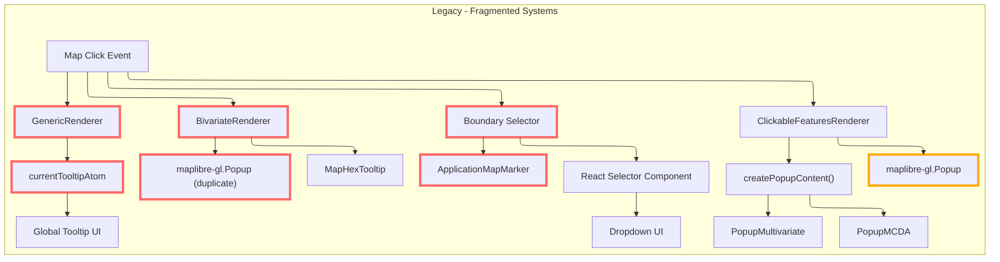
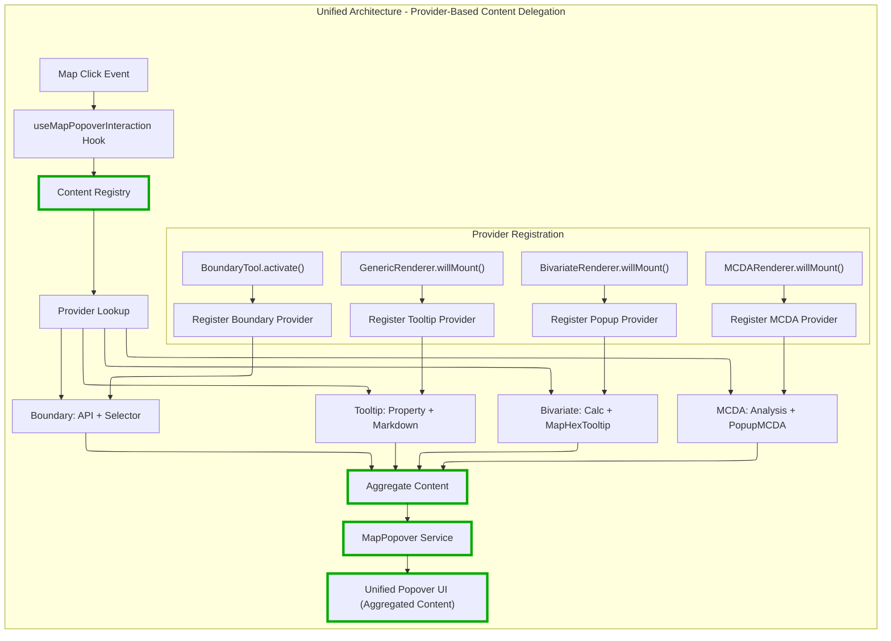

# ADR-001: MapPopover Migration Architecture - Autonomous Content Providers

## Status

**Proposed** _(Rewritten with corrected architectural principles)_

## Executive Summary

This ADR proposes migrating **four fragmented map interaction systems** to a **clean, autonomous provider architecture** where:

1. **MapPopover** = Pure presentation layer (positioning + rendering)
2. **Content Providers** = Autonomous domain logic (feature detection, API calls, state management)
3. **Registry** = Simple provider coordination (no complex config matching)
4. **Migration** = Incremental, low-risk, provider-by-provider approach

**Key Principle**: MapPopover doesn't care about domain logic - it just renders whatever content providers give it.

## Problem Statement

Current map popover/tooltip implementations are fragmented across **four distinct systems** with duplicated code and inconsistent behavior patterns.

### Current Implementation Analysis



### Technical Debt Issues

1. **Four Different Presentation Systems**: Global atom, MapLibre popups, markers - no consistency
2. **Duplicated Interaction Logic**: Each system reimplements click handling, positioning, lifecycle
3. **Mixed Responsibilities**: Renderers handle both layer logic AND popup presentation
4. **Tight Coupling**: Components depend on specific popup implementations
5. **Testing Complexity**: Must mock different popup systems for different features
6. **Inconsistent UX**: Different interaction patterns for similar use cases

## Solution: Provider-Based Content Delegation Model

### Core Principle: Providers Contribute to Aggregated Content



**Key Benefits:**

- **Single Presentation System**: Only `MapPopover` handles positioning and rendering.
- **Domain Logic Stays in Domain**: Providers manage their own interaction logic, contributing to a unified output.
- **Aggregated Content Display**: All providers that return content contribute to the popover, ensuring comprehensive feedback.
- **Flexible Registration**: Providers can be registered from any component, not strictly tied to renderer lifecycle.
- **Simplified Coordination**: Registry collects and aggregates content without complex prioritization logic.

### Core Interfaces

```typescript
// MapPopover: Pure presentation - doesn't care about content source
interface MapPopoverService {
  show(point: ScreenPoint, content: React.ReactNode, options?: MapPopoverOptions): void;
  move(point: ScreenPoint): void;
  close(): void;
}

interface MapPopoverOptions {
  placement?: Placement;
  closeOnMove?: boolean;
  className?: string;
}

// Content Provider: Autonomous domain logic with close capability
interface IMapPopoverContentProvider {
  /**
   * Renders content for the map popover based on the click event.
   * @param mapEvent - The original MapLibre mouse event
   * @param onClose - Callback to close the popover (for interactive content)
   * @returns React content to display, or null if this provider doesn't handle this event
   */
  renderContent(mapEvent: MapMouseEvent, onClose: () => void): React.ReactNode | null;
}

// Registry: Simple provider coordination with ID-based registration
interface IMapPopoverContentRegistry {
  register(id: string, provider: IMapPopoverContentProvider): void;
  unregister(id: string): void;
  renderContent(mapEvent: MapMouseEvent, onClose: () => void): React.ReactNode | null;
}
```

### Registry Implementation - Aggregated Content Approach

```typescript
class MapPopoverContentRegistry implements IMapPopoverContentRegistry {
  private providers = new Map<string, IMapPopoverContentProvider>();

  register(id: string, provider: IMapPopoverContentProvider): void {
    if (this.providers.has(id)) {
      console.warn(`MapPopover provider "${id}" already registered, replacing`);
    }
    this.providers.set(id, provider);
  }

  unregister(id: string): void {
    this.providers.delete(id);
  }

  renderContent(mapEvent: MapMouseEvent, onClose: () => void): React.ReactNode | null {
    const contentElements: React.ReactNode[] = [];

    for (const [id, provider] of this.providers) {
      try {
        const providerContent = provider.renderContent(mapEvent, onClose);
        if (providerContent) {
          // Use stable provider ID as React key
          contentElements.push(React.createElement('div', { key: id }, providerContent));
        }
      } catch (error) {
        console.error(`Error in MapPopover provider "${id}":`, error);
        // Continue to next provider on error
      }
    }

    // Return null if no content (not empty array)
    if (contentElements.length === 0) {
      return null;
    }

    // Return aggregated content as React fragment
    return React.createElement(React.Fragment, {}, ...contentElements);
  }
}
```

### Memory Safety and Cleanup

**Critical Requirement**: All providers must be properly unregistered to prevent memory leaks.

#### C.1> Provider Lifecycle Management

```typescript
// ✅ Correct pattern - Renderers cleanup on unmount
class BivariateRenderer {
  willUnMount({ map }: { map: ApplicationMap }) {
    // Clean up popover providers
    if (this._bivariateProvider) {
      mapPopoverRegistry.unregister(`bivariate-${this._sourceId}`);
      this._bivariateProvider = null; // Clear reference
    }
    if (this._mcdaProvider) {
      mapPopoverRegistry.unregister(`mcda-${this._sourceId}`);
      this._mcdaProvider = null;
    }
  }
}
```

#### C.2> Close Callback Safety

The `onClose` callback passed to providers is designed to prevent memory leaks:

```typescript
// Safe implementation - no closure retention
renderContent(mapEvent: MapMouseEvent, onClose: () => void): React.ReactNode | null {
  // onClose is a stable function reference that doesn't capture provider state
  // Providers can safely use it without creating memory leaks
  return (
    <div>
      <button onClick={onClose}>Close Popover</button>
      <SomeContent />
    </div>
  );
}
```

#### C.3> Registry Cleanup Methods

```typescript
interface IMapPopoverContentRegistry {
  // Individual cleanup
  unregister(id: string): void;

  // Bulk cleanup for testing/reset scenarios
  clear(): void;

  // Diagnostic method
  get providerCount(): number;
}
```

**Memory Leak Prevention Checklist:**

- ✅ Providers automatically removed on renderer unmount
- ✅ Registry uses `Map.delete()` for clean removal
- ✅ Close callback doesn't capture provider references
- ✅ Error boundaries prevent one provider from affecting others
- ✅ Clear references set to `null` after unregistration

### Integration Hook - Clean and Simple

```typescript
function useMapPopoverInteraction({
  map,
  popoverService,
  registry,
}: {
  map: Map | null;
  popoverService: MapPopoverService;
  registry: IMapPopoverContentRegistry;
}) {
  useEffect(() => {
    if (!map) return;

    const handleMapClick = (event: MapMouseEvent) => {
      const result = registry.renderContent(event, () => popoverService.close());

      if (result) {
        popoverService.show(event.point, result.contents, result.options);
      } else {
        popoverService.close();
      }
    };

    map.on('click', handleMapClick);
    return () => map.off('click', handleMapClick);
  }, [map, popoverService, registry]);
}
```

## Renderer-Based Provider Implementation

### GenericRenderer Tooltip Provider Integration

```typescript
export class GenericRenderer extends LogicalLayerDefaultRenderer {
  private _tooltipProvider: IMapPopoverContentProvider | null = null;

  async willMount({ map, state }: { map: ApplicationMap; state: LogicalLayerState }) {
    // Handle layer mounting as before
    if (state.source) {
      await this._updateMap(map, state.source, state.legend, state.isVisible, state.style);
    }

    // Register tooltip provider if legend has tooltip configuration
    if (state.legend && 'tooltip' in state.legend && state.legend.tooltip) {
      this._tooltipProvider = this.createTooltipProvider(state.legend.tooltip);
      mapPopoverRegistry.register(`tooltip-${this._sourceId}`, this._tooltipProvider);
    }
  }

  willUnMount({ map }: { map: ApplicationMap }) {
    // Cleanup layers as before
    this._removeLayers(map);
    // ... existing cleanup

    // Unregister tooltip provider
    if (this._tooltipProvider) {
      mapPopoverRegistry.unregister(`tooltip-${this._sourceId}`);
      this._tooltipProvider = null;
    }
  }

  private createTooltipProvider(tooltipConfig: TooltipConfig): IMapPopoverContentProvider {
    const sourceId = this._sourceId;
    const { paramName, type } = tooltipConfig;

    return {
      renderContent: (mapEvent: MapMouseEvent, onClose: () => void) => {
        const features = mapEvent.target
          .queryRenderedFeatures(mapEvent.point)
          .filter(f => f.source.includes(sourceId));

        const feature = features.find(f => f.properties?.[paramName]);
        if (!feature?.properties?.[paramName]) return null;

        const content = feature.properties[paramName];
        return type === 'markdown' ? (
          <MarkdownRenderer content={content} />
        ) : (
          <div>{content}</div>
        );
      },

      getPopoverOptions: () => ({
        placement: 'top',
        closeOnMove: false,
        className: 'generic-tooltip',
      }),
    };
  }
}
```

### BivariateRenderer Popup Provider Integration

```typescript
export class BivariateRenderer extends LogicalLayerDefaultRenderer {
  private _popupProvider: IMapPopoverContentProvider | null = null;

  async willMount({ map, state }: { map: ApplicationMap; state: LogicalLayerState }) {
    // Handle bivariate layer mounting
    await this.setupBivariateVisualization(map, state);

    // Register popup provider for bivariate interactions
    this._popupProvider = this.createBivariateProvider();
    mapPopoverRegistry.register(`bivariate-${this._sourceId}`, this._popupProvider);
  }

  willUnMount({ map }: { map: ApplicationMap }) {
    // Cleanup bivariate layers
    this.cleanupBivariateVisualization(map);

    // Unregister popup provider
    if (this._popupProvider) {
      mapPopoverRegistry.unregister(`bivariate-${this._sourceId}`);
      this._popupProvider = null;
    }
  }

  private createBivariateProvider(): IMapPopoverContentProvider {
    const sourceId = this._sourceId;

    return {
      renderContent: (mapEvent: MapMouseEvent, onClose: () => void) => {
        const features = mapEvent.target
          .queryRenderedFeatures(mapEvent.point)
          .filter(f => f.source.includes(sourceId));

        const bivariateFeature = features.find(f => f.layer.metadata?.type === 'bivariate');
        if (!bivariateFeature) return null;

        const bivariateValues = this.calculateBivariateValues(bivariateFeature);
        return (
          <MapHexTooltip
            feature={bivariateFeature}
            values={bivariateValues}
            axis={this.getBivariateAxis()}
          />
        );
      },

      getPopoverOptions: () => ({
        placement: 'top',
        closeOnMove: true,
        className: 'bivariate-popup',
      }),
    };
  }
}
```

### Generic Tooltip Provider Example

```typescript
class GenericTooltipProvider implements IMapPopoverContentProvider {
  renderContent(mapEvent: MapMouseEvent, onClose: () => void): React.ReactNode | null {
    const features = mapEvent.target.queryRenderedFeatures(mapEvent.point);
    const tooltipFeature = this.findTooltipFeature(features);

    if (!tooltipFeature) return null;

    const tooltipConfig = this.extractTooltipConfig(tooltipFeature);
    const content = tooltipFeature.properties?.[tooltipConfig.paramName];

    if (!content) return null;

    return tooltipConfig.type === 'markdown' ? (
      <MarkdownRenderer content={content} />
    ) : (
      <div>{content}</div>
    );
  }

  private findTooltipFeature(features: MapGeoJSONFeature[]): MapGeoJSONFeature | null {
    return features.find(f => f.layer.metadata?.tooltip) || null;
  }

  private extractTooltipConfig(feature: MapGeoJSONFeature): TooltipConfig {
    return feature.layer.metadata.tooltip;
  }
}
```

## Migration Strategy - Incremental and Low-Risk

### Architectural Approach

The migration strategy leverages existing MapPopover infrastructure and applies the renderer-managed provider pattern incrementally. Each renderer can be migrated independently without affecting others, ensuring zero-risk deployment.

### Core Migration Principles

1. **Preserve Domain Boundaries**: Interaction logic stays within renderer classes
2. **Automatic Lifecycle Management**: Providers register/unregister with renderer mount/unmount
3. **Incremental Adoption**: Each renderer migrates independently
4. **Zero Breaking Changes**: Existing popup systems continue working during migration
5. **Easy Rollback**: Simply disable provider registration to revert

### Phase 1: Content Provider Infrastructure

**Goal**: Build provider registry infrastructure and update map interaction hook

```typescript
// 1. Define provider interface
interface IMapPopoverContentProvider {
  renderContent(mapEvent: MapMouseEvent, onClose: () => void): React.ReactNode | null;
}

// 2. Create registry to coordinate providers
class MapPopoverContentRegistry implements IMapPopoverContentRegistry {
  // Simple registration and first-match-wins content rendering
}

// 3. Enhanced map interaction hook
useMapPopoverInteraction({
  map,
  popoverService,
  registry, // Registry support alongside existing renderContent
});
```

### Phase 2: GenericRenderer Provider Integration

**Goal**: Replace `currentTooltipAtom` with renderer-managed provider

```typescript
export class GenericRenderer extends LogicalLayerDefaultRenderer {
  private _tooltipProvider: IMapPopoverContentProvider | null = null;

  async willMount({ map, state }) {
    // Existing layer mounting logic
    await this._updateMap(map, state.source, state.legend, state.isVisible, state.style);

    // NEW: Register tooltip provider if legend has tooltip configuration
    if (state.legend?.tooltip) {
      this._tooltipProvider = this.createTooltipProvider(state.legend.tooltip);
      mapPopoverRegistry.register(this._tooltipProvider);
    }
  }

  willUnMount({ map }) {
    // Existing cleanup
    this._removeLayers(map);

    // NEW: Unregister provider
    if (this._tooltipProvider) {
      mapPopoverRegistry.unregister(this._tooltipProvider);
      this._tooltipProvider = null;
    }
  }
}
```

**Key Architectural Benefits:**

- **Domain logic stays in renderer** - no artificial separation of concerns
- **Automatic lifecycle management** - providers tied to renderer lifecycle
- **Access to renderer context** - source IDs, legends, and renderer state available

### Phase 3: ClickableFeaturesRenderer Integration

**Goal**: Migrate MCDA and Multivariate popup logic to renderer-managed providers

```typescript
export class ClickableFeaturesRenderer extends LogicalLayerDefaultRenderer {
  private _mcdaProvider: IMapPopoverContentProvider | null = null;
  private _multivariateProvider: IMapPopoverContentProvider | null = null;

  async willMount({ map, state }) {
    // Existing feature layer setup
    await this.setupClickableFeatures(map, state);

    // Register popup providers based on layer type
    if (state.metadata?.type === 'mcda') {
      this._mcdaProvider = this.createMCDAProvider(state.config);
      mapPopoverRegistry.register(this._mcdaProvider);
    }

    if (state.metadata?.type === 'multivariate') {
      this._multivariateProvider = this.createMultivariateProvider(state.config);
      mapPopoverRegistry.register(this._multivariateProvider);
    }
  }

  private createMCDAProvider(config: MCDAConfig) {
    return {
      renderContent: (mapEvent, onClose) => {
        const mcdaFeature = this.findMCDAFeature(mapEvent);
        return mcdaFeature ? <PopupMCDA feature={mcdaFeature} config={config} /> : null;
      },
      getPopoverOptions: () => ({
        placement: 'top',
        closeOnMove: true,
        className: 'mcda-popup',
      }),
    };
  }
}
```

### Phase 4: BivariateRenderer Integration

**Goal**: Apply renderer-managed provider pattern to bivariate popups

```typescript
export class BivariateRenderer extends LogicalLayerDefaultRenderer {
  private _bivariateProvider: IMapPopoverContentProvider | null = null;

  async willMount({ map, state }) {
    await this.setupBivariateVisualization(map, state);

    // Register bivariate popup provider
    this._bivariateProvider = this.createBivariateProvider();
    mapPopoverRegistry.register(this._bivariateProvider);
  }

  private createBivariateProvider() {
    return {
      renderContent: (mapEvent, onClose) => {
        const feature = this.findBivariateFeature(mapEvent);
        if (!feature) return null;

        const values = this.calculateBivariateValues(feature);
        return <MapHexTooltip feature={feature} values={values} />;
      },
      getPopoverOptions: () => ({
        placement: 'top',
        closeOnMove: true,
        className: 'bivariate-popup',
      }),
    };
  }
}
```

### Phase 5: Boundary Selector Integration

**Goal**: Replace marker-based dropdown with popover-based approach

```typescript
class BoundaryToolProvider implements IMapPopoverContentProvider {
  private isToolActive = false;

  renderContent(mapEvent: MapMouseEvent, onClose: () => void): React.ReactNode | null {
    if (!this.isToolActive) return null;

    return (
      <BoundarySelector
        coordinates={mapEvent.lngLat}
        onSelect={(boundary) => {
          focusedGeometryService.setFocusedGeometry(boundary);
          mapPositionService.fitToBounds(boundary.bounds);
          this.deactivate();
        }}
      />
    );
  }

  getPopoverOptions(): MapPopoverOptions {
    return {
      placement: 'bottom-start',
      closeOnMove: false, // Keep open during selection
    };
  }
}

// Integrate with toolbar control lifecycle
boundarySelectorControl.onStateChange((state) => {
  if (state === 'active') {
    boundaryProvider.activate();
  } else {
    boundaryProvider.deactivate();
  }
});
```

**Architectural Pattern:**

- **Tool-managed providers** - providers activated/deactivated with tool state
- **Consistent interaction model** - same popover system as layer interactions
- **Preserved existing logic** - boundary selection and geometry handling unchanged
- **Leverages** proven MapPopover positioning system

### Phase 6: Legacy System Cleanup

**Goal**: Remove deprecated systems after successful migration

- Remove `currentTooltipAtom` and related tooltip infrastructure
- Remove direct popup management from renderers
- Remove marker-based dropdown utilities
- Clean up legacy interaction handlers and atoms

## Technical Integration Pattern

### Registry-Based Map Component

```typescript
function MapComponent() {
  const map = useMapInstance();
  const popoverService = useMapPopoverService();
  const registry = useMemo(() => new MapPopoverContentRegistry(), []);

  useMapPopoverInteraction({
    map,
    popoverService,
    registry, // Registry coordinates all renderer-managed providers
  });

  return <div ref={mapRef} />;
}
```

### Renderer Integration Pattern

```typescript
export class ExampleRenderer extends LogicalLayerDefaultRenderer {
  private _interactionProvider: IMapPopoverContentProvider | null = null;

  async willMount({ map, state }) {
    // Standard layer mounting
    await this.setupLayer(map, state);

    // Register interaction provider
    this._interactionProvider = this.createInteractionProvider(state);
    mapPopoverRegistry.register(this._interactionProvider);
  }

  willUnMount({ map }) {
    // Standard cleanup
    this.cleanupLayer(map);

    // Unregister provider
    if (this._interactionProvider) {
      mapPopoverRegistry.unregister(this._interactionProvider);
      this._interactionProvider = null;
    }
  }
}
```

## Conclusion

This architecture achieves **true separation of concerns** with **domain-appropriate ownership**:

- **MapPopover**: Pure presentation layer (positioning + rendering)
- **Registry**: Simple provider coordination (aggregates content from all providers)
- **Providers**: Contribute domain-specific content to a unified popover
- **Migration**: Incremental provider-by-provider approach

**Key Architectural Benefits:**

1. **Domain Logic Stays in Domain**: Tooltip logic remains in `GenericRenderer`, popup logic in `BivariateRenderer`, etc., with contributions aggregated.
2. **Comprehensive User Feedback**: All relevant providers add content to the popover, avoiding information loss.
3. **Flexible Provider Management**: Providers can be registered from any component, supporting varied use cases.
4. **Access to Context**: Providers can access relevant state and configurations as needed.
5. **Incremental Migration**: Each provider can be integrated independently with zero risk.

The result is a maintainable, extensible system that **preserves domain boundaries** while **unifying presentation** through the `MapPopover` infrastructure, displaying aggregated content from all contributing providers.
