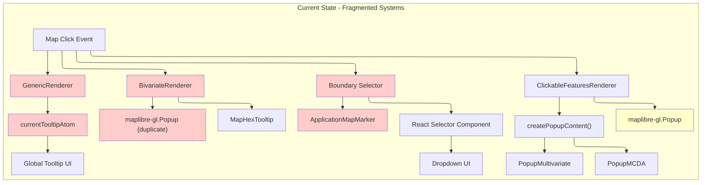
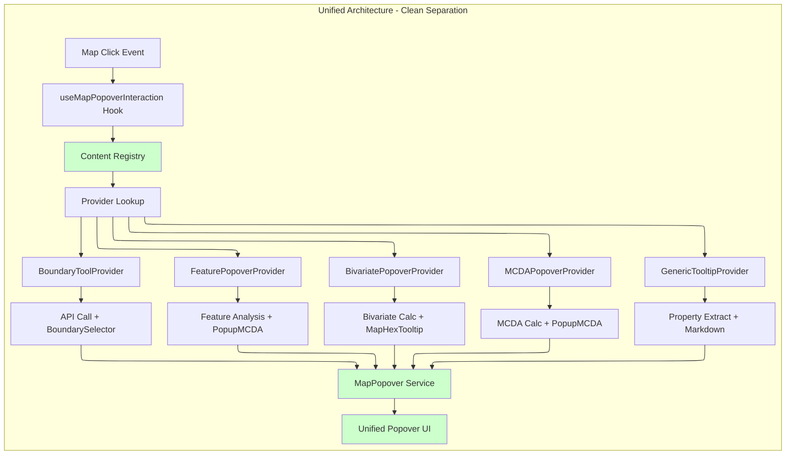

# ADR-001: MapPopover Migration Architecture - Autonomous Content Providers

## Status

**Proposed** _(Rewritten with corrected architectural principles)_

## Executive Summary

This ADR proposes migrating **four fragmented map interaction systems** to a **clean, autonomous provider architecture** where:

1. **MapPopover** = Pure presentation layer (positioning + rendering)
2. **Content Providers** = Autonomous domain logic (feature detection, API calls, state management)
3. **Registry** = Simple provider coordination (no complex config matching)
4. **Migration** = Incremental, low-risk, provider-by-provider approach

**Key Principle**: MapPopover doesn't care about domain logic - it just renders whatever content providers give it.

## Problem Statement

Current map popover/tooltip implementations are fragmented across **four distinct systems** with duplicated code and inconsistent behavior patterns.

### Current Implementation Analysis



### Technical Debt Issues

1. **Four Different Presentation Systems**: Global atom, MapLibre popups, markers - no consistency
2. **Duplicated Interaction Logic**: Each system reimplements click handling, positioning, lifecycle
3. **Mixed Responsibilities**: Renderers handle both layer logic AND popup presentation
4. **Tight Coupling**: Components depend on specific popup implementations
5. **Testing Complexity**: Must mock different popup systems for different features
6. **Inconsistent UX**: Different interaction patterns for similar use cases

## Solution: Autonomous Provider Architecture

### Core Principle: Clean Separation of Concerns



**Key Benefits:**

- **Single Presentation System**: Only MapPopover handles positioning and rendering
- **Autonomous Providers**: Each handles its own domain logic completely
- **Zero Core Changes**: Adding new providers requires no core interface modifications
- **Simple Testing**: Mock map events, test providers independently

### Core Interfaces

```typescript
// MapPopover: Pure presentation - doesn't care about content source
interface MapPopoverService {
  show(point: ScreenPoint, content: React.ReactNode, options?: MapPopoverOptions): void;
  move(point: ScreenPoint): void;
  close(): void;
}

interface MapPopoverOptions {
  placement?: Placement;
  closeOnMove?: boolean;
  className?: string;
}

// Content Provider: Autonomous domain logic
interface IMapPopoverContentProvider {
  // Provider gets raw map event, returns content or null
  renderContent(mapEvent: MapMouseEvent): React.ReactNode | null;

  // Optional: Provider can specify display options
  getPopoverOptions?(mapEvent: MapMouseEvent): MapPopoverOptions;
}

// Registry: Simple provider coordination
interface IMapPopoverContentRegistry {
  register(provider: IMapPopoverContentProvider): void;
  unregister(provider: IMapPopoverContentProvider): void;
  renderContent(mapEvent: MapMouseEvent): {
    content: React.ReactNode;
    options?: MapPopoverOptions;
  } | null;
}
```

### Registry Implementation - Simple and Clean

```typescript
class MapPopoverContentRegistry implements IMapPopoverContentRegistry {
  private providers: IMapPopoverContentProvider[] = [];

  register(provider: IMapPopoverContentProvider): void {
    this.providers.push(provider);
  }

  unregister(provider: IMapPopoverContentProvider): void {
    const index = this.providers.indexOf(provider);
    if (index > -1) {
      this.providers.splice(index, 1);
    }
  }

  renderContent(mapEvent: MapMouseEvent): {
    content: React.ReactNode;
    options?: MapPopoverOptions;
  } | null {
    // Simple iteration - first provider that returns content wins
    for (const provider of this.providers) {
      const content = provider.renderContent(mapEvent);
      if (content) {
        return {
          content,
          options: provider.getPopoverOptions?.(mapEvent),
        };
      }
    }
    return null;
  }
}
```

### Integration Hook - Clean and Simple

```typescript
function useMapPopoverInteraction({
  map,
  popoverService,
  registry,
}: {
  map: Map | null;
  popoverService: MapPopoverService;
  registry: IMapPopoverContentRegistry;
}) {
  useEffect(() => {
    if (!map) return;

    const handleMapClick = (event: MapMouseEvent) => {
      const result = registry.renderContent(event);

      if (result) {
        popoverService.show(event.point, result.content, result.options);
      } else {
        popoverService.close();
      }
    };

    map.on('click', handleMapClick);
    return () => map.off('click', handleMapClick);
  }, [map, popoverService, registry]);
}
```

## Provider Implementations - Autonomous and Self-Contained

### MCDA Provider Example

```typescript
class MCDAPopoverProvider implements IMapPopoverContentProvider {
  renderContent(mapEvent: MapMouseEvent): React.ReactNode | null {
    // Provider handles ALL its domain logic
    const features = mapEvent.target.queryRenderedFeatures(mapEvent.point);
    const mcdaFeature = this.findMCDAFeature(features);

    if (!mcdaFeature) return null;

    // Provider extracts its own config from feature/layer
    const mcdaConfig = this.extractMCDAConfig(mcdaFeature);
    if (!mcdaConfig) return null;

    // Provider handles error boundaries
    return (
      <ErrorBoundary fallback={<div>MCDA analysis unavailable</div>}>
        <PopupMCDA
          feature={mcdaFeature}
          config={mcdaConfig}
          map={mapEvent.target}
        />
      </ErrorBoundary>
    );
  }

  private findMCDAFeature(features: MapGeoJSONFeature[]): MapGeoJSONFeature | null {
    return features.find(f => f.layer.metadata?.type === 'mcda') || null;
  }

  private extractMCDAConfig(feature: MapGeoJSONFeature): MCDAConfig | null {
    // Provider knows how to extract its config from layer/feature
    return feature.layer.metadata?.mcdaConfig || null;
  }
}
```

### Boundary Tool Provider Example

```typescript
class BoundaryToolProvider implements IMapPopoverContentProvider {
  private isToolActive = false;
  private boundaryService = new BoundaryService();

  activate() { this.isToolActive = true; }
  deactivate() { this.isToolActive = false; }

  renderContent(mapEvent: MapMouseEvent): React.ReactNode | null {
    if (!this.isToolActive) return null;

    // Provider handles coordinate-based logic
    return (
      <ErrorBoundary fallback={<div>Boundary tool unavailable</div>}>
        <BoundarySelector
          coordinates={mapEvent.lngLat}
          boundaryService={this.boundaryService}
          onSelect={(boundary) => this.handleBoundarySelect(boundary, mapEvent)}
          onHover={(boundary) => this.handleBoundaryHover(boundary)}
        />
      </ErrorBoundary>
    );
  }

  getPopoverOptions(mapEvent: MapMouseEvent): MapPopoverOptions {
    return {
      placement: 'bottom-start',
      closeOnMove: false, // Keep open during boundary selection
      className: 'boundary-tool-popover'
    };
  }

  private handleBoundarySelect(boundary: Boundary, mapEvent: MapMouseEvent) {
    // Provider handles all side effects
    focusedGeometryService.setFocusedGeometry(boundary);
    mapPositionService.fitToBounds(boundary.bounds);
    this.deactivate();
  }

  private handleBoundaryHover(boundary: Boundary) {
    boundaryHighlightService.highlight(boundary);
  }
}
```

### Generic Tooltip Provider Example

```typescript
class GenericTooltipProvider implements IMapPopoverContentProvider {
  renderContent(mapEvent: MapMouseEvent): React.ReactNode | null {
    const features = mapEvent.target.queryRenderedFeatures(mapEvent.point);
    const tooltipFeature = this.findTooltipFeature(features);

    if (!tooltipFeature) return null;

    const tooltipConfig = this.extractTooltipConfig(tooltipFeature);
    const content = tooltipFeature.properties?.[tooltipConfig.paramName];

    if (!content) return null;

    return tooltipConfig.type === 'markdown' ? (
      <MarkdownRenderer content={content} />
    ) : (
      <div>{content}</div>
    );
  }

  private findTooltipFeature(features: MapGeoJSONFeature[]): MapGeoJSONFeature | null {
    return features.find(f => f.layer.metadata?.tooltip) || null;
  }

  private extractTooltipConfig(feature: MapGeoJSONFeature): TooltipConfig {
    return feature.layer.metadata.tooltip;
  }
}
```

## Migration Strategy - Incremental and Low-Risk

### Current State Assessment

**✅ Already Implemented (MapPopover Core Infrastructure):**

- `MapPopoverService` interface and implementation
- `MapPopoverProvider` React context provider
- `useMapPopoverService` hook for accessing the service
- `useMapPopoverInteraction` hook for map click handling
- `MapPopoverController` for click event orchestration
- `MapPopoverPositionCalculator` for positioning and placement
- Position tracking and movement handling
- Error handling and cleanup
- Multi-map support

**📋 Need to Implement (Content Provider Layer):**

- `IMapPopoverContentProvider` interface
- `MapPopoverContentRegistry` for provider coordination
- Specific content providers (MCDA, Bivariate, Generic, Boundary)
- Migration of existing renderer popup logic to providers

### Phase 1: Content Provider Architecture _(NEW WORK)_

**Goal**: Build provider layer on top of existing MapPopover infrastructure

```typescript
// 1. Define provider interface
interface IMapPopoverContentProvider {
  renderContent(mapEvent: MapMouseEvent): React.ReactNode | null;
  getPopoverOptions?(mapEvent: MapMouseEvent): MapPopoverOptions;
}

// 2. Create registry to coordinate providers
class MapPopoverContentRegistry implements IMapPopoverContentRegistry {
  // ... implementation as defined above
}

// 3. Integrate with existing useMapPopoverInteraction
function MapComponent() {
  const map = useMapInstance();
  const popoverService = useMapPopoverService(); // ✅ Already exists
  const registry = useMemo(() => new MapPopoverContentRegistry(), []);

  useMapPopoverInteraction({ // ✅ Already exists
    map,
    popoverService,
    renderContent: (context: MapClickContext) => {
      // NEW: Use registry to render content
      const result = registry.renderContent(context.originalEvent);
      return result?.content || null;
    },
    onError: (errorInfo) => <div>Error: {errorInfo.error.message}</div>
  });
}
```

**Implementation:**

- Create `IMapPopoverContentProvider` interface
- Create `MapPopoverContentRegistry` class
- Integrate registry with existing `useMapPopoverInteraction`
- **Zero risk** - builds on proven infrastructure
- **No changes** to existing MapPopover core system

### Phase 2: Migrate Generic Tooltips _(LOW RISK)_

**Goal**: Replace `currentTooltipAtom` with `GenericTooltipProvider`

```typescript
// Create first provider
class GenericTooltipProvider implements IMapPopoverContentProvider {
  renderContent(mapEvent: MapMouseEvent): React.ReactNode | null {
    const features = mapEvent.target.queryRenderedFeatures(mapEvent.point);
    const tooltipFeature = this.findTooltipFeature(features);
    // ... rest of implementation
  }
}

// Register with registry
const registry = new MapPopoverContentRegistry();
registry.register(new GenericTooltipProvider());

// Gradually disable currentTooltipAtom for layers using new system
```

**Implementation:**

- Create `GenericTooltipProvider`
- Extract tooltip logic from `GenericRenderer`
- Register provider with registry
- **Test side-by-side** with old system
- **Easy rollback** - just unregister provider

### Phase 3: Migrate Feature Popups _(MEDIUM RISK)_

**Goal**: Replace `ClickableFeaturesRenderer` popup management with providers

```typescript
class MCDAPopoverProvider implements IMapPopoverContentProvider {
  renderContent(mapEvent: MapMouseEvent): React.ReactNode | null {
    const features = mapEvent.target.queryRenderedFeatures(mapEvent.point);
    const mcdaFeature = this.findMCDAFeature(features);
    if (!mcdaFeature) return null;

    // Reuse existing PopupMCDA component
    return <PopupMCDA feature={mcdaFeature} map={mapEvent.target} />;
  }
}

registry.register(new MCDAPopoverProvider());
registry.register(new MultivariatePopoverProvider());
```

**Implementation:**

- Extract popup content logic from `ClickableFeaturesRenderer` derivatives
- Create `MCDAPopoverProvider` and `MultivariatePopoverProvider`
- **Reuse existing** `PopupMCDA` and `PopupMultivariate` components
- Disable popup creation in renderers gradually
- **Preserve** all existing component logic and styling

### Phase 4: Migrate Bivariate Popups _(MEDIUM RISK)_

**Goal**: Replace `BivariateRenderer` direct popup management

```typescript
class BivariatePopoverProvider implements IMapPopoverContentProvider {
  renderContent(mapEvent: MapMouseEvent): React.ReactNode | null {
    const features = mapEvent.target.queryRenderedFeatures(mapEvent.point);
    const bivariateFeature = this.findBivariateFeature(features);
    if (!bivariateFeature) return null;

    // Reuse existing MapHexTooltip component
    const bivariateValues = this.calculateBivariateValues(bivariateFeature);
    return <MapHexTooltip feature={bivariateFeature} values={bivariateValues} />;
  }
}
```

### Phase 5: Migrate Boundary Selector _(HIGH VALUE)_

**Goal**: Replace marker-based dropdown with popover-based approach

```typescript
class BoundaryToolProvider implements IMapPopoverContentProvider {
  private isToolActive = false;

  renderContent(mapEvent: MapMouseEvent): React.ReactNode | null {
    if (!this.isToolActive) return null;

    // Use existing boundary fetching logic in popover context
    return (
      <BoundarySelector
        coordinates={mapEvent.lngLat}
        onSelect={(boundary) => {
          // Reuse existing boundary selection logic
          focusedGeometryService.setFocusedGeometry(boundary);
          mapPositionService.fitToBounds(boundary.bounds);
          this.deactivate();
        }}
      />
    );
  }

  getPopoverOptions(): MapPopoverOptions {
    return {
      placement: 'bottom-start',
      closeOnMove: false, // Keep open during selection
    };
  }
}

// Integrate with existing toolbar control
boundarySelectorControl.onStateChange((state) => {
  if (state === 'active') {
    boundaryProvider.activate();
  } else {
    boundaryProvider.deactivate();
  }
});
```

**Benefits:**

- **Eliminates** marker-based dropdown complexity
- **Consistent UX** with other map interactions
- **Preserves** all existing boundary selection logic
- **Leverages** proven MapPopover positioning system

### Phase 6: Legacy Cleanup _(FINAL CLEANUP)_

**Goal**: Remove old systems after successful migration

- Remove `currentTooltipAtom` and related components
- Remove popup management from renderers
- Remove marker-based dropdown utilities
- Clean up atoms and legacy interaction handlers

## Updated Technical Implementation

### Integration with Existing System

```typescript
// This leverages the existing, proven MapPopover infrastructure
function MapComponent() {
  const map = useMapInstance();
  const popoverService = useMapPopoverService(); // ✅ Already working
  const registry = useMemo(() => {
    const reg = new MapPopoverContentRegistry();
    reg.register(new GenericTooltipProvider());
    reg.register(new MCDAPopoverProvider());
    reg.register(new BivariatePopoverProvider());
    reg.register(boundaryToolProvider); // Conditional registration
    return reg;
  }, []);

  useMapPopoverInteraction({ // ✅ Already working
    map,
    popoverService,
    renderContent: (context: MapClickContext) => {
      // NEW: Registry provides content, existing system handles presentation
      const result = registry.renderContent(context.originalEvent);
      return result?.content || null;
    },
    onError: (errorInfo) => <div>Error: {errorInfo.error.message}</div>
  });

  return <div ref={mapRef} />;
}
```

### Key Architecture Benefits

**A.1> Building on Proven Foundation**

- MapPopover core is **already tested and working**
- Position tracking, error handling, cleanup - **all solved**
- Multi-map support - **already implemented**
- No need to reinvent presentation layer

**A.2> Minimal Risk Migration**

- Each provider can be **independently tested**
- **Side-by-side operation** with old systems during migration
- **Easy rollback** - just unregister problematic providers
- **Incremental value** - each migrated system immediately benefits

**A.3> Preserved Investment**

- **Reuse existing** `PopupMCDA`, `PopupMultivariate`, `MapHexTooltip` components
- **Preserve existing** boundary selection, geometry highlighting logic
- **Maintain existing** styling, UX patterns, and user workflows

The updated migration strategy leverages the significant work already completed on the MapPopover infrastructure and focuses on implementing the missing content provider layer to unify all map interactions.

## Conclusion

This architecture achieves **true separation of concerns**:

- **MapPopover**: Pure presentation layer
- **Providers**: Autonomous domain logic
- **Registry**: Simple coordination
- **Migration**: Incremental and low-risk

The result is a maintainable, extensible, and testable system that unifies all map interaction patterns without architectural anti-patterns or tight coupling.
