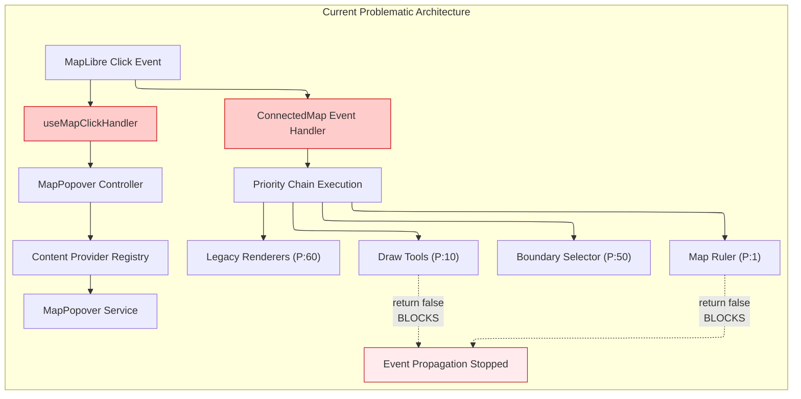
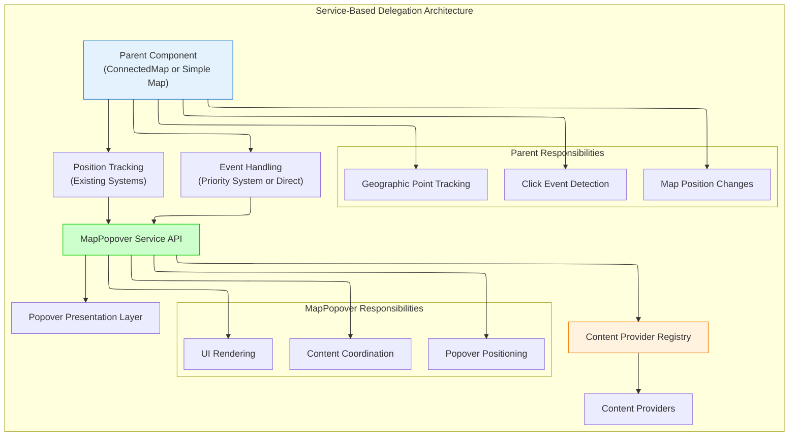

# ADR-002: MapPopover Event System Integration

## Status

**Approved** - Integration of MapPopover into existing priority-based event coordination system

## Executive Summary

This ADR documents the architectural decision to integrate the MapPopover system into the existing priority-based event coordination mechanism in `ConnectedMap` rather than maintaining two parallel click handling systems. The integration resolves event conflicts between interactive tools and popover content while preserving the clean provider architecture of the MapPopover system.

## Context and Problem Statement

### MapPopover Functional Requirements

MapPopover has two distinct functional requirements that must be preserved:

1. **Click Handling**: Open popover at clicked geographic location with appropriate content
2. **Position Tracking**: Continuously track the original geographic point during map movement/dragging so popover follows the location

### Current Dual Event System Architecture

The application currently operates two separate click handling systems:

**System 1: Legacy Priority-Based Event Coordination**

- **Location**: [`src/components/ConnectedMap/ConnectedMap.tsx:90-108`](../../src/components/ConnectedMap/ConnectedMap.tsx#L90-L108)
- **Registry**: [`src/core/shared_state/mapListeners.ts`](../../src/core/shared_state/mapListeners.ts)
- **Pattern**: Sequential execution with propagation control via boolean return values
- **Scope**: Click events only

**System 2: MapPopover Direct Event Handling**

- **Location**: [`src/core/map/hooks/useMapClickHandler.ts`](../../src/core/map/hooks/useMapClickHandler.ts)
- **Integration**: [`src/components/ConnectedMap/ConnectedMap.tsx:57-62`](../../src/components/ConnectedMap/ConnectedMap.tsx#L57-L62)
- **Pattern**: Direct MapLibre event binding with content provider registry
- **Scope**: Click events + independent position tracking via [`useMapPositionTracker`](../../src/core/map/hooks/useMapPositionTracker.ts)



### Architectural Inconsistencies

**Problem 1: Event System Conflicts**

- MapPopover operates independently of priority system
- Tools like Map Ruler (priority 1) and Draw Tools (priority 10) can block all other interactions via `return false`
- MapPopover still triggers despite tool exclusivity, creating UX inconsistencies

**Problem 2: Duplicate Event Handling**

```typescript
// ConnectedMap.tsx:90-98 - Legacy system
const clickHandlers = (event: MapMouseEvent) => {
  for (let i = 0; i < mapListeners.click.length; i++) {
    const { listener } = mapListeners.click[i];
    const passToNextListener = listener(event, mapRef.current);
    if (!passToNextListener) break; // Can block MapPopover
  }
};

// ConnectedMap.tsx:57-62 - Parallel MapPopover system
useMapPopoverInteraction({
  map: mapRef.current || null,
  popoverService,
  registry: mapPopoverRegistry,
});
```

**Problem 3: Inconsistent Behavior Patterns**

- **Expected**: When Map Ruler is active, no popups should appear
- **Actual**: MapPopover can still trigger independently
- **Root Cause**: Two separate event subscription systems

### Current Priority Assignment Analysis

**Location**: [`src/core/shared_state/mapListeners.ts:44-71`](../../src/core/shared_state/mapListeners.ts#L44-L71)

| System            | Priority | Propagation Behavior         | Integration Point                                                                                      |
| ----------------- | -------- | ---------------------------- | ------------------------------------------------------------------------------------------------------ |
| Map Ruler         | 1        | `return false` (blocks all)  | [`MapRulerRenderer.ts:109`](../../src/features/map_ruler/renderers/MapRulerRenderer.ts#L109)           |
| Draw Tools        | 10       | `return false` (blocks all)  | [`DrawModeRenderer.ts:181`](../../src/core/draw_tools/renderers/DrawModeRenderer.ts#L181)              |
| Boundary Selector | 50       | `return false` (blocks all)  | [`clickCoordinatesAtom.ts:27`](../../src/features/boundary_selector/atoms/clickCoordinatesAtom.ts#L27) |
| Legacy Renderers  | 60       | `return true` (non-blocking) | [`GenericRenderer.ts:248`](../../src/core/logical_layers/renderers/GenericRenderer.ts#L248)            |
| **MapPopover**    | **N/A**  | **Independent system**       | **No integration**                                                                                     |

## Architectural Decision

### Decision: Service-Based Delegation Architecture

Transform MapPopover from a **map-coupled event handler** to a **pure service layer** that parent components call. This decouples MapPopover from map instances and event systems, allowing flexible integration with both ConnectedMap's priority system and simple map implementations while preserving all functional requirements.

### Integration Architecture



### Technical Implementation Approach

**Step 1: Transform MapPopover to Service-Based API**

```typescript
// Enhanced MapPopover Service API
interface MapPopoverService {
  // Content-based API - parent determines when to show
  showWithContent(
    point: ScreenPoint,
    content: React.ReactNode,
    options?: MapPopoverOptions,
  ): void;

  // Registry-based API - parent passes map event, service determines content
  showWithEvent(mapEvent: MapMouseEvent, options?: MapPopoverOptions): boolean;

  // Position updates - parent tracks position, calls this
  updatePosition(point: ScreenPoint, placement?: Placement): void;

  // Simple control
  close(): void;
  isOpen(): boolean;
}
```

**Step 2: ConnectedMap Integration - Priority System Delegation**

```typescript
// ConnectedMap.tsx - Service delegation approach
function ConnectedMapWithPopover({ className }: { className?: string }) {
  const popoverService = useMapPopoverService();

  // 1. Click handling via existing priority system
  useEffect(() => {
    if (!mapRef.current) return;

    const mapPopoverClickListener = (event: MapMouseEvent) => {
      // Service determines content and shows if available
      const hasContent = popoverService.showWithEvent(event);
      return true; // Always non-blocking
    };

    return registerMapListener('click', mapPopoverClickListener, 55);
  }, [mapRef, popoverService]);

  // 2. Position tracking via existing ConnectedMap systems
  const handleMapMove = useCallback(() => {
    if (popoverService.isOpen()) {
      // Use existing position tracking to update popover
      const newPosition = calculatePopoverPosition(); // Use existing logic
      popoverService.updatePosition(newPosition);
    }
  }, [popoverService]);

  // Integrate with existing position sync systems
  useMapPositionSync(mapRef, { onPositionChange: handleMapMove });
}
```

**Step 3: Simple Map Integration - Direct API Usage**

```typescript
// MapPopover.fixture.tsx - Simple integration
function SimpleMapDemo() {
  const mapRef = useRef<HTMLDivElement>(null);
  const map = useMapInstance(mapRef);
  const popoverService = useMapPopoverService();

  // Direct map event handling - no priority system needed
  useEffect(() => {
    if (!map) return;

    const handleClick = (event: MapMouseEvent) => {
      // Simple maps can use content directly or registry
      const content = generateContent(event); // Your content logic
      if (content) {
        popoverService.showWithContent(event.point, content);
      }
    };

    const handleMove = () => {
      if (popoverService.isOpen()) {
        const newPosition = calculatePosition(); // Simple position calc
        popoverService.updatePosition(newPosition);
      }
    };

    map.on('click', handleClick);
    map.on('move', handleMove);

    return () => {
      map.off('click', handleClick);
      map.off('move', handleMove);
    };
  }, [map, popoverService]);
}
```

**Step 4: Remove Direct Map Coupling**

```typescript
// Remove useMapPopoverInteraction hook entirely
// Replace with service-based API calls from parent components
```

**Step 5: ConnectedMap Priority Assignment**

For ConnectedMap integration, the service call uses existing priority system:

| System            | Priority | Behavior                 | Integration Method                     |
| ----------------- | -------- | ------------------------ | -------------------------------------- |
| Map Ruler         | 1        | Blocks all (unchanged)   | Existing priority listener             |
| Draw Tools        | 10       | Blocks all (unchanged)   | Existing priority listener             |
| Boundary Selector | 50       | Blocks all (unchanged)   | Existing priority listener             |
| **MapPopover**    | **55**   | **Non-blocking**         | **Service call via priority listener** |
| Legacy Renderers  | 60       | Non-blocking (unchanged) | Existing priority listeners            |

**Service Integration Pattern**: ConnectedMap registers a priority listener that calls `popoverService.showWithEvent()`. This maintains tool exclusivity while allowing flexible parent-controlled integration. Simple maps bypass the priority system entirely and call the service directly.

## Consequences

### Positive Consequences

**Decoupling Benefits**

- MapPopover no longer directly binds to map events, eliminating tight coupling
- Parent components control event handling strategy (priority system vs direct binding)
- No conflicts with existing position tracking systems in ConnectedMap
- Clean separation between event handling and content rendering responsibilities

**Flexible Integration Patterns**

- ConnectedMap uses service delegation through existing priority system
- Simple maps (fixtures) use direct service API calls without priority overhead
- Content provider registry operates independently of event handling strategy
- Each parent component can implement appropriate position tracking approach

**Preserved Core Functionality**

- Geographic point tracking continues working via parent-controlled position updates
- Content provider pattern unchanged - providers remain autonomous
- All MapPopover presentation features preserved (positioning, placement calculation)
- Multi-map support maintained through isolated service instances

**Enhanced Architecture Quality**

- Single responsibility principle - MapPopover handles only content and presentation
- No event system conflicts between different architectural patterns
- Clear API boundaries between parent responsibilities and service responsibilities
- Consistent service interface works across all map implementation types

### Implementation Impact

**Code Changes Required**

1. Transform MapPopover to service-based API (`showWithEvent`, `showWithContent`, `updatePosition`)
2. Remove `useMapPopoverInteraction` hook entirely
3. Update ConnectedMap to use service delegation through priority listener
4. Update simple map implementations to use direct service API calls
5. Migrate content provider registration to service-based lifecycle

**Migration Risk Assessment**

- **Low Risk**: Service API maintains same functional behavior
- **Incremental Migration**: Can migrate ConnectedMap and simple maps independently
- **Backward Compatible**: Content provider pattern unchanged
- **Clear Rollback**: Can revert to old hook-based approach if needed

**Performance Characteristics**

- **Eliminated Event Coupling**: No direct map event binding from MapPopover
- **Flexible Position Tracking**: Parent components control tracking strategy and performance
- **Maintained Registry Performance**: Content provider chain execution unchanged
- **Reduced Architecture Complexity**: Clear separation of concerns between components

### Long-term Maintenance Benefits

**Simplified Debugging**

- Clear separation between parent event handling and MapPopover service calls
- No complex event binding interactions to debug
- Service API calls are explicit and traceable

**Enhanced Extensibility**

- New map implementations can integrate via simple service API calls
- Content providers register independently of event handling strategy
- Consistent service interface supports diverse integration patterns
- Parent components free to implement optimal event handling for their context

## Implementation Notes

### Service-Based Registry Integration

The service API integrates with the existing [`MapPopoverContentRegistry`](../../src/core/map/popover/MapPopoverContentRegistry.ts) through the `showWithEvent` method:

```typescript
// Enhanced MapPopover Service Implementation
export class MapPopoverService {
  constructor(
    private registry: IMapPopoverContentRegistry,
    private presentationService: PopoverPresentationService,
  ) {}

  showWithEvent(mapEvent: MapMouseEvent, options?: MapPopoverOptions): boolean {
    const result = this.registry.renderContent(mapEvent);
    if (result) {
      this.presentationService.show(mapEvent.point, result.content, {
        ...options,
        ...result.options,
      });
      return true;
    }
    return false;
  }

  showWithContent(
    point: ScreenPoint,
    content: React.ReactNode,
    options?: MapPopoverOptions,
  ): void {
    this.presentationService.show(point, content, options);
  }

  updatePosition(point: ScreenPoint, placement?: Placement): void {
    this.presentationService.move(point, placement);
  }
}
```

This pattern maintains provider autonomy while providing flexible integration options for both registry-based and direct content usage.

### Provider Migration Strategy

**Phase 1**: Infrastructure integration (priority listener)
**Phase 2**: Migrate `GenericRenderer` tooltip functionality
**Phase 3**: Migrate `BivariateRenderer` and `ClickableFeaturesRenderer` popup logic
**Phase 4**: Remove legacy popup implementations

Each phase can be deployed independently with rollback capability.

## References

- **Event System Investigation**: [`docs/investigations/map-event-management-system.md`](../investigations/map-event-management-system.md)
- **MapPopover Documentation**: [`src/core/map/MapPopover.md`](../../src/core/map/MapPopover.md)
- **Current Implementation**: [`src/components/ConnectedMap/ConnectedMap.tsx`](../../src/components/ConnectedMap/ConnectedMap.tsx)
- **Priority Registry**: [`src/core/shared_state/mapListeners.ts`](../../src/core/shared_state/mapListeners.ts)
