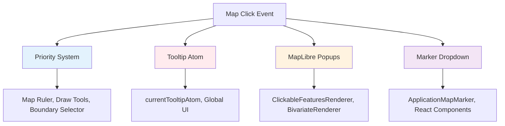
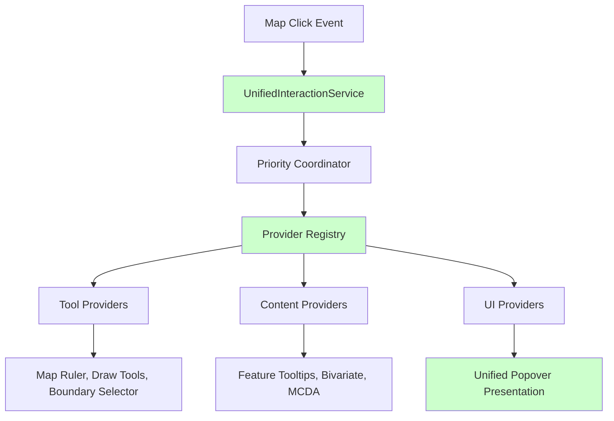

# ADR-005: Map Interaction System Consolidation

## Status

**Proposed** - Comprehensive map interaction unification

## Context

The current map interaction system is **severely fragmented** across four completely separate systems, creating maintenance nightmares, UX inconsistencies, and significant technical debt.

### Problem Statement

**Issue Identified:** [Architectural Debt Analysis](../investigations/architectural-debt-analysis.md) - Section 3

Four distinct interaction systems operate in isolation:



### Current System Analysis

#### System 1: Priority-Based Event System

**Location:** `src/core/shared_state/mapListeners.ts`
**Users:** Map Ruler, Draw Tools, Boundary Selector (tool-based interactions)
**Strengths:** ✅ Conflict prevention, tool exclusivity
**Weaknesses:** ❌ Complex registration, hard debugging, MapPopover integration conflicts

#### System 2: Global Tooltip Atom System

**Location:** `src/core/logical_layers/renderers/GenericRenderer.ts`
**Users:** Basic feature tooltips
**Strengths:** ✅ Simple implementation
**Weaknesses:** ❌ Global state pollution, single tooltip limit, no positioning logic

#### System 3: MapLibre Popup System

**Location:** Multiple renderers (`ClickableFeaturesRenderer`, `BivariateRenderer`)
**Users:** Complex feature popups
**Strengths:** ✅ Rich content, built-in positioning
**Weaknesses:** ❌ Code duplication, no centralized styling, lifecycle complexity

#### System 4: Marker-Based Dropdown System

**Location:** `src/features/boundary_selector/`
**Users:** Boundary selector tool
**Strengths:** ✅ Rich React integration
**Weaknesses:** ❌ Performance overhead, z-index issues, mobile problems

### Technical Debt Impact

**Quantified Problems:**

- **Total interaction-related files:** 12+ different implementations
- **Duplicated click handling logic:** ~400 lines across systems

- **Bug fix cost:** 3x multiplier due to system fragmentation
- **Integration conflicts:** MapPopover bypasses priority system

## Decision

Implement **Unified Map Interaction Architecture** that consolidates all four systems under a single, extensible provider-based pattern building on [ADR-001](./ADR-001-MapPopover-Migration-Architecture.md) vision.

### Target Architecture



### Core Architecture Components

#### 1. Unified Interaction Service

```typescript
interface UnifiedInteractionService {
  // Single entry point for all map interactions
  handleMapClick(event: MapMouseEvent): void;

  // Provider management
  registerProvider(provider: IMapInteractionProvider, priority?: number): () => void;
  unregisterProvider(provider: IMapInteractionProvider): void;

  // State management
  isBlocked(): boolean;
  getCurrentProvider(): IMapInteractionProvider | null;
}
```

#### 2. Provider Interface

```typescript
interface IMapInteractionProvider {
  // Unique identifier for debugging and management
  readonly id: string;
  readonly priority: number;

  // Interaction handling
  canHandle(event: MapMouseEvent): boolean;
  handle(event: MapMouseEvent): InteractionResult;

  // Lifecycle
  activate?(): void;
  deactivate?(): void;
}

enum InteractionResult {
  HANDLED_EXCLUSIVE = 'handled_exclusive', // Block further processing
  HANDLED_CONTINUE = 'handled_continue', // Allow further processing
  NOT_HANDLED = 'not_handled', // Pass to next provider
}
```

#### 3. Priority Coordination

```typescript
class PriorityCoordinator {
  private providers = new Map<IMapInteractionProvider, number>();

  handleEvent(event: MapMouseEvent): void {
    const sortedProviders = this.getSortedProviders();

    for (const provider of sortedProviders) {
      if (!provider.canHandle(event)) continue;

      const result = provider.handle(event);

      if (result === InteractionResult.HANDLED_EXCLUSIVE) {
        break; // Stop processing
      }

      if (result === InteractionResult.HANDLED_CONTINUE) {
        continue; // Allow other providers to also handle
      }
    }
  }

  private getSortedProviders(): IMapInteractionProvider[] {
    return Array.from(this.providers.keys()).sort((a, b) => a.priority - b.priority);
  }
}
```

## Implementation Plan

### Phase 1: Infrastructure

#### Core Service Implementation

```typescript
// src/core/map/interaction/UnifiedInteractionService.ts
class UnifiedInteractionService {
  private coordinator = new PriorityCoordinator();
  private activeProviders = new Set<IMapInteractionProvider>();

  constructor(private map: Map) {
    this.setupEventListeners();
  }

  private setupEventListeners() {
    this.map.on('click', this.handleMapClick.bind(this));
  }

  handleMapClick(event: MapMouseEvent): void {
    this.coordinator.handleEvent(event);
  }

  registerProvider(provider: IMapInteractionProvider, priority = 50): () => void {
    this.coordinator.register(provider, priority);
    this.activeProviders.add(provider);

    return () => {
      this.coordinator.unregister(provider);
      this.activeProviders.delete(provider);
    };
  }
}
```

#### Provider Base Classes

```typescript
// Tool providers (exclusive interactions)
abstract class ToolProvider implements IMapInteractionProvider {
  abstract readonly id: string;
  readonly priority = 10; // Higher priority than content providers

  private isActive = false;

  canHandle(event: MapMouseEvent): boolean {
    return this.isActive;
  }

  handle(event: MapMouseEvent): InteractionResult {
    this.handleToolClick(event);
    return InteractionResult.HANDLED_EXCLUSIVE; // Block other interactions
  }

  activate() {
    this.isActive = true;
  }

  deactivate() {
    this.isActive = false;
  }

  protected abstract handleToolClick(event: MapMouseEvent): void;
}

// Content providers (cooperative interactions)
abstract class ContentProvider implements IMapInteractionProvider {
  abstract readonly id: string;
  readonly priority = 50; // Lower priority, cooperative

  handle(event: MapMouseEvent): InteractionResult {
    const content = this.generateContent(event);
    if (content) {
      this.showContent(content, event);
      return InteractionResult.HANDLED_CONTINUE; // Allow others to also show content
    }
    return InteractionResult.NOT_HANDLED;
  }

  protected abstract generateContent(event: MapMouseEvent): React.ReactNode | null;
  protected abstract showContent(content: React.ReactNode, event: MapMouseEvent): void;
}
```

### Phase 2: Tool Provider Migration

#### Map Ruler Provider

```typescript
// src/features/map_ruler/MapRulerProvider.ts
class MapRulerProvider extends ToolProvider {
  readonly id = 'map-ruler';

  protected handleToolClick(event: MapMouseEvent): void {
    // Existing map ruler logic
    this.addRulerPoint(event.lngLat);
  }

  // Integrate with existing toolbar control
  static createWithToolbarIntegration(): MapRulerProvider {
    const provider = new MapRulerProvider();

    mapRulerToolbar.onStateChange((active) => {
      if (active) provider.activate();
      else provider.deactivate();
    });

    return provider;
  }
}
```

#### Draw Tools Provider

```typescript
// src/core/draw_tools/DrawToolsProvider.ts
class DrawToolsProvider extends ToolProvider {
  readonly id = 'draw-tools';

  protected handleToolClick(event: MapMouseEvent): void {
    // Existing draw tools logic
    this.handleDrawClick(event);
  }
}
```

#### Boundary Selector Provider

```typescript
// src/features/boundary_selector/BoundarySelectorProvider.ts
class BoundarySelectorProvider extends ToolProvider {
  readonly id = 'boundary-selector';

  protected handleToolClick(event: MapMouseEvent): void {
    // Replace marker dropdown with popover
    const popoverService = getMapPopoverService();

    popoverService.showWithContent(
      CoordinateConverter.mapToPage(event.point, this.map.getContainer()),
      <BoundarySelector coordinates={event.lngLat} onSelect={this.handleBoundarySelect} />
    );
  }

  private handleBoundarySelect = (boundary: Boundary) => {
    focusedGeometryService.setFocusedGeometry(boundary);
    this.deactivate();
  };
}
```

### Phase 3: Content Provider Migration

#### Generic Feature Provider

```typescript
// src/core/logical_layers/renderers/GenericFeatureProvider.ts
class GenericFeatureProvider extends ContentProvider {
  readonly id = 'generic-features';

  canHandle(event: MapMouseEvent): boolean {
    const features = event.target.queryRenderedFeatures(event.point);
    return features.length > 0;
  }

  protected generateContent(event: MapMouseEvent): React.ReactNode | null {
    const features = event.target.queryRenderedFeatures(event.point);
    if (features.length === 0) return null;

    // Use existing tooltip generation logic
    return this.createFeatureTooltip(features);
  }

  protected showContent(content: React.ReactNode, event: MapMouseEvent): void {
    const popoverService = getMapPopoverService();
    popoverService.showWithContent(
      CoordinateConverter.mapToPage(event.point, event.target.getContainer()),
      content,
    );
  }
}
```

#### Bivariate Analysis Provider

```typescript
// src/features/bivariate_manager/BivariateContentProvider.ts
class BivariateContentProvider extends ContentProvider {
  readonly id = 'bivariate-analysis';

  canHandle(event: MapMouseEvent): boolean {
    // Only active when bivariate layer is visible
    return this.isBivariateLayerActive();
  }

  protected generateContent(event: MapMouseEvent): React.ReactNode | null {
    const features = event.target.queryRenderedFeatures(event.point);
    const bivariateFeature = features.find(f => f.source === 'bivariate-layer');

    if (!bivariateFeature) return null;

    return <MapHexTooltip feature={bivariateFeature} />;
  }

  protected showContent(content: React.ReactNode, event: MapMouseEvent): void {
    const popoverService = getMapPopoverService();
    popoverService.showWithContent(
      CoordinateConverter.mapToPage(event.point, event.target.getContainer()),
      content,
      { placement: 'top', className: 'bivariate-tooltip' }
    );
  }
}
```

### Phase 4: Legacy System Removal

#### Remove Global Tooltip Atom

```typescript
// ❌ REMOVE: src/core/logical_layers/atoms/currentTooltipAtom.ts
// ❌ REMOVE: Global tooltip state management
// ✅ REPLACE: With GenericFeatureProvider
```

#### Remove Direct MapLibre Popup Usage

```typescript
// ❌ REMOVE: Direct popup.addTo(map) calls in renderers
// ✅ REPLACE: With content providers that use unified popover service
```

#### Remove Marker-Based Dropdown

```typescript
// ❌ REMOVE: ApplicationMapMarker for boundary selector
// ✅ REPLACE: With BoundarySelectorProvider using popover
```

## Integration with ConnectedMap

### Unified Service Integration

```typescript
// src/components/ConnectedMap/ConnectedMap.tsx
function ConnectedMapWithUnifiedInteractions() {
  const mapRef = useRef<ApplicationMap>();
  const interactionService = useRef<UnifiedInteractionService>();

  useEffect(() => {
    if (!mapRef.current) return;

    // Initialize unified service
    interactionService.current = new UnifiedInteractionService(mapRef.current);

    // Register all providers
    const unregisterFns = [
      // Tool providers (high priority)
      interactionService.current.registerProvider(MapRulerProvider.createWithToolbarIntegration(), 1),
      interactionService.current.registerProvider(new DrawToolsProvider(), 10),
      interactionService.current.registerProvider(new BoundarySelectorProvider(), 50),

      // Content providers (lower priority, cooperative)
      interactionService.current.registerProvider(new GenericFeatureProvider(), 60),
      interactionService.current.registerProvider(new BivariateContentProvider(), 60),
      interactionService.current.registerProvider(new MCDAContentProvider(), 60),
    ];

    return () => {
      unregisterFns.forEach(fn => fn());
      interactionService.current?.destroy();
    };
  }, []);

  return (
    <MapPopoverProvider registry={globalRegistry}>
      <div ref={mapRef} className="map-container" />
    </MapPopoverProvider>
  );
}
```

## Migration Strategy

### Backward Compatibility

```typescript
// Temporary compatibility layer
namespace LegacyInteractions {
  /** @deprecated Use UnifiedInteractionService with providers */
  export function registerMapListener(
    type: 'click',
    handler: Function,
    priority: number,
  ) {
    console.warn('registerMapListener deprecated - use UnifiedInteractionService');
    // Delegate to unified service
  }

  /** @deprecated Use ContentProvider pattern */
  export function setCurrentTooltip(content: React.ReactNode) {
    console.warn('currentTooltipAtom deprecated - use ContentProvider');
    // Delegate to unified service
  }
}
```

## Performance Considerations

### Event Processing Optimization

```typescript
class OptimizedPriorityCoordinator {
  private sortedProviders: IMapInteractionProvider[] = [];
  private needsSort = false;

  register(provider: IMapInteractionProvider, priority: number) {
    this.providers.set(provider, priority);
    this.needsSort = true; // Lazy sorting
  }

  handleEvent(event: MapMouseEvent): void {
    if (this.needsSort) {
      this.sortProviders();
      this.needsSort = false;
    }

    // Early exit optimization
    for (const provider of this.sortedProviders) {
      if (!provider.canHandle(event)) continue;

      const result = provider.handle(event);
      if (result === InteractionResult.HANDLED_EXCLUSIVE) {
        break;
      }
    }
  }
}
```

### Memory Management

```typescript
class UnifiedInteractionService {
  destroy() {
    // Clean up all event listeners
    this.map.off('click', this.handleMapClick);

    // Deactivate all providers
    this.activeProviders.forEach((provider) => {
      provider.deactivate?.();
    });

    this.activeProviders.clear();
    this.coordinator.clear();
  }
}
```

## Related Documentation

**Root Analysis:** [Architectural Debt Analysis](../investigations/architectural-debt-analysis.md) - Section 3
**Vision Foundation:** [ADR-001: MapPopover Migration Architecture](./ADR-001-MapPopover-Migration-Architecture.md)
**Service Integration:** [ADR-002: MapPopover Event System Integration](./ADR-002-MapPopover-Event-System-Integration.md)

**Event System Analysis:** [Map Event Management System Investigation](../investigations/map-event-management-system.md)

---

**ADR Status:** PROPOSED - Awaiting approval for comprehensive interaction system unification.
