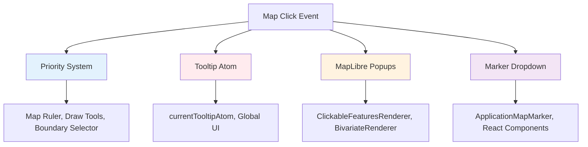
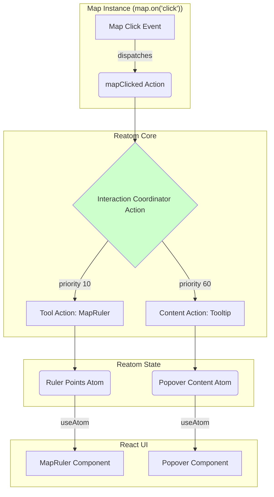

# ADR-005: Map Interaction System Consolidation

## Status

**Proposed** - Comprehensive map interaction unification

## Context

The current map interaction system is **severely fragmented** across four completely separate systems, creating maintenance nightmares, UX inconsistencies, and significant technical debt.

### Problem Statement

**Issue Identified:** [Architectural Debt Analysis](../investigations/architectural-debt-analysis.md) - Section 3

Four distinct interaction systems operate in isolation:



### Current System Analysis

#### System 1: Priority-Based Event System

**Location:** `src/core/shared_state/mapListeners.ts`
**Users:** Map Ruler, Draw Tools, Boundary Selector (tool-based interactions)
**Strengths:** ✅ Conflict prevention, tool exclusivity
**Weaknesses:** ❌ Complex registration, hard debugging, MapPopover integration conflicts

#### System 2: Global Tooltip Atom System

**Location:** `src/core/logical_layers/renderers/GenericRenderer.ts`
**Users:** Basic feature tooltips
**Strengths:** ✅ Simple implementation
**Weaknesses:** ❌ Global state pollution, single tooltip limit, no positioning logic

#### System 3: MapLibre Popup System

**Location:** Multiple renderers (`ClickableFeaturesRenderer`, `BivariateRenderer`)
**Users:** Complex feature popups
**Strengths:** ✅ Rich content, built-in positioning
**Weaknesses:** ❌ Code duplication, no centralized styling, lifecycle complexity

#### System 4: Marker-Based Dropdown System

**Location:** `src/features/boundary_selector/`
**Users:** Boundary selector tool
**Strengths:** ✅ Rich React integration
**Weaknesses:** ❌ Performance overhead, z-index issues, mobile problems

### Technical Debt Impact

**Quantified Problems:**

- **Total interaction-related files:** 12+ different implementations
- **Duplicated click handling logic:** ~400 lines across systems

- **Bug fix cost:** 3x multiplier due to system fragmentation
- **Integration conflicts:** MapPopover bypasses priority system

## Decision

Implement **Unified Map Interaction Architecture** that consolidates all four systems under a single, extensible provider-based pattern building on [ADR-001](./ADR-001-MapPopover-Migration-Architecture.md) vision.

### Target Architecture

A Reatom-native, action-based architecture where interactions are managed as a side effect of state changes within the Reatom ecosystem. This approach eliminates custom hooks and services in favor of idiomatic Reatom patterns.



### Core Architecture Components

#### 1. Core State and Actions

At the heart of the system are a few core atoms and actions that form the foundation for all interactions.

```typescript
// src/core/map/interaction/atoms.ts
import { atom, action } from '@reatom/framework';
import type { Map as MapLibreMap, MapMouseEvent } from 'maplibre-gl';

// Atom to hold the map instance, provided by ConnectedMap.
// Allows any other atom/action to access the map instance via ctx.get().
export const mapInstanceAtom = atom<MapLibreMap | null>(null, 'map.instanceAtom');

// A single action that all raw map clicks are funneled into.
// This is the primary trigger for the entire interaction system.
export const mapClicked = action<MapMouseEvent>('map.clicked');
```

#### 2. Declarative Interaction Handler

An `InteractionHandler` is a plain configuration object. It declaratively links a feature's enabling state (`enabledAtom`) to its execution logic (`action`). This makes the system modular and easy to extend.

```typescript
// src/core/map/interaction/types.ts
import { Action, Atom } from '@reatom/framework';
import type { MapMouseEvent } from 'maplibre-gl';

export interface InteractionHandler {
  // Unique identifier
  id: string;
  // Execution priority (lower is higher)
  priority: number;
  // If true, stops processing after this handler
  exclusive: boolean;
  // Atom that holds the boolean enabled state of the feature
  enabledAtom: Atom<boolean>;
  // Action to execute when the handler is enabled and a click occurs
  action: Action<[MapMouseEvent], any>;
}
```

#### 3. The Coordinator

A central `action` that listens for `mapClicked` events. It iterates through a static list of registered `InteractionHandler` configurations, checks their `enabledAtom`, and executes the appropriate `action`.

```typescript
// src/core/map/interaction/coordinator.ts
import { action } from '@reatom/framework';
import { mapClicked } from './atoms';
import { mapRulerHandler } from 'src/features/map_ruler/interaction';
import { bivariateTooltipHandler } from 'src/features/bivariate_manager/interaction';
// ... import other handlers as they are created

// Handlers are imported and sorted once to create a prioritized list.
const INTERACTION_HANDLERS = [mapRulerHandler, bivariateTooltipHandler].sort(
  (a, b) => a.priority - b.priority,
);

export const coordinateInteractions = action((ctx) => {
  // ctx.onCall subscribes this action's logic to another action.
  // It will run every time mapClicked is dispatched.
  ctx.onCall(mapClicked, (clickEvent) => {
    for (const handler of INTERACTION_HANDLERS) {
      // Check if the handler is active by reading its state atom.
      if (ctx.get(handler.enabledAtom)) {
        // If enabled, dispatch the handler's specific action.
        handler.action(ctx, clickEvent);

        if (handler.exclusive) {
          break; // Stop processing for exclusive tools.
        }
      }
    }
  });
}, 'map.coordinateInteractions');
```

## Reatom-centric Implementation

### Phase 1: Feature Handler Implementation

Each interactive feature becomes a self-contained module that exports its state, logic, and handler configuration.

#### Example: Map Ruler

```typescript
// src/features/map_ruler/interaction.ts
import { atom, action } from '@reatom/framework';
import type { MapMouseEvent } from 'maplibre-gl';
import type { InteractionHandler } from 'src/core/map/interaction/types';
import { rulerPointsAtom } from './atoms'; // An atom to store LngLat points

// Public atom to toggle the ruler tool from any component.
export const mapRulerEnabledAtom = atom(false, 'mapRuler.enabledAtom');

// The action containing the feature's specific logic.
const handleMapRulerClick = action<MapMouseEvent>((ctx, event) => {
  const points = ctx.get(rulerPointsAtom);
  // Add new point to the points atom.
  ctx.set(rulerPointsAtom, [...points, event.lngLat]);
}, 'mapRuler.handleClick');

// The handler config, exported for the coordinator.
export const mapRulerHandler: InteractionHandler = {
  id: 'map-ruler',
  priority: 10,
  exclusive: true,
  enabledAtom: mapRulerEnabledAtom,
  action: handleMapRulerClick,
};
```

#### Example: Bivariate Tooltip

```typescript
// src/features/bivariate_manager/interaction.ts
import { atom, action } from '@reatom/framework';
import { mapInstanceAtom } from 'src/core/map/interaction/atoms';
import { popoverContentAtom, popoverPositionAtom } from 'src/core/map/popover/atoms';

// The tooltip is always "enabled" when the bivariate layer is visible.
export const bivariateTooltipEnabledAtom = atom(
  (ctx) => ctx.spy(bivariateLayerAtom)?.isVisible, // Fictional dependency
  'bivariate.tooltipEnabledAtom',
);

const handleBivariateClick = action<MapMouseEvent>((ctx, event) => {
  const map = ctx.get(mapInstanceAtom);
  const features = map?.queryRenderedFeatures(event.point, {
    layers: ['bivariate-layer-id'],
  });
  const feature = features?.[0];

  if (feature) {
    ctx.set(popoverPositionAtom, event.lngLat);
    ctx.set(popoverContentAtom, {
      component: 'BivariateTooltip',
      props: { feature },
    });
  }
}, 'bivariate.handleClick');

export const bivariateTooltipHandler: InteractionHandler = {
  id: 'bivariate-tooltip',
  priority: 60,
  exclusive: false,
  enabledAtom: bivariateTooltipEnabledAtom,
  action: handleBivariateClick,
};
```

### Phase 2: Connecting to React

UI components interact with the system using standard Reatom hooks. They do not need to know about the interaction system itself, only the state atoms they care about.

```typescript
// src/features/map_ruler/MapRulerToggle.tsx
import { useAtom } from '@reatom/npm-react';
import { mapRulerEnabledAtom } from './interaction';

export function MapRulerToggle() {
  const [isEnabled, toggle] = useAtom(mapRulerEnabledAtom);
  // `useAtom` with a boolean atom returns a tuple with a `toggle` function.
  return <button onClick={toggle}> {isEnabled ? 'Disable' : 'Enable'} Ruler</button>
}
```

### Phase 3: Legacy System Removal

This architecture entirely replaces the previous systems.

- **`mapListeners.ts`**: Fully replaced by the `coordinateInteractions` action.
- **Global Tooltip Atom**: Replaced by feature-specific atoms like `popoverContentAtom`.
- **Direct Popup Usage**: Replaced by actions that update popover state atoms.
- **Custom Hooks/Context**: No longer necessary, replaced by standard Reatom patterns.

## Integration with ConnectedMap

Integration is minimal. The `ConnectedMap` component is only responsible for creating the map instance and activating the interaction coordinator.

```typescript
// src/components/ConnectedMap/ConnectedMap.tsx
import { useReatomContext } from '@reatom/npm-react';
import { useEffect } from 'react';
import { mapInstanceAtom, mapClicked } from 'src/core/map/interaction/atoms';
import { coordinateInteractions } from 'src/core/map/interaction/coordinator';

function ConnectedMap() {
  const mapContainerRef = useRef<HTMLDivElement>(null);
  const ctx = useReatomContext();

  useEffect(() => {
    if (!mapContainerRef.current) return;
    const map = new ApplicationMap({ container: mapContainerRef.current });

    // Provide the map instance and activate the interaction listener
    mapInstanceAtom(ctx, map);
    coordinateInteractions(ctx);

    const clickCallback = (event: MapMouseEvent) => {
      mapClicked(ctx, event);
    };
    map.on('click', clickCallback);

    return () => {
      map.off('click', clickCallback);
      mapInstanceAtom(ctx, null);
      map.remove();
    };
  }, [ctx]);

  return (
    // PopoverProvider and other global components would go here
    <div ref={mapContainerRef} className="map-container" />
  );
}
```

## Performance & Memory

- **Performance**: Reatom's granular dependency tracking ensures that only the necessary atoms are recomputed and components re-rendered on state changes.
- **Memory Management**: By setting `mapInstanceAtom` to `null` on unmount, we allow Reatom's garbage collection to clean up atoms and listeners that are no longer connected to the component tree, preventing memory leaks.

## Related Documentation

**Root Analysis:** [Architectural Debt Analysis](../investigations/architectural-debt-analysis.md) - Section 3
**Vision Foundation:** [ADR-001: MapPopover Migration Architecture](./ADR-001-MapPopover-Migration-Architecture.md)
**Service Integration:** [ADR-002: MapPopover Event System Integration](./ADR-002-MapPopover-Event-System-Integration.md)

**Event System Analysis:** [Map Event Management System Investigation](../investigations/map-event-management-system.md)

---

**ADR Status:** PROPOSED - Awaiting approval for comprehensive interaction system unification.
