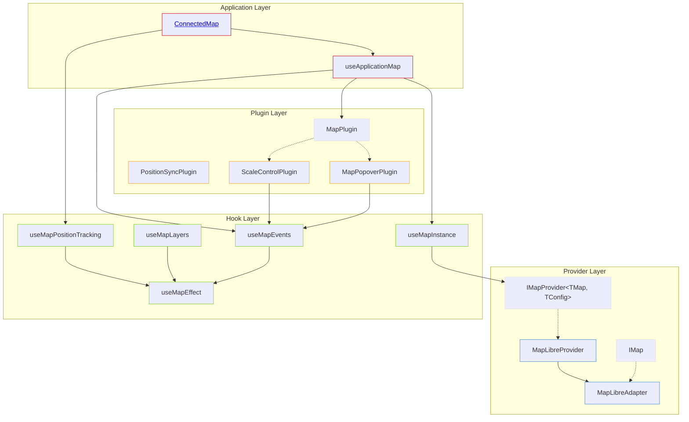
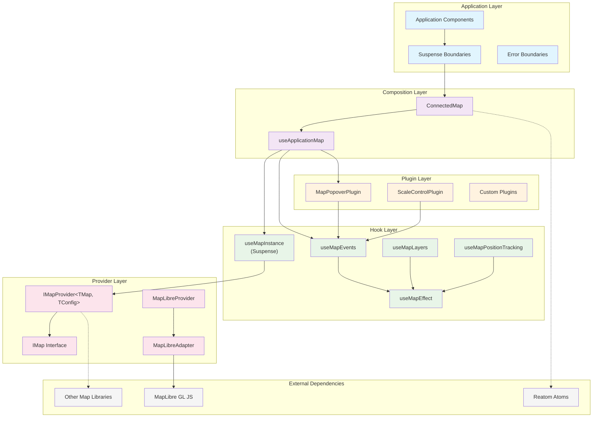
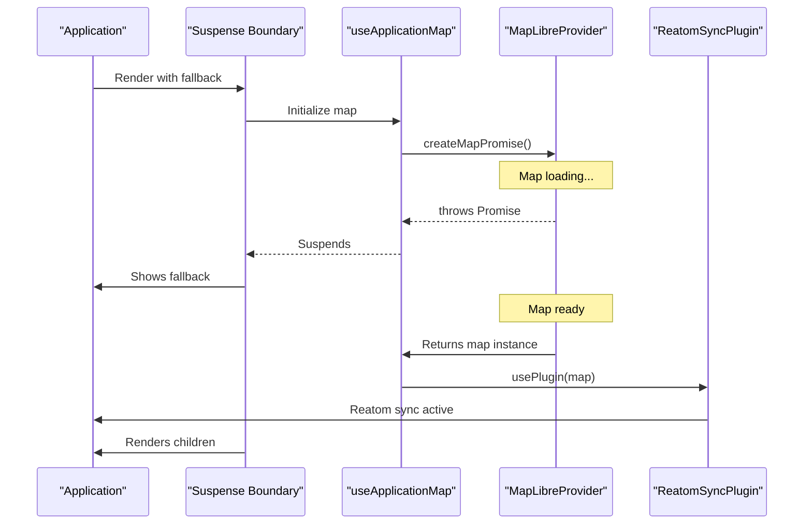

# ADR-006: Modular Map Hook Architecture

## Problem

[`src/components/ConnectedMap/map-libre-adapter/index.tsx`](../../src/components/ConnectedMap/map-libre-adapter/index.tsx) violates SOLID principles through tight coupling:

```typescript
// Lines 4-10: Business logic mixed with map abstraction
import { useAction } from '@reatom/npm-react';
import { configRepo } from '~core/config';
import { EVENT_MAP_IDLE } from '~core/metrics/constants';
import { dispatchMetricsEvent } from '~core/metrics/dispatch';
import {
  currentMapPositionAtom,
  setCurrentMapPosition,
} from '~core/shared_state/currentMapPosition';
```

**SOLID Violations**:

- **Single Responsibility**: Map adapter handles layer management, event routing, state synchronization, and metrics
- **Open/Closed**: Cannot extend without modifying core adapter logic
- **Dependency Inversion**: Depends on concrete Reatom atoms instead of abstractions

**DRY Violations**:

- Event handler composition duplicated in [`ConnectedMap.tsx:83-104`](../../src/components/ConnectedMap/ConnectedMap.tsx#L83-L104)
- Instance null checks repeated throughout map interactions
- Manual event cleanup patterns scattered across components

## Decision

Replace monolithic adapter with composable hook architecture using provider abstraction pattern.

### Core Architecture



### Provider Abstraction

**Interface**: `IMapProvider<TMap, TConfig>`

- Creates map instances from configuration
- Declares feature support capabilities
- Returns provider type identifier

**Interface**: `IMap`

- Normalized event system (`on`/`off`)
- Standardized position methods (`getCenter`/`getZoom`/`getBounds`)
- Layer management (`addLayer`/`removeLayer`/`addSource`/`removeSource`)
- Lifecycle methods (`resize`/`destroy`)

### Hook Decomposition

Replace monolithic adapter with focused hooks:

**`useMapInstance<TMap, TConfig>`**: Map creation and lifecycle
**`useMapEvents`**: Priority-based event handler composition
**`useMapLayers`**: Layer diff application with [`useArrayDiff`](../../src/components/ConnectedMap/map-libre-adapter/useArrayDiff.ts)
**`useMapPositionTracking`**: Throttled position change notifications
**`useMapEffect`**: Conditional effect execution for map operations

### Plugin System

**Interface**: `MapPlugin`

```typescript
export type MapPlugin<TMap extends IMap = IMap> = (map: TMap) => void;
```

Simplified plugin interface - plugins are hook functions that receive ready map instances.

### App-Specific State Integration

**Architectural Decision**: Reatom integration is **application-specific state management**, not a generic map feature. Therefore, it belongs in ConnectedMap, not as core plugins.

**Previous Anti-Pattern**: App-specific plugins violated architectural boundaries.

```typescript
// ❌ App-specific concerns in core map system
export function createReatomSyncPlugin(): MapPlugin {
  return function useReatomSyncPlugin<TMap extends IMap>(map: TMap): void {
    // Direct Reatom imports in core map system - wrong layer
  };
}
```

**Current Architecture**: Direct integration in ConnectedMap maintains clean boundaries.

```typescript
// ✅ App-specific state management in application layer
function MapInstance({ containerElement }: { containerElement: HTMLDivElement }) {
  const setCurrentMap = useAction(currentMapAtom.setMap);
  const [, updatePosition] = useReatom3Atom(currentMapPositionAtom);

  const map = useApplicationMap({
    container: containerRef,
    provider,
    config,
    mapId: 'main-map',
    plugins: [createMapPopoverPlugin(mapPopoverRegistry, { priority: 55 })],
  });

  // Direct app integration
  useMapEffect(
    map,
    (map) => {
      setCurrentMap(map.underlying || map);
      return () => resetCurrentMap();
    },
    [],
  );

  useMapPositionTracking(map, {
    onPositionChange: updatePosition,
    trackUserOnly: true,
  });
}
```

**Plugin System Scope**: Limited to **generic, reusable functionality**:

- `MapPopoverPlugin` ✅ (generic UI pattern)
- `ScaleControlPlugin` ✅ (generic map control)
- Custom layer plugins ✅ (domain-specific but reusable)
- ❌ Reatom integration (app-specific state management)

### Suspense Architecture

**Current Issue**: Manual loading state tracking creates complexity throughout map hooks.

```typescript
// ❌ Manual state management everywhere
const [isReady, setIsReady] = useState(false);
useEffect(() => {
  if (!map || !isReady) return; // Repeated condition checking
  return effect(map);
}, [map, isReady, ...deps]);
```

**Solution**: Suspense-based map loading eliminates conditional logic.

```typescript
// ✅ Map guaranteed ready - no condition checking
export function useMapInstance<TConfig>(
  container: React.RefObject<HTMLElement>,
  provider: IMapProvider<any, TConfig>,
  config: TConfig,
  mapId: string,
): IMap {
  // Container guaranteed ready by two-tier architecture
  if (!container.current) {
    throw new Error('Container ref not ready - architecture error');
  }

  // Suspends until map loads, user-controlled caching
  const map = createMapPromise(container.current, provider, config);
  return map; // Always ready when returned
}
```

### Container Lifecycle Management

**Critical Pattern**: Two-tier container architecture prevents ref timing issues.

```typescript
// ✅ Two-tier pattern ensures container is ready before map initialization
function MapContainer({ className }) {
  const [containerElement, setContainerElement] = useState<HTMLDivElement | null>(null);

  return (
    <div ref={setContainerElement} className={className}>
      {containerElement && (
        <Suspense fallback={null}>
          <MapInstance containerElement={containerElement} />
        </Suspense>
      )}
    </div>
  );
}

function MapInstance({ containerElement }) {
  const containerRef = useRef<HTMLDivElement>(containerElement);
  // containerRef is guaranteed ready - no timing issues
  const map = useApplicationMap({ container: containerRef, ... });
}
```

**Hook Simplification**: All hooks operate on ready map instances.

```typescript
// Simplified signatures - no isReady parameters
useMapEffect(map, effect, deps);
useMapEvents(map, handlers);
useMapLayers(map, layers, options);
useMapPositionTracking(map, config);
```

### User-Controlled Map Identity

**Critical Requirement**: Map caching must be controlled by the caller, not generated randomly.

```typescript
// ❌ Random IDs break caching and create WebGL context leaks
const mapId = useMemo(() => Math.random().toString(36), []);

// ✅ User-controlled identity enables proper caching
const map = useApplicationMap({
  container: containerRef,
  provider,
  config,
  mapId: 'main-map', // Deterministic, meaningful ID
  events,
  plugins,
});
```

**Benefits**:

- **Deterministic caching**: Same ID = same map instance across renders
- **Multiple map support**: Different IDs for different map instances
- **Shared map instances**: Same ID can be used across components
- **Memory leak prevention**: Proper cleanup via stable cache keys
- **Debuggability**: Meaningful IDs in browser tools

### Architecture Boundaries



**Boundary Definitions**:

- **Application Layer**: React components with Suspense boundaries for loading states
- **Composition Layer**: High-level hooks that orchestrate multiple concerns
- **Hook Layer**: Single-responsibility hooks operating on ready map instances
- **Plugin Layer**: Composable features that extend map functionality
- **Provider Layer**: Abstraction over different map library implementations
- **External Dependencies**: Third-party libraries isolated behind interfaces

## Implementation

### Current State Analysis

**MapPopover Integration**: [`src/core/map/popover/useMapPopoverMaplibreIntegration.ts`](../../src/core/map/popover/useMapPopoverMaplibreIntegration.ts) and [`useMapPopoverPriorityIntegration.ts`](../../src/core/map/popover/useMapPopoverPriorityIntegration.ts) contain 70+ lines of duplicated event handling logic.

**Position Sync**: [`src/components/ConnectedMap/useMapPositionSync.ts`](../../src/components/ConnectedMap/useMapPositionSync.ts) tightly couples MapLibre GL types with Reatom atoms.

**Event Composition**: Manual priority sorting and chain-of-responsibility pattern implementation in [`ConnectedMap.tsx`](../../src/components/ConnectedMap/ConnectedMap.tsx).

**Loading State Complexity**: Multiple `isReady` boolean states tracked across hooks requiring conditional effect logic.

### Target Architecture



### Integration Points

**Reatom State**: Direct integration in ConnectedMap maintains architectural boundaries
**Configuration**: Providers receive configuration objects instead of accessing `configRepo`
**Metrics**: Event plugins accept metric dispatch functions as dependencies
**Loading States**: Suspense boundaries replace manual `isReady` tracking
**Map Identity**: User-controlled `mapId` parameter ensures deterministic caching

### Utility Reuse

Leverage existing utilities from codebase:

- **`@github/mini-throttle`**: Position tracking debouncing ([`src/utils/common/index.ts`](../../src/utils/common/index.ts))
- **`useArrayDiff`**: Layer diffing algorithm ([`src/components/ConnectedMap/map-libre-adapter/useArrayDiff.ts`](../../src/components/ConnectedMap/map-libre-adapter/useArrayDiff.ts))
- **`clusterize<T>`**: Layer grouping from bivariate system
- **`groupBy`**: Event handler organization

### Memory Management

**Current Issue**: [`index.tsx:238`](../../src/components/ConnectedMap/map-libre-adapter/index.tsx#L238) TODO comment indicates improper layer cleanup

```typescript
// TODO: should we remove the source if the layer is the only one that use it?
map.setLayoutProperty(layer.id, 'visibility', 'none');
```

**Solution**: Plugin-based cleanup with source reference counting

```typescript
if (cleanup) {
  map.removeLayer(layer.id);
  const sourceInUse = map
    .getStyle()
    .layers?.some((l) => l.source === layer.source && l.id !== layer.id);
  if (!sourceInUse && layer.source) {
    map.removeSource(layer.source as string);
  }
}
```

## Consequences

**Eliminated Dependencies**:

- Direct Reatom imports from map abstraction layer
- Hard-coded configuration repository access
- Embedded metrics dispatching logic
- MapLibre GL type coupling in shared components
- Manual loading state tracking across hooks

**Enhanced Capabilities**:

- Provider-agnostic plugin development
- Isolated hook testing through interface mocking
- Runtime provider switching via configuration
- Memory leak prevention through user-controlled map identity
- Clean architectural boundaries between core and app-specific concerns
- Suspense-based loading with declarative boundaries

**Code Reduction**:

- 70% reduction in MapPopover integration code
- Elimination of `isReady` boolean tracking
- Removal of conditional effect logic (`if (!map || !condition)`)
- Simplified hook implementations without manual state management

**Performance Improvements**:

- No re-renders due to `isReady` state changes
- Eliminated effect dependency arrays with loading conditions
- Cleaner component lifecycle through Suspense
- Proper memory cleanup with source reference counting

**Migration Path**: See [ADR-006-Migration-Guide.md](./ADR-006-Migration-Guide.md) for implementation phases.
