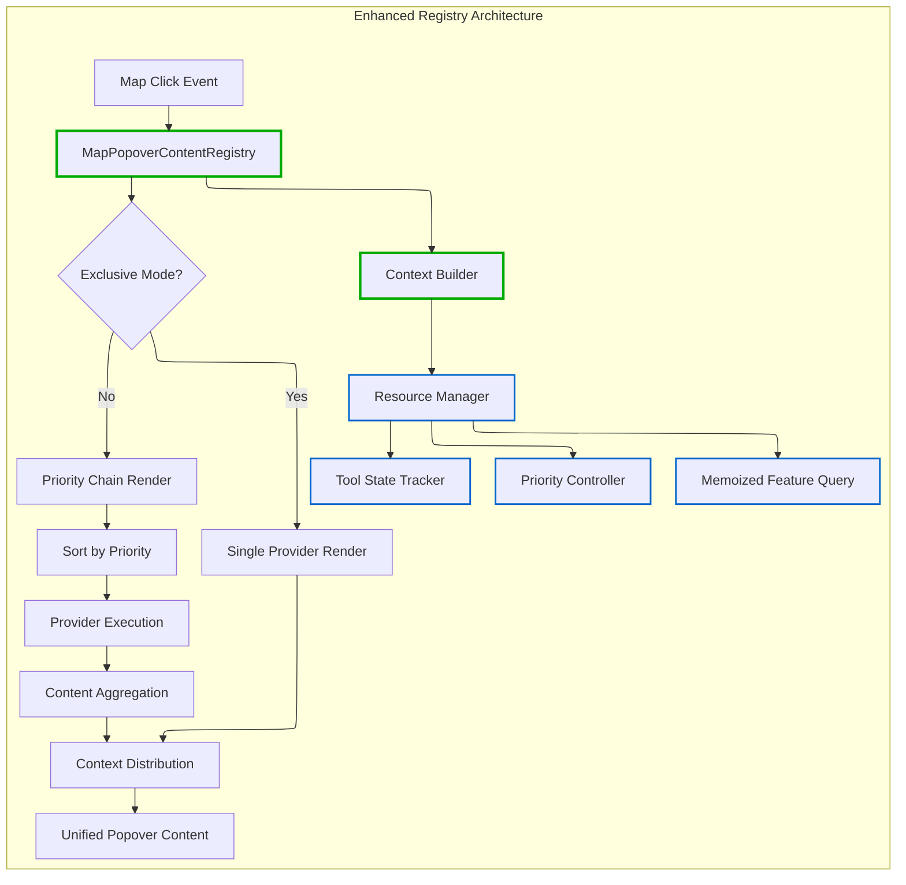

# ADR-007: Enhanced MapPopover Content Provider Architecture

## Status

**Proposed**

## Table of Contents

- [Executive Summary](#executive-summary)
- [System Architecture](#system-architecture)
- [Implementation Analysis](#implementation-analysis)
- [Current Usage Analysis](#current-usage-analysis)
- [State Management Integration](#state-management-integration)
- [Architectural Inconsistencies](#architectural-inconsistencies)
- [System Boundaries](#system-boundaries)

## Executive Summary

This ADR proposes enhancing the MapPopover content provider architecture with **shared resource optimization**, **exclusive interaction modes**, and **priority-based rendering** to address performance bottlenecks and tool integration conflicts. The core pattern shifts from independent provider queries to coordinated resource sharing through registry-mediated context distribution.

## System Architecture

### Core Pattern: Registry-Mediated Context Distribution

The architecture implements a **coordinator pattern** where the registry acts as a mediator, providing shared resources and managing provider interactions through context objects.



### Component Architecture

**Registry**: [`MapPopoverContentRegistry.ts:1-50`](../src/core/map/popover/MapPopoverContentRegistry.ts#L1-L50)

- Coordinates provider execution
- Manages shared resource distribution
- Implements exclusive mode logic

**Provider Context**: Shared resource interface

- Memoized feature getter
- Tool state information
- Priority metadata

**Providers**: Content generators implementing `IMapPopoverContentProvider`

- Domain-specific rendering logic
- Resource consumption through context
- Priority and exclusivity declarations

### Key Architectural Patterns

#### 1. Shared Resource Pattern

Instead of each provider independently querying features, the registry provides a memoized getter:

```typescript
interface IMapPopoverProviderContext {
  getFeatures: () => MapGeoJSONFeature[]; // Memoized query result
  toolState: ToolStateInfo;
  providerInfo: ProviderMetadata;
}
```

#### 2. Exclusive Interaction Pattern

Providers can declare exclusive mode to prevent conflicts during tool operations:

```typescript
interface IMapPopoverContentProvider {
  readonly isExclusive: boolean;
  readonly priority: number;
  readonly toolId?: string;
}
```

#### 3. Priority Chain Pattern

Non-exclusive providers execute in priority order with early termination:

```typescript
enum ProviderPriority {
  CRITICAL = 1000, // System alerts
  HIGH = 500, // Active tools
  NORMAL = 100, // Default interactions
  LOW = 50, // Background info
  DEBUG = 1, // Development
}
```

## Implementation Analysis

### Data Structures

**Provider Registration with Priority Ordering**:

```typescript
interface ProviderRegistration {
  provider: IMapPopoverContentProvider;
  isActive: boolean;
  toolId?: string;
}

// Providers maintained in priority order during registration
private providers = new Map<string, ProviderRegistration>();
private orderedProviderIds: string[] = []; // Sorted by priority on registration
```

**Context Distribution**:

```typescript
const context = {
  getFeatures: memoizedFeatureGetter,
  toolState: currentToolState,
  providerInfo: { priority, mode, id },
};
```

### Source Filtering Enhancement

**Security Fix**: Changed from `f.source.includes(sourceId)` to `f.source === sourceId`

- Prevents substring collision security issues
- Exact matching improves filtering reliability

### Control Mechanisms

**Exclusive Mode Control**:
**Location**: [`EnhancedMapPopoverContentRegistry.ts:45-65`](../src/core/map/popover/MapPopoverContentRegistry.ts#L45-L65)

```typescript
setExclusiveMode(providerId: string, toolId?: string): void {
  this.exclusiveProviderId = providerId;
  this.activeToolId = toolId;
}
```

**Priority-Based Execution**:
**Location**: [`EnhancedMapPopoverContentRegistry.ts:85-110`](../src/core/map/popover/MapPopoverContentRegistry.ts#L85-L110)

Providers execute in pre-sorted priority order with error isolation.

### Integration Points

**Tool Integration**: Tools register exclusive providers during activation
**Renderer Integration**: Renderers register providers during `willMount()` lifecycle
**Registry Coordination**: Single global registry coordinates all interactions

## Current Usage Analysis

### Component Inventory

**Existing Providers**:

- **BivariatePopoverProvider**: [`BivariatePopoverProviders.tsx:45-90`](../src/core/logical_layers/renderers/BivariateRenderer/BivariatePopoverProviders.tsx#L45-L90)
- **MCDAPopoverProvider**: [`BivariatePopoverProviders.tsx:105-138`](../src/core/logical_layers/renderers/BivariateRenderer/BivariatePopoverProviders.tsx#L105-L138)
- **ClickableFeaturesPopoverProvider**: [`ClickableFeaturesPopoverProvider.tsx:1-37`](../src/core/logical_layers/renderers/ClickableFeaturesRenderer/ClickableFeaturesPopoverProvider.tsx#L1-L37)
- **GenericRendererPopoverProvider**: [`GenericRendererPopoverProvider.tsx:1-32`](../src/core/logical_layers/renderers/GenericRendererPopoverProvider.tsx#L1-L32)

**Registry Implementation**:

- **MapPopoverContentRegistry**: [`MapPopoverContentRegistry.ts:1-50`](../src/core/map/popover/MapPopoverContentRegistry.ts#L1-L50)
- **Global Registry**: [`globalMapPopoverRegistry.ts:11`](../src/core/map/popover/globalMapPopoverRegistry.ts#L11)

### Usage Patterns

**Current Registration Pattern**:

```typescript
// In renderer willMount()
this._provider = new BivariatePopoverProvider(sourceId, legend);
mapPopoverRegistry.register(`bivariate-${sourceId}`, this._provider);

// In renderer willUnMount()
mapPopoverRegistry.unregister(`bivariate-${sourceId}`);
```

**Performance Characteristics**:

- **Before**: N providers × 1 feature query each = N queries per click
- **After**: 1 shared query + N provider executions = 1 query per click

## State Management Integration

### Application State Dependencies

**Tool State Integration**:

- **Boundary Selector**: [`boundaryRegistryAtom.ts:1-29`](../src/features/boundary_selector/atoms/boundaryRegistryAtom.ts#L1-L29)
- **Drawing Tools**: Integration through toolbar control state
- **Layer Visibility**: Renderer lifecycle manages provider registration

### Provider Lifecycle

**Registration**: Tied to renderer `willMount()` hooks
**Deregistration**: Automatic cleanup in renderer `willUnMount()`
**State Synchronization**: Tool activation triggers exclusive mode

### Dependencies

**Core Dependencies**:

- **MapLibre Events**: Source of map interaction events
- **Renderer Lifecycle**: Provider registration timing
- **Tool State**: Exclusive mode coordination
- **Global Registry**: Central coordination point

## Architectural Inconsistencies

### Current Inconsistencies

❌ **Duplicate Feature Queries**: Each provider independently calls `queryRenderedFeatures()`
❌ **Source Filtering Inconsistency**: Mix of `includes()` and `===` for source matching
❌ **No Tool Coordination**: Tools and layer interactions compete simultaneously
❌ **Priority Conflicts**: No defined rendering order for competing providers

### Pattern Violations

**Violation**: Direct map querying in providers

```typescript
// Anti-pattern in current providers
const features = mapEvent.target.queryRenderedFeatures(mapEvent.point);
```

**Solution**: Context-mediated resource sharing

```typescript
// Preferred pattern
const features = context.getFeatures(); // Shared memoized result
```

### Impact Analysis

**Performance Impact**: Redundant map queries in multi-provider scenarios
**UX Impact**: Conflicting popovers when tools are active
**Maintenance Impact**: Inconsistent source filtering creates debugging complexity

### Resolution Strategy

✅ **Shared Resource Pattern**: Eliminate duplicate queries through memoization
✅ **Exclusive Mode Pattern**: Tool-based interaction exclusivity
✅ **Exact Source Matching**: Consistent `===` filtering across all providers
✅ **Priority System**: Pre-sorted provider execution order

## System Boundaries

### Managed by Enhanced Registry

✅ **Provider Coordination**: Registration, priority, exclusive mode
✅ **Resource Sharing**: Feature query memoization and distribution
✅ **Tool State**: Exclusive mode activation and deactivation
✅ **Error Isolation**: Provider failure containment
✅ **Content Aggregation**: Multi-provider content assembly

### Outside System Scope

❌ **Map Event Handling**: Managed by existing map interaction hooks
❌ **Popover Positioning**: Handled by MapPopover service layer
❌ **Provider Content Logic**: Domain-specific rendering remains in providers
❌ **Tool Lifecycle**: Tool activation/deactivation managed by toolbar controls
❌ **Renderer Management**: Layer mounting/unmounting outside registry scope

### Integration Boundaries

**Upstream**: Receives map events from existing interaction hooks
**Downstream**: Provides aggregated content to MapPopover service
**Lateral**: Coordinates with tool state management and renderer lifecycle
