# ADR-007: Enhanced MapPopover Content Provider Architecture

## Status

**Proposed**

## Table of Contents

- [Executive Summary](#executive-summary)
- [System Architecture](#system-architecture)
- [Implementation Analysis](#implementation-analysis)
- [Current Usage Analysis](#current-usage-analysis)
- [State Management Integration](#state-management-integration)
- [Architectural Inconsistencies](#architectural-inconsistencies)
- [System Boundaries](#system-boundaries)

## Executive Summary

This ADR proposes enhancing the MapPopover content provider architecture with **shared resource coordination**, **exclusive interaction modes**, and **priority-based conflict resolution** to address tool integration conflicts and rendering inconsistencies. The core pattern shifts from independent provider execution to coordinated interaction management through a mediator that handles resource sharing, conflict management, and rendering priority.

## System Architecture

### Core Pattern: Interaction Mediator

The architecture implements a **mediator pattern** where the `MapPopoverInteractionMediator` coordinates provider execution, manages resource sharing, and resolves interaction conflicts through context distribution.

```mermaid
---
config:
  layout: elk
---
graph TD
    subgraph "Interaction Mediator Architecture"
        A["Map Click Event"] --> B["MapPopoverInteractionMediator"]

        B --> C{Exclusive Tool Active?}
        C -->|Yes| D["Execute Exclusive Provider Only"]
        C -->|No| E["Execute Priority Chain"]

        E --> F["Iterate Pre-Sorted Providers"]
        F --> G["Provider Context Distribution"]

        G --> H["Shared Resource Access"]
        H --> I["getFeatures()"]
        H --> J["toolState"]
        H --> K["providerMetadata"]

        D --> L["Single Provider Content"]
        G --> M["Aggregated Content"]

        L --> N["Unified Popover Result"]
        M --> N

        classDef mediator stroke:#00aa00,stroke-width:3px
        classDef exclusive stroke:#ff6600,stroke-width:2px
        classDef shared stroke:#0066cc,stroke-width:2px

        class B mediator
        class D,L exclusive
        class I,J,K shared
    end

    subgraph "Legend"
        P["🟢 Mediator: Coordinates provider execution"]
        Q["🟠 Exclusive: Tool-based single provider mode"]
        R["🔵 Shared: Resource distribution to providers"]
    end
```



### Component Architecture

**Interaction Mediator**: [`MapPopoverInteractionMediator.ts:1-50`](../src/core/map/popover/MapPopoverInteractionMediator.ts#L1-L50)

- Coordinates provider execution based on tool state and priority
- Distributes shared resources through context objects
- Resolves conflicts through exclusive mode and priority ordering

**Provider Context**: Resource distribution interface

- `getFeatures()`: Shared feature query results (eliminates duplicate queries)
- `toolState`: Current active tool and exclusive mode status
- `providerInfo`: Priority metadata and execution context

**Content Providers**: Domain-specific interaction handlers implementing `IMapPopoverContentProvider`

- Consume context resources instead of direct map queries
- Declare priority and exclusivity requirements for conflict resolution
- Generate popover content for specific use cases (layers, tools, etc.)

### Key Architectural Patterns

#### 1. Shared Resource Pattern

Providers consume shared resources through context instead of independent queries:

```typescript
// Provider implementation using shared context
renderContent(context: IMapPopoverProviderContext): React.ReactNode | null {
  const features = context.getFeatures(); // Shared result, not new query
  const relevantFeatures = features.filter(f => f.source === this.sourceId);

  if (!relevantFeatures.length) return null;
  return <LayerTooltip feature={relevantFeatures[0]} />;
}
```

#### 2. Exclusive Interaction Pattern

Tools can claim exclusive interaction control to prevent conflicts:

```typescript
// Boundary selector tool example
class BoundarySelectorProvider implements IMapPopoverContentProvider {
  readonly isExclusive = true;
  readonly priority = ProviderPriority.HIGH;
  readonly toolId = 'boundary-selector';

  renderContent(context: IMapPopoverProviderContext): React.ReactNode | null {
    // Only renders when tool is active and in exclusive mode
    if (!context.toolState.isExclusiveMode || context.toolState.activeToolId !== this.toolId) {
      return null;
    }

    return <BoundarySelector coordinates={context.mapEvent.lngLat} />;
  }
}
```

#### 3. Priority-Based Conflict Resolution

Providers execute in pre-sorted priority order with same-priority tie-breaking:

```typescript
enum ProviderPriority {
  CRITICAL = 1000, // System alerts, error states
  HIGH = 500, // Active tools (drawing, selection)
  NORMAL = 100, // Layer interactions, tooltips
  LOW = 50, // Background info, debug data
  DEBUG = 1, // Development diagnostics
}

// Same priority resolution: registration order determines execution order
// Earlier registered provider executes first when priorities are equal
```

## Implementation Analysis

### Data Structures

**Provider Registration with Priority Ordering**:

```typescript
interface ProviderRegistration {
  provider: IMapPopoverContentProvider;
  isActive: boolean;
  toolId?: string;
}

// Providers maintained in priority order during registration
private providers = new Map<string, ProviderRegistration>();
private orderedProviderIds: string[] = []; // Sorted by priority on registration
```

**Context Distribution**:

```typescript
const context = {
  getFeatures: memoizedFeatureGetter,
  toolState: currentToolState,
  providerInfo: { priority, mode, id },
};
```

### Source Filtering Enhancement

**Correctness Fix**: Changed from `f.source.includes(sourceId)` to `f.source === sourceId`

- Prevents substring collision bugs (e.g., "layer-1" matching "layer-10")
- Exact matching improves filtering reliability and prevents unintended feature matches

### Control Mechanisms

**Exclusive Mode Control**:
**Location**: [`MapPopoverInteractionMediator.ts:45-65`](../src/core/map/popover/MapPopoverInteractionMediator.ts#L45-L65)

```typescript
setExclusiveMode(providerId: string, toolId?: string): void {
  this.exclusiveProviderId = providerId;
  this.activeToolId = toolId;
  // When exclusive mode is active, only the specified provider executes
}

// Tool state reaction - mediator listens to external tool state changes
onToolStateChange(toolId: string, isActive: boolean): void {
  if (isActive) {
    const exclusiveProvider = this.findProviderByToolId(toolId);
    if (exclusiveProvider?.isExclusive) {
      this.setExclusiveMode(exclusiveProvider.id, toolId);
    }
  } else {
    this.clearExclusiveMode();
  }
}
```

**Error Isolation and Recovery**:
**Location**: [`MapPopoverInteractionMediator.ts:85-110`](../src/core/map/popover/MapPopoverInteractionMediator.ts#L85-L110)

```typescript
// Provider execution with error boundaries
for (const providerId of this.orderedProviderIds) {
  try {
    const content = provider.renderContent(context);
    if (content) contentElements.push(content);
  } catch (error) {
    console.error(`Provider "${providerId}" failed:`, error);
    // Continue to next provider - failure isolation
    // Optional: Add fallback content for critical providers
  }
}
```

### Integration Points

**Tool Integration**: Tools register exclusive providers during activation
**Renderer Integration**: Renderers register providers during `willMount()` lifecycle
**Registry Coordination**: Single global registry coordinates all interactions

## Current Usage Analysis

### Component Inventory

**Existing Providers**:

- **BivariatePopoverProvider**: [`BivariatePopoverProviders.tsx:45-90`](../src/core/logical_layers/renderers/BivariateRenderer/BivariatePopoverProviders.tsx#L45-L90)
- **MCDAPopoverProvider**: [`BivariatePopoverProviders.tsx:105-138`](../src/core/logical_layers/renderers/BivariateRenderer/BivariatePopoverProviders.tsx#L105-L138)
- **ClickableFeaturesPopoverProvider**: [`ClickableFeaturesPopoverProvider.tsx:1-37`](../src/core/logical_layers/renderers/ClickableFeaturesRenderer/ClickableFeaturesPopoverProvider.tsx#L1-L37)
- **GenericRendererPopoverProvider**: [`GenericRendererPopoverProvider.tsx:1-32`](../src/core/logical_layers/renderers/GenericRendererPopoverProvider.tsx#L1-L32)

**Registry Implementation**:

- **MapPopoverContentRegistry**: [`MapPopoverContentRegistry.ts:1-50`](../src/core/map/popover/MapPopoverContentRegistry.ts#L1-L50)
- **Global Registry**: [`globalMapPopoverRegistry.ts:11`](../src/core/map/popover/globalMapPopoverRegistry.ts#L11)

### Usage Patterns

**Current Registration Pattern**:

```typescript
// In renderer willMount()
this._provider = new BivariatePopoverProvider(sourceId, legend);
mapPopoverRegistry.register(`bivariate-${sourceId}`, this._provider);

// In renderer willUnMount()
mapPopoverRegistry.unregister(`bivariate-${sourceId}`);
```

**Interaction Patterns**:

- **Before**: Each provider queries features independently, causing duplication
- **After**: Single feature query shared through context distribution

## State Management Integration

### Application State Dependencies

**Tool State Integration**:

- **Boundary Selector**: [`boundaryRegistryAtom.ts:1-29`](../src/features/boundary_selector/atoms/boundaryRegistryAtom.ts#L1-L29)
- **Drawing Tools**: Integration through toolbar control state
- **Layer Visibility**: Renderer lifecycle manages provider registration

### Provider Lifecycle

**Registration**: Tied to renderer `willMount()` hooks
**Deregistration**: Automatic cleanup in renderer `willUnMount()`
**State Synchronization**: Tool activation triggers exclusive mode

### Dependencies

**Core Dependencies**:

- **MapLibre Events**: Source of map interaction events
- **Renderer Lifecycle**: Provider registration timing
- **Tool State**: Exclusive mode coordination
- **Global Registry**: Central coordination point

## Architectural Inconsistencies

### Current Inconsistencies

❌ **Duplicate Feature Queries**: Each provider independently calls `queryRenderedFeatures()`
❌ **Source Filtering Inconsistency**: Mix of `includes()` and `===` for source matching
❌ **No Tool Coordination**: Boundary selector tool shows dropdown while layer tooltips also render, creating competing popovers
❌ **Priority Conflicts**: No defined rendering order - drawing tool popover might appear alongside layer information

### Pattern Violations

**Violation**: Direct map querying in providers

```typescript
// Anti-pattern in current providers
const features = mapEvent.target.queryRenderedFeatures(mapEvent.point);
```

**Solution**: Context-mediated resource sharing

```typescript
// Preferred pattern
const features = context.getFeatures(); // Shared memoized result
```

### Impact Analysis

**UX Impact**: Conflicting popovers create confusing user experience during tool operations
**Maintenance Impact**: Inconsistent source filtering creates debugging complexity across providers
**Architectural Impact**: No clear interaction model for tool vs layer content coordination

### Resolution Strategy

✅ **Shared Resource Pattern**: Eliminate duplicate queries through context distribution
✅ **Exclusive Mode Pattern**: Tool-based interaction exclusivity prevents popover conflicts
✅ **Exact Source Matching**: Consistent `===` filtering across all providers
✅ **Priority System**: Pre-sorted provider execution with same-priority tie-breaking

## System Boundaries

### Managed by Interaction Mediator

✅ **Provider Coordination**: Registration with priority-based ordering
✅ **Resource Sharing**: Feature query result distribution through context
✅ **Conflict Resolution**: Exclusive mode for tool interactions
✅ **Error Isolation**: Provider failure containment with fallback strategies
✅ **Content Aggregation**: Multi-provider content assembly and rendering

### Outside System Scope

❌ **Map Event Handling**: Managed by existing map interaction hooks
❌ **Popover Positioning**: Handled by MapPopover service layer
❌ **Provider Content Logic**: Domain-specific rendering remains in providers
❌ **Tool Lifecycle**: Tool activation/deactivation managed by toolbar controls
❌ **Renderer Management**: Layer mounting/unmounting outside registry scope

### Integration Boundaries

**Upstream**: Receives map events from existing interaction hooks
**Downstream**: Provides aggregated content to MapPopover service
**Lateral**: Coordinates with tool state management and renderer lifecycle
