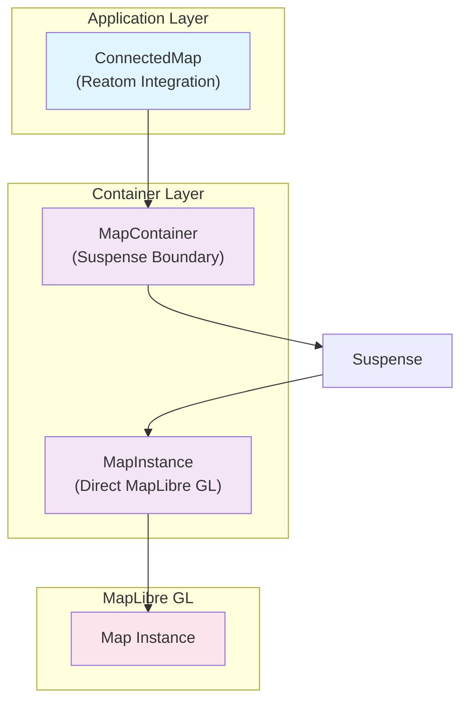

# ADR-007: Pragmatic Map Loading with Suspense

## Problem

[`src/components/ConnectedMap/map-libre-adapter/index.tsx`](../../src/components/ConnectedMap/map-libre-adapter/index.tsx) has real problems that need fixing:

**1. Manual Loading State Hell**

```typescript
// Lines 47-52: Repeated everywhere
const [isReady, setIsReady] = useState(false);
useEffect(() => {
  if (!map || !isReady) return; // This pattern everywhere
  // Actual logic here
}, [map, isReady, ...deps]);
```

**2. Tight Coupling Issues**

```typescript
// Lines 4-10: Business logic mixed with map initialization
import { useAction } from '@reatom/npm-react';
import { configRepo } from '~core/config';
import { dispatchMetricsEvent } from '~core/metrics/dispatch';
import { currentMapPositionAtom } from '~core/shared_state/currentMapPosition';
```

**3. Duplicated Event Logic**

- MapPopover integration has 70+ lines of duplicated event handling
- Manual cleanup patterns scattered across components
- Same null checks repeated everywhere

## Decision

Fix the real problems with pragmatic solutions - no abstraction layers, no micro-hooks. Use existing `mapListenersAtom` system.

### 1. Suspense-Based Map Loading

Replace manual `isReady` tracking with Suspense:

```typescript
// ✅ Map guaranteed ready when returned
function useMapInstance(
  container: React.RefObject<HTMLDivElement>,
  config: MapConfig,
): Map {
  if (!container.current) {
    throw new Error('Container not ready');
  }

  // Suspends until map loads - no manual state tracking
  const map = useMemo(() => {
    const mapPromise = new Promise<Map>((resolve) => {
      const map = new Map({
        container: container.current!,
        ...config,
      });
      map.on('load', () => resolve(map));
    });
    throw mapPromise; // Suspense pattern
  }, [container.current, config]);

  return map;
}
```

### 2. Two-Tier Container Pattern

Ensure container is ready before map initialization:

```typescript
function MapContainer({ className, config }) {
  const [container, setContainer] = useState<HTMLDivElement | null>(null);

  return (
    <div ref={setContainer} className={className}>
      {container && (
        <Suspense fallback={<LoadingSpinner />}>
          <MapInstance container={container} config={config} />
        </Suspense>
      )}
    </div>
  );
}

function MapInstance({ container, config }) {
  const containerRef = useRef(container);
  const map = useMapInstance(containerRef, config); // Always ready

  // Direct MapLibre GL usage - no abstractions
  useEffect(() => {
    map.on('click', handleClick);
    map.on('moveend', handleMoveEnd);
    return () => {
      map.off('click', handleClick);
      map.off('moveend', handleMoveEnd);
    };
  }, []);
}
```

### 3. Use Existing `mapListenersAtom` System

No new event abstractions - use the working `mapListenersAtom` priority system:

```typescript
function MapInstance({ containerElement }) {
  const [mapListeners] = useAtom(mapListenersAtom);
  const map = useMapInstance(containerRef, config);

  // Apply mapListeners directly to map - single event loop
  useEffect(() => {
    const handlers = new Map();

    typedObjectEntries(mapListeners).forEach(([eventType, listeners]) => {
      // Sort by priority and create chain
      const sortedListeners = listeners.sort((a, b) => b.priority - a.priority);

      const chainHandler = (event) => {
        for (const { listener } of sortedListeners) {
          const shouldContinue = listener(event, event.target);
          if (!shouldContinue) break; // Priority chain stops
        }
      };

      map.on(eventType, chainHandler);
      handlers.set(eventType, chainHandler);
    });

    return () => {
      handlers.forEach((handler, eventType) => {
        map.off(eventType, handler);
      });
    };
  }, [map, mapListeners]);

  // Direct position tracking with existing atoms
  useEffect(() => {
    const handler = throttle(() => {
      updatePosition({
        lat: map.getCenter().lat,
        lng: map.getCenter().lng,
        zoom: map.getZoom(),
      });
    }, 100);

    map.on('moveend', handler);
    return () => map.off('moveend', handler);
  }, [map]);
}
```

### 4. MapPopover Integration via `mapListenersAtom`

MapPopover registers listeners through existing system - no special integration:

```typescript
// ✅ MapPopover uses same priority system as everything else
function useMapPopoverIntegration() {
  const registerMapListener = useAction(mapListenersAtom.registerMapListener);
  const popoverService = useMapPopoverService();

  useEffect(() => {
    registerMapListener({
      eventType: 'click',
      listener: (event, map) => {
        return popoverService.handleMapClick(event, map);
      },
      priority: 55, // Standard priority in existing system
    });

    registerMapListener({
      eventType: 'mousemove',
      listener: (event, map) => {
        return popoverService.handleMapHover(event, map);
      },
      priority: 55,
    });
  }, []);
}
```

### 5. Clean Separation of Concerns

Move app-specific logic out of map initialization:

```typescript
// ✅ App logic in ConnectedMap, not in adapter
function ConnectedMap({ className }) {
  return (
    <MapPopoverProvider registry={mapPopoverRegistry}>
      <Suspense fallback={<div className={className}>Loading map...</div>}>
        <MapContainer className={className} />
      </Suspense>
    </MapPopoverProvider>
  );
}

// Reatom integration stays in MapInstance - no abstraction needed
function MapInstance({ containerElement }) {
  const setCurrentMap = useAction(currentMapAtom.setMap);
  const resetCurrentMap = useAction(currentMapAtom.resetMap);
  const [, updatePosition] = useReatom3Atom(currentMapPositionAtom);

  const map = useMapInstance(containerRef, mapConfig);

  // Direct Reatom integration
  useEffect(() => {
    setCurrentMap(map);
    return () => resetCurrentMap();
  }, [map]);
}
```

## Implementation

### Current State Issues

**File**: [`src/components/ConnectedMap/ConnectedMap.tsx`](../../src/components/ConnectedMap/ConnectedMap.tsx)

- Lines 6-16: Over-abstraction imports (`useApplicationMap`, `useMapEffect`, etc.)
- Lines 86-91: Event abstraction when `mapListeners` already works
- Lines 95-123: Multiple `useMapEffect` calls instead of direct `useEffect`
- Mixed responsibilities: `useMapPopoverPriorityIntegration` separate from `mapListeners`

**What to Remove**:

- `useApplicationMap` abstraction
- `useMapEffect` wrapper
- `useMapPositionTracking` abstraction
- `useMapPopoverPriorityIntegration` separate system
- `MapEventHandler` type abstractions

**Files to Delete** (~360 lines of over-abstraction):

Core abstraction hooks:

- [`src/core/map/hooks/useApplicationMap.ts`](../../src/core/map/hooks/useApplicationMap.ts) (54 lines)
- [`src/core/map/hooks/useMapEffect.ts`](../../src/core/map/hooks/useMapEffect.ts) (13 lines)
- [`src/core/map/hooks/useMapEvents.ts`](../../src/core/map/hooks/useMapEvents.ts) (53 lines)
- [`src/core/map/hooks/useMapPositionTracking.ts`](../../src/core/map/hooks/useMapPositionTracking.ts) (39 lines)
- [`src/core/map/hooks/useMapPopoverPriorityIntegration.ts`](../../src/core/map/hooks/useMapPopoverPriorityIntegration.ts) (71 lines)

Provider abstraction layer:

- [`src/core/map/providers/IMapProvider.ts`](../../src/core/map/providers/IMapProvider.ts) (25 lines)
- [`src/core/map/providers/MapLibreProvider.ts`](../../src/core/map/providers/MapLibreProvider.ts) (106 lines)

Plugin system:

- [`src/core/map/plugins/MapPopoverPlugin.ts`](../../src/core/map/plugins/MapPopoverPlugin.ts) (47 lines)

**Remove from [`src/core/map/index.ts`](../../src/core/map/index.ts) exports** (lines 29-46):

```typescript
export type { IMapProvider, IMap } from './providers/IMapProvider';
export { MapLibreProvider, MapLibreAdapter } from './providers/MapLibreProvider';
export { useMapInstance } from './hooks/useMapInstance';
export { useMapEffect } from './hooks/useMapEffect';
export { useMapEvents } from './hooks/useMapEvents';
export { useMapPositionTracking } from './hooks/useMapPositionTracking';
export type { MapEventHandler } from './hooks/useMapEvents';
export type { MapPlugin } from './types';
export { createMapPopoverPlugin } from './plugins/MapPopoverPlugin';
export { useApplicationMap } from './hooks/useApplicationMap';
```

**Keep These** (they provide real value):

- `src/core/map/popover/*` - Working MapPopover system
- `src/core/map/utils/*` - Coordinate transformation utilities

### Target Architecture



### Migration Strategy

**Phase 1**: Remove abstraction imports from ConnectedMap.tsx

- Replace `useApplicationMap` with simple `useMapInstance`
- Replace `useMapEffect` with direct `useEffect`
- Remove `useMapPositionTracking` and `useMapPopoverPriorityIntegration`

**Phase 2**: Use existing `mapListenersAtom` system

- Apply `mapListeners` directly to map with priority sorting
- Remove separate event handler abstractions
- MapPopover registers through `mapListenersAtom` like other features

**Phase 3**: Keep Suspense, simplify everything else

- Two-tier container pattern already works
- Direct MapLibre GL calls replace wrapper functions
- Reatom integration stays in MapInstance - no callbacks needed

### Memory Management

```typescript
// ✅ Proper cleanup with direct API usage
useEffect(() => {
  const handlers = {
    click: handleClick,
    moveend: handleMoveEnd,
  };

  Object.entries(handlers).forEach(([event, handler]) => {
    map.on(event, handler);
  });

  return () => {
    Object.entries(handlers).forEach(([event, handler]) => {
      map.off(event, handler);
    });
  };
}, []);
```

## Consequences

**Eliminated Complexity**:

- No provider interfaces or abstractions
- No composable hooks for every map operation
- No manual `isReady` boolean tracking
- No conditional effects with loading checks

**Real Benefits**:

- Suspense eliminates loading state complexity
- Direct MapLibre GL usage - no learning curve
- Clean separation between map logic and app state
- Proper memory cleanup with standard patterns

**Code Reduction**:

- Remove 100+ lines of abstraction code
- Eliminate `if (!map || !isReady)` checks everywhere
- Simplify event handling to direct MapLibre GL calls
- Remove duplicated loading state management

**Performance**:

- No re-renders from `isReady` state changes
- Cleaner component lifecycle with Suspense
- Direct map API calls without wrapper overhead

This pragmatic approach fixes the real problems without over-engineering.
