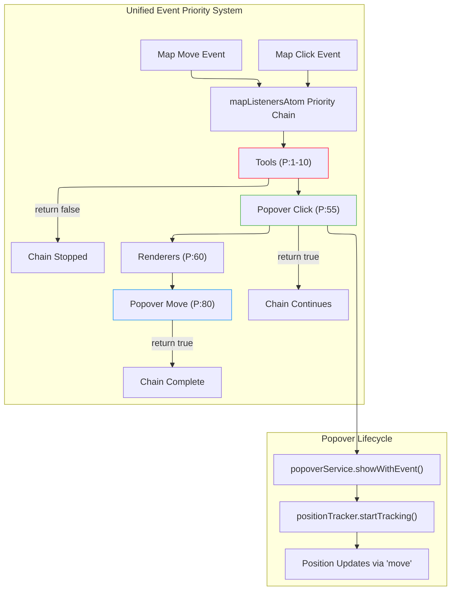

# ADR-008: MapPopover Priority Event Integration

## Status

**Approved** - Consolidation of MapPopover event handling into single priority-based system

## Executive Summary

This ADR documents the architectural decision to consolidate MapPopover click and position tracking events through the existing `registerMapListener` priority system, eliminating the dual event system conflict that prevents position tracking initialization. The integration maintains the established registry-context pattern while ensuring proper event coordination with interactive tools.

## Context and Problem Statement

### Current Architectural Issues

Investigation in [R009-MapPopover-Position-Tracking-Architecture-Analysis](../investigations/R009-MapPopover-Position-Tracking-Architecture-Analysis.md) identified critical failures in the MapPopover system:

1. **Dual Event System Conflict**: Both `mapListenersAtom` priority chain AND `useMapPopoverMaplibreIntegration` direct binding compete for the same map click events
2. **Position Tracking Failure**: Direct `map.on('move')` binding bypasses priority coordination, creating race conditions
3. **Event Consumption**: Priority chain may consume events before position tracking can initialize

### Functional Requirements

The MapPopover system must maintain:

- **Click Handling**: Open popover at clicked geographic location with appropriate content
- **Position Tracking**: Continuously track original geographic point during map movement
- **Tool Coordination**: Respect priority system when Map Ruler, Draw Tools, or Boundary Selector are active
- **Registry Integration**: Access content providers through established context pattern

## Decision

**Consolidate all MapPopover event handling through the `registerMapListener` priority system**, eliminating direct MapLibre event binding and ensuring consistent event coordination.

### Core Architectural Changes

#### 1. Priority-Based Click Integration

Replace direct `map.on('click')` binding with priority registration:

```typescript
// Remove: Direct binding in useMapPopoverMaplibreIntegration
useEffect(() => {
  map.on('click', handleMapClick); // ← REMOVED
  return () => map.off('click', handleMapClick);
}, [map, enabled, handleMapClick]);

// Add: Priority-based registration
useEffect(() => {
  const handleClick = (event: MapMouseEvent) => {
    if (popoverService.isOpen()) {
      popoverService.close();
      positionTracker.stopTracking();
    }

    const hasContent = popoverService.showWithEvent(event);
    if (hasContent) {
      positionTracker.startTracking([event.lngLat.lng, event.lngLat.lat]);
    }

    return true; // Continue chain - don't block other listeners
  };

  const unregister = registerMapListener('click', handleClick, 55);
  return unregister;
}, [popoverService, positionTracker]);
```

#### 2. Priority-Based Position Tracking

Replace direct `map.on('move')` binding with priority registration:

```typescript
// New: Priority-based position tracker
export function useMapPositionTrackerPriority(
  options: UseMapPositionTrackerOptions & { priority?: number },
): MapPositionTracker {
  const { onPositionChange, throttleMs = 0, priority = 80 } = options;
  const currentLngLatRef = useRef<[number, number] | null>(null);
  const unregisterMoveRef = useRef<(() => void) | null>(null);

  const throttledUpdatePosition = useMemo(() => {
    const rawUpdate = (event: MapMouseEvent) => {
      if (!currentLngLatRef.current) return true;

      const [lng, lat] = currentLngLatRef.current;
      try {
        const pagePoint = geographicToPageCoords(event.target, [lng, lat], {
          edgePadding: 0,
          clampToBounds: true,
        });
        onPositionChange({ x: pagePoint.x, y: pagePoint.y });
      } catch (error) {
        console.error('Error updating position:', error);
      }

      return true; // Continue chain
    };

    if (throttleMs > 0) {
      return throttle(rawUpdate, throttleMs);
    }
    return rawUpdate;
  }, [onPositionChange, throttleMs]);

  const startTracking = useCallback(
    (lngLat: [number, number]) => {
      const wrappedLngLat: [number, number] = [wrapLongitude(lngLat[0]), lngLat[1]];

      if (!isValidLngLatArray(wrappedLngLat)) {
        console.error(
          `Invalid coordinates for tracking: [${wrappedLngLat[0]}, ${wrappedLngLat[1]}]`,
        );
        return;
      }

      currentLngLatRef.current = wrappedLngLat;

      // Remove existing registration
      if (unregisterMoveRef.current) {
        unregisterMoveRef.current();
      }

      // Register via priority system
      unregisterMoveRef.current = registerMapListener(
        'move',
        throttledUpdatePosition,
        priority,
      );

      // Initial position update
      throttledUpdatePosition({
        target: {
          /* mock event for initial update */
        },
        lngLat: { lng: wrappedLngLat[0], lat: wrappedLngLat[1] },
      } as any);
    },
    [throttledUpdatePosition, priority],
  );

  const stopTracking = useCallback(() => {
    if (unregisterMoveRef.current) {
      unregisterMoveRef.current();
      unregisterMoveRef.current = null;
    }
    currentLngLatRef.current = null;
  }, []);

  return { startTracking, stopTracking, cleanup: stopTracking };
}
```

#### 3. Registry Context Integration

Maintain the established `MapPopoverProvider` context pattern:

```typescript
// PRESERVE: Existing registry context pattern
export function ConnectedMap({ className }: { className?: string }) {
  return (
    <MapPopoverProvider registry={mapPopoverRegistry}>
      <Suspense fallback={<div className={className}>Loading map...</div>}>
        <MapContainer className={className} />
      </Suspense>
    </MapPopoverProvider>
  );
}

// PRESERVE: Service access through context
function MapIntegration({ map }: { map: MapLibreMap }) {
  const popoverService = useMapPopoverService(); // ← Registry access via context

  useMapPopoverMaplibreIntegration({
    map,
    popoverService,
    enabled: true,
    trackingThrottleMs: 16,
  });
}
```

## Priority Coordination Strategy

### Event Priority Assignments

| System                    | Priority | Events               | Behavior                                  |
| ------------------------- | -------- | -------------------- | ----------------------------------------- |
| **Map Ruler**             | 1        | `click`, `mousemove` | Blocks all other interactions when active |
| **Draw Tools**            | 10       | `click`, `mousemove` | Blocks all other interactions when active |
| **Boundary Selector**     | 10       | `click`, `mousemove` | Blocks all other interactions when active |
| **MapPopover Click**      | 55       | `click`              | Shows popover, continues chain            |
| **Renderer Interactions** | 60       | `click`, `mousemove` | Feature highlighting and interaction      |
| **MapPopover Tracking**   | 80       | `move`               | Position updates, continues chain         |

### Event Flow Coordination



## Implementation Details

### Modified Integration Hook

**Location**: `src/core/map/hooks/useMapPopoverMaplibreIntegration.ts`

```typescript
export function useMapPopoverMaplibreIntegration(
  options: UseMapPopoverMaplibreIntegrationOptions,
) {
  const {
    map,
    popoverService,
    positionCalculator = defaultPositionCalculator,
    enabled = true,
    trackingThrottleMs = 16,
  } = options;

  const handlePositionChange = useCallback(
    (point: ScreenPoint) => {
      if (!popoverService.isOpen()) return;

      try {
        const { placement } = positionCalculator.calculate(/* ... */);
        popoverService.updatePosition(point, placement);
      } catch (error) {
        console.error('Error updating popover position:', error);
      }
    },
    [positionCalculator, popoverService],
  );

  // Use priority-based position tracker
  const positionTracker = useMapPositionTrackerPriority({
    onPositionChange: handlePositionChange,
    throttleMs: trackingThrottleMs,
    priority: 80, // Low priority - don't block other move handlers
  });

  // Register click handler via priority system
  useEffect(() => {
    if (!enabled) return;

    const handleMapClick = (event: MapMouseEvent) => {
      if (popoverService.isOpen()) {
        popoverService.close();
        positionTracker.stopTracking();
      }

      try {
        const hasContent = popoverService.showWithEvent(event);
        if (hasContent) {
          positionTracker.startTracking([event.lngLat.lng, event.lngLat.lat]);
        }
      } catch (error) {
        console.error('Error rendering popover content:', error);
      }

      return true; // Continue chain
    };

    const unregister = registerMapListener('click', handleMapClick, 55);
    return unregister;
  }, [enabled, popoverService, positionTracker]);

  const close = useCallback(() => {
    popoverService.close();
    positionTracker.stopTracking();
  }, [popoverService, positionTracker]);

  return { close };
}
```

### ConnectedMap Simplification

**Location**: `src/components/ConnectedMap/ConnectedMap.tsx`

```typescript
function MapIntegration({ map }: { map: MapLibreMap }) {
  const [mapListeners] = useAtom(mapListenersAtom);
  const [, updatePosition] = useReatom3Atom(currentMapPositionAtom, [], false);
  const popoverService = useMapPopoverService();

  // Single event system - priority-based coordination
  useEffect(() => {
    const handlers = new Map();

    typedObjectEntries(mapListeners).forEach(([eventType, listeners]) => {
      const sortedListeners = listeners.sort((a, b) => b.priority - a.priority);

      const chainHandler = (event: any) => {
        for (const { listener } of sortedListeners) {
          const shouldContinue = listener(event, event.target);
          if (!shouldContinue) break;
        }
      };

      map.on(eventType, chainHandler);
      handlers.set(eventType, chainHandler);
    });

    return () => {
      handlers.forEach((handler, eventType) => {
        map.off(eventType, handler);
      });
    };
  }, [map, mapListeners]);

  // Popover integration - registers itself via priority system
  useMapPopoverMaplibreIntegration({
    map,
    popoverService,
    enabled: true,
    trackingThrottleMs: 16,
  });

  // Position tracking for URL updates
  useEffect(() => {
    const throttledHandler = throttle(() => {
      const center = map.getCenter();
      updatePosition({ lat: center.lat, lng: center.lng, zoom: map.getZoom() });
    }, 100);

    const unregister = registerMapListener(
      'moveend',
      () => {
        throttledHandler();
        return true;
      },
      10,
    );

    return unregister;
  }, []);

  return null;
}
```

## Benefits and Trade-offs

### Benefits

1. **Single Event System**: Eliminates race conditions between competing click handlers
2. **Priority Coordination**: Tools can properly block popover interactions when active
3. **Consistent Architecture**: All map interactions follow the same priority-based pattern
4. **Position Tracking Reliability**: Move events respect priority system and can be blocked by tools
5. **Registry Context Preservation**: Maintains established provider access pattern

### Trade-offs

1. **Slightly More Complex**: Position tracker now requires priority parameter
2. **Event Signature Changes**: Move handlers receive `MapMouseEvent` instead of direct coordinates
3. **Throttling Considerations**: Move event throttling happens at priority level rather than direct binding

### Performance Implications

- **Event Throughput**: No change - same 16ms throttling for position updates
- **Priority Processing**: Minimal overhead - O(n) where n = registered listeners per event type
- **Memory Usage**: Slight reduction - single event system instead of dual registration

## Migration Strategy

### Phase 1: Update Position Tracker

1. Create `useMapPositionTrackerPriority` hook with priority parameter
2. Update `useMapPositionTracker` to use priority-based registration internally
3. Maintain backward compatibility with existing API

### Phase 2: Update Integration Hook

1. Replace direct `map.on('click')` with `registerMapListener('click', handler, 55)`
2. Update position tracker instantiation to use priority-based version
3. Remove all direct MapLibre event binding

### Phase 3: Verify Tool Coordination

1. Test Map Ruler blocks popover interactions (priority 1 < 55)
2. Test Draw Tools blocks popover interactions (priority 10 < 55)
3. Test Boundary Selector blocks popover interactions (priority 10 < 55)
4. Verify position tracking stops when tools are active

### Phase 4: Remove Dual System Code

1. Remove conflicting event registration patterns
2. Update documentation to reflect single event system
3. Clean up unused direct binding utilities

## Success Criteria

- ✅ Position tracking initializes correctly after popover opens
- ✅ Popover follows geographic coordinates during map movement
- ✅ Map Ruler blocks all popover interactions when active
- ✅ Draw Tools blocks all popover interactions when active
- ✅ Boundary Selector blocks all popover interactions when active
- ✅ Registry content providers work through context pattern
- ✅ No event system race conditions or conflicts
- ✅ Performance maintains 16ms position update throttling

## Future Considerations

### Enhanced Priority Coordination

The unified event system enables more sophisticated priority management:

- **Dynamic Priority Adjustment**: Tools could temporarily adjust their priority based on context
- **Event Filtering**: More granular control over which events reach which listeners
- **Performance Optimization**: Batch event processing for high-frequency events

## Related Documents

- [R009: MapPopover Position Tracking Architecture Analysis](../investigations/R009-MapPopover-Position-Tracking-Architecture-Analysis.md)
- [ADR-002: MapPopover Event System Integration](./ADR-002-MapPopover-Event-System-Integration.md)
- [R006: Map Event Management System Investigation](../investigations/R006-map-event-management.md)
