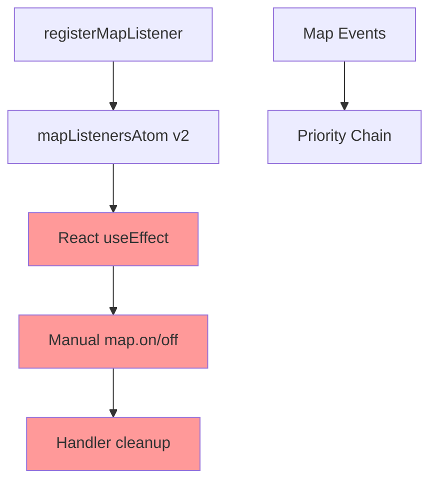
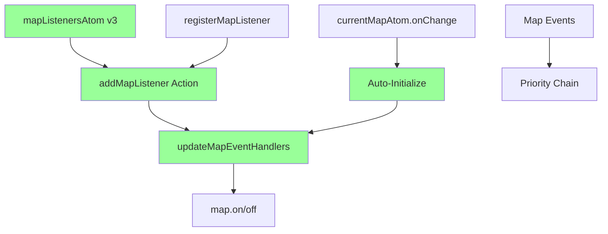

# ADR-010: MapListeners Reatom v3 Migration and Direct Map Integration

## Status

**ACCEPTED** - Implemented 2025

## Table of Contents

- [Context](#context)
- [Decision](#decision)
- [Implementation Details](#implementation-details)
- [Architecture Changes](#architecture-changes)
- [Benefits](#benefits)
- [Migration Impact](#migration-impact)

## Context

### Previous Architecture

The `mapListenersAtom` was implemented using Reatom v2 patterns with manual React-based event synchronization:

1. **Atom State Management**: Listeners stored in Reatom v2 atom with priority-based ordering
2. **React Integration**: `ConnectedMap` component manually synchronized atom state with MapLibre event handlers
3. **Manual Event Handling**: Complex `useEffect` logic to register/unregister map event handlers
4. **Dual System**: Separation between atom state and actual map event registration

**Location**: [`src/core/shared_state/mapListeners.ts:39`](../../src/core/shared_state/mapListeners.ts#L39-L90)

### Problems Identified

- **React Coupling**: Map event management coupled to React lifecycle
- **Manual Synchronization**: Complex logic to sync atom state with map handlers
- **Performance**: Unnecessary re-renders and effect dependencies
- **Architecture Inconsistency**: Mixed v2/v3 atom patterns
- **Error Prone**: Manual cleanup and priority ordering logic

## Decision

**Migrate `mapListenersAtom` to pure Reatom v3 with direct map event integration**, eliminating React-based synchronization and making the system fully reactive.

### Core Changes

1. **Pure Reatom v3 Implementation**: Convert atom and actions to `@reatom/framework`
2. **Direct Map Integration**: Actions register/unregister handlers directly with MapLibre
3. **Reactive Initialization**: Automatic setup when map becomes available via `currentMapAtom.onChange`
4. **Eliminate React Coupling**: Remove manual `useEffect` synchronization

## Implementation Details

### Reatom v3 Atom Structure

```typescript
// Pure v3 atom - no v3toV2 wrapper needed
export const mapListenersAtom = atom<MapListenersAtomState>(
  defaultListeners,
  '[Shared state] mapListenersAtom',
);

export const addMapListener = action(
  (ctx, eventType: MapEvent, listener: MapListener, priority: number) => {
    // Update atom state + register with map directly
    const state = ctx.get(mapListenersAtom);
    const listenerCategory = [...state[eventType]];
    // ... priority insertion logic
    mapListenersAtom(ctx, { ...state, [eventType]: listenerCategory });
    updateMapEventHandlers(ctx, eventType, listenerCategory);
  },
  'addMapListener',
);
```

### Direct Map Integration

```typescript
function updateMapEventHandlers(
  ctx: Ctx,
  eventType: MapEvent,
  listeners: ListenerInfo[],
) {
  const map = ctx.get(currentMapAtom.v3atom);
  if (!map) return;

  // Remove existing handler
  const existingHandler = registeredHandlers.get(eventType);
  if (existingHandler) {
    map.off(eventType, existingHandler);
    registeredHandlers.delete(eventType);
  }

  // Add new priority-ordered chain handler
  if (listeners.length > 0) {
    const sortedListeners = listeners.sort((a, b) => b.priority - a.priority);
    const chainHandler = (event: any) => {
      for (const { listener } of sortedListeners) {
        const shouldContinue = listener(event, event.target);
        if (!shouldContinue) break; // Priority chain stops
      }
    };
    map.on(eventType, chainHandler);
    registeredHandlers.set(eventType, chainHandler);
  }
}
```

### Reactive Initialization

```typescript
// Auto-initialize when map becomes available
currentMapAtom.v3atom.onChange((ctx, map) => {
  if (map) {
    initializeMapEventHandlers(ctx);
  }
});
```

## Architecture Changes

### Before: Manual React Synchronization



### After: Direct Reactive Integration



### Component Simplification

**Removed from ConnectedMap**:

- 25 lines of manual event synchronization
- `useEffect` dependency management
- `typedObjectEntries` iteration
- Handler cleanup logic
- Manual priority sorting

**Final Integration**:

```typescript
function MapIntegration({ map }: { map: MapLibreMap }) {
  const resetCurrentMap = useAction(currentMapAtom.resetMap);
  const popoverService = useMapPopoverService();

  useEffect(() => {
    return () => {
      resetCurrentMap();
      const cleanup = (map as any)._cleanup;
      if (cleanup && typeof cleanup === 'function') {
        cleanup();
      }
    };
  }, [map, resetCurrentMap]);

  // MapPopover integration with proper position tracking
  useMapPopoverMaplibreIntegration({
    map,
    popoverService,
    enabled: true,
    trackingThrottleMs: 16,
  });

  return null;
}
```

## Benefits

### Performance Improvements

- **Eliminated Re-renders**: No React state dependencies for map event handling
- **Direct Registration**: No intermediate synchronization steps
- **Reduced Effects**: Fewer `useEffect` hooks and dependencies

### Architecture Consistency

- **Pure Reatom v3**: Consistent with modern atom patterns
- **Reactive Design**: Automatic initialization and cleanup
- **Single Responsibility**: Actions handle both state and map integration

### Maintainability

- **Simplified Logic**: Event handling contained in actions
- **Self-Managing**: No manual React coordination required
- **Type Safety**: Full TypeScript integration with Reatom v3

### Developer Experience

- **Cleaner API**: Same `registerMapListener` interface preserved
- **Automatic Setup**: No manual initialization calls needed
- **Error Reduction**: Eliminates manual cleanup and synchronization bugs

## Migration Impact

### Backward Compatibility

✅ **Full Compatibility**: `registerMapListener` API unchanged

```typescript
// Same interface preserved
const unregister = registerMapListener('click', handler, 50);
unregister(); // Same cleanup pattern
```

### Component Updates

✅ **No Breaking Changes**: Existing usage continues working
✅ **Simplified Components**: Manual event handling removed from ConnectedMap
✅ **Import Changes**: Removed unused imports (`throttle`, `typedObjectEntries`, etc.)

### Performance Impact

✅ **Improved**: Eliminated React re-renders for event management
✅ **Faster**: Direct map registration without intermediate steps
✅ **Cleaner**: Reduced component complexity and effect dependencies

### System Integration

✅ **Enhanced**: Better integration with Reatom v3 ecosystem
✅ **Consistent**: Matches patterns used in other v3 atoms
✅ **Reliable**: Automatic initialization prevents race conditions

## Validation

The migration successfully:

1. ✅ Preserves all existing functionality
2. ✅ Maintains priority-based event ordering
3. ✅ Eliminates React coupling in map event management
4. ✅ Improves performance by removing unnecessary re-renders
5. ✅ Provides automatic initialization and cleanup
6. ✅ Maintains backward compatibility for all consumers

This architectural decision creates a more reactive, performant, and maintainable map event management system while preserving the existing API surface.
