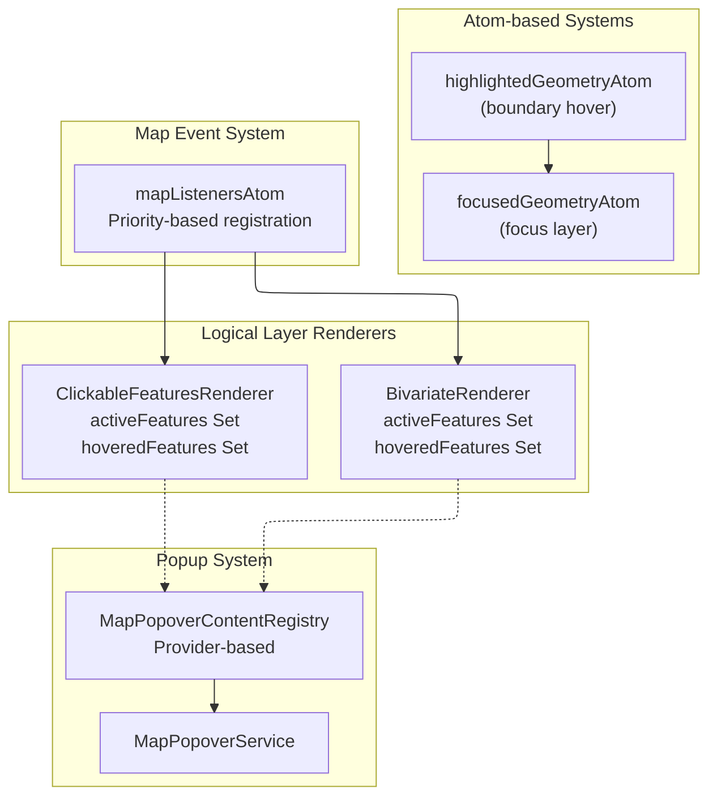
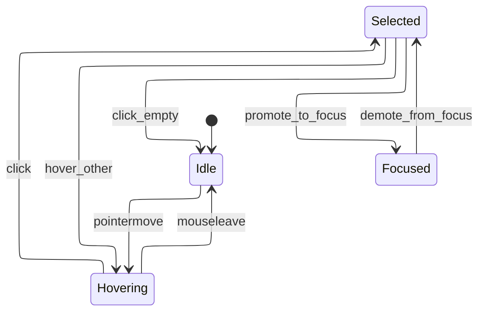
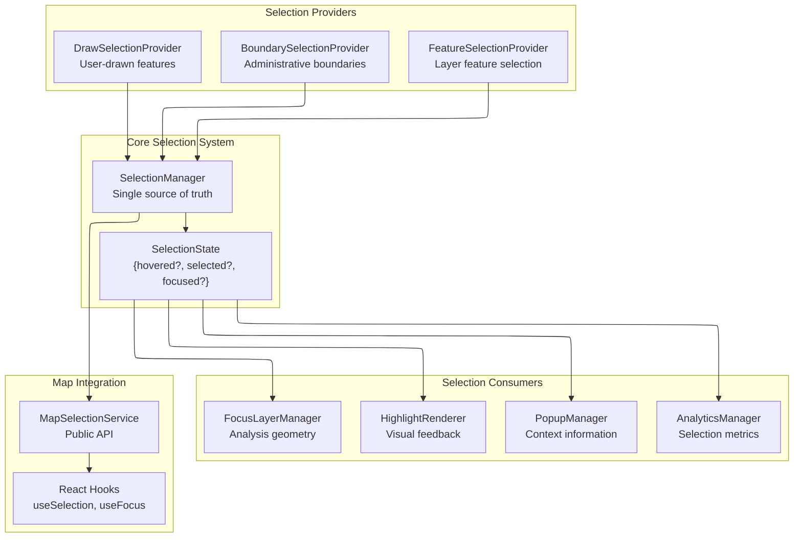

# ADR-014: Map Feature Selection & Focus Architecture

## Status

**Draft**

## Table of Contents

1. [Executive Summary](#executive-summary)
2. [Current State Investigation](#current-state-investigation)
3. [System Architecture Analysis](#system-architecture-analysis)
4. [Implementation Issues](#implementation-issues)
5. [GIS Industry Best Practices](#gis-industry-best-practices)
6. [Proposed Architecture](#proposed-architecture)
7. [System Boundaries](#system-boundaries)

## Executive Summary

This document investigates the current map feature selection and focus systems, identifies architectural issues, and proposes a unified architecture based on GIS industry best practices. The current implementation suffers from fragmented selection logic across multiple renderers, inconsistent state management, and lack of coordination between hover, click, and focus behaviors.

## Current State Investigation

### Selection State Management Patterns

**Location**: Multiple implementations scattered across renderers

#### Per-Renderer Feature State Handlers

**Location**: [`activeAndHoverFeatureStates.ts:22-111`](../../src/core/logical_layers/renderers/helpers/activeAndHoverFeatureStates.ts#L22-L111)

```typescript
export function createFeatureStateHandlers(ctx: {
  map: maplibregl.Map;
  sourceId: string;
  sourceLayer: string;
}) {
  const activeFeatures = new Set<string | number>();
  const hoveredFeatures = new Set<string | number>();
  // Direct MapLibre setFeatureState calls
  const setFeatureState = (featureId, newState) => {
    ctx.map.setFeatureState(
      { source: ctx.sourceId, id: featureId, sourceLayer: ctx.sourceLayer },
      newState,
    );
  };
}
```

**Usage**: [`BivariateRenderer.tsx:95-110`](../../src/core/logical_layers/renderers/BivariateRenderer/BivariateRenderer.tsx#L95-L110), [`ClickableFeaturesRenderer.tsx:105-120`](../../src/core/logical_layers/renderers/ClickableFeaturesRenderer/ClickableFeaturesRenderer.tsx#L105-L120)

Each renderer maintains independent Sets for `activeFeatures` and `hoveredFeatures` with no coordination between renderers.

#### Boundary Selector Highlight System

**Location**: [`highlightedGeometry.ts:1-10`](../../src/features/boundary_selector/atoms/highlightedGeometry.ts#L1-L10)

```typescript
export const highlightedGeometryAtom = atom<FeatureCollection | Feature>(
  {
    type: 'FeatureCollection',
    features: [],
  },
  'highlightedGeometryAtom',
);
```

**Usage**: [`boundaryActions.ts:14-22`](../../src/features/boundary_selector/atoms/boundaryActions.ts#L14-L22)

Separate atom-based system for boundary hover highlighting, completely isolated from renderer-based selection.

#### Focus Geometry System

**Location**: [`focusedGeometryAtom.ts:7-46`](../../src/core/focused_geometry/model.ts#L7-L46)

```typescript
export const focusedGeometryAtom = createAtom(
  {
    setFocusedGeometry: (
      source: GeometrySource | null,
      geometry: GeoJSON.GeoJSON | null,
    ) => ({ source, geometry }),
    reset: () => null,
  },
  // Complex hash-based change detection
);
```

Independent focused geometry system with no connection to selection states.

### Event System Analysis

**Location**: [`mapListeners.ts`](../../src/core/shared_state/mapListeners.ts) (event registration system)

Priority-based event listener system where multiple renderers register competing handlers:

- **Priority 60**: Feature hover/click handlers (`BivariateRenderer`, `ClickableFeaturesRenderer`)
- **Priority 10**: Exclusive tools (`DrawTools`, `BoundarySelector`)
- **Priority 1**: Map ruler

**Issue**: No coordination between same-priority listeners leads to race conditions.

### Popup/Tooltip Coordination

**Location**: [`MapPopoverContentRegistry.ts:10-199`](../../src/core/map/popover/MapPopoverContentRegistry.ts#L10-L199)

Registry-based popup system with provider coordination, but disconnected from selection state:

```typescript
export class MapPopoverContentRegistry implements IMapPopoverContentRegistry {
  private providers = new Map<string, ProviderRegistration>();

  renderContent(mapEvent: MapMouseEvent, onClose: () => void): React.ReactNode | null {
    // Queries features independently for each provider
    this.memoizedFeatures = mapEvent.target.queryRenderedFeatures(mapEvent.point);
  }
}
```

Each popup provider independently queries features without leveraging selection state.

## System Architecture Analysis

### Current Architecture Pattern



**Problems**:

1. **No Coordination**: Each renderer maintains independent selection state
2. **State Fragmentation**: Selection, hover, and focus managed by different systems

## Implementation Issues

### Issue 1: Renderer State Isolation

**Problem**: Each renderer (`BivariateRenderer`, `ClickableFeaturesRenderer`) maintains independent `Set<string | number>` for active/hovered features.

**Impact**: Multiple features can be "selected" simultaneously across different layers, causing visual confusion.

**Evidence**: [`BivariateRenderer.tsx:95-110`](../../src/core/logical_layers/renderers/BivariateRenderer/BivariateRenderer.tsx#L95-L110) and [`ClickableFeaturesRenderer.tsx:105-120`](../../src/core/logical_layers/renderers/ClickableFeaturesRenderer/ClickableFeaturesRenderer.tsx#L105-L120) show identical but isolated implementations.

### Issue 2: Selection-Focus Disconnect

**Problem**: Selection state and focus layer operate independently.

**Impact**: Users can't easily promote selected features to focus layer.

**Evidence**: [`focusedGeometryAtom`](../../src/core/focused_geometry/model.ts) and renderer selection systems have no integration points.

## GIS Industry Best Practices

### OpenLayers Selection Model

**Pattern**: Single selection manager with feature state coordination

```javascript
// OpenLayers hover selection pattern
map.on('pointermove', function (e) {
  if (selected !== null) {
    selected.setStyle(undefined);
    selected = null;
  }
  map.forEachFeatureAtPixel(e.pixel, function (f) {
    selected = f;
    f.setStyle(selectStyle);
    return true; // Stop at first feature
  });
});
```

**Key Principles**:

- Single selection state per map
- Clear previous selection before setting new
- First feature wins at pixel location

### ArcGIS Selection Architecture

**Pattern**: Centralized selection manager with event coordination

- **Selection Set**: Single source of truth for selected features across all layers
- **Selection Events**: Coordinated selection-changed events
- **Visual Feedback**: Consistent highlight styling across feature types
- **Tool Integration**: Selection state integrates with analysis tools

### QGIS Vector Editor Model

**Pattern**: Modal selection with tool-specific behavior

- **Selection Tool**: Dedicated tool for feature selection
- **Hover Preview**: Temporary highlight before selection
- **Multi-Selection**: Coordinated multi-feature selection with modifier keys
- **Context Actions**: Selection-aware context menus

## Proposed Architecture

### Core Selection State Machine



### Unified Selection Architecture



### Selection State Interface

```typescript
interface SelectionState {
  // Single hovered feature across all layers
  hovered: {
    featureId: string;
    layerId: string;
    feature: MapGeoJSONFeature;
    timestamp: number;
  } | null;

  // Single selected feature (persistent until new selection)
  selected: {
    featureId: string;
    layerId: string;
    feature: MapGeoJSONFeature;
    timestamp: number;
    source: 'click' | 'programmatic';
  } | null;

  // Focused geometry for analysis (can be different from selected)
  focused: {
    geometry: GeoJSON.Feature | GeoJSON.FeatureCollection;
    source: 'selection' | 'boundary' | 'drawn' | 'uploaded';
    timestamp: number;
  } | null;
}

interface SelectionManager {
  // State queries
  getState(): SelectionState;
  getHovered(): SelectionState['hovered'];
  getSelected(): SelectionState['selected'];
  getFocused(): SelectionState['focused'];

  // State mutations
  setHovered(feature: MapGeoJSONFeature | null): void;
  setSelected(feature: MapGeoJSONFeature | null, source?: 'click' | 'programmatic'): void;
  setFocused(geometry: GeoJSON.Feature | GeoJSON.FeatureCollection, source: string): void;

  // Promotions
  promoteSelectedToFocus(): boolean;
  clearAll(): void;

  // Event subscriptions
  onSelectionChange(callback: (state: SelectionState) => void): () => void;
}
```

### Migration Strategy

1. **Phase 1**: Implement `SelectionManager` (leveraging existing mapListeners system)
2. **Phase 2**: Migrate `BivariateRenderer` and `ClickableFeaturesRenderer` to use selection manager
3. **Phase 3**: Integrate boundary selector with unified selection
4. **Phase 4**: Connect focus layer to selection promotion
5. **Phase 5**: Remove legacy per-renderer selection code

## System Boundaries

### Managed by Selection System

- Feature hover state coordination
- Single selection state across all layers
- Selection-to-focus promotion
- Visual highlight coordination

### External Dependencies

- MapLibre GL feature state API
- Logical layer renderer lifecycle
- Popup content provider system
- Focus layer rendering

### Out of Scope

- Layer-specific styling definitions
- Feature geometry modifications
- Analytics data processing
- User authentication for selections
