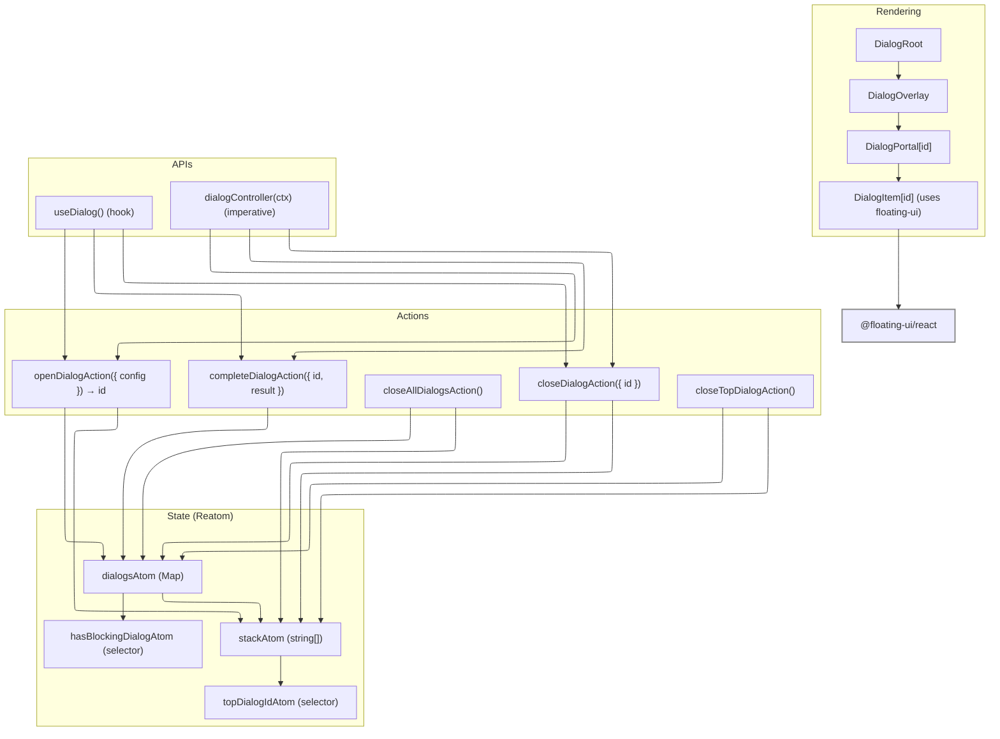

# ADR-016: Dialog System Architecture

## Status

Accepted — Replacement for the current single-modal implementation

## Table of Contents

- [Executive Summary](#executive-summary)
- [System Architecture](#system-architecture)
- [Implementation Analysis](#implementation-analysis)
- [Current Usage Analysis](#current-usage-analysis)
- [State Management Integration](#state-management-integration)
- [Architectural Inconsistencies](#architectural-inconsistencies)
- [System Boundaries](#system-boundaries)

## Executive Summary

This ADR defines a pragmatic, extensible dialog system that supports multiple dialogs, stacking, accessibility, and mobile UX while reusing `@floating-ui/react` and established application patterns. It integrates with our existing Reatom v3 store and `@reatom/npm-react` hooks without introducing a separate store. The API provides a single headless `open` primitive and typed helpers (`alert`, `confirm`, `prompt`, `custom`), optimized for developer experience and testability.

## System Architecture

**Core pattern:** Reatom atoms maintain dialog registry and z-ordered stack. A single React root renders an overlay and portals each dialog. Floating/focus management lives in per-dialog components, not in state. Actions accept a single object payload (v3/v2 bridge-compatible).



### Component List

- `DialogRoot` renders overlay and all active dialogs; placed near app root once.
- `DialogPortal` wraps each dialog instance in `FloatingPortal` and `FloatingFocusManager`.
- `DialogItem` hosts `useFloating` for each dialog, renders content.
- Headless helpers: typed builders for `alert`, `confirm`, `prompt`, `custom` on top of `open`.

## Implementation Analysis

### Data Structures

```ts
// src/core/dialog/types.ts
export type DialogMode = 'modal' | 'nonmodal';

export type DialogType = 'alert' | 'confirm' | 'prompt' | 'custom';

export interface DialogOptions {
  title?: string;
  description?: string;
  variant?: 'info' | 'warning' | 'error' | 'success';
  mode?: DialogMode; // modal blocks background interactions
  persistent?: boolean; // disable backdrop/Escape close
  size?: 'sm' | 'md' | 'lg' | 'xl';
  position?: 'center' | 'top' | 'bottom';
}

export interface DialogConfig {
  type: DialogType;
  content: React.ReactNode;
  options?: DialogOptions;
}

export interface DialogInstance {
  id: string;
  type: DialogType;
  options: DialogOptions;
  createdAt: number;
}
```

```ts
// src/core/dialog/atoms.ts
import { atom } from '@reatom/framework';

export const dialogsAtom = atom<Map<string, DialogInstance>>(new Map(), 'dialogsAtom');
export const stackAtom = atom<string[]>([], 'stackAtom');

export const topDialogIdAtom = atom((ctx) => {
  const stack = ctx.spy(stackAtom);
  return stack.length ? stack[stack.length - 1] : null;
}, 'topDialogIdAtom');

export const hasBlockingDialogAtom = atom((ctx) => {
  const dialogs = ctx.spy(dialogsAtom);
  const stack = ctx.spy(stackAtom);
  return stack.some((id) => dialogs.get(id)?.options.mode === 'modal');
}, 'hasBlockingDialogAtom');
```

### Actions (single-object payloads)

```ts
// src/core/dialog/actions.ts
import { action } from '@reatom/framework';
import { nanoid } from 'nanoid';

export const openDialogAction = action((ctx, { config }: { config: DialogConfig }) => {
  const id = nanoid();
  const instance: DialogInstance = {
    id,
    type: config.type,
    options: { mode: 'modal', ...config.options },
    createdAt: Date.now(),
  };
  dialogsAtom(ctx, (prev) => new Map(prev).set(id, instance));
  stackAtom(ctx, (prev) => [...prev, id]);
  return id;
}, 'openDialogAction');

export const closeDialogAction = action((ctx, { id }: { id: string }) => {
  dialogsAtom(ctx, (prev) => {
    const next = new Map(prev);
    next.delete(id);
    return next;
  });
  stackAtom(ctx, (prev) => prev.filter((x) => x !== id));
}, 'closeDialogAction');

export const closeTopDialogAction = action((ctx) => {
  const topId = ctx.get(topDialogIdAtom);
  if (topId) ctx.schedule(() => closeDialogAction(ctx, { id: topId }));
}, 'closeTopDialogAction');

export const closeAllDialogsAction = action((ctx) => {
  dialogsAtom(ctx, () => new Map());
  stackAtom(ctx, () => []);
}, 'closeAllDialogsAction');
```

### Result handling (promises)

Resolvers are non-serializable. Keep them outside atoms in a module-level map keyed by `id`.

```ts
// src/core/dialog/resultRegistry.ts
const resolvers = new Map<string, (value: unknown) => void>();

export function registerResolver<T>(id: string, resolve: (value: T) => void) {
  resolvers.set(id, resolve as (v: unknown) => void);
}

export function resolveAndDelete<T>(id: string, value: T) {
  const resolve = resolvers.get(id);
  if (resolve) {
    resolve(value);
    resolvers.delete(id);
  }
}
```

```ts
// src/core/dialog/complete.ts
import { action } from '@reatom/framework';
import { resolveAndDelete } from './resultRegistry';

export const completeDialogAction = action(
  (ctx, { id, result }: { id: string; result: unknown }) => {
    resolveAndDelete(id, result);
    ctx.schedule(() => closeDialogAction(ctx, { id }));
  },
  'completeDialogAction',
);
```

### Rendering and floating-ui integration

```ts
// src/core/dialog/DialogRoot.tsx
import { useAtom } from '@reatom/npm-react';
import { FloatingOverlay } from '@floating-ui/react';

export function DialogRoot() {
  const hasBlocking = useAtom(hasBlockingDialogAtom);
  const stack = useAtom(stackAtom);
  return (
    <>
      {hasBlocking && <FloatingOverlay lockScroll />}
      {stack.map((id) => (
        <DialogPortal key={id} id={id} />
      ))}
    </>
  );
}
```

```ts
// src/core/dialog/DialogPortal.tsx
import { FloatingPortal, FloatingFocusManager } from '@floating-ui/react';
import { useAtom } from '@reatom/npm-react';

export function DialogPortal({ id }: { id: string }) {
  const dialog = useAtom(dialogsAtom, (m) => m.get(id));
  const isTop = useAtom(topDialogIdAtom, (top) => top === id);
  if (!dialog) return null;
  return (
    <FloatingPortal>
      <FloatingFocusManager modal={dialog.options.mode === 'modal'} returnFocus disabled={!isTop}>
        <DialogItem id={id} />
      </FloatingFocusManager>
    </FloatingPortal>
  );
}
```

```ts
// src/core/dialog/DialogItem.tsx
import { useFloating, offset, flip, shift, size } from '@floating-ui/react';

export function DialogItem({ id }: { id: string }) {
  const dialog = useAtom(dialogsAtom, (m) => m.get(id));
  const close = useAction(closeDialogAction);
  const complete = useAction(completeDialogAction);

  const floating = useFloating({
    open: true,
    onOpenChange: (open) => {
      if (!open && dialog && !dialog.options.persistent) close({ id });
    },
    middleware: [offset(10), flip(), shift(), size()],
  });

  if (!dialog) return null;
  const { options } = dialog;

  const onCancel = () => complete({ id, result: null });
  const onConfirm = (value: unknown) => complete({ id, result: value });

  return (
    <div
      ref={floating.refs.setFloating}
      role="dialog"
      aria-modal={options.mode === 'modal'}
      aria-labelledby={options.title ? `${id}-title` : undefined}
      aria-describedby={options.description ? `${id}-description` : undefined}
    >
      {/* Render provided content; helpers will pass the proper handlers */}
      {typeof dialogContentRenderer === 'function'
        ? dialogContentRenderer(id, dialog, { onCancel, onConfirm })
        : null}
    </div>
  );
}
```

### Public API (DX)

Single primitive plus helpers. Both promise and non-promise forms are provided.

```ts
// src/core/dialog/api.ts
export interface OpenOptions extends DialogOptions { type?: DialogType }

export function dialogController(ctx: (fn: any, payload?: any) => any) {
  const open = <T = unknown>({ content, type = 'custom', ...opts }: { content: React.ReactNode } & OpenOptions) => {
    return new Promise<T>((resolve) => {
      const id = ctx(openDialogAction, { config: { type, content, options: opts } });
      registerResolver<T>(id, resolve);
    });
  };

  return {
    open,
    alert: (o: { title: string; description?: string; variant?: DialogOptions['variant'] }) =>
      open<void>({ type: 'alert', content: <AlertContent {...o} />, ...o }),
    confirm: (o: { title: string; description?: string; confirmText?: string; cancelText?: string; variant?: DialogOptions['variant'] }) =>
      open<boolean>({ type: 'confirm', content: <ConfirmContent {...o} />, ...o }),
    prompt: (o: { title: string; description?: string; placeholder?: string; validator?: (v: string) => string | null }) =>
      open<string | null>({ type: 'prompt', content: <PromptContent {...o} />, ...o }),
    close: (id: string) => ctx(closeDialogAction, { id }),
    closeAll: () => ctx(closeAllDialogsAction),
  };
}

// React hook wrapper
export function useDialog() {
  const ctx = useAtom();
  return useMemo(() => dialogController(ctx), [ctx]);
}

// Programmatic controller using global store
export const dialog = dialogController(store.v3ctx);
```

Notes:

- `content` is a React node; helpers may inject `onConfirm`/`onCancel` into their own internal content components.
- The module-level `dialog` object enables usage outside React (e.g., thunks), consistent with `src/core/modal/index.tsx` current pattern.

### Accessibility

- Use `role="dialog"`, `aria-modal` per instance.
- Manage focus with `FloatingFocusManager`; only top-of-stack dialog is focusable.
- Do not place `aria-live` on the dialog container. If needed, use a separate live region.
- Esc/backdrop handling respects `persistent` and `mode`.

### Mobile Responsiveness

- Prefer CSS and `floating-ui` sizing for most dialogs.
- For bottom sheets, use `react-modal-sheet` behind a `MobileSheetDialog` wrapper, selected by options or by a responsive hook.
- SSR-safe detection: use a hook (`useIsMobile`) with media queries; do not access `window` in atoms.

## Current Usage Analysis

Current modal is single-instance and promise-based: **Location**: [`src/core/modal/index.tsx`](mdc:../../src/core/modal/index.tsx#L25-L66)

```ts
// Current system (simplified)
export function showModal(component, extraProps?) {
  /* Promise with onConfirm */
}
export function GlobalModal() {
  /* Renders single <Modal> */
}
```

Key differences:

- New system supports multiple concurrent dialogs with a stack and overlay lock.
- Result promises are resolved via registry for any dialog type.
- Rendering uses per-dialog `useFloating` and focus management.

## State Management Integration

- Actions use single-object payloads (bridge-friendly) [[v3/v2 bridge constraint]].
- No separate `DialogProvider`; use existing global store and `@reatom/npm-react` hooks.
- React hook `useDialog()` returns controller bound to the current ctx; `dialog` exposes the same API bound to `store.v3ctx`.

## Architectural Inconsistencies

This ADR corrects issues observed in ADR-015 and aligns with project conventions:

- Hooks (`useFloating`) live inside React components, not in state factories.
- Selectors and types are consistent (`mode` determines modal behavior; no `'modal'` in `DialogType`).
- Single ctx strategy (global store), avoiding dual-provider confusion.
- SSR-safe mobile detection via hooks, not atoms.
- Atom naming uses `Atom` suffix where appropriate for discoverability.

## System Boundaries

Included:

- Dialog state and stacking, rendering primitives, focus/overlay, typed helpers.

Excluded:

- Toast notifications, tooltips, popovers (separate systems).
- Form validation (handled by dialog content).
- Animation specifics (CSS and floating-ui defaults).

---

References:

- Current modal: **Location**: [`src/core/modal/index.tsx`](mdc:../../src/core/modal/index.tsx#L1-L67)
- Prior analysis: **Location**: [`docs/architecture/ADR-015-Dialog-System-Architecture.md`](mdc:./ADR-015-Dialog-System-Architecture.md#L20-L60)
