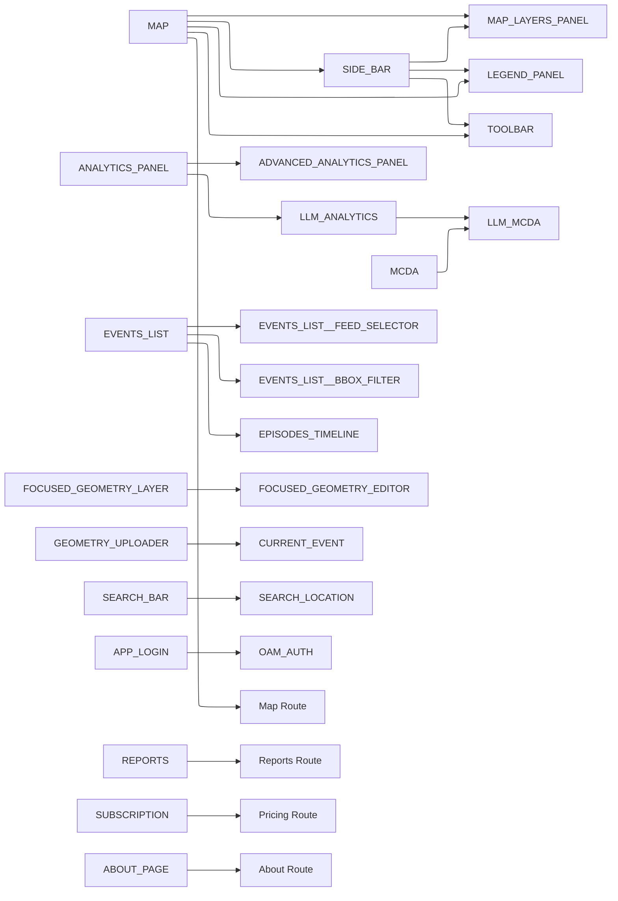
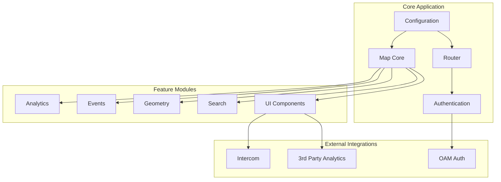
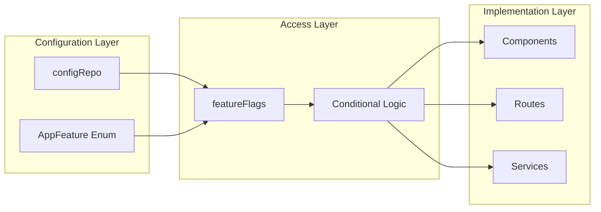

# Feature Flags Current State Analysis

## Table of Contents

- [Overview](#overview)
- [Current Feature Flag Inventory](#current-feature-flag-inventory)
- [Deprecated Feature Flags Analysis](#deprecated-feature-flags-analysis)
- [Feature Flag Access Patterns](#feature-flag-access-patterns)
- [Dependency Analysis](#dependency-analysis)
- [System Boundaries](#system-boundaries)
- [Recommendations](#recommendations)

## Overview

This document provides a comprehensive analysis of the current feature flag system in the disaster-ninja-fe codebase. It identifies active feature flags, deprecated flags, access patterns, dependencies, and system boundaries to guide future development and maintenance.

## Current Feature Flag Inventory

### Active Feature Flags

| Feature Flag                 | Status | Description                            | Usage Count |
| ---------------------------- | ------ | -------------------------------------- | ----------- |
| `ABOUT_PAGE`                 | Active | About page and documentation           | 8           |
| `ADMIN_BOUNDARY_BREADCRUMBS` | Active | Administrative boundary breadcrumbs    | 4           |
| `ADVANCED_ANALYTICS_PANEL`   | Active | Advanced analytics panel functionality | 3           |
| `ANALYTICS_PANEL`            | Active | Core analytics panel                   | 4           |
| `APP_LOGIN`                  | Active | Application login functionality        | 3           |
| `BOUNDARY_SELECTOR`          | Active | Boundary selection tools               | 2           |
| `CREATE_LAYER`               | Active | Layer creation functionality           | 2           |
| `CURRENT_EVENT`              | Active | Current event display and management   | 3           |
| `CUSTOM_ROUTES`              | Active | Custom route configuration             | 2           |
| `EPISODES_TIMELINE`          | Active | Event episodes timeline                | 3           |
| `EVENTS_LIST`                | Active | Events list functionality              | 6           |
| `EVENTS_LIST__BBOX_FILTER`   | Active | BBox filter for events list            | 2           |
| `EVENTS_LIST__FEED_SELECTOR` | Active | Feed selector for events list          | 3           |
| `FOCUSED_GEOMETRY_EDITOR`    | Active | Focused geometry editing tools         | 2           |
| `FOCUSED_GEOMETRY_LAYER`     | Active | Focused geometry layer display         | 2           |
| `GEOMETRY_UPLOADER`          | Active | Geometry upload functionality          | 2           |
| `INTERCOM`                   | Active | Intercom integration                   | 2           |
| `LAYER_FEATURES_PANEL`       | Active | Layer features panel                   | 3           |
| `LAYERS_COPYRIGHTS`          | Active | Layer copyrights display               | 2           |
| `LAYERS_IN_AREA`             | Active | Layers in area functionality           | 2           |
| `LEGEND_PANEL`               | Active | Legend panel display                   | 3           |
| `LIVE_SENSOR`                | Active | Live sensor data                       | 2           |
| `LLM_ANALYTICS`              | Active | LLM-powered analytics                  | 4           |
| `LLM_MCDA`                   | Active | LLM-powered MCDA                       | 2           |
| `LOCATE_ME`                  | Active | Location services                      | 2           |
| `MAP`                        | Active | Core map functionality                 | 3           |
| `MAP_LAYERS_PANEL`           | Active | Map layers panel                       | 2           |
| `MAP_RULER`                  | Active | Map ruler tools                        | 2           |
| `MAP_TITLE`                  | Active | Map title display                      | 2           |
| `MCDA`                       | Active | Multi-criteria decision analysis       | 3           |
| `MULTIVARIATE_ANALYSIS`      | Active | Multivariate analysis                  | 2           |
| `OAM_AUTH`                   | Active | OAM authentication                     | 3           |
| `OSM_EDIT_LINK`              | Active | OSM edit link functionality            | 2           |
| `REFERENCE_AREA`             | Active | Reference area functionality           | 4           |
| `REPORTS`                    | Active | Reports functionality                  | 3           |
| `SEARCH_BAR`                 | Active | Search bar functionality               | 2           |
| `SEARCH_LOCATION`            | Active | Location search functionality          | 2           |
| `SIDE_BAR`                   | Active | Sidebar navigation                     | 2           |
| `SUBSCRIPTION`               | Active | Subscription management                | 3           |
| `TOASTS`                     | Active | Toast notifications                    | 2           |
| `TOOLBAR`                    | Active | Toolbar functionality                  | 2           |
| `TOOLTIP`                    | Active | Tooltip functionality                  | 1           |
| `USE_3RDPARTY_ANALYTICS`     | Active | Third-party analytics                  | 2           |

### Deprecated Feature Flags

| Feature Flag              | Status     | Replacement                  | Notes                     |
| ------------------------- | ---------- | ---------------------------- | ------------------------- |
| `FEED_SELECTOR`           | Deprecated | `EVENTS_LIST__FEED_SELECTOR` | Still used in 2 locations |
| `BIVARIATE_MANAGER`       | Deprecated | None                         | Marked as removed         |
| `BIVARIATE_COLOR_MANAGER` | Deprecated | None                         | Marked as removed         |

## Deprecated Feature Flags Analysis

### Successfully Removed Flags

The following feature flags have been successfully removed from the codebase and are no longer referenced:

- `app_registration`
- `communities`
- `current_episode`
- `episode_list`
- `routing`
- `geocoder`
- `feature_settings`
- `header`
- `popup`
- `translation`
- `url_store`
- `interactive_map`
- `share_map`
- `small_front_facing_map`

### Deprecated Usage Status

All deprecated feature flag usage has been successfully migrated:

**Completed Migrations:**

- `src/core/router/components/Router.tsx:125` - `'about_page'` → `AppFeature.ABOUT_PAGE`
- `src/core/url_store/atoms/urlStore.ts:40` - `'events_list__feed_selector'` → `AppFeature.EVENTS_LIST__FEED_SELECTOR`
- `src/features/events_list/components/FeedSelector/index.tsx:9` - `FEED_SELECTOR` → `EVENTS_LIST__FEED_SELECTOR`

**Note:** The deprecated `FEED_SELECTOR` feature flag is still defined in the `AppFeature` enum but is no longer used in the codebase.

## Feature Flag Access Patterns

### Primary Access Pattern

The standard pattern for accessing feature flags is:

```typescript
const featureFlags = configRepo.get().features;
const isFeatureEnabled = featureFlags[AppFeature.FEATURE_NAME];
```

### Access Pattern Distribution

| Pattern                                    | Count | Examples                     |
| ------------------------------------------ | ----- | ---------------------------- |
| `configRepo.get().features[AppFeature.X]`  | 45+   | Most common pattern          |
| `configRepo.get().features['string']`      | 0     | All string literals migrated |
| `configRepo?.get().features[AppFeature.X]` | 3     | Optional chaining            |

### Usage Contexts

1. **Conditional Rendering** (Most Common)

   ```typescript
   {featureFlags[AppFeature.EVENTS_LIST] && <EventListPanel />}
   ```

2. **Lazy Loading**

   ```typescript
   if (featureFlags[AppFeature.CURRENT_EVENT]) {
     import('~features/current_event').then(({ initCurrentEvent }) => initCurrentEvent());
   }
   ```

3. **Route Requirements**

   ```typescript
   requiredFeature: AppFeature.REPORTS;
   ```

4. **Configuration Access**
   ```typescript
   const config = configRepo.get().features[AppFeature.SUBSCRIPTION];
   ```

## Dependency Analysis

### Critical Dependencies

| Feature                          | Depends On               | Required | Evidence                                     |
| -------------------------------- | ------------------------ | -------- | -------------------------------------------- |
| `EVENTS_LIST__FEED_SELECTOR`     | `EVENTS_LIST`            | Yes      | Conditional rendering in EventsPanel         |
| `EVENTS_LIST__BBOX_FILTER`       | `EVENTS_LIST`            | Yes      | Conditional rendering in EventsPanelSettings |
| `ADVANCED_ANALYTICS_PANEL`       | `ANALYTICS_PANEL`        | Yes      | Shared panel state management                |
| `FOCUSED_GEOMETRY_EDITOR`        | `FOCUSED_GEOMETRY_LAYER` | Yes      | Editor requires layer to exist               |
| `LLM_MCDA`                       | `MCDA`, `LLM_ANALYTICS`  | Yes      | Combines MCDA and LLM analytics              |
| `SEARCH_BAR` + `SEARCH_LOCATION` | Both required            | Yes      | Combined conditional in Map.tsx              |

### Functional Dependencies



### Feature Groups

#### Map Core Features

- `MAP`, `MAP_LAYERS_PANEL`, `LEGEND_PANEL`, `TOOLBAR`, `SIDE_BAR`

#### Analytics Features

- `ANALYTICS_PANEL`, `ADVANCED_ANALYTICS_PANEL`, `LLM_ANALYTICS`, `MCDA`, `LLM_MCDA`

#### Events Features

- `EVENTS_LIST`, `EVENTS_LIST__FEED_SELECTOR`, `EVENTS_LIST__BBOX_FILTER`, `EPISODES_TIMELINE`, `CURRENT_EVENT`

#### Geometry Features

- `GEOMETRY_UPLOADER`, `FOCUSED_GEOMETRY_LAYER`, `FOCUSED_GEOMETRY_EDITOR`, `BOUNDARY_SELECTOR`, `REFERENCE_AREA`

#### Search Features

- `SEARCH_BAR`, `SEARCH_LOCATION`

#### Authentication Features

- `APP_LOGIN`, `OAM_AUTH`

#### UI Features

- `TOASTS`, `INTERCOM`, `USE_3RDPARTY_ANALYTICS`, `LAYERS_COPYRIGHTS`, `MAP_TITLE`

## System Boundaries

### Core Application Boundaries



### Feature Flag System Architecture



## Recommendations

### Immediate Actions

1. **✅ Deprecated Usage Migration Complete**
   - All deprecated feature flag usage has been successfully migrated to use `AppFeature` enum
   - String literal usage has been eliminated

2. **✅ Access Pattern Standardization Complete**
   - Consistent use of `AppFeature` enum enforced across codebase
   - All string literal feature flag access removed

### Medium-term Improvements

1. **Dependency Validation**
   - Implement runtime validation for feature flag dependencies
   - Add TypeScript types for feature flag configurations

2. **Documentation**
   - Add JSDoc comments for each feature flag
   - Document dependencies in feature flag definitions

3. **Testing**
   - Add unit tests for feature flag combinations
   - Test dependency validation logic

### Long-term Architecture

1. **Feature Flag Management**
   - Consider implementing a feature flag management service
   - Add feature flag analytics and usage tracking

2. **Configuration Validation**
   - Implement schema validation for feature flag configurations
   - Add build-time validation for feature flag dependencies

3. **Performance Optimization**
   - Consider lazy loading strategies for feature flag evaluation
   - Implement feature flag caching where appropriate

### Code Quality Improvements

1. **Type Safety**
   - Strengthen TypeScript types for feature flag configurations
   - Add compile-time validation for feature flag usage

2. **Consistency**
   - Establish coding standards for feature flag usage
   - Create linting rules for feature flag access patterns

3. **Monitoring**
   - Add feature flag usage metrics
   - Implement feature flag health checks

## Conclusion

The current feature flag system is well-established with 40+ active feature flags covering all major application areas. The system follows consistent patterns with the `AppFeature` enum providing type safety. However, there are still some deprecated usages that need to be migrated, and the dependency system could benefit from stronger validation.

The feature flag architecture supports the modular nature of the application while providing fine-grained control over feature availability. The system is ready for the next phase of development with proper dependency management and enhanced type safety.
