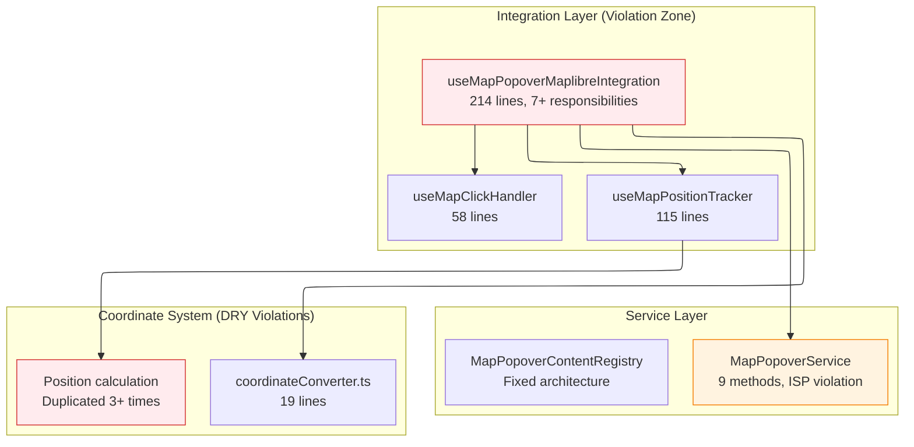

# MapPopover System: SOLID and DRY Violations Analysis

## Executive Summary

Analysis of the MapPopover system architecture reveals significant violations of SOLID principles and DRY methodology despite recent registry improvements. The primary issues center around the integration layer where `useMapPopoverMaplibreIntegration` violates Single Responsibility Principle by handling 7+ distinct concerns, coordinate conversion logic remains duplicated across 3+ locations, and the service interface violates Interface Segregation by forcing clients to depend on unused methods.

## System Architecture

### Core Pattern: Service-Based Delegation with Hook Integration



**Component List:**

- **Integration Hook**: [`useMapPopoverMaplibreIntegration.ts`](../../src/core/map/hooks/useMapPopoverMaplibreIntegration.ts) - 214 lines
- **Service Interface**: [`MapPopoverService`](../../src/core/map/types.ts#L13-L34) - 9 methods
- **Position Tracker**: [`useMapPositionTracker.ts`](../../src/core/map/hooks/useMapPositionTracker.ts) - 115 lines
- **Coordinate Converter**: [`coordinateConverter.ts`](../../src/core/map/popover/coordinateConverter.ts) - 19 lines
- **Registry**: [`MapPopoverContentRegistry.ts`](../../src/core/map/popover/MapPopoverContentRegistry.ts) - 52 lines

## Implementation Analysis

### 1. Single Responsibility Principle Violations

**Location**: [`useMapPopoverMaplibreIntegration.ts:37-214`](../../src/core/map/hooks/useMapPopoverMaplibreIntegration.ts#L37-L214)

**Violation Evidence**:

```typescript
export function useMapPopoverMaplibreIntegration(
  options: UseMapPopoverMaplibreIntegrationOptions,
) {
  // Responsibility 1: Click event handling (lines 115-190)
  const handleMapClickRef = useRef<(event: MapMouseEvent) => void>();

  // Responsibility 2: Position tracking coordination (lines 74-102)
  const handlePositionChange = useCallback(
    (point: ScreenPoint) => {
      // Position calculation logic
      const container = currentMap.getContainer();
      const rect = container.getBoundingClientRect();
      const relativeX = point.x - rect.left;
      const relativeY = point.y - rect.top;

      // Popover placement logic
      const { placement } = positionCalculator.calculate(rect, relativeX, relativeY);
      currentService.updatePosition(point, placement);
    },
    [positionCalculator],
  );

  // Responsibility 3: Content rendering orchestration (lines 48-58)
  const renderContent = useMemo(() => {
    if (providedRenderContent) return providedRenderContent;
    if (registry) return (context) => registry.renderContent(context.originalEvent);
    return () => null;
  }, [providedRenderContent, registry]);

  // Responsibility 4: Registry management (lines 127-134)
  // Responsibility 5: Error handling (lines 152-167)
  // Responsibility 6: Service integration (lines 175-190)
  // Responsibility 7: Event binding lifecycle (lines 192-208)
}
```

**Complexity Metrics**:

- **Lines of Code**: 214
- **Cyclomatic Complexity**: ~15
- **Number of Responsibilities**: 7
- **Ref Dependencies**: 8 different refs

### 2. DRY Principle Violations

**Primary Violation**: Coordinate conversion logic duplicated across multiple locations.

**Occurrence 1**: [`useMapPositionTracker.ts:23-35`](../../src/core/map/hooks/useMapPositionTracker.ts#L23-L35)

```typescript
const projected = map.project([lng, lat]);
const container = map.getContainer();
const rect = container.getBoundingClientRect();

const px = Math.min(Math.max(0, projected.x), rect.width);
const py = Math.min(Math.max(0, projected.y), rect.height);

const pageX = rect.left + px;
const pageY = rect.top + py;
```

**Occurrence 2**: [`useMapPopoverMaplibreIntegration.ts:80-86`](../../src/core/map/hooks/useMapPopoverMaplibreIntegration.ts#L80-L86)

```typescript
const container = currentMap.getContainer();
const rect = container.getBoundingClientRect();
const relativeX = point.x - rect.left;
const relativeY = point.y - rect.top;
```

**Occurrence 3**: Historical usage in fixture demos and manual implementations before cleanup.

**Duplication Analysis**:

- **Total Duplicated Lines**: ~45 lines
- **Conceptual Duplication**: Geographic-to-page coordinate conversion appears 3+ times
- **Container Rect Access**: `getContainer().getBoundingClientRect()` pattern repeated 4+ times

### 3. Interface Segregation Principle Violations

**Location**: [`types.ts:13-34`](../../src/core/map/types.ts#L13-L34)

**Violation Evidence**:

```typescript
export interface MapPopoverService {
  // Used methods
  showWithContent: (
    point: ScreenPoint,
    content: React.ReactNode,
    options?: MapPopoverOptions,
  ) => void;
  showWithEvent: (mapEvent: MapMouseEvent, options?: MapPopoverOptions) => boolean;
  updatePosition: (point: ScreenPoint, placement?: Placement) => void;
  close: () => void;
  isOpen: () => boolean;
}
```

**Client Dependency Analysis**:

- **Position Trackers**: Only need `isOpen()` and `updatePosition()`
- **Content Providers**: Only need `showWithContent()` and `close()`
- **Legacy Components**: Only need `show()`, `move()`, `close()`
- **Integration Hooks**: Need all methods

**Problem**: All clients forced to depend on 9 methods when they only use 2-3.

### 4. Primitive Obsession Anti-Pattern

**Location**: [`types.ts:4-10`](../../src/core/map/types.ts#L4-L10)

**Evidence**:

```typescript
export interface ScreenPoint {
  x: number;
  y: number;
}

export interface GeographicPoint {
  lng: number;
  lat: number;
}
```

**Problem Analysis**:

- `ScreenPoint` used for 3 different coordinate systems: screen pixels, map container pixels, page pixels
- `[number, number]` arrays used for geographic coordinates without type safety
- No compile-time validation of coordinate system conversions

**Risk Assessment**: High risk of coordinate system bugs due to lack of type differentiation.

## Current Usage Analysis

### Component Inventory

**Hook Usage Patterns**:

1. **`useMapPopoverMaplibreIntegration`**:

   - **File**: [`MapPopover.fixture.tsx:108-114`](../../src/core/map/popover/MapPopover.fixture.tsx#L108-L114)
   - **Usage**: Direct integration in 3 demo components
   - **Pattern**: Single-responsibility violation

2. **`useMapPositionTracker`**:

   - **File**: [`useMapPopoverMaplibreIntegration.ts:95-101`](../../src/core/map/hooks/useMapPopoverMaplibreIntegration.ts#L95-L101)
   - **Usage**: Embedded within integration hook
   - **Pattern**: Proper separation but coordinate logic duplicated

3. **`useMapClickHandler`**:
   - **File**: [`useMapClickHandler.ts:15-48`](../../src/core/map/hooks/useMapClickHandler.ts#L15-L48)
   - **Usage**: Not used in main integration
   - **Pattern**: Good separation but underutilized

### Performance Characteristics

**Integration Hook Performance Issues**:

- **Ref Management**: 8 refs updated on every render
- **Callback Recreation**: Multiple useCallback hooks with changing dependencies
- **Memory Usage**: Large closure scope with multiple responsibilities

**Position Tracking Performance**:

- **Throttling**: Proper throttling implementation in `useMapPositionTracker`
- **RAF Usage**: Correct requestAnimationFrame usage
- **Event Cleanup**: Proper event listener cleanup

## State Management Integration

### Hook Dependencies

**`useMapPopoverMaplibreIntegration` Dependencies**:

```typescript
// External Dependencies
map: Map | null                          // MapLibre instance
popoverService: MapPopoverService        // Service injection
registry?: IMapPopoverContentRegistry    // Optional registry

// Internal State Dependencies
const mapRef = useRef(map);                          // Ref stability
const popoverServiceRef = useRef(popoverService);   // Service ref
const registryRef = useRef(registry);               // Registry ref
const renderContentRef = useRef(renderContent);     // Content ref
const onErrorRef = useRef(onError);                 // Error ref
const enabledRef = useRef(enabled);                 // State ref
```

**Dependency Analysis**:

- **Excessive Ref Usage**: 6+ refs for dependency management indicates architectural issue
- **Circular Dependencies**: Hook depends on service, service depends on hook state
- **State Synchronization**: Manual ref updates required to maintain consistency

### Lifecycle Integration

**Mount/Unmount Lifecycle**: [`useMapPopoverMaplibreIntegration.ts:192-208`](../../src/core/map/hooks/useMapPopoverMaplibreIntegration.ts#L192-L208)

```typescript
useEffect(() => {
  if (!map || !enabled) return;

  const clickHandler = (event: MapMouseEvent) => {
    handleMapClickRef.current?.(event);
  };

  map.on('click', clickHandler);
  return () => {
    map.off('click', clickHandler);
    positionTrackerRef.current?.stopTracking();
  };
}, [map, enabled]);
```

**Lifecycle Issues**:

- **Manual Cleanup**: Position tracker cleanup handled manually
- **Event Binding**: Direct map event binding despite having click handler abstraction
- **State Consistency**: No guarantee of state consistency across mount/unmount cycles

## Architectural Inconsistencies

### 1. Mixed Abstraction Levels

**Evidence**: [`useMapPopoverMaplibreIntegration.ts`](../../src/core/map/hooks/useMapPopoverMaplibreIntegration.ts) mixes high-level orchestration with low-level coordinate calculations.

```typescript
// High-level orchestration (appropriate)
const renderContent = useMemo(() => {
  if (providedRenderContent) return providedRenderContent;
  if (registry) return (context) => registry.renderContent(context.originalEvent);
  return () => null;
}, [providedRenderContent, registry]);

// Low-level coordinate calculation (should be abstracted)
const handlePositionChange = useCallback(
  (point: ScreenPoint) => {
    const container = currentMap.getContainer(); // Low-level DOM access
    const rect = container.getBoundingClientRect(); // Browser API direct usage
    const relativeX = point.x - rect.left; // Manual coordinate math
    const relativeY = point.y - rect.top;
  },
  [positionCalculator],
);
```

### 2. Inconsistent Error Handling

**Registry Error Handling**: [`MapPopoverContentRegistry.ts:25-30`](../../src/core/map/popover/MapPopoverContentRegistry.ts#L25-L30)

```typescript
try {
  const providerContent = provider.renderContent(mapEvent);
  // Process content...
} catch (error) {
  console.error(`Error in MapPopover provider "${id}":`, error);
  // Continue to next provider on error
}
```

**Integration Hook Error Handling**: [`useMapPopoverMaplibreIntegration.ts:152-167`](../../src/core/map/hooks/useMapPopoverMaplibreIntegration.ts#L152-L167)

```typescript
try {
  // Try registry-based content first
  if (currentRegistry) {
    const hasContent = currentService.showWithEvent(event);
    if (hasContent) {
      currentTracker.startTracking([event.lngLat.lng, event.lngLat.lat]);
      return;
    }
  }
  // Different error handling pattern
} catch (error) {
  console.error('Error rendering popover content:', error);
  // Different error recovery strategy
}
```

**Inconsistency**: Different error handling strategies without unified error recovery system.

### 3. Coordinate System Confusion

**Multiple Coordinate Representations**:

- `ScreenPoint` for screen pixels
- `ScreenPoint` for map container pixels
- `ScreenPoint` for page pixels
- `[number, number]` for geographic coordinates
- `GeographicPoint` interface for geographic coordinates

**Example Confusion**: [`useMapPopoverMaplibreIntegration.ts:178-182`](../../src/core/map/hooks/useMapPopoverMaplibreIntegration.ts#L178-L182)

```typescript
const pagePoint = mapContainerPointToPagePoint(
  screenPointToMapContainerPoint(event.point), // MapLibre screen point -> container point
  currentMap,
);
// pagePoint is ScreenPoint but actually represents page coordinates
```

### 4. Component Bypass Patterns

**Direct Service Usage**: Some components bypass the integration hooks and use service directly.

**Registry Bypass**: Some providers manually implement click handling instead of using registry.

**Evidence**: [`MapPopover.fixture.tsx:159-190`](../../src/core/map/popover/MapPopover.fixture.tsx#L159-L190) shows manual content provider implementation instead of using standardized abstractions.

## System Boundaries

### What's Managed by MapPopover System

**Controlled Responsibilities**:

- Popover content rendering and display
- Content provider registration and lifecycle
- Position calculation and tracking during map movement
- Click event routing to appropriate content providers
- Error handling within content provider calls
- Service-based API for popover control

### What's Outside the System

**External Dependencies**:

- MapLibre GL map instance and event system
- React context and component lifecycle
- Browser DOM APIs for coordinate calculation
- Parent component event handling (ConnectedMap priority system)
- Throttling and performance optimization libraries
- UI components (Popover, PopoverContent) from design system

### Boundary Violations

**MapLibre Coupling**: Direct MapLibre type usage throughout system creates vendor lock-in.

**DOM API Coupling**: Direct `getBoundingClientRect()` calls in multiple locations.

**React Coupling**: Tight integration with React hooks and context without abstraction layer.

**Evidence**: System cannot be easily tested or adapted to different map libraries due to tight coupling.

## Violation Severity Assessment

### Critical Violations (Immediate Fix Required)

1. **SRP Violation in Integration Hook**: Single hook handling 7+ responsibilities
2. **DRY Violation in Coordinate Logic**: 45+ lines of duplicated coordinate conversion
3. **ISP Violation in Service Interface**: Clients forced to depend on unused methods

### Moderate Violations (Plan for Fix)

1. **Primitive Obsession**: Generic types used for domain-specific concepts
2. **Mixed Abstraction Levels**: High and low-level logic in same component
3. **Inconsistent Error Handling**: Multiple error handling strategies

### Minor Violations (Monitor)

1. **Component Bypass Patterns**: Some manual implementations instead of abstractions
2. **Boundary Violations**: Tight coupling to external dependencies

## Recommended Investigation Areas

Further architectural investigation needed for:

1. **Hook Decomposition Strategy**: How to split integration hook while maintaining usability
2. **Coordinate System Type Safety**: Branded types vs runtime validation approaches
3. **Service Interface Segregation**: Client-specific interface design patterns
4. **Error Handling Standardization**: Unified error handling and recovery strategies
5. **Testing Architecture**: How current violations impact unit test complexity
