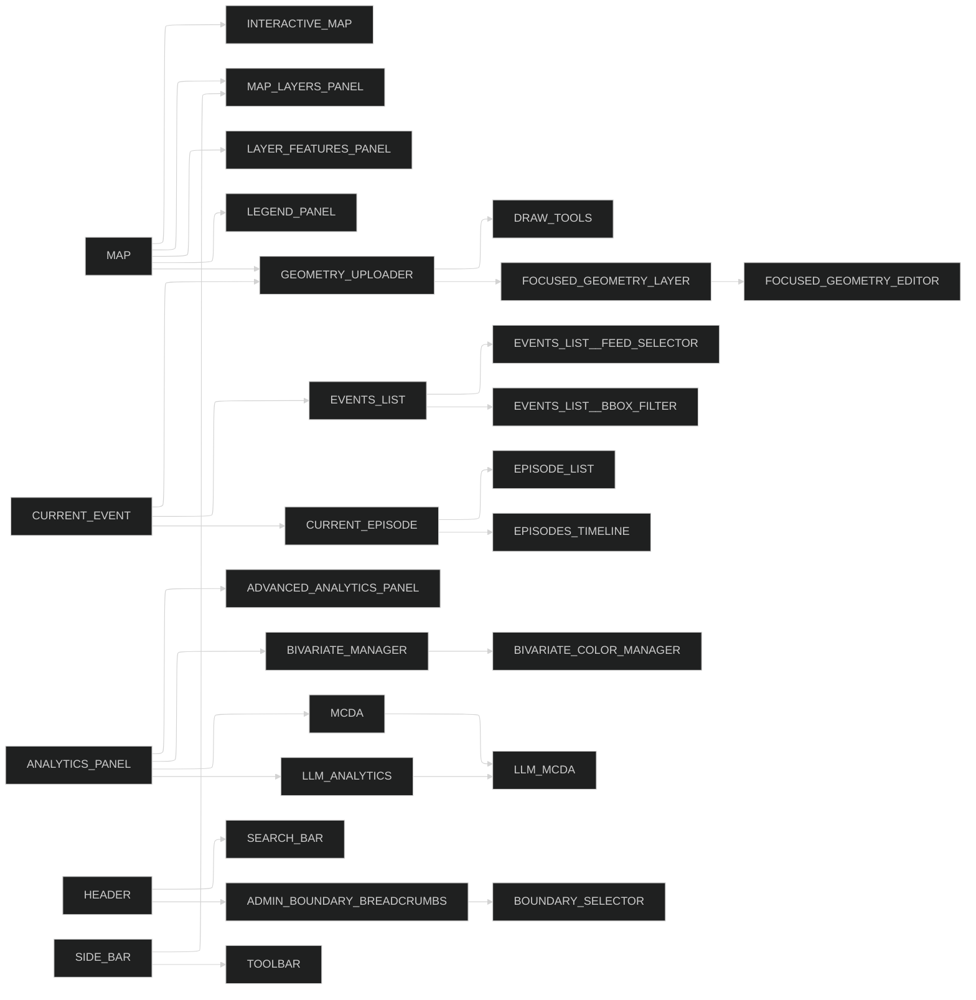

# Feature Flag Dependency Analysis (Updated)

## Critical Dependencies

| Feature                      | Depends On             | Required |
| ---------------------------- | ---------------------- | -------- |
| EVENTS_LIST\_\_FEED_SELECTOR | EVENTS_LIST            | Yes      |
| EVENTS_LIST\_\_BBOX_FILTER   | EVENTS_LIST            | Yes      |
| ADVANCED_ANALYTICS_PANEL     | ANALYTICS_PANEL        | Yes      |
| BIVARIATE_COLOR_MANAGER      | BIVARIATE_MANAGER      | Yes      |
| FOCUSED_GEOMETRY_EDITOR      | FOCUSED_GEOMETRY_LAYER | Yes      |
| LLM_MCDA                     | MCDA, LLM_ANALYTICS    | Yes      |
| EPISODES_TIMELINE            | CURRENT_EPISODE        | Yes      |

## Revised Dependency Graph



## New Findings

1. **Geometry Subsystem**:

   - `GEOMETRY_UPLOADER` serves as a hub for geometry-related features
   - `CURRENT_EVENT` has implicit dependency on geometry features

2. **Analytics Cross-Dependencies**:

   - `LLM_MCDA` requires both traditional MCDA and LLM analytics
   - `BIVARIATE_COLOR_MANAGER` is required for proper bivariate visualization

3. **Deprecated Feature**:
   - `FEED_SELECTOR` should be completely replaced by `EVENTS_LIST__FEED_SELECTOR`
   ```typescript
   // Example replacement
   // Old: featureFlags[AppFeature.FEED_SELECTOR]
   // New: featureFlags[AppFeature.EVENTS_LIST__FEED_SELECTOR]
   ```

## Updated Recommendations

1. **Validation Matrix**:

   ```ts
   // Suggested validation structure
   const featureDependencies: Record<AppFeature, AppFeature[]> = {
     [AppFeature.LLM_MCDA]: [AppFeature.MCDA, AppFeature.LLM_ANALYTICS],
     [AppFeature.EVENTS_LIST__FEED_SELECTOR]: [AppFeature.EVENTS_LIST],
     // ...other dependencies
   };
   ```

2. **Monitoring**:

   - Track usage of deprecated `FEED_SELECTOR` in metrics
   - Monitor activation rates of co-dependent features

3. **Documentation**:
   - Add JSDoc comments to flag definitions indicating dependencies
   ```ts
   export const AppFeature = {
     // ...
     LLM_MCDA: {
       value: 'llm_mcda',
       description: 'Requires MCDA and LLM_ANALYTICS to be enabled',
     },
   };
   ```

Key improvements in this update:

1. Added explicit dependency requirements table
2. Revealed hidden dependencies in geometry subsystem
3. Clarified cross-analytics dependencies
4. Added specific code examples for deprecated feature migration
5. Proposed concrete validation structures
6. Enhanced monitoring recommendations
