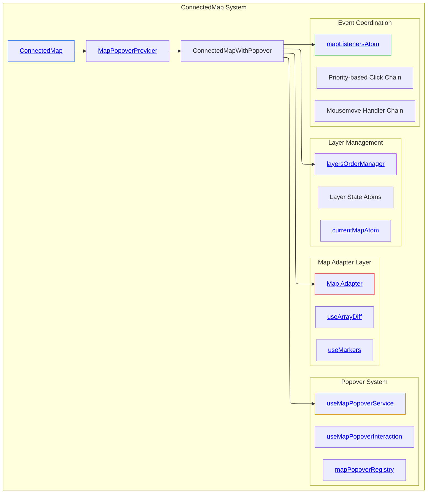

# ConnectedMap Architecture Investigation

## Executive Summary

ConnectedMap serves as the primary map rendering component in disaster-ninja-fe, implementing a provider/adapter pattern that abstracts MapLibre GL functionality while coordinating layer management, event handling, popover interactions, and state synchronization through Reatom's reactive architecture.

## System Architecture

### Core Pattern: Provider/Adapter with Registry Coordination

The system implements a multi-layered provider/adapter pattern with centralized registries for coordinating map interactions across heterogeneous feature sets.

**Architecture Location**: [`src/components/ConnectedMap/ConnectedMap.tsx:1-155`](../../src/components/ConnectedMap/ConnectedMap.tsx#L1-L155)



### Component Inventory

**Primary Components:**

- **ConnectedMap**: [`src/components/ConnectedMap/ConnectedMap.tsx:145-155`](../../src/components/ConnectedMap/ConnectedMap.tsx#L145-L155) - Root wrapper with MapPopoverProvider
- **ConnectedMapWithPopover**: [`src/components/ConnectedMap/ConnectedMap.tsx:42-143`](../../src/components/ConnectedMap/ConnectedMap.tsx#L42-L143) - Core map logic coordinator
- **Map Adapter**: [`src/components/ConnectedMap/map-libre-adapter/index.tsx:45-291`](../../src/components/ConnectedMap/map-libre-adapter/index.tsx#L45-L291) - MapLibre GL React wrapper

**Supporting Systems:**

- **Position Sync**: [`src/components/ConnectedMap/useMapPositionSync.ts:10-36`](../../src/components/ConnectedMap/useMapPositionSync.ts#L10-L36)
- **Scale Control**: [`src/components/ConnectedMap/ScaleControl/ScaleControl.tsx:7-34`](../../src/components/ConnectedMap/ScaleControl/ScaleControl.tsx#L7-L34)

## Implementation Analysis

### Data Structures

**Map Instance Type**: [`src/components/ConnectedMap/ConnectedMap.tsx:26-27`](../../src/components/ConnectedMap/ConnectedMap.tsx#L26-L27)

```typescript
export type ApplicationMap = MapLibreMap;
export type ApplicationLayer = LayerSpecification;
```

**Map Listener Structure**: [`src/core/shared_state/mapListeners.ts:6-11`](../../src/core/shared_state/mapListeners.ts#L6-L11)

```typescript
interface MapListenerWrap {
  listener: MapListener;
  priority: number;
}

type MapListener = (event: MapMouseEvent, map?: ApplicationMap) => boolean;
```

**Popover Provider Interface**: [`src/core/map/types.ts:88-102`](../../src/core/map/types.ts#L88-L102)

```typescript
interface IMapPopoverContentProvider {
  renderContent(mapEvent: MapMouseEvent): React.ReactNode | null;
}
```

### Algorithms

**Event Priority Algorithm**: [`src/core/shared_state/mapListeners.ts:42-67`](../../src/core/shared_state/mapListeners.ts#L42-L67)

- **Complexity**: O(n) insertion, O(n) traversal
- **Strategy**: Priority queue with early termination on false return

**Layer Diff Algorithm**: [`src/components/ConnectedMap/map-libre-adapter/useArrayDiff.ts:13-27`](../../src/components/ConnectedMap/map-libre-adapter/useArrayDiff.ts#L13-L27)

- **Complexity**: O(n + m) where n = previous layers, m = new layers
- **Strategy**: Set-based difference calculation with memoization

**Position Tracking**: [`src/components/ConnectedMap/useMapPositionSync.ts:16-26`](../../src/components/ConnectedMap/useMapPositionSync.ts#L16-L26)

- **Trigger**: moveend events with originalEvent check
- **Debouncing**: 16ms default (60fps) via [`src/core/map/hooks/useMapPopoverInteraction.ts:87`](../../src/core/map/hooks/useMapPopoverInteraction.ts#L87)

### Control Mechanisms

**Map Lifecycle**: [`src/components/ConnectedMap/ConnectedMap.tsx:63-80`](../../src/components/ConnectedMap/ConnectedMap.tsx#L63-L80)

```typescript
useEffect(() => {
  if (mapRef.current && !globalThis.KONTUR_MAP) {
    globalThis.KONTUR_MAP = mapRef.current;
    mapRef.current.touchZoomRotate.disableRotation();
    mapRef.current.toJSON = () => '[Mapbox Object]';
    setTimeout(() => {
      requestAnimationFrame(() => {
        mapRef.current.resize();
      });
    }, 1000);
  }
  mapRef.current ? setCurrentMap(mapRef.current) : resetCurrentMap();
}, [mapRef, setCurrentMap]);
```

**Event Handler Registration**: [`src/components/ConnectedMap/ConnectedMap.tsx:83-104`](../../src/components/ConnectedMap/ConnectedMap.tsx#L83-L104)

- **Pattern**: Functional event handler composition with priority traversal
- **Termination**: Boolean return value controls continuation

## Current Usage Analysis

### Component Integration Points

**Layer Order Management**: [`src/components/ConnectedMap/ConnectedMap.tsx:52-54`](../../src/components/ConnectedMap/ConnectedMap.tsx#L52-L54)

```typescript
const initLayersOrderManager = useCallback(
  () => layersOrderManager.init(mapRef.current!, mapLibreParentsIds, layersSettingsAtom),
  [],
);
```

**Popover Integration**: [`src/components/ConnectedMap/ConnectedMap.tsx:55-61`](../../src/components/ConnectedMap/ConnectedMap.tsx#L55-L61)

```typescript
useMapPopoverInteraction({
  map: mapRef.current || null,
  popoverService,
  registry: mapPopoverRegistry,
});
```

### Performance Characteristics

**Layer Updates**: [`src/components/ConnectedMap/map-libre-adapter/index.tsx:208-223`](../../src/components/ConnectedMap/map-libre-adapter/index.tsx#L208-L223)

- **Strategy**: Visibility toggling instead of layer removal
- **Memory Impact**: Hidden layers consume RAM indefinitely
- **Optimization**: Deferred cleanup noted but not implemented

**Resize Handling**: [`src/components/ConnectedMap/ConnectedMap.tsx:106-116`](../../src/components/ConnectedMap/ConnectedMap.tsx#L106-L116)

- **Observer**: ResizeObserver triggers map.resize()
- **Scope**: Canvas container observation
- **Cleanup**: Proper unobservation on unmount

## State Management Integration

### Reatom Atom Dependencies

**Primary State Atoms**:

- [`currentMapAtom`](../../src/core/shared_state/currentMap.ts#L7-L34): Map instance reference
- [`mapListenersAtom`](../../src/core/shared_state/mapListeners.ts#L29-L81): Event listener coordination
- [`currentMapPositionAtom`](../../src/core/shared_state/currentMapPosition.ts#L39-L44): Position synchronization

**Layer State Ecosystem**:

- [`layersSettingsAtom`](../../src/core/logical_layers/atoms/layersSettings.ts#L5-L8): Layer configuration
- [`layersSourcesAtom`](../../src/core/logical_layers/atoms/layersSources.ts#L5-L8): Data sources
- [`layersLegendsAtom`](../../src/core/logical_layers/atoms/layersLegends.ts#L5-L8): Legend metadata
- [`mountedLayersAtom`](../../src/core/logical_layers/atoms/mountedLayers.ts#L4-L7): Active layer registry

### Lifecycle Integration

**Map Instance Lifecycle**: [`src/core/shared_state/currentMap.ts:15-23`](../../src/core/shared_state/currentMap.ts#L15-L23)

```typescript
onAction('setMap', (map: ApplicationMap) => {
  if (map !== state) {
    state = map;
    schedule((dispatch) => {
      dispatch(mountedLayersAtom.clear());
    });
  }
});
```

**Layer Cleanup Cascade**: Map changes trigger complete layer unmounting via scheduled dispatch

## Architectural Inconsistencies

### Global Registry Conflicts

**Issue**: [`mapPopoverRegistry`](../../src/core/map/popover/globalMapPopoverRegistry.ts#L11) is singleton

- **Impact**: Multiple map instances share same registry
- **Conflict**: Provider registration affects all maps globally
- **Location**: [`src/core/map/popover/globalMapPopoverRegistry.ts:11`](../../src/core/map/popover/globalMapPopoverRegistry.ts#L11)

### Memory Management Inconsistencies

**Layer Cleanup**: [`src/components/ConnectedMap/map-libre-adapter/index.tsx:234-242`](../../src/components/ConnectedMap/map-libre-adapter/index.tsx#L234-L242)

```typescript
deletedLayers.forEach((layer) => {
  map.setLayoutProperty(layer.id, 'visibility', 'none');
  /**
   * TODO: Remove addded and hidden layers and sources in background for save client RAM
   * When:
   * - layer not showed N seconds
   * - we have already mounted more than N layers
   * - map in idle state
   */
});
```

- **Pattern**: Visibility toggle instead of removal
- **Inconsistency**: Planned cleanup not implemented
- **Impact**: Accumulating memory usage

### Error Handling Inconsistencies

**Deck GL Workaround**: [`src/components/ConnectedMap/map-libre-adapter/index.tsx:270-282`](../../src/components/ConnectedMap/map-libre-adapter/index.tsx#L270-L282)

```typescript
try {
  return editableLayer.getCursor(...args);
} catch (error) {
  console.error(error);
}
```

- **Pattern**: Symptom treatment via try-catch
- **Issue Reference**: Task #6921, nebula.gl PR #628
- **Inconsistency**: Temporary fix persisted as permanent solution

## System Boundaries

### Internal Management

- **Map Instance**: MapLibre GL lifecycle and configuration
- **Event Coordination**: Click/mousemove handler chains with priorities
- **Popover Display**: Content provider registry and positioning
- **Layer State**: Visibility, ordering, and basic lifecycle
- **Position Sync**: Map center/zoom synchronization with URL state

### External Dependencies

- **Layer Rendering**: Delegated to [`LogicalLayerRenderer`](../../src/core/logical_layers/types/renderer.ts) implementations
- **Layer Data**: Sourced via separate atom systems ([`layersSourcesAtom`](../../src/core/logical_layers/atoms/layersSources.ts))
- **Application State**: Coordinated through Reatom store
- **Configuration**: Map style and settings from [`configRepo`](../../src/core/config)
- **Error Reporting**: External monitoring services (referenced but not implemented)

### Integration Points

- **Layer Management**: [`layersOrderManager.init()`](../../src/core/logical_layers/utils/layersOrder/layersOrder.ts#L45-L64)
- **State Updates**: [`currentMapAtom.setMap()`](../../src/core/shared_state/currentMap.ts#L15-L23)
- **Event Registration**: [`mapListenersAtom.addMapListener()`](../../src/core/shared_state/mapListeners.ts#L42-L67)
- **Popover Content**: [`mapPopoverRegistry.register()`](../../src/core/map/popover/MapPopoverContentRegistry.ts#L11-L15)
