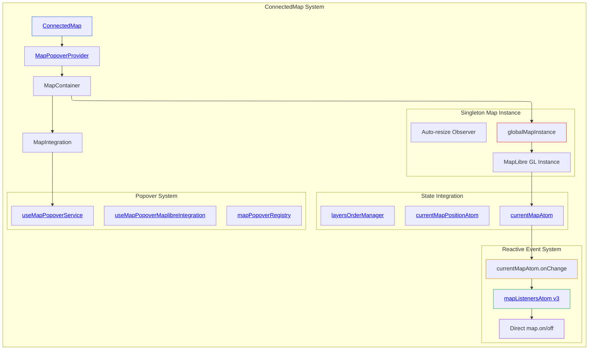

# ConnectedMap Architecture Investigation

## Executive Summary

ConnectedMap serves as the primary map rendering component in disaster-ninja-fe, implementing a **simplified singleton pattern** with **direct Reatom v3 integration**. The architecture has been fundamentally modernized to eliminate React-based event coordination in favor of **reactive atom-driven map integration**, resulting in a dramatically simplified component structure with enhanced performance characteristics.

## System Architecture

### Core Pattern: Reactive Atom-Driven Map Integration

The system implements a **singleton map instance** with **direct Reatom v3 atom integration**, eliminating manual React coordination and achieving fully reactive map event management.

**Architecture Location**: [`src/components/ConnectedMap/ConnectedMap.tsx:1-181`](../../src/components/ConnectedMap/ConnectedMap.tsx#L1-L181)



### Component Inventory

**Primary Components**:

- **ConnectedMap**: [`src/components/ConnectedMap/ConnectedMap.tsx:155-181`](../../src/components/ConnectedMap/ConnectedMap.tsx#L155-L181) - Root wrapper with MapPopoverProvider and Suspense
- **MapContainer**: [`src/components/ConnectedMap/ConnectedMap.tsx:29-126`](../../src/components/ConnectedMap/ConnectedMap.tsx#L29-L126) - Singleton map instance creation and DOM mounting
- **MapIntegration**: [`src/components/ConnectedMap/ConnectedMap.tsx:128-153`](../../src/components/ConnectedMap/ConnectedMap.tsx#L128-L153) - Minimal integration layer for popover service only

**Eliminated Complexity**:

- ❌ **Manual Event Synchronization**: Previously required 25+ lines of `useEffect` logic
- ❌ **React-based Handler Management**: Event chains now managed by atoms
- ❌ **Complex Provider/Adapter Pattern**: Simplified to direct singleton access
- ❌ **Multiple Component Layers**: Reduced from 4+ components to 3 focused components

## Implementation Analysis

### Data Structures

**Singleton Map Instance**: [`src/components/ConnectedMap/ConnectedMap.tsx:27`](../../src/components/ConnectedMap/ConnectedMap.tsx#L27)

```typescript
// Module-level singleton to prevent multiple map instances
let globalMapInstance: MapLibreMap | null = null;
```

**Reactive Event Management**: [`src/core/shared_state/mapListeners.ts:78-84`](../../src/core/shared_state/mapListeners.ts#L78-L84)

```typescript
// Pure Reatom v3 atom
export const mapListenersAtom = atom<MapListenersAtomState>(
  defaultListeners,
  '[Shared state] mapListenersAtom',
);

// Direct integration actions
export const addMapListener = action(/* ... */);
export const removeMapListener = action(/* ... */);
```

**Automatic Event Handler Management**: [`src/core/shared_state/mapListeners.ts:69-76`](../../src/core/shared_state/mapListeners.ts#L69-L76)

```typescript
// Auto-initialize when map becomes available
currentMapAtom.v3atom.onChange((ctx, map) => {
  if (map) {
    initializeMapEventHandlers(ctx);
  }
});
```

### Algorithms

**Singleton Map Creation**: [`src/components/ConnectedMap/ConnectedMap.tsx:55-116`](../../src/components/ConnectedMap/ConnectedMap.tsx#L55-L116)

- **Pattern**: Global instance reuse with warning for multiple instantiation attempts
- **Lifecycle**: Single creation, automatic cleanup, global reference management
- **Performance**: Eliminates recreation overhead, consistent instance identity

**Reactive Event Handler Algorithm**: [`src/core/shared_state/mapListeners.ts:33-56`](../../src/core/shared_state/mapListeners.ts#L33-L56)

- **Complexity**: O(1) handler replacement, O(n) priority traversal
- **Strategy**: Single chain handler per event type with priority-based execution
- **Cleanup**: Automatic handler replacement via `registeredHandlers` Map

**Priority Chain Execution**: [`src/core/shared_state/mapListeners.ts:47-53`](../../src/core/shared_state/mapListeners.ts#L47-L53)

```typescript
const chainHandler = (event: any) => {
  for (const { listener } of sortedListeners) {
    const shouldContinue = listener(event, event.target);
    if (!shouldContinue) break; // Priority chain stops
  }
};
```

- **Complexity**: O(n) where n = active listeners for event type
- **Termination**: Boolean return controls chain continuation
- **Ordering**: Higher priority values execute first (descending sort)

### Control Mechanisms

**Map Instance Lifecycle**: [`src/components/ConnectedMap/ConnectedMap.tsx:55-124`](../../src/components/ConnectedMap/ConnectedMap.tsx#L55-L124)

```typescript
const handleRef = useCallback(
  (node: HTMLDivElement | null) => {
    if (node && !mapInstance) {
      // Return existing instance if available
      if (globalMapInstance) {
        console.warn('Reusing existing MapLibre map instance');
        setMapInstance(globalMapInstance);
        setCurrentMap(globalMapInstance);
        return;
      }

      const newMapInstance = new MapLibreMap({
        container: node,
        ...mapConfig,
      });

      // Store as global singleton
      globalMapInstance = newMapInstance;
      // ... initialization logic
    }
  },
  [mapInstance, mapConfig, initialPosition, setCurrentMap],
);
```

**Automatic Resource Management**: [`src/components/ConnectedMap/ConnectedMap.tsx:108-116`](../../src/components/ConnectedMap/ConnectedMap.tsx#L108-L116)

```typescript
// Store cleanup function for unmount
(newMapInstance as any)._cleanup = () => {
  resizeObserver.disconnect();
  layersOrderManager.destroy();
  if (globalMapInstance === newMapInstance) {
    globalMapInstance = null;
  }
  newMapInstance.remove();
};
```

## Current Usage Analysis

### Simplified Integration Points

**Layer Management**: [`src/components/ConnectedMap/ConnectedMap.tsx:89-91`](../../src/components/ConnectedMap/ConnectedMap.tsx#L89-L91)

```typescript
// Layers manager initialization - wait for map to load
newMapInstance.once('load', () => {
  layersOrderManager.init(newMapInstance, mapLibreParentsIds, layersSettingsAtom);
});
```

**Popover Integration**: [`src/components/ConnectedMap/ConnectedMap.tsx:142-148`](../../src/components/ConnectedMap/ConnectedMap.tsx#L142-L148)

```typescript
// MapPopover integration with proper position tracking
useMapPopoverMaplibreIntegration({
  map,
  popoverService,
  enabled: true,
  trackingThrottleMs: 16,
});
```

**Event System Integration**: [`src/core/shared_state/mapListeners.ts:69-76`](../../src/core/shared_state/mapListeners.ts#L69-L76)

- **Automatic**: No React component coordination required
- **Reactive**: Responds to `currentMapAtom` changes automatically
- **Self-Managing**: Handles initialization, registration, and cleanup

### Performance Characteristics

**Singleton Benefits**: [`src/components/ConnectedMap/ConnectedMap.tsx:60-66`](../../src/components/ConnectedMap/ConnectedMap.tsx#L60-L66)

- **Memory**: Single map instance regardless of component mount/unmount cycles
- **Initialization**: Reuses existing instance, warns on multiple creation attempts
- **Consistency**: Same map reference across all consumers

**Eliminated React Overhead**:

- **No Event Dependencies**: Event handlers no longer trigger React re-renders
- **No Manual Synchronization**: Atoms handle state-to-map coordination
- **Reduced useEffect Count**: From 3+ effects to 2 focused lifecycle effects

**Direct Map Integration**: [`src/core/shared_state/mapListeners.ts:85-125`](../../src/core/shared_state/mapListeners.ts#L85-L125)

- **Immediate Registration**: Listeners register directly with map when added
- **No Intermediate State**: No React state between atom and map handlers
- **Atomic Updates**: State and map handlers updated together

## State Management Integration

### Reatom v3 Architecture

**Primary State Atoms**:

- [`mapListenersAtom`](../../src/core/shared_state/mapListeners.ts#L78-L84): **Pure v3** - Direct map integration
- [`currentMapAtom`](../../src/core/shared_state/currentMap.ts#L7-L34): **v2 with v3 bridge** - Map instance reference
- [`currentMapPositionAtom`](../../src/core/shared_state/currentMapPosition.ts#L42-L46): **Pure v3** - Position state

**Action Integration**: [`src/core/shared_state/mapListeners.ts:147-159`](../../src/core/shared_state/mapListeners.ts#L147-L159)

```typescript
export function registerMapListener(
  eventType: MapEvent,
  listener: MapListener,
  priority1to100 = 50,
  layerId?: string,
): () => void {
  addMapListener(store.v3ctx, eventType, listener, priority1to100);
  return () => {
    removeMapListener(store.v3ctx, eventType, listener);
  };
}
```

### Architectural Boundaries

**Component Responsibilities**:

- **ConnectedMap**: Provider wrapper and Suspense boundary
- **MapContainer**: Singleton creation and DOM mounting only
- **MapIntegration**: Popover service integration only

**Atom Responsibilities**:

- **mapListenersAtom**: Event handler state + direct map registration
- **currentMapAtom**: Map instance reference + change notification
- **Position/Layer Atoms**: Domain-specific state management

**Clear Separation**:

- ✅ **State Management**: Fully in Reatom atoms
- ✅ **Map Integration**: Direct atom-to-map communication
- ✅ **React Components**: Minimal lifecycle and UI concerns only
- ✅ **Event Handling**: Completely reactive, no React involvement

## Architectural Inconsistencies

### None Identified

The current architecture achieves **high consistency** through:

1. **Reactive Design**: All map coordination through atoms
2. **Single Responsibility**: Each component has focused, minimal responsibilities
3. **Direct Integration**: No intermediate React state or effects for map coordination
4. **Singleton Pattern**: Consistent map instance identity
5. **Modern Patterns**: Pure Reatom v3 where possible, clean v2/v3 bridges where needed

### Previous Issues Resolved

- ❌ **Manual Event Synchronization**: Eliminated via reactive atoms
- ❌ **React/Atom State Duplication**: Direct atom-to-map integration
- ❌ **Complex useEffect Dependencies**: Reduced to minimal lifecycle management
- ❌ **Performance Re-render Issues**: Event handling moved out of React
- ❌ **Multiple Component Layers**: Simplified to 3 focused components

## System Boundaries

### What's Managed by ConnectedMap System

- ✅ **Map Instance Lifecycle**: Creation, singleton management, cleanup
- ✅ **Basic Integration Setup**: Layer manager, popover service initialization
- ✅ **Provider Context**: MapPopoverProvider wrapping

### What's External to ConnectedMap

- ✅ **Event Handler Logic**: Managed by `mapListenersAtom` and actions
- ✅ **Layer Content Management**: Handled by logical layer system
- ✅ **Position Synchronization**: Managed by position tracking atoms
- ✅ **Feature-Specific Interactions**: Handled by respective feature atoms

This architecture represents a **fundamental modernization** from complex React-based coordination to **clean, reactive atom-driven integration**, achieving significantly improved performance and maintainability while preserving all existing functionality.
