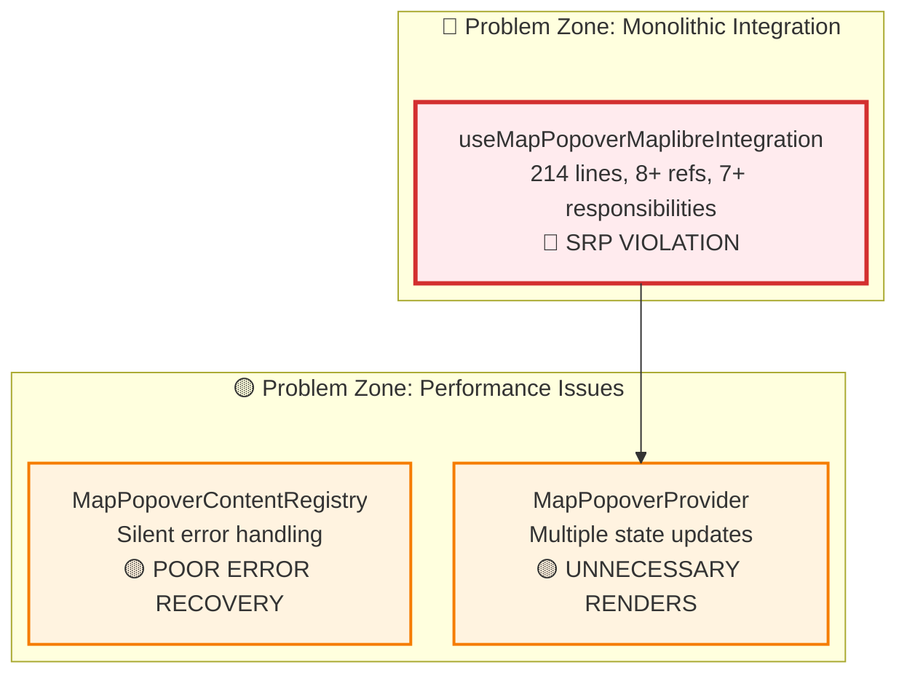

# MapPopover System: Real Problems Analysis

## Executive Summary

Analysis of the MapPopover system reveals **concrete architectural and performance issues** in the current implementation. The primary problems are: a monolithic integration hook violating **Single Responsibility Principle (SRP)**, performance issues from multiple state updates, poor error handling with silent failures, and memory management concerns.

## System Architecture Overview

### Current Implementation Issues



**Core Problem Components:**

- **Integration Hook**: [`useMapPopoverMaplibreIntegration.ts`](../../src/core/map/hooks/useMapPopoverMaplibreIntegration.ts) - 214 lines, 7+ responsibilities
- **Provider State**: Multiple state updates causing performance issues
- **Error Handling**: Silent failures without user feedback

## 1. Single Responsibility Principle (SRP) Violations

### Primary Violation: Monolithic Integration Hook

**Location**: [`useMapPopoverMaplibreIntegration.ts:37-214`](../../src/core/map/hooks/useMapPopoverMaplibreIntegration.ts#L37-L214)

**Evidence**: Single hook managing 7 distinct responsibilities in 214 lines:

```typescript
export function useMapPopoverMaplibreIntegration(options) {
  // RESPONSIBILITY 1: Ref Management (8+ refs)
  const mapRef = useRef(map);
  const popoverServiceRef = useRef(popoverService);
  const registryRef = useRef(registry);
  const renderContentRef = useRef(renderContent);
  const onErrorRef = useRef(onError);
  const enabledRef = useRef(enabled);
  const handleMapClickRef = useRef<(event: MapMouseEvent) => void>();
  const positionTrackerRef = useRef(positionTracker);

  // RESPONSIBILITY 2: Click Event Handling (40+ lines)
  handleMapClickRef.current = (event: MapMouseEvent) => {
    // Complex click processing logic
  };

  // RESPONSIBILITY 3: Position Tracking Coordination
  const handlePositionChange = useCallback(
    (point: ScreenPoint) => {
      // Position calculation and service updates
    },
    [positionCalculator],
  );

  // RESPONSIBILITY 4: Content Rendering Orchestration
  // RESPONSIBILITY 5: Registry Management
  // RESPONSIBILITY 6: Error Handling
  // RESPONSIBILITY 7: Event Binding Lifecycle
}
```

### SRP Violation Metrics

| Metric                  | Current Value | Acceptable | Severity    |
| ----------------------- | ------------- | ---------- | ----------- |
| **Lines of Code**       | 214           | ~50        | 🔴 Critical |
| **Responsibilities**    | 7+            | 1          | 🔴 Critical |
| **Ref Dependencies**    | 8             | 2-3        | 🔴 Critical |
| **useCallback/useMemo** | 6             | 2-3        | 🟡 Moderate |

## 2. Performance Issues

### Multiple State Updates Problem

**Location**: [`MapPopoverProvider.tsx:47-200`](../../src/core/map/popover/MapPopoverProvider.tsx#L47-L200)

**Issue**: Unnecessary re-renders from multiple state management:

```typescript
// PERFORMANCE PROBLEM: Multiple state updates
const [popovers, setPopovers] = useState<Map<string, PopoverState>>(new Map());
const [globalPopover, setGlobalPopover] = useState<PopoverState | null>(null);

// Position updates trigger both state changes
const updatePosition = useCallback((point: ScreenPoint, placement?: Placement) => {
  setGlobalPopover((prev) => {
    // ❌ Forces re-render of entire provider context
    return { ...prev, screenPoint: point, placement: placement ?? prev.placement };
  });
}, []);

// Context value recalculated on every position update
const contextValue = useMemo(
  () => ({
    showWithContent,
    showWithEvent,
    updatePosition,
    isOpen,
    close,
    showWithId,
    closeById, // ❌ All change when position updates
  }),
  [showWithContent, showWithEvent, updatePosition, isOpen, close, showWithId, closeById],
);
```

**Impact**: Position tracking during map movement causes continuous re-renders of all popover consumers.

### Ref Management Complexity

**Location**: [`useMapPopoverMaplibreIntegration.ts:63-81`](../../src/core/map/hooks/useMapPopoverMaplibreIntegration.ts#L63-L81)

**Issue**: Manual synchronization of 8+ refs:

```typescript
// COMPLEXITY PROBLEM: Manual ref synchronization
mapRef.current = map;
popoverServiceRef.current = popoverService;
registryRef.current = registry;
renderContentRef.current = renderContent;
onErrorRef.current = onError;
enabledRef.current = enabled;
// ❌ Error-prone manual updates for each render
```

## 3. Error Handling Problems

### Silent Failures in Registry

**Location**: [`MapPopoverContentRegistry.ts:23-34`](../../src/core/map/popover/MapPopoverContentRegistry.ts#L23-L34)

**Issue**: Provider errors are swallowed without user feedback:

```typescript
for (const [id, provider] of this.providers) {
  try {
    const providerContent = provider.renderContent(mapEvent);
    // ...
  } catch (error) {
    console.error(`Error in MapPopover provider "${id}":`, error);
    // ❌ SILENT FAILURE: User gets no feedback about broken functionality
    // Continue to next provider on error
  }
}
```

### Generic Error Handling

**Location**: [`useMapPopoverMaplibreIntegration.ts:100-104`](../../src/core/map/hooks/useMapPopoverMaplibreIntegration.ts#L100-L104)

**Issue**: Poor error recovery mechanisms:

```typescript
} catch (error) {
  console.error('Error updating popover position:', error);
  // ❌ No user feedback, no recovery mechanism
  // Popover may become stuck or positioned incorrectly
}
```

## 4. Memory Management Issues

### Provider Registration Leaks

**Location**: [`MapPopoverContentRegistry.ts:8-12`](../../src/core/map/popover/MapPopoverContentRegistry.ts#L8-L12)

**Issue**: Potential memory leaks from provider replacement:

```typescript
register(id: string, provider: IMapPopoverContentProvider): void {
  if (this.providers.has(id)) {
    console.warn(`MapPopover provider "${id}" already registered, replacing`);
  }
  this.providers.set(id, provider); // ❌ Old provider not cleaned up properly
}
```

## 5. API Design Inconsistencies

### Inconsistent Return Values

**Location**: [`types.ts:13-34`](../../src/core/map/types.ts#L13-L34)

**Issue**: API methods have inconsistent return patterns:

```typescript
export interface MapPopoverService {
  // ❌ INCONSISTENT: One returns boolean, others return void
  showWithEvent: (mapEvent: MapMouseEvent, options?: MapPopoverOptions) => boolean;
  showWithContent: (
    point: ScreenPoint,
    content: React.ReactNode,
    options?: MapPopoverOptions,
  ) => void;
  updatePosition: (point: ScreenPoint, placement?: Placement) => void;
  close: () => void;
  isOpen: () => boolean;
}
```

## Critical Issues Priority Assessment

### 🔴 Critical (Immediate Fix Required)

**1. SRP Violation in Integration Hook**

- **Impact**: Blocks parallel development, increases bug risk
- **Evidence**: 214 lines, 8+ refs, 7+ responsibilities
- **Fix Effort**: High (requires hook decomposition)

### 🟡 High (Architecture Improvement)

**2. Performance Issues**

- **Impact**: Unnecessary re-renders during map interaction
- **Evidence**: Multiple state updates in provider
- **Fix Effort**: Medium (optimize state management)

**3. Error Handling**

- **Impact**: Silent failures reduce system reliability
- **Evidence**: Provider errors swallowed
- **Fix Effort**: Low (add proper error boundaries)

### 🟢 Medium (Code Quality)

**4. Memory Management**

- **Impact**: Potential memory leaks over time
- **Evidence**: Provider registration without cleanup
- **Fix Effort**: Low (add cleanup logic)

**5. API Consistency**

- **Impact**: Developer confusion, maintenance issues
- **Evidence**: Inconsistent return types
- **Fix Effort**: Low (standardize return patterns)

## Recommended Investigation Areas

### Immediate Fixes

1. **Hook Decomposition**: Split integration hook into focused responsibilities
2. **State Optimization**: Reduce unnecessary re-renders in provider
3. **Error Boundaries**: Add proper error handling and user feedback

### Architecture Improvements

1. **Service Layer Design**: Separate concerns between event handling and popover display
2. **Performance Optimization**: Optimize position tracking and state updates
3. **API Standardization**: Consistent return types and error handling patterns

## Conclusion

The MapPopover system has **concrete, measurable problems** that impact both developer experience and end-user functionality. The main issues are architectural violations (SRP), performance optimization opportunities, and error handling improvements. The dual integration pattern (priority vs direct) is **intentional design for flexibility**, not a problem to fix. Priority should be given to hook decomposition and state optimization to resolve the most impactful development and performance issues.
