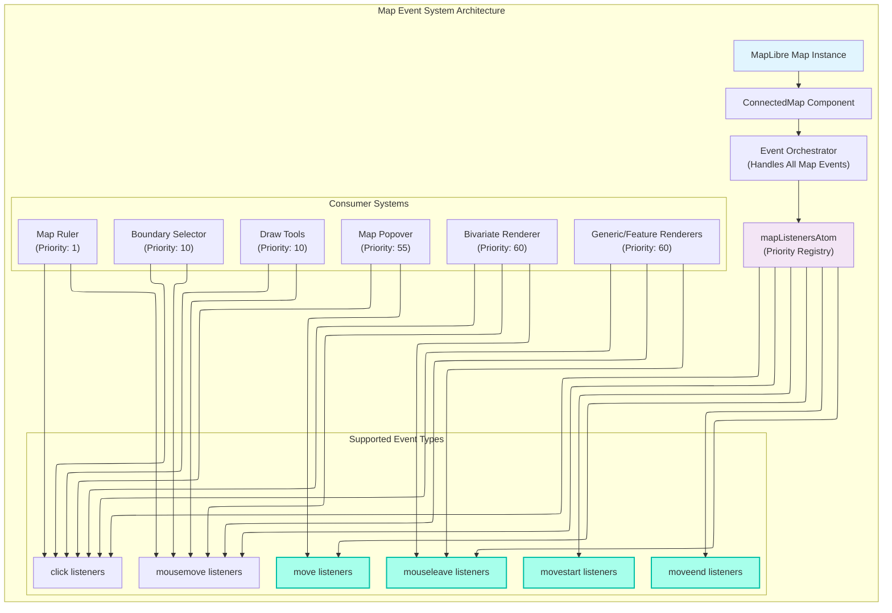
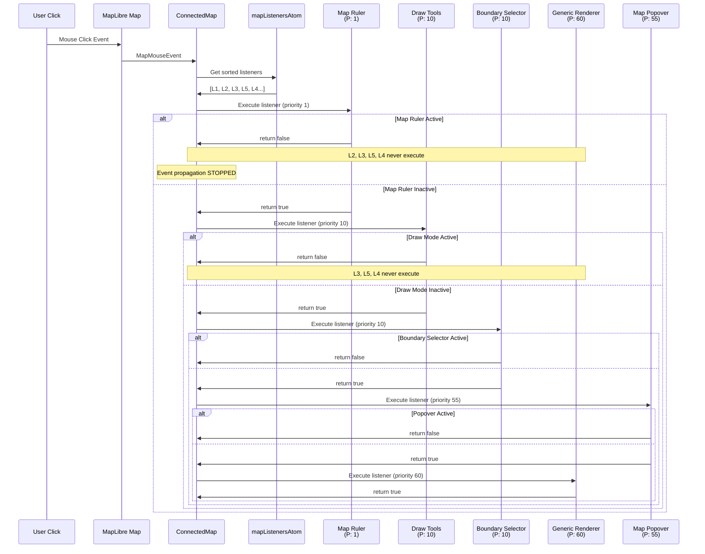

# R006: Map Event Management System Investigation

## Executive Summary

This document provides a comprehensive architectural analysis of the Map Event Management System in the Disaster Ninja application. The system implements a priority-based event coordination mechanism that manages multiple interactive subsystems on the map interface. This investigation reveals that the current implementation only supports `click` and `mousemove` events, despite allowing registration for `mouseleave` events. This document serves as an accurate, up-to-date reference for architectural decisions and future development.

## System Architecture

### Core Architecture Pattern

The Map Event Management System follows a **Centralized Event Coordination** pattern with priority-based execution control. The system consists of four primary components:

1.  **Event Registry** (`mapListenersAtom`) - Maintains prioritized listener collections
2.  **Event Orchestrator** (`ConnectedMap`) - Coordinates event dispatch and execution for `click` and `mousemove` events
3.  **Registration Interface** (`registerMapListener`) - Provides controlled listener registration
4.  **State Integration** (Reatom atoms) - Integrates with application state management



## Event Registry Implementation

### Data Structure Analysis

**Location**: [`src/core/shared_state/mapListeners.ts`](../../src/core/shared_state/mapListeners.ts)

The event registry uses a Reatom-based atom that can store listeners for six event types, all of which are processed by the orchestrator.

```typescript
export type MapListener = (event: MapLibre.MapMouseEvent, map?: MapLibre.Map) => boolean;

type MapListenersAtomState = {
  click: { listener: MapListener; priority: number }[];
  mousemove: { listener: MapListener; priority: number }[];
  mouseleave: { listener: MapListener; priority: number }[];
  move: { listener: MapListener; priority: number }[];
  movestart: { listener: MapListener; priority: number }[];
  moveend: { listener: MapListener; priority: number }[];
};
```

### Registration Mechanism

**Function Signature**:

```typescript
export function registerMapListener(
  eventType: MapEvent,
  listener: MapListener,
  priority1to100 = 50,
  layerId?: string, // NOTE: This parameter is unused
): () => void;
```

**Key Characteristics**:

- Returns a cleanup function for listener removal
- Default priority is 50, placing it between control tools and renderers
- The `layerId` parameter is currently ignored by the implementation

### Priority Insertion Algorithm

**Location**: [`src/core/shared_state/mapListeners.ts:44-71`](../../src/core/shared_state/mapListeners.ts#L44-L71)

The system maintains sorted priority lists using an insertion algorithm that preserves execution order. Listeners with lower priority numbers execute first. Listeners with equal priority execute in the order they were registered.

**Implementation Details**:

```typescript
// Simplified insertion logic from source
if (priority < listenerWrap.priority) {
  listenerCategory.splice(i, 0, { listener, priority });
  break;
} else if (listenerWrap.priority === priority) {
  // Equal priority - first added gets precedence
  listenerCategory.splice(i + 1, 0, { listener, priority });
  break;
}
```

## Event Propagation Control

### Control Mechanism

Each listener function returns a boolean value that controls event propagation:

- `return true`: Continue to the next listener in the priority queue
- `return false`: Stop all subsequent listener execution for that event

**Example Implementation (Blocking)**:

```typescript
// From MapRulerRenderer (Priority: 1)
function preventClicking(e) {
  e.preventDefault();
  return false; // STOPS all other listeners
}
```

### Execution Flow

**Location**: [`src/components/ConnectedMap/ConnectedMap.tsx:90-108`](../../src/components/ConnectedMap/ConnectedMap.tsx#L90-L108)

The event orchestrator implements a sequential execution pattern for all registered events.

```typescript
const clickHandlers = (event: MapMouseEvent) => {
  for (let i = 0; i < mapListeners.click.length; i++) {
    const { listener } = mapListeners.click[i];
    const passToNextListener = listener(event, mapRef.current);
    if (!passToNextListener) break; // Propagation stopped
  }
};

const mousemoveHandlers = (event: MapMouseEvent) => {
  for (let i = 0; i < mapListeners.mousemove.length; i++) {
    const { listener } = mapListeners.mousemove[i];
    const passToNextListener = listener(event, mapRef.current);
    if (!passToNextListener) break; // Propagation stopped
  }
};

const mouseleaveHandlers = (event: MapMouseEvent) => {
  for (let i = 0; i < mapListeners.mouseleave.length; i++) {
    const { listener } = mapListeners.mouseleave[i];
    const passToNextListener = listener(event, mapRef.current);
    if (!passToNextListener) break; // Propagation stopped
  }
};

const moveHandlers = (event: MapMouseEvent) => {
  for (let i = 0; i < mapListeners.move.length; i++) {
    const { listener } = mapListeners.move[i];
    const passToNextListener = listener(event, mapRef.current);
    if (!passToNextListener) break; // Propagation stopped
  }
};

const movestartHandlers = (event: MapMouseEvent) => {
  for (let i = 0; i < mapListeners.movestart.length; i++) {
    const { listener } = mapListeners.movestart[i];
    const passToNextListener = listener(event, mapRef.current);
    if (!passToNextListener) break; // Propagation stopped
  }
};

const moveendHandlers = (event: MapMouseEvent) => {
  for (let i = 0; i < mapListeners.moveend.length; i++) {
    const { listener } = mapListeners.moveend[i];
    const passToNextListener = listener(event, mapRef.current);
    if (!passToNextListener) break; // Propagation stopped
  }
};

// Register with MapLibre directly
mapRef.current.on('click', clickHandlers);
mapRef.current.on('mousemove', mousemoveHandlers);
mapRef.current.on('mouseleave', mouseleaveHandlers);
mapRef.current.on('move', moveHandlers);
mapRef.current.on('movestart', movestartHandlers);
mapRef.current.on('moveend', moveendHandlers);
```

### Event Flow Analysis



## Current System Usage Analysis

### Registered Listeners Inventory

Based on a full codebase analysis, these are the current priority assignments:

| System                    | Priority | Events                             | Location                                                                                                                                    | Stops Propagation? |
| :------------------------ | :------- | :--------------------------------- | :------------------------------------------------------------------------------------------------------------------------------------------ | :----------------- |
| **Map Ruler**             | 1        | `click`, `mousemove`               | [`MapRulerRenderer.ts:109`](../../src/features/map_ruler/renderers/MapRulerRenderer.ts#L109)                                                | ✅                 |
| **Draw Tools**            | 10       | `click`, `mousemove`               | [`DrawModeRenderer.ts:181`](../../src/core/draw_tools/renderers/DrawModeRenderer.ts#L181)                                                   | ✅                 |
| **Boundary Selector**     | 10       | `click`, `mousemove`               | [`clickCoordinatesAtom.ts:27`](../../src/features/boundary_selector/atoms/clickCoordinatesAtom.ts#L27)                                      | ✅                 |
| **Map Popover**           | 55       | `click`, `move`                    | [`ConnectedMap.tsx`](../../src/components/ConnectedMap/ConnectedMap.tsx)                                                                    | ✅ / ❌            |
| **Active Contributors**   | 60       | `click`, `mousemove`, `mouseleave` | [`GenericRenderer.ts:231`](../../src/core/logical_layers/renderers/GenericRenderer.ts#L231)                                                 | ❌                 |
| **Generic Links**         | 60       | `click`                            | [`GenericRenderer.ts:248`](../../src/core/logical_layers/renderers/GenericRenderer.ts#L248)                                                 | ❌                 |
| **Bivariate Tooltips**    | 60       | `click`, `mousemove`, `mouseleave` | [`BivariateRenderer.tsx:132`](../../src/core/logical_layers/renderers/BivariateRenderer/BivariateRenderer.tsx#L132)                         | ❌                 |
| **Feature Hover Effects** | 60       | `click`, `mousemove`, `mouseleave` | [`ClickableFeaturesRenderer.tsx:118`](../../src/core/logical_layers/renderers/ClickableFeaturesRenderer/ClickableFeaturesRenderer.tsx#L118) | ❌                 |

_Note: `BivariateRenderer` and `ClickableFeaturesRenderer` now have their `mouseleave` listeners executed as `ConnectedMap` subscribes to this event._

### Listener Purpose Analysis

This section provides a detailed breakdown of what each registered listener does.

#### Tier 1: Exclusive Control Systems (Priority < 50)

These systems are designed to take exclusive control of the map and prevent any other interactions.

1.  **Map Ruler** (Priority: 1)

    - **Location**: `MapRulerRenderer.ts:109`
    - **`click` handler**: Calls `event.preventDefault()` and returns `false`.
    - **`mousemove` handler**: Returns `false`.
    - **Purpose**: To completely block all other map interactions (clicks, hovers, popups) while the measurement tool is active, ensuring a clean user experience for measuring distances.

2.  **Draw Tools** (Priority: 10)

    - **Location**: `DrawModeRenderer.ts:181`
    - **`click` handler**: Calls `event.preventDefault()` and returns `false`.
    - **`mousemove` handler**: Returns `false`.
    - **Purpose**: Identical to the Map Ruler, it blocks all other map interactions to provide a stable interface for drawing polygons, lines, or points without interference.

3.  **Boundary Selector** (Priority: 10)
    - **Location**: `clickCoordinatesAtom.ts:27`
    - **Activation**: Only active when its controlling atom is started.
    - **`click` handler**: Captures the click coordinates and returns `false`.
    - **`mousemove` handler**: Returns `false`.
    - **Purpose**: To enter a special mode where the user's next click selects a geographic coordinate. It disables map panning/zooming and blocks all other listeners to ensure the click is captured exclusively for this purpose.

#### Tier 2: Mid-Priority UI Tools (Priority 50-55)

These systems are designed to perform an action and then allow other systems to react to the same event, or to take precedence over renderers.

1.  **Map Popover** (Priority: 55)

    - **Location**: `ConnectedMap.tsx`
    - **`click` handler**: Manages the display and closure of map popovers. If a popover is open, it closes it and stops propagation. If a feature has content for a popover, it displays it and stops propagation. Otherwise, it allows propagation.
    - **`move` handler**: Updates the position of an open popover to track the map's movement, without stopping propagation.
    - **Purpose**: To provide interactive information displays on the map that can optionally take precedence over other click actions when content is present.

#### Tier 3: Cooperative Feature Handlers (Priority >= 60)

These systems are designed to perform an action and then allow other systems to react to the same event.

1.  **Generic & Thematic Renderers** (Priority: 60)
    - **Location**: `GenericRenderer.ts` & `ClickableFeaturesRenderer.tsx`
    - **Handlers**:
      - **Feature State (`onClick`, `onMouseMove`)**: Toggles "hover" and "active" visual states on map features. Used to provide visual feedback.
      - **Popups (`onClick`)**: Queries the map at the click location. If a feature is found, it generates and displays a detailed popup.
      - **External Links (`onClick`)**: For layers configured with a `linkProperty`, it checks clicked features for a URL and opens it in a new tab.
    - **Purpose**: These handlers provide the core interactivity for data layers, enabling hover effects, popups, and external links, without preventing other systems from also reacting to the click.

### Priority Tier Analysis

**Tier 1 (1-10): Highest-Priority Control Systems**

- Includes Map Ruler and Draw Tools.
- Designed to take exclusive control of map interactions and always stop propagation when active.

**Tier 2 (50): Mid-Priority UI Tools**

- Includes the Boundary Selector and Map Popover.
- Operates with default priority, allowing it to override renderers but be overridden by higher-priority controls.

**Tier 3 (60): Lowest-Priority Feature Renderers**

- Includes all standard data visualization layers (tooltips, hover effects, links).
- All are designed to be cooperative and allow propagation, enabling multiple layers to react to the same event.

## Architectural Inconsistency: Unhandled `mouseleave` Event

The `BivariateRenderer` and `ClickableFeaturesRenderer` both register a listener for the `mouseleave` event. However, the `ConnectedMap` component, which serves as the central orchestrator, **does not subscribe to `mouseleave` events** from the MapLibre instance. This means the registered cleanup logic is never executed.

### Analysis of the Unhandled Handler

1.  **Registered By**:

    - [`BivariateRenderer.tsx:134`](../../src/core/logical_layers/renderers/BivariateRenderer/BivariateRenderer.tsx#L134)
    - [`ClickableFeaturesRenderer.tsx:120`](../../src/core/logical_layers/renderers/ClickableFeaturesRenderer/ClickableFeaturesRenderer.tsx#L120)

2.  **Handler Logic Location**:

    - `createFeatureStateHandlers` in [`activeAndHoverFeatureStates.ts:98-105`](../../src/core/logical_layers/renderers/helpers/activeAndHoverFeatureStates.ts#L98-L105)

3.  **Intended Purpose**:
    - The `onMouseLeave` handler's sole purpose is to **clear the "hover" state from any features that were previously highlighted**.
    - When the `onMouseMove` handler detects the mouse over a feature, it sets a `hover: true` state on that feature, causing it to be visually highlighted (e.g., with an outline).
    - The `onMouseLeave` handler is designed to set `hover: false` for all previously highlighted features, effectively removing the highlight when the mouse leaves the feature.

**Consequences**:

- **The registered listeners are never called.**
- **Visual Bug**: Features remain highlighted even after the mouse cursor has moved off them. This leaves the UI in a permanently stale and confusing state.
- **Dead Code**: This represents a critical bug where essential cleanup logic is present but never executed due to an omission in the central event orchestrator.

## Supported vs. Unsupported Event Types

### Fully Supported Events

- **`click`**: Primary interaction mechanism with full priority and propagation control.
- **`mousemove`**: Used for hover effects and continuous tracking, also with full priority control.
- **`mouseleave`**: Used for clearing hover states and ensuring visual consistency.
- **`move`**: Used for continuous tracking and popover positioning.
- **`movestart`**: Used for tracking map movement initiation.
- **`moveend`**: Used for tracking map movement completion.

### Registered but Unsupported Events

- **`mouseleave`**: The `mapListenersAtom` accepts these listeners, and several components register them. However, `ConnectedMap` does not have a handler for this event, so the listeners are **never executed**.

This investigation provides the foundational understanding needed for architectural decisions regarding the Map Event Management System and its integration patterns within the Disaster Ninja application.
